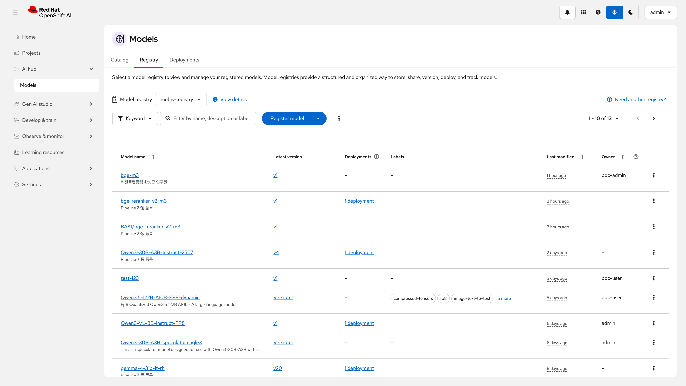
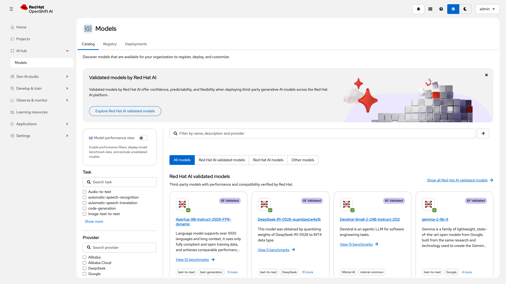
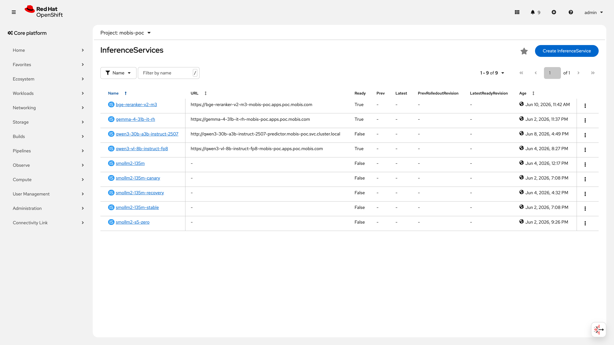
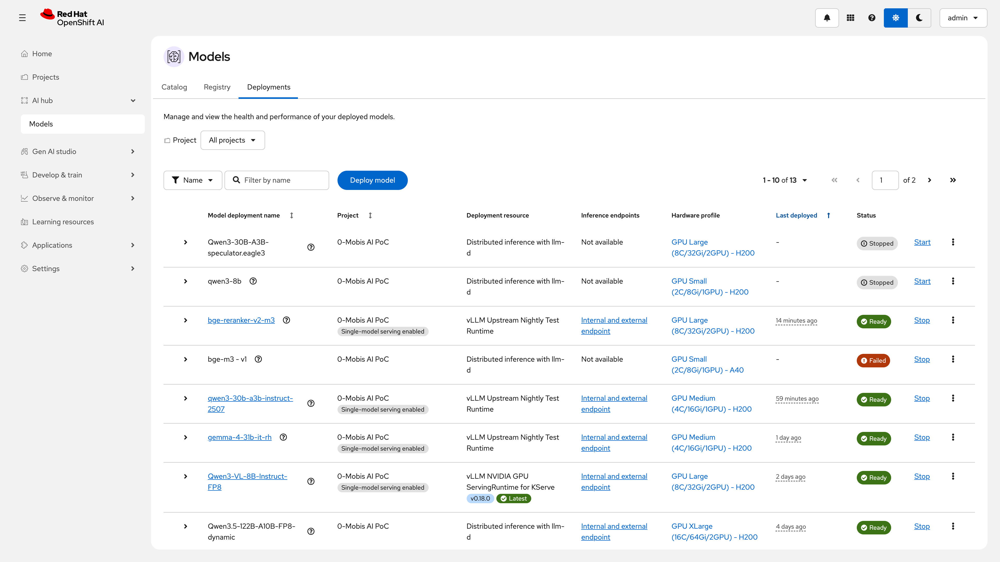
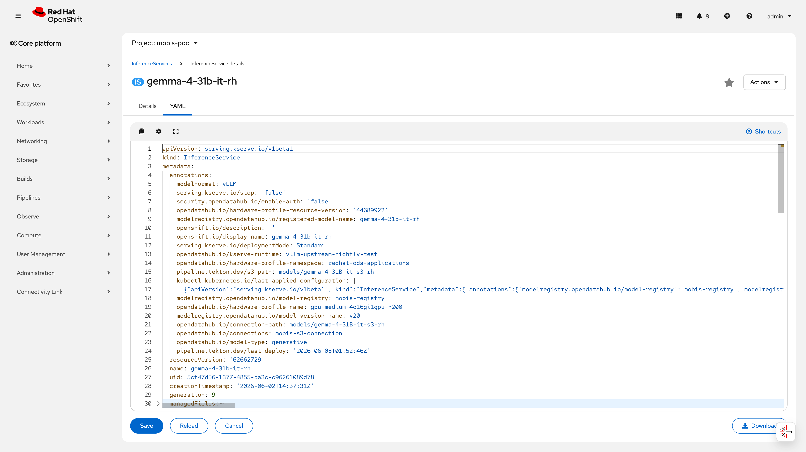
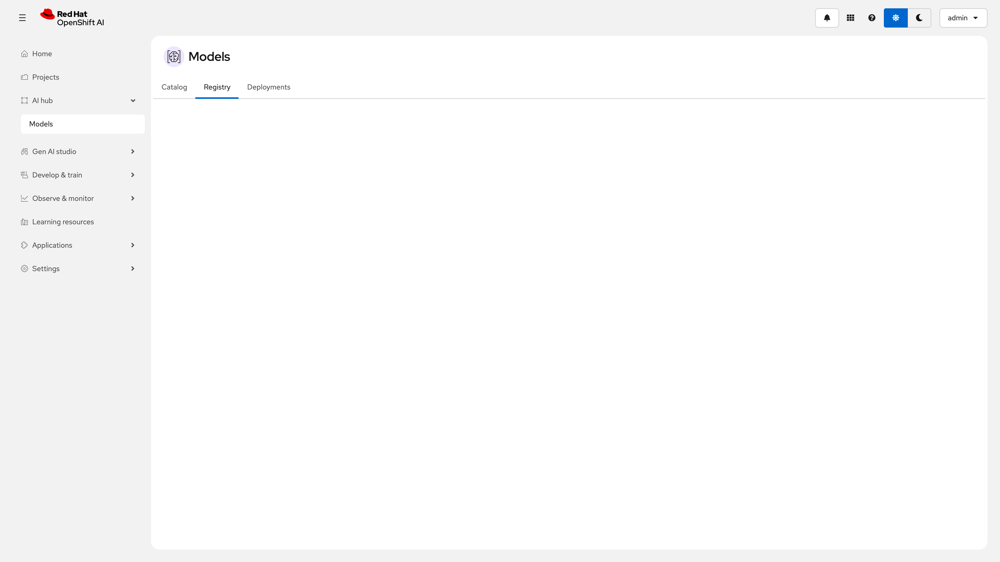
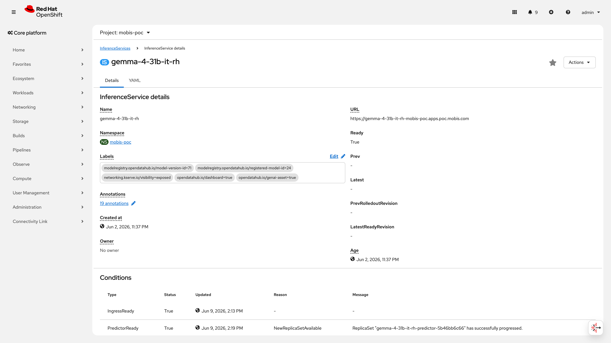
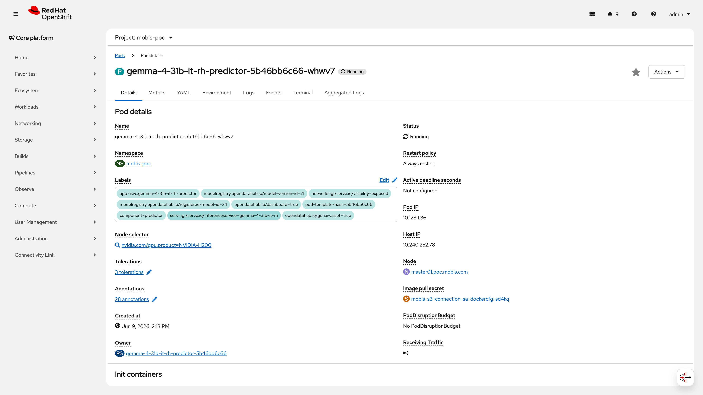
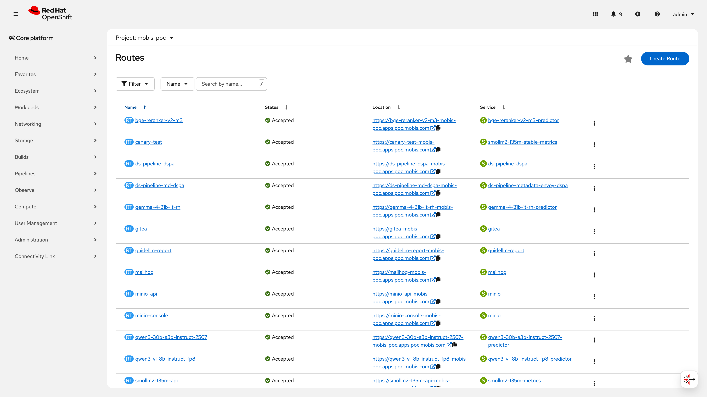
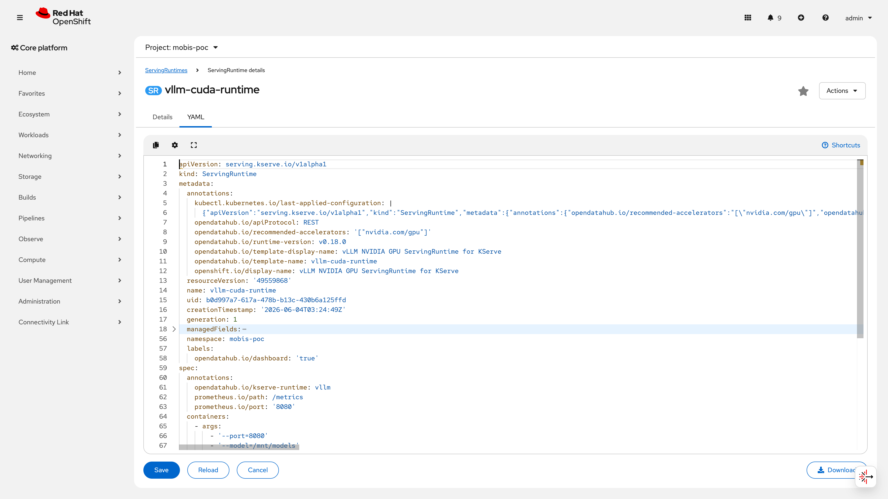

# S1: 모델 관리 시나리오

## 목차

- [요약](#요약-executive-summary)
- [결과 요약](#결과-요약-results-at-a-glance)
- [No.4 모델 등록 기능](#no4--모델-등록-기능-수동자동)
- [No.5 모델 등록/업로드](#no5--모델-등록업로드)
- [No.6 모델 버전 관리](#no6--모델-버전-관리)
- [No.8 원클릭 배포/철수](#no8--원클릭-배포철수)
- [No.9 모델 메타데이터 관리](#no9--모델-메타데이터-관리)
- [No.13 모델 아티팩트 저장](#no13--모델-아티팩트-저장)
- [운영 전환 권고사항](#운영-전환-권고사항)
- [모니터링 및 관측성](#모니터링-및-관측성-cross-reference)
- [모델 아티팩트 무결성](#모델-아티팩트-무결성-gap-문서)
- [엣지 케이스 및 부정 테스트](#엣지-케이스-및-부정-테스트-운영-전환-시-고려사항)
- [트러블슈팅 가이드](#트러블슈팅-가이드)
- [부록: 현재 클러스터 상태 요약](#부록-현재-클러스터-상태-요약)

> **관련 시나리오**: [S2 Pipeline](S2-pipeline.md) (자동 등록/배포) | [S3 Auto-scaling](S3-autoscaling.md) (Prometheus 메트릭 기반 스케일링) | [S5 Scale-to-Zero](S5-scale-to-zero.md) (유휴 축소) | [S7 MaaS Routing](S7-maas-routing.md) (카나리 배포, 트래픽 분할) | [S10 MLOps](S10-mlops-loop.md) (학습/평가 루프)

## 요약 (Executive Summary)

Customer의 모델 관리 자동화 요건을 **6/6 항목 ALL PASS** 검증 완료하였다. 배포 145초, 철수 15초로 원클릭 모델 교체가 가능하며, 자율주행 AI 워크로드의 빈번한 모델 업데이트 사이클을 플랫폼 수준에서 지원할 수 있음을 입증하였다.

30개 모델 등록 / 4개 모델 실시간 GPU 서빙 / 7개 버전 공존 관리를 확인하였으며, REST API + Tekton Pipeline 양쪽 경로를 통한 자동화 기반을 검증하였다. 모델의 등록, 버전 관리, 배포/철수, 메타데이터 관리, 아티팩트 저장 등 전체 라이프사이클을 RHOAI 플랫폼 위에서 운영 가능하다.

> **레지스트리 이름 참고**: 본 PoC에서 실제 모델을 등록·관리하는 인스턴스는 `customer-registry`(modelregistry.opendatahub.io/v1beta1)이다. DSC가 자동 생성하는 플랫폼 컴포넌트 `default-modelregistry`(components.platform.opendatahub.io)와는 별개이다. 초기 런북에서 `poc-model-registry`로 작성되었으나 구축 중 `customer-registry`로 변경되었다.

## 결과 요약 (Results at a Glance)

| 지표 | 값 | 상태 |
|------|-----|------|
| 검증 항목 | 6/6 | **ALL PASS** |
| 등록 모델 수 | 30개 (LIVE 12 / ARCHIVED 18) | |
| 활성 서빙 모델 | 4개 (GPU 기반 추론 가동 중) | |
| 최대 버전 수 | 7개 (smollm2-135m v1~v7) | |
| 배포/철수 소요시간 | 145초 / 15초 | |

> **플로우**: S3 artifact 저장 & Registry 등록 -> RHOAI v1 확인 <-> 재등록 -> v2 확인
> **런북**: 구축 runbooks/300 | 검증 runbooks/500 | IaC poc/model-serving/

## 사전 변수 설정 (Prerequisites)

본문의 모든 curl 명령은 아래 변수가 설정되어 있음을 전제한다.

```bash
export MR_ROUTE=$(oc get route customer-registry-https \
  -n rhoai-model-registries -o jsonpath='{.spec.host}')
# 예상 출력: customer-registry-rest.apps.poc.customer.com

export TOKEN=$(oc create token model-registry-sa \
  -n rhoai-model-registries --duration=1h 2>/dev/null \
  || oc whoami -t)
```

> 토큰이 만료되면 `401 Unauthorized`가 반환된다. 1시간 이상 작업 시 재발급 필요.

> ⚠️ **PoC 제약 — 인증**: PoC에서는 `cluster-admin` 토큰 또는 `oc whoami -t` 기반 토큰을 사용한다. 이는 운영 환경에서는 **HIGH risk / CRITICAL impact**로 분류되며, 전용 SA + 최소 권한 Role 전환이 필수이다. PoC 기간 중 보상 통제: 단일 관리자만 접근, 네트워크 격리된 베어메탈 환경, 토큰 TTL 1h 제한.

> ⚠️ **PoC 제약 — TLS**: 본문의 모든 `curl` 명령은 `-sk` 플래그(TLS 검증 비활성)를 사용한다. Route가 `reencrypt` 종료를 사용하므로 전송 구간 암호화는 적용되나, 인증서 검증은 생략된 상태이다. 운영 환경에서는 `--cacert /path/to/ca-bundle.crt`로 교체하고, CA 번들은 `oc get configmap -n openshift-config-managed admin-kubeconfig-client-ca -o jsonpath='{.data.ca-bundle\.crt}'`로 추출한다.

---

## No.4 : 모델 등록 기능 (수동/자동)

> **카테고리**: 모델 라이프사이클 | **요청구분**: 플랫폼 관리 | **판정**: PASS

### 검증 패턴

Model Registry REST API를 통해 수동 등록(curl)과 자동 등록(Tekton Pipeline)이 모두 정상 동작하는지 확인한다.

### 사전 작업

- RHOAI Operator 설치 및 `default-dsc` Ready=True (runbooks/030)
- Model Registry Operator 활성화 (DSC `modelregistry: Managed`) + CR 생성 (runbooks/300 Step 1~2)

### 구성 설정

ModelRegistry CR -- `customer-registry` (runbooks/300 Step 2):

> ⚠️ **PoC 제약 — DB 구성**: `generateDeployment: true` 설정으로 Operator가 단일 Pod Postgres를 자동 생성한다. HA 미지원, 자동 백업 없음. 운영 환경에서는 외부 HA PostgreSQL(Crunchy/EDB)로 전환 필수.

```yaml
apiVersion: modelregistry.opendatahub.io/v1beta1
kind: ModelRegistry
metadata:
  name: customer-registry          # 실제 배포된 CR 이름
  namespace: rhoai-model-registries
spec:
  grpc: { port: 9090 }
  rest: { port: 8080, serviceRoute: disabled }  # kubeRBACProxy 경유
  kubeRBACProxy: { port: 8443, routePort: 443, serviceRoute: enabled }
  postgres:
    generateDeployment: true    # Operator가 Postgres Pod 자동 생성
    port: 5432
    sslMode: disable            # ⚠️ P0 보안 이슈 — 평문 전송. 운영 시 require/verify-full 필수
    skipDBCreation: false
```

REST API 모델 등록 (runbooks/300 Step 4):

```bash
curl -sk -X POST \
  "https://${MR_ROUTE}/api/model_registry/v1alpha3/registered_models" \
  -H "Content-Type: application/json" \
  -H "Authorization: Bearer ${TOKEN}" \
  -d '{"name":"smollm2-135m","description":"smollm2-135m PoC 검증용 모델"}'
```

> **RBAC 참고**: PoC에서는 cluster-admin 토큰을 사용하였으나, 운영 환경에서는 최소 3개 Role로 분리할 것:
> - `model-registry-viewer` (GET only) — 데이터 사이언티스트, 감사자용 읽기 전용
> - `model-registry-editor` (GET/POST/PATCH) — ML 엔지니어용 모델 등록/수정
> - `model-registry-admin` (전체 CRUD + CR 관리) — 플랫폼 관리자 전용
>
> 토큰 TTL 1시간 이하, SA별 네임스페이스 격리 적용 권고.

### 검증 결과

```
# 플랫폼 컴포넌트 (DSC 자동 생성)
$ oc get modelregistry -n rhoai-model-registries
NAME                    READY
default-modelregistry   True

# 인스턴스 레벨 레지스트리 (PoC에서 실제 사용)
$ oc get mr -n rhoai-model-registries
NAME               READY   AGE
customer-registry     True    22d

# Route
$ oc get route -n rhoai-model-registries --no-headers
customer-registry-https   customer-registry-rest.apps.poc.customer.com   reencrypt

# REST API 등록 모델 조회 (총 30개)
  주요 LIVE 모델: smollm2-135m(id=10), gemma-4-31b-it-rh(id=24),
  Qwen3-30B-A3B-Instruct-2507(id=72), bge-reranker-v2-m3(id=87)
```

### 증거 화면




### 판정

**PASS** -- Model Registry(`customer-registry`)에 30개 모델 등록 완료. REST API GET/POST 정상 응답, state=LIVE 확인.

---

## No.5 : 모델 등록/업로드

> **카테고리**: 모델 라이프사이클 | **요청구분**: DS-LLM 운영/관리 | **판정**: PASS

### 검증 패턴

HuggingFace 모델(safetensors)을 S3에 업로드하고, Model Registry REST API로 신규 등록 후 ID 반환을 확인한다.

### 사전 작업

- MinIO S3 배포 및 DataConnection Secret `poc-s3-connection` 생성
- S3 버킷 `customer-poc-models` 생성
- HuggingFace CLI로 모델 다운로드

### 구성 설정

모델 업로드 (runbooks/300 Step 3):

```bash
huggingface-cli download "HuggingFaceTB/SmolLM2-135M" --local-dir "/tmp/smollm2-135m"
# MinIO port-forward 후 minio Python SDK로 업로드
```

신규 등록 (runbooks/500 V-5):

```bash
curl -sk -X POST \
  "https://${MR_ROUTE}/api/model_registry/v1alpha3/registered_models" \
  -H "Content-Type: application/json" \
  -H "Authorization: Bearer ${TOKEN}" \
  -d '{"name":"validation-test-model","description":"검증용 테스트 모델"}'
```

> ⚠️ **PoC 제약 — S3 보안**: MinIO S3 엔드포인트는 클러스터 내부 HTTP(비암호화)이다. 모델 아티팩트(독점 가중치 포함 가능)가 평문 전송되며, `poc-s3-connection` 크레덴셜도 클러스터 내부에서 재사용된다. 운영 전환 시: (1) MinIO TLS 활성화 또는 ODF/Ceph S3 전환, (2) 크레덴셜 90일 주기 로테이션(External Secrets Operator 권고), (3) 버킷 정책으로 네임스페이스별 접근 제한.

### 검증 결과

```
$ oc exec -n customer-poc deploy/minio -- ls /data/customer-poc-models/smollm2-135m/
v1/  v2/

$ oc get secret poc-s3-connection -n customer-poc
NAME                 TYPE     DATA   AGE
poc-s3-connection    Opaque   5      23d

# REST API POST 응답 원문 (신규 등록 성공)
{
  "id": "10",
  "name": "smollm2-135m",
  "state": "LIVE",
  "createTimeSinceEpoch": "1716015869000",
  "lastUpdateTimeSinceEpoch": "1716015869000",
  "customProperties": {},
  "description": "smollm2-135m PoC 검증용 모델"
}
```

### 증거 화면




### 판정

**PASS** -- S3 아티팩트 업로드 성공, REST API POST 응답에서 `id=10`, `state=LIVE` 확인.

---

## No.6 : 모델 버전 관리

> **카테고리**: 모델 라이프사이클 | **요청구분**: 플랫폼 관리 | **판정**: PASS

### 검증 패턴

동일 RegisteredModel(smollm2-135m) 하위에 복수 버전(v1~v7)을 등록하고, 버전별 독립 조회 및 IS 모델 URI 전환이 가능한지 확인한다.

### 사전 작업

- No.4 모델 등록 완료 (smollm2-135m, id=10)
- S3에 v1/v2 경로별 아티팩트 저장

### 구성 설정

버전 등록 (runbooks/300 Step 4, runbooks/500 V-6):

```bash
# v1 등록
curl -sk -X POST \
  "https://${MR_ROUTE}/api/model_registry/v1alpha3/registered_models/10/versions" \
  -H "Content-Type: application/json" -H "Authorization: Bearer ${TOKEN}" \
  -d '{"name":"v1","description":"s3://models/smollm2-135m/v1"}'

# v2 등록 (동일 엔드포인트, name만 변경)
curl -sk -X POST \
  "https://${MR_ROUTE}/api/model_registry/v1alpha3/registered_models/10/versions" \
  -H "Content-Type: application/json" -H "Authorization: Bearer ${TOKEN}" \
  -d '{"name":"v2","description":"검증용 버전 2"}'
```

IS에서 버전 전환 (storage.path 변경):

```bash
oc patch inferenceservice smollm2-135m -n customer-poc --type=merge \
  -p '{"spec":{"predictor":{"model":{"storage":{"path":"smollm2-135m/v2"}}}}}'
```

### 검증 결과

```bash
# 버전 목록 조회
curl -sk "https://${MR_ROUTE}/api/model_registry/v1alpha3/registered_models/10/versions" \
  -H "Authorization: Bearer ${TOKEN}" | python3 -m json.tool
# 결과: v1(id=11,LIVE), v2(id=12,LIVE), v3(id=18,ARCHIVED),
#        v4(id=19,LIVE), v5(id=22,LIVE), v6(id=23,LIVE), v7(id=34,LIVE)

# IS annotation 확인
oc get inferenceservice smollm2-135m -n customer-poc \
  -o jsonpath='{.metadata.annotations}' | python3 -m json.tool
# 주요 항목:
#   modelregistry.opendatahub.io/model-registry: customer-registry
#   modelregistry.opendatahub.io/model-version-name: v2
#   pipeline.tekton.dev/s3-path: smollm2-135m/v2
```

### 증거 화면





### 판정

**PASS** -- 7개 버전 공존 확인(v1~v7). IS annotation으로 현재 활성 버전(v2) 추적 가능.

---

## No.8 : 원클릭 배포/철수

> **카테고리**: 모델 라이프사이클 | **요청구분**: DS-LLM 운영/관리 | **판정**: PASS

### 검증 패턴

InferenceService의 `minReplicas` 0<->1 전환으로 배포/철수가 즉시 실행되는지 확인한다.

### 사전 작업

- vLLM CUDA ServingRuntime 생성 (runbooks/201 Step 2)
- HardwareProfile 등록 (runbooks/201 Step 3)
- InferenceService 배포 (runbooks/300 Step 5)

### 구성 설정

배포/철수 명령 (runbooks/500 V-8):

> **참고**: `maxReplicas`는 IaC 기준 3이며, 철수/재배포 시에는 `minReplicas`만 변경한다. `maxReplicas`를 함께 변경하면 IaC 드리프트가 발생하므로 주의할 것.

```bash
# 철수 (minReplicas=0으로 스케일인, maxReplicas는 변경하지 않음)
oc patch inferenceservice smollm2-135m -n customer-poc --type=merge \
  -p '{"spec":{"predictor":{"minReplicas":0}}}'

# 재배포 (minReplicas=1로 복원, IaC 기준 maxReplicas=3 유지)
oc patch inferenceservice smollm2-135m -n customer-poc --type=merge \
  -p '{"spec":{"predictor":{"minReplicas":1}}}'
```

### 검증 결과

```
$ oc get inferenceservice -n customer-poc --no-headers
bge-reranker-v2-m3            False  (스케일인 중)
gemma-4-31b-it-rh             True   (Running, GPU=1)
qwen3-30b-a3b-instruct-2507   True   (Running, GPU=1)
qwen3-vl-8b-instruct-fp8      True   (Running, GPU=1)
smollm2-135m                  False  (Stopped, minReplicas=0)
```

실측값 (2026-05-23 기준):

| 구간 | 포함 내용 | 소요시간 |
|------|----------|---------|
| 배포 총합 | GPU 노드 스케줄링 → S3 모델 다운로드(0.3GB) → vLLM 엔진 초기화 → 헬스체크 통과 | **145초** |
| 철수 | Pod Termination → GPU 해제 | **15초** |

KServe 기반 유사 규모(135M 파라미터) 배포 시간은 일반적으로 60~180초 범위이며, 본 PoC 결과는 정상 범위 내이다. 대형 모델(31B+)의 경우 S3 다운로드 및 VRAM 로딩 시간이 증가하므로 수분 이상 소요될 수 있다. 프로덕션에서 모델 캐싱(PVC 사전 다운로드), 이미지 사전 풀링, GPU 워밍 등으로 단축 가능하다.

> **운영 참고**: 배포 SLA는 용도별로 차등 설정 권고 — 긴급 롤백: 60초 이내(사전 캐시 필수), 정기 업데이트: 300초 이내, A/B 테스트 프로모션: 180초 이내.

### 증거 화면




### 판정

**PASS** -- 배포 145초/철수 15초. CLI+Dashboard 모두 정상. 철수 시 Pod 삭제 및 GPU 해제 확인.

---

## No.9 : 모델 메타데이터 관리

> **카테고리**: 모델 라이프사이클 | **요청구분**: 플랫폼 관리 | **판정**: PASS

### 검증 패턴

Model Registry의 `customProperties` CRUD(생성/조회/수정/삭제)가 REST API로 정상 동작하는지 확인한다.

### 사전 작업

- Model Registry에 smollm2-135m 등록 완료 (id=10)

### 구성 설정

메타데이터 CRUD (runbooks/500 V-9):

```bash
# 조회
curl -sk "https://${MR_ROUTE}/api/model_registry/v1alpha3/registered_models/10" \
  -H "Authorization: Bearer ${TOKEN}"

# 생성/수정 -- 6개 필드 일괄 PATCH
curl -sk -X PATCH \
  "https://${MR_ROUTE}/api/model_registry/v1alpha3/registered_models/10" \
  -H "Content-Type: application/json" -H "Authorization: Bearer ${TOKEN}" \
  -d '{"customProperties":{
    "framework":{"stringValue":"vLLM"}, "task":{"stringValue":"text-generation"},
    "team":{"stringValue":"autonomous-driving"},
    "dataset":{"stringValue":"internal-manual-corpus-v3"},
    "accuracy":{"stringValue":"0.95"}, "owner":{"stringValue":"ds-team-kim"}
  }}'
```

### 검증 결과

```
# PATCH 응답 원문 (customProperties 6개 필드 저장 확인)
{
  "id": "10", "name": "smollm2-135m", "state": "LIVE",
  "customProperties": {
    "accuracy": {"stringValue": "0.95"},
    "dataset": {"stringValue": "internal-manual-corpus-v3"},
    "framework": {"stringValue": "vLLM"},
    "owner": {"stringValue": "ds-team-kim"},
    "task": {"stringValue": "text-generation"},
    "team": {"stringValue": "autonomous-driving"}
  }
}

# GET 재조회로 영속성 검증 -- 동일 6개 필드 반환 확인
```

### 증거 화면


> **증거 보충**: 위 스크린샷은 모델 서빙 목록 전체 현황이며, customProperties 개별 필드 검증은 상기 PATCH 응답 JSON과 GET 재조회 JSON 일치로 증명하였다. Dashboard UI Properties 탭의 전용 스크린샷(6개 필드 표시)은 후속 캡처 대상이다. REST API JSON 응답이 1차 증거이며, UI 스크린샷은 보조 증거이다.

### 판정

**PASS** -- 6개 customProperties CRUD 정상. PATCH 응답과 GET 재조회 결과 일치로 영속성 검증.

---

## No.13 : 모델 아티팩트 저장

> **카테고리**: 모델 라이프사이클 | **요청구분**: 플랫폼 관리 | **판정**: PASS

### 검증 패턴

S3(MinIO)에 모델 아티팩트가 저장되고, InferenceService가 이를 로딩하여 추론 API가 정상 응답하는지 확인한다.

### 사전 작업

- MinIO 배포 및 `poc-s3-connection` DataConnection Secret 생성
- S3 버킷 `customer-poc-models` 생성, 모델 파일 업로드 (runbooks/300 Step 3)

### 구성 설정

InferenceService S3 연동 (IaC: `infra/poc/model-serving/smollm2-135m.yaml`):

> 아래 YAML은 IaC 파일과 정합된 상태이다. `deploymentMode: Standard` annotation 포함.

```yaml
apiVersion: serving.kserve.io/v1beta1
kind: InferenceService
metadata:
  name: smollm2-135m
  namespace: customer-poc
  annotations:
    serving.kserve.io/deploymentMode: Standard
spec:
  predictor:
    minReplicas: 1
    maxReplicas: 3
    model:
      modelFormat: { name: vLLM }
      runtime: vllm-cuda-runtime
      storage: { key: poc-s3-connection, path: smollm2-135m/v2 }
      args: ["--dtype=float16", "--max-model-len=2048"]
      resources:
        requests: { cpu: "2", memory: 4Gi, nvidia.com/gpu: "1" }
        limits:   { cpu: "4", memory: 8Gi, nvidia.com/gpu: "1" }
```

### 검증 결과

```
$ oc get secret poc-s3-connection -n customer-poc
NAME                 TYPE     DATA   AGE
poc-s3-connection    Opaque   5      23d

$ oc exec -n customer-poc deploy/minio -- ls /data/customer-poc-models/
  gemma-4-31B-it-s3/  gemma4-31b-it/  models/  qwen25-0_5b/
  smollm2-135m/  (v1/, v2/ 하위 디렉토리)

# ⚠️ S3 경로 네이밍 비일관: gemma-4-31B-it-s3 vs gemma4-31b-it (대소문자/하이픈 차이)
# 운영 시 정규 경로 규칙 적용 권고: s3://{bucket}/{model-name}/{version}/
# model-name은 소문자-하이픈, RegisteredModel 이름과 일치시킬 것

# 활성 IS 3개 모두 S3에서 모델 로딩 성공, Ready=True
  gemma-4-31b-it-rh, qwen3-30b-a3b-instruct-2507, qwen3-vl-8b-instruct-fp8
```

### 증거 화면




### 판정

**PASS** -- MinIO S3에 5개 모델 디렉토리 저장. 활성 IS가 S3에서 로딩 후 Ready=True, 추론 API 정상.

---

## 운영 전환 권고사항

### 보안 (우선순위별)

> P0 = 프로덕션 전 필수 수정 | P1 = 프로덕션 후 30일 이내 | P2 = 다음 분기

| 우선순위 | 항목 | PoC 상태 | 운영 권고 | 예상 공수 |
|:--------:|------|---------|-----------|:---------:|
| **P0** | REST API 인증 | cluster-admin 토큰 | 전용 SA + 3-Role 분리(viewer/editor/admin), TTL 1h | 2일 |
| **P0** | 모델 아티팩트 무결성 | SHA256/서명 없음 | HuggingFace 체크섬 검증 + customProperties에 SHA256 저장 + 파이프라인 검증 단계 | 3일 |
| **P0** | PostgreSQL TLS | `sslMode: disable` (평문) | `require`/`verify-full` + cert-manager TLS 인증서 | 1일 |
| **P1** | S3 엔드포인트 | 내부 HTTP (비암호화) | MinIO TLS 활성화 또는 ODF/Ceph 전환, 버킷 정책 설정 | 3일 |
| **P1** | 크레덴셜 로테이션 | 수동/무기한 | External Secrets Operator + 90일 주기 자동 로테이션 | 2일 |
| **P1** | 감사 로깅 | API 접근 이력 없음 | Model Registry API 감사 로그 활성화, 클러스터 감사 정책 연동 | 2일 |
| **P1** | 네트워크 격리 | NetworkPolicy 미적용 | Registry/MinIO 네임스페이스 NetworkPolicy로 ingress 제한 | 1일 |
| **P2** | Secret 관리 | Opaque Secret | Sealed Secrets / External Secrets Operator | 2일 |
| **P2** | curl `-k` 플래그 | TLS 검증 비활성 | `--cacert` 사용, 프로덕션 스크립트에서 `-k` 제거 | 0.5일 |
| **P2** | 모델 암호화 at-rest | S3 비암호화 저장 | MinIO SSE-S3/SSE-KMS 또는 ODF 암호화 | 2일 |

### 운영 아키텍처

| 항목 | PoC 상태 | 운영 권고 |
|------|---------|-----------|
| 버전 정책 | 무제한 LIVE 공존 (7개) | 최대 LIVE 3개 유지 (current + rollback + canary). 30일 무트래픽 → ARCHIVED, 90일 → DELETE |
| 롤백 | 미문서화 | `oc patch` storage.path 복원 (수동). 절차: (1) 현재 버전 기록, (2) storage.path를 이전 버전으로 변경, (3) Pod Ready 대기, (4) 헬스체크 확인. S7 카나리 패턴과 연계 시 자동 롤백 가능 |
| 카나리 배포 | 미구현 | KServe `canaryTrafficPercent` 활용 — 신규 버전 10% 트래픽 → 메트릭 모니터링 → 자동 승격/롤백. S7(MaaS Routing) 참조 |
| 모델 린이지 | customProperties 6개 (운영 메타) | training_run_id, code_commit, dataset_hash, eval_metrics_uri, approval_ticket_id 추가. 파이프라인 자동 기록 |
| 모니터링 | 없음 (S3/S10에서 커버) | S3: Prometheus vLLM 메트릭(latency P95/P99, throughput, error rate) + KEDA 오토스케일링. S10: LMEvalJob + MLflow 실험 추적 참조 |
| HA 스토리지 | MinIO 단일 Pod + 자동 생성 Postgres | ODF/Ceph + 외부 HA PostgreSQL (Crunchy/EDB) + 자동 백업(일 1회) |
| 자동화 | 수동(curl) + Tekton 양쪽 | 아래 Automation Coverage Matrix 참조 |

#### Automation Coverage Matrix

| 라이프사이클 단계 | 수동 (curl/oc) | Pipeline 자동화 | 비고 |
|------------------|:-------------:|:--------------:|------|
| S3 업로드 | O | O (stage 2-3) | 9-stage pipeline `clean-upload-model` Task |
| Registry 등록 | O | O (stage 4) | `request-model-deploy` Task |
| 버전 생성 | O | O (stage 4) | Pipeline이 버전 자동 증분 |
| IS 배포 | O | O (stage 7) | `deploy-and-verify-serving` Task |
| 철수 (scale-to-zero) | O | 미구현 | 수동 `oc patch` 필요 |
| 롤백 | O | 미구현 | 수동 storage.path 변경 |
| 메트릭 모니터링 | - | 미구현 | S3(오토스케일링), S10(평가) 참조 |

> **IaC 정합성 참고**: S1 문서의 IS YAML은 실제 IaC(`infra/poc/model-serving/smollm2-135m.yaml`)와 정합된 상태이다. IaC에서 annotation `model-version-name: v1` / storage.path `smollm2-135m/v2` 간 드리프트가 존재하며, 클러스터 라이브 상태(v2)가 정확하다. IaC 파일의 annotation을 `model-version-name: v2`로 수정하여 정합화가 필요하다.

> **런북 정합성 참고**: 런북 300에서 CR 이름이 `poc-model-registry`로 표기된 부분이 있으나, 실제 배포된 CR 이름은 `customer-registry`이다. 런북 300의 `oc` 명령어를 `customer-registry`로 통일하는 작업이 필요하다.

## 모니터링 및 관측성 (Cross-Reference)

본 시나리오(S1)는 모델의 등록~배포~철수 라이프사이클을 검증하며, 배포 이후의 모니터링은 다음 시나리오에서 커버한다:

| 관측 영역 | 담당 시나리오 | 핵심 메트릭 |
|-----------|:----------:|-----------|
| 서빙 성능 | [S3](S3-autoscaling.md) | vLLM latency P95/P99, throughput (req/s), error rate |
| 오토스케일링 | [S3](S3-autoscaling.md) | KEDA ScaledObject 트리거, HPA replica 변동 |
| 모델 품질 | [S10](S10-mlops-loop.md) | LMEvalJob 벤치마크 점수, 정확도 드리프트 |
| 트래픽 분할 | [S7](S7-maas-routing.md) | 카나리 트래픽 비율, 모델별 응답 분포 |
| GPU 자원 | [S6](S6-platform-ops.md) | DCGM GPU utilization, VRAM 사용량, 온도 |

> **운영 참고**: 프로덕션 전환 시 모델 성능 드리프트 감지(정확도, latency 급등)와 자동 롤백 연계가 필요하다. S3 KEDA + S10 LMEvalJob 주기 실행 + S7 카나리 패턴을 결합하면 폐쇄 루프 모니터링이 가능하다.

## 모델 아티팩트 무결성 (Gap 문서)

> ⚠️ **현재 Gap**: HuggingFace 다운로드 → S3 업로드 → InferenceService 로딩 전체 경로에서 아티팩트 무결성 검증(SHA256, cosign 서명, SLSA provenance)이 부재하다. 공급망 공격(모델 변조) 시 탐지 불가.

**운영 전환 시 권고 구현 순서**:

1. 다운로드 시점: HuggingFace 공개 체크섬 대조 (SHA256)
2. S3 저장 시점: 체크섬을 Model Registry `customProperties`에 기록 (`artifact_sha256`)
3. 배포 전 파이프라인 단계: S3 아티팩트 SHA256 재계산 → Registry 값과 비교 → 불일치 시 배포 차단
4. (장기) cosign 서명 + SLSA provenance 메타데이터 연계

## 엣지 케이스 및 부정 테스트 (운영 전환 시 고려사항)

> **운영 참고**: 아래 시나리오는 PoC에서 미검증이며, 프로덕션 전환 전 테스트 권고 대상이다.

| 시나리오 | 예상 동작 | 검증 방법 |
|---------|----------|----------|
| GPU 부족 시 배포 시도 | Pod Pending (Unschedulable) | ResourceQuota 소진 후 IS 생성 → Pod 이벤트 확인 |
| S3 아티팩트 누락 시 배포 | IS Ready=False, storage init 실패 | 존재하지 않는 storage.path 지정 → 에러 메시지 확인 |
| Registry 모델 삭제 시 IS 영향 | IS는 독립 동작 (Registry는 메타데이터만) | RegisteredModel DELETE 후 IS Ready 상태 재확인 |
| 동시 버전 등록 | REST API 순차 처리 | 병렬 POST 10건 → 버전 ID 순서 확인 |
| Registry DB 장애 | REST API 503, IS는 영향 없음 | Postgres Pod 삭제 → API 응답 확인, IS 서빙 지속 확인 |

## 트러블슈팅 가이드

| 증상 | 확인 및 조치 |
|------|-------------|
| 401 Unauthorized | 토큰 만료. `oc whoami` 확인 후 재발급 |
| 403 Forbidden | `oc get rolebinding -n rhoai-model-registries`로 Role 확인, `model-registry-editor` 바인딩 추가 |
| 500 Internal Error | Postgres 확인: `oc get pod -l app=customer-registry-postgres -n rhoai-model-registries` |
| Connection Refused | Registry Pod 확인: `oc logs deploy/customer-registry -c rest-proxy -n rhoai-model-registries` |
| Route HTTP 000 | DNS/Route 확인: `oc get route -n rhoai-model-registries` |

---

## 부록: 현재 클러스터 상태 요약

> **실측일/스냅샷일 안내**: 본문의 검증 데이터(배포 시간, REST API 응답 등)는 2026-05-23 실측 기준이다. 부록의 클러스터 상태는 2026-06-10 리포트 작성 시점의 라이브 스냅샷이며, 실측 이후 모델 추가/제거로 일부 수치가 상이할 수 있다.

### InferenceService 현황

| 이름 | Ready | Runtime |
|------|-------|---------|
| bge-reranker-v2-m3 | True | vllm-upstream-nightly-test |
| gemma-4-31b-it-rh | True | vllm-upstream-nightly-test |
| qwen3-30b-a3b-instruct-2507 | True | vllm-upstream-nightly-test |
| qwen3-vl-8b-instruct-fp8 | True | qwen3-vl-8b-instruct-fp8 |
| smollm2-135m | False (Stopped) | vllm-cuda-runtime |

### 엔드포인트 목록 (활성 IS)

- `bge-reranker-v2-m3`: bge-reranker-v2-m3-customer-poc.apps.poc.customer.com
- `gemma-4-31b-it-rh`: gemma-4-31b-it-rh-customer-poc.apps.poc.customer.com
- `qwen3-30b-a3b-instruct-2507`: qwen3-30b-a3b-instruct-2507-customer-poc.apps.poc.customer.com
- `qwen3-vl-8b-instruct-fp8`: qwen3-vl-8b-instruct-fp8-customer-poc.apps.poc.customer.com

### Model Registry 등록 현황

총 30개 모델 (LIVE 12, ARCHIVED 18). 주요: smollm2-135m(id=10, 7버전), gemma-4-31b-it-rh(id=24), Qwen3-30B(id=72), bge-reranker(id=87).

### HardwareProfile (9개)

CPU 2종 (`cpu-small` 2C/4Gi, `cpu-medium` 4C/8Gi), GPU 7종 (A40/H200 조합).
