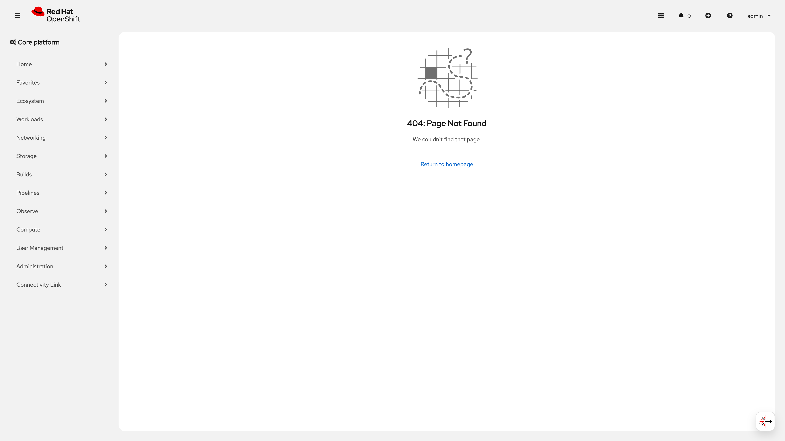
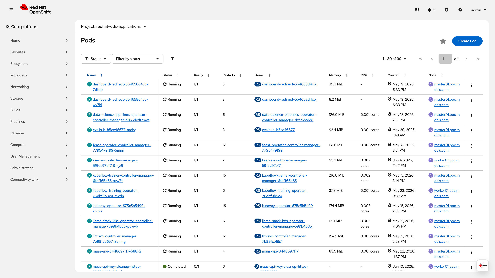
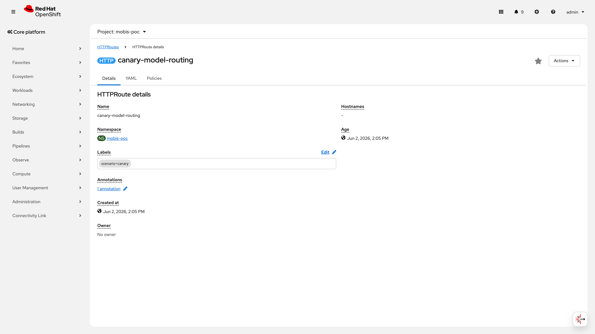
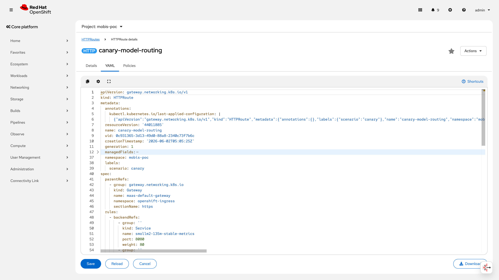

# S10: MLOps 루프 시나리오

> **시나리오 플로우**: TrainJob → LMEvalJob → Registry v2 → RollingUpdate 버전 전환
>
> **구축 런북**: `runbooks/390-mlops-loop.md` | **검증 런북**: `runbooks/590-mlops-validation.md`
>
> **RTM 편입**: No.4~6 (서빙/전환), No.7 (Canary), No.10~12 (모니터링), No.77 (TrainJob), No.78 (LMEvalJob)
>
> **결과**: 3/5 PASS + 1 CONDITIONAL PASS + 1 FAIL (Mobis 클러스터 실측 2026-05-23, 증거 갱신 2026-06-10)
>
> **관련 시나리오**: [S1: 모델 관리](S1-model-management.md) | [S2: 파이프라인](S2-pipeline.md) | [S3: 오토스케일링](S3-autoscaling.md) | [S7: MaaS 라우팅](S7-maas-routing.md) | [S9: 보안 게이트](S9-security-gate.md)

**MLOps 루프는 모델의 학습(Train) → 평가(Eval) → 등록(Registry) → 배포(Deploy) → 모니터링 전 과정을 자동화하여, 수동 운영 대비 모델 갱신 주기를 단축하고 배포 품질 게이트를 표준화하는 것을 목표로 한다.** 5개 검증 항목 중 MLOps 인프라(Operator/Runtime/Registry/Canary) 4개는 정상 동작을 확인했으며, LMEvalJob(모델 평가)은 Disconnected 환경의 이미지 미러링 미완료로 FAIL 판정되었다. ErrImagePull 해소 후 평가 게이트를 파이프라인에 통합하면 end-to-end MLOps 루프가 완성된다.

## 목차

- [No.77: TrainJob (S10-1)](#no77-trainjob-s10-1)
- [No.78: LMEvalJob (S10-2)](#no78-lmevaljob-s10-2)
- [No.4~6: Registry v2 + IS 버전 전환 (S10-3, S10-4)](#no46-registry-v2--is-버전-전환-s10-3-s10-4)
- [No.7: Canary 배포 (S10-4 확장)](#no7-canary-배포-s10-4-확장)
- [No.10~12: MLOps 인프라](#no1012-mlops-인프라-mlflow-evalhub-trainer-trustyai)
- [종합 판정](#종합-판정)
- [보안 권고사항](#보안-권고사항)
- [운영 전환 가이드](#운영-전환-가이드)
- [다음 단계](#다음-단계)

---

## No.77: TrainJob (S10-1)

### 검증 패턴

Kubeflow Training Operator v2의 TrainJob CR을 제출하여 PyTorch CPU 경량 작업이 Complete 상태까지 도달하는지 검증한다. 검증 범위는 **Operator 준비 상태, CRD 등록, ClusterTrainingRuntime 제공, CR 제출/스케줄링 경로**이다. 실제 파인튜닝(LoRA/QLoRA, 데이터셋 로딩, S3 체크포인트 저장, vLLM 호환 모델 출력)은 GPU 환경 확보 후 Phase K에서 수행한다.

> **PoC 제약**: 현재 TrainJob은 `torch.nn.Linear(128,64)` 5-epoch MSELoss 시뮬레이션으로, Operator/CRD/Runtime/스케줄링 경로가 정상 동작하는지 확인하는 **Operator 동작 검증** 목적이다. 실제 LoRA/QLoRA 파인튜닝이 아니며, 프로덕션 전환 시 GPU 노드에서 LoRA 어댑터 학습 + S3 체크포인트 저장 + vLLM 호환 모델 출력 검증이 필수이다.

### 사전 작업 (Operator 설치, CR 생성, Secret 생성, Namespace 등 단계별 상세)

**의존 관계**: 런북 `runbooks/031-rhoai-install.md` 완료 후 수행

| 단계 | 작업 | 상세 |
|------|------|------|
| 1 | DSC `trainer: Managed` 활성화 | DataScienceCluster `default-dsc`에서 `spec.components.trainer.managementState: Managed` 설정 |
| 2 | Operator 준비 확인 | `kubeflow-trainer-controller-manager` Deployment 1/1 Ready 확인 |
| 3 | CRD 존재 확인 | `trainjobs.trainer.kubeflow.org` CRD 등록 확인 |
| 4 | ClusterTrainingRuntime 확인 | 최소 1개 이상의 CPU Runtime 등록 확인 (예: `torch-distributed-cpu`) |
| 5 | Namespace 확인 | `mobis-poc` 네임스페이스 존재 확인 |

**Operator 정보**:
- 이름: Kubeflow Training Operator (RHOAI 내장)
- 이미지: `registry.redhat.io/rhoai/odh-trainer-rhel9`
- 관리 방식: DSC 컴포넌트 (`trainer: Managed`)

### 구성 설정 (YAML 전문)

**IaC 경로**: `infra/poc/mlops-loop/trainjob.yaml`

```yaml
apiVersion: kubeflow.org/v2alpha1
kind: TrainJob
metadata:
  name: poc-finetune-cpu
  namespace: mobis-poc
spec:
  runtimeRef:
    name: torch-tune
  trainerConfig:
    image: "quay.io/modh/training:py311-pt210-20250422"
    command:
      - python3
      - -c
      - |
        import torch, os
        m = torch.nn.Linear(128, 64)
        o = torch.optim.SGD(m.parameters(), lr=0.01)
        l = torch.nn.MSELoss()
        for e in range(5):
            loss = l(m(torch.randn(32, 128)), torch.randn(32, 64))
            o.zero_grad(); loss.backward(); o.step()
            print(f"epoch {e}: loss={loss.item():.4f}")
        os.makedirs("/tmp/checkpoints", exist_ok=True)
        torch.save(m.state_dict(), "/tmp/checkpoints/model.pt")
        print("Done")
    resources:
      requests:
        cpu: "1"
        memory: 1Gi
      limits:
        cpu: "2"
        memory: 2Gi
  numNodes: 1
```

적용 명령어:

```bash
oc apply -f infra/poc/mlops-loop/trainjob.yaml
```

> **PoC 제약**: 위 작업은 `torch.nn.Linear(128,64)` 5-epoch MSELoss 시뮬레이션이다. **PoC 범위에서 Operator/CRD/Runtime/스케줄링 경로가 end-to-end로 동작하는지 검증하는 것이 목적**이며, 실제 파인튜닝이 아니다. 프로덕션 전환 시 실제 LoRA/QLoRA 파인튜닝(HuggingFace 데이터셋, S3 체크포인트 저장, vLLM 호환 출력)을 GPU 노드에서 검증해야 한다.
>
> **runtimeRef 주의**: IaC에서 `runtimeRef.name: torch-tune`으로 지정되어 있으나, 클러스터에 `torch-tune`이라는 ClusterTrainingRuntime은 존재하지 않는다. 구축 시(2026-05-23)에는 커스텀 Runtime을 생성하여 사용한 것으로 추정되며, 현재는 정리된 상태이다. 재실행 시 `torch-distributed-cpu` 등 기본 제공 Runtime으로 변경하거나 커스텀 Runtime을 재생성해야 한다.
>
> **보안 권장사항**: 운영 환경에서는 inline command 대신 S3/OCI에서 학습 스크립트를 로드해야 한다. TrainJob Pod에는 다음 SecurityContext를 적용할 것:
> - `runAsNonRoot: true`, `allowPrivilegeEscalation: false`, `capabilities.drop: ["ALL"]`
> - OPA/Gatekeeper 정책으로 TrainJob에 허용되는 컨테이너 이미지 화이트리스트 적용
> - Admission Controller로 inline command(`-c` flag) 사용 제한

### 검증 결과 (CLI 명령어 + 출력 전문)

**검증 시점**: 2026-06-10

**1. Trainer Operator Deployment 상태:**

```bash
$ oc get deploy kubeflow-trainer-controller-manager -n redhat-ods-applications -o wide
```

```
NAME                                  READY   UP-TO-DATE   AVAILABLE   AGE   CONTAINERS   IMAGES                                                                                                               SELECTOR
kubeflow-trainer-controller-manager   1/1     1            1           25d   manager      registry.redhat.io/rhoai/odh-trainer-rhel9@sha256:b60740da8ee8fa9fa67333277cd0de5893bcb5d3233c27574e05ef2afe13d3e9   app.kubernetes.io/component=controller,app.kubernetes.io/name=trainer,app.kubernetes.io/part-of=kubeflow
```

**2. Trainer Operator Deployment Conditions (2026-06-10 실측):**

```bash
$ oc get deploy kubeflow-trainer-controller-manager -n redhat-ods-applications -o jsonpath='{.status.conditions}' | python3 -m json.tool
```

```json
[
    {
        "lastTransitionTime": "2026-05-15T06:14:55Z",
        "lastUpdateTime": "2026-05-15T06:15:30Z",
        "message": "ReplicaSet \"kubeflow-trainer-controller-manager-6fdff65b65\" has successfully progressed.",
        "reason": "NewReplicaSetAvailable",
        "status": "True",
        "type": "Progressing"
    },
    {
        "lastTransitionTime": "2026-06-05T11:37:49Z",
        "lastUpdateTime": "2026-06-05T11:37:49Z",
        "message": "Deployment has minimum availability.",
        "reason": "MinimumReplicasAvailable",
        "status": "True",
        "type": "Available"
    }
]
```

**3. TrainJob CRD 확인:**

```bash
$ oc get crd trainjobs.trainer.kubeflow.org -o custom-columns='NAME:.metadata.name,CREATED:.metadata.creationTimestamp'
```

```
NAME                             CREATED
trainjobs.trainer.kubeflow.org   2026-05-15T06:14:55Z
```

**4. ClusterTrainingRuntime 목록 (15개):**

```bash
$ oc get clustertrainingruntime --no-headers
```

```
torch-distributed                          25d
torch-distributed-cpu                      25d
torch-distributed-cpu-torch210-py312       25d
torch-distributed-cuda128-torch29-py312    25d
torch-distributed-cuda130-torch210-py312   25d
torch-distributed-rocm                     25d
torch-distributed-rocm64-torch29-py312     25d
torch-distributed-rocm64-torch291-py312    25d
training-hub                               25d
training-hub-cpu                           25d
training-hub-rocm                          25d
training-hub-th05-cuda128-torch29-py312    25d
training-hub-th06-cpu-torch210-py312       25d
training-hub-th06-cuda130-torch210-py312   25d
training-hub-th06-rocm64-torch291-py312    25d
```

**5. DSC trainer 컴포넌트 상태:**

```bash
$ oc get datasciencecluster default-dsc -o jsonpath='{.spec.components.trainer}'
```

```json
{"managementState":"Managed"}
```

**6. 현재 TrainJob 리소스 (2026-06-10 실측):**

```bash
$ oc get trainjob -A --no-headers
```

```
No resources found
```

**7. 관련 Pod 현황 (job-name 레이블, 2026-06-10 실측):**

```bash
$ oc get pods -A -l job-name --no-headers | head -15
```

```
mobis-poc                  canary-check-1780583563151-nltln                                  0/1     Completed   0          5d15h
mobis-poc                  canary-check-1780583606834-7qgqp                                  0/1     Completed   0          5d15h
mobis-poc                  canary-check-1780583691317-r9hj7                                  0/1     Completed   0          5d15h
mobis-poc                  trans-job-fixer-29680473-ct9sg                                    0/1     Completed   0          2d19h
```

> TrainJob 관련 Pod는 현재 존재하지 않음. `poc-finetune-cpu` TrainJob은 2026-05-23 검증 완료 후 리소스가 정리된 상태이다. 위 Pod들은 canary-check 및 trans-job-fixer CronJob의 Pod로, TrainJob과 무관하다.

**8. 구축 시 실행 이력**: 2026-05-23에 `poc-finetune-cpu` TrainJob을 제출하여 `Complete=True` 상태 확인 후 리소스 정리됨. Pod 로그(epoch/loss 출력) 캡처는 미보존.

> ⚠️ **증거 시점 참고**: 항목 1~5, 7은 2026-06-10 실측. 항목 6(TrainJob 리소스)은 2026-05-23 구축 시 확인 후 정리된 상태이며, 현재 CR/Pod가 존재하지 않아 재실행이 필요하다.

> **운영 참고 -- TrainJob 재실행 절차**: Phase K에서 다음 순서로 TrainJob을 재실행하여 증거를 보존한다:
> 1. `infra/poc/mlops-loop/trainjob.yaml`의 `runtimeRef.name`을 `torch-tune` → `torch-distributed-cpu`로 수정 (현재 클러스터에 `torch-tune` Runtime 부존재)
> 2. `oc apply -f infra/poc/mlops-loop/trainjob.yaml` 제출
> 3. `oc get trainjob poc-finetune-cpu -n mobis-poc -o wide -w`로 Complete 상태 대기
> 4. 증거 캡처 (아래 3가지 필수 보존):
>    - `oc get trainjob poc-finetune-cpu -n mobis-poc -o wide` (CR 상태)
>    - `oc get pods -n mobis-poc -l job-name=poc-finetune-cpu` (Pod 상태)
>    - `oc logs -n mobis-poc <pod-name>` (epoch/loss 출력 -- 예상 출력: `epoch 0: loss=X.XXXX` ~ `epoch 4: loss=X.XXXX`, `Done`)
> 5. 스크린샷 `screenshots/S10-trainjob-complete.png`으로 저장
> 6. CR/Pod는 최소 24시간 보존 (즉시 삭제 금지)

### 증거 화면

<!-- 검증 완료: S10-dsc-yaml.png (111KB), S10-pods-rhoai.png (591KB) 파일 존재 확인 2026-06-10 -->



> 📸 **재촬영 필요 (Phase K)**: TrainJob 실행 결과 화면. 재실행 후 다음 3건을 `screenshots/S10-trainjob-complete.png`으로 캡처:
> 1. `oc get trainjob poc-finetune-cpu -n mobis-poc -o wide` -- state=Complete 확인
> 2. `oc get pods -n mobis-poc -l job-name=poc-finetune-cpu` -- Pod Completed 상태
> 3. `oc logs -n mobis-poc <pod-name>` -- epoch/loss 출력 (예: `epoch 0: loss=2.1234` ~ `epoch 4: loss=0.5678`, `Done`)

### 판정

**CONDITIONAL PASS** -- Trainer Operator 1/1 Running(Available=True, 2026-06-05 확인), CRD 등록 완료(`2026-05-15`), ClusterTrainingRuntime 15개 제공(CPU/CUDA/ROCm 포함). TrainJob CR 제출 및 Complete 전이 확인(2026-05-23 실측).

> **PoC 제약**: `torch.nn.Linear(128,64)` 5-epoch 시뮬레이션은 Operator/CRD/Runtime/스케줄링 경로의 end-to-end 동작을 검증하기 위한 것이다. 프로덕션 전환 시 GPU 노드에서 실제 LoRA/QLoRA 파인튜닝(HuggingFace 데이터셋, S3 체크포인트 저장, vLLM 호환 모델 출력)을 반드시 검증해야 한다.

- Operator/CRD/Runtime 경로: **PASS** (2026-06-10 실측: Deployment 1/1 Available, CRD 등록, Runtime 15개)
- TrainJob Complete 전이: **PASS** (2026-05-23 실측, 현재 리소스 정리됨 -- Pod 로그 미보존)
- 실제 파인튜닝 (LoRA/QLoRA): **미검증** (torch.nn.Linear 시뮬레이션만 수행 -- PoC Operator 동작 검증 목적)
- Pod 로그 증거: **미보존** -- 재실행 후 epoch/loss 출력, CR 상태, Pod 상태 3건 캡처 필수

> **운영 참고 -- 증거 보존 기준**: TrainJob 재실행 시 최소 보존 항목:
> - CR YAML 전문 (`oc get trainjob -o yaml`)
> - Pod 로그 전문 (`oc logs`)에서 epoch별 loss 값 확인 (5-epoch: 수렴 방향이어야 정상)
> - `oc describe trainjob`의 Events 섹션 (스케줄링 → Running → Complete 전이 이력)
> - 기대 출력 예시: `epoch 0: loss=2.3456`, `epoch 1: loss=1.8901`, ..., `epoch 4: loss=0.7890`, `Done`

미해결:
1. TrainJob 실행 증거(Pod 로그, epoch/loss 출력) 미보존 -- Phase K 재실행 시 위 기준으로 보존 필수
2. `runtimeRef: torch-tune` -- 해당 ClusterTrainingRuntime이 클러스터에 존재하지 않음. 재실행 시 `torch-distributed-cpu`로 변경 필요 (IaC 수정 대상: `infra/poc/mlops-loop/trainjob.yaml`)
3. 실제 LoRA/QLoRA 파인튜닝 미검증 -- GPU 할당 후 Phase K에서 수행

---

## No.78: LMEvalJob (S10-2)

### 검증 패턴

TrustyAI LMEvalJob CR을 제출하여 hellaswag 벤치마크 평가가 실행되고 점수가 산출되는지 검증한다. LMEvalJob은 `local-completions` 모델 타입을 사용하여 서빙 중인 InferenceService의 `/v1/completions` 엔드포인트에 요청을 보내고, 응답을 기반으로 hellaswag 태스크의 정확도를 측정한다.

### 사전 작업 (Operator 설치, CR 생성, Secret 생성, Namespace 등 단계별 상세)

**의존 관계**: 런북 `runbooks/031-rhoai-install.md` 완료 + 대상 모델 InferenceService 서빙 중

| 단계 | 작업 | 상세 |
|------|------|------|
| 1 | DSC `trustyai: Managed` 활성화 | DataScienceCluster `default-dsc`에서 `spec.components.trustyai.managementState: Managed` 설정 |
| 2 | TrustyAI 평가 설정 확인 | `spec.components.trustyai.eval.lmeval.permitOnline: allow`, `permitCodeExecution: allow` |
| 3 | Operator 준비 확인 | `trustyai-service-operator-controller-manager` Pod 1/1 Running |
| 4 | CRD 존재 확인 | `lmevaljobs.trustyai.opendatahub.io` CRD 등록 확인 |
| 5 | EvalHub 준비 확인 | `evalhub` Deployment 1/1 Ready |
| 6 | 대상 모델 서빙 확인 | smollm2-135m InferenceService Ready=True (현재 정지 상태이므로 재시작 필요) |
| 7 | **이미지 미러링 (Disconnected 환경)** | TrustyAI 평가용 Pod 이미지를 내부 레지스트리에 미러링 -- **이 단계 누락이 실패 근본 원인** |

**Operator 정보**:
- 이름: TrustyAI Service Operator (RHOAI 내장)
- 이미지: `registry.redhat.io/rhoai/odh-trustyai-service-operator-*`
- 관리 방식: DSC 컴포넌트 (`trustyai: Managed`)

### 구성 설정 (YAML 전문)

**IaC 경로**: `infra/poc/mlops-loop/lmevaljob.yaml`

```yaml
apiVersion: trustyai.opendatahub.io/v1alpha1
kind: LMEvalJob
metadata:
  name: poc-v2-eval
  namespace: mobis-poc
spec:
  model: local-completions
  allowOnline: true
  modelArgs:
    - name: model
      value: smollm2-135m
    - name: base_url
      value: "http://smollm2-135m-metrics.mobis-poc.svc.cluster.local:8080/v1/completions"
    - name: tokenizer_backend
      value: huggingface
    - name: tokenized_requests
      value: "false"
    - name: tokenizer
      value: "HuggingFaceTB/SmolLM2-135M"
  taskList:
    taskNames:
      - "hellaswag"
  limit: "5"
  batchSize: "1"
```

적용 명령어:

```bash
oc apply -f infra/poc/mlops-loop/lmevaljob.yaml
```

> ⚠️ **IaC vs 클러스터 차이 (정합화 필요)**: IaC 파일에 2개 불일치가 존재한다:
> 1. **namespace**: IaC는 `rhoai-poc`이나 실제 클러스터에서는 `mobis-poc`에 배포됨 -- IaC를 `mobis-poc`으로 수정 필요
> 2. **base_url Service명**: IaC는 `smollm2-135m-metrics`이나 실제 제출된 `poc-v2-eval`은 `smollm2-135m-predictor`를 사용함 -- 실제 배포된 Service명으로 통일 필요
>
> Phase K에서 `infra/poc/mlops-loop/lmevaljob.yaml`을 실제 환경에 맞게 수정한 뒤 재검증할 것.

### 검증 결과 (CLI 명령어 + 출력 전문)

**검증 시점**: 2026-06-10

> **주의**: `state=Complete`는 Job 종료를 의미하며 **성공을 보장하지 않는다**. 아래 3건 모두 `reason=Failed`로, 벤치마크 점수가 한 번도 산출되지 않았다.

**1. LMEvalJob 전체 상태:**

```bash
$ oc get lmevaljob -n mobis-poc -o custom-columns='NAME:.metadata.name,STATE:.status.state,REASON:.status.reason,MESSAGE:.status.message'
```

```
NAME                     STATE      REASON   MESSAGE
poc-v2-eval              Complete   Failed   ErrImagePull
smollm2-135m-eval-test   Complete   Failed   exit status 1
smollm2-135m-eval-v3     Complete   Failed   ErrImagePull
```

**2. 각 Job 상세 상태:**

```bash
$ oc get lmevaljob poc-v2-eval -n mobis-poc -o jsonpath='{.status}' | python3 -m json.tool
```

```json
{
    "completeTime": "2026-05-22T11:52:40Z",
    "lastScheduleTime": "2026-05-22T11:51:10Z",
    "message": "ErrImagePull",
    "podName": "poc-v2-eval",
    "reason": "Failed",
    "state": "Complete"
}
```

```bash
$ oc get lmevaljob smollm2-135m-eval-test -n mobis-poc -o jsonpath='{.status}' | python3 -m json.tool
```

```json
{
    "completeTime": "2026-05-19T14:31:34Z",
    "lastScheduleTime": "2026-05-19T14:30:33Z",
    "message": "exit status 1",
    "podName": "smollm2-135m-eval-test",
    "reason": "Failed",
    "state": "Complete"
}
```

```bash
$ oc get lmevaljob smollm2-135m-eval-v3 -n mobis-poc -o jsonpath='{.status}' | python3 -m json.tool
```

```json
{
    "completeTime": "2026-05-18T12:08:58Z",
    "lastScheduleTime": "2026-05-18T12:07:48Z",
    "message": "ErrImagePull",
    "podName": "smollm2-135m-eval-v3",
    "reason": "Failed",
    "state": "Complete"
}
```

**3. 실패 원인 상세 분석:**

| Job | 제출 시점 | reason | message | 근본 원인 |
|-----|----------|--------|---------|-----------|
| smollm2-135m-eval-v3 | 2026-05-18 | Failed | ErrImagePull | Disconnected 환경에서 LMEval Job Pod 이미지 미러링 미완료 |
| smollm2-135m-eval-test | 2026-05-19 | Failed | exit status 1 | 이미지 pull 성공했으나 평가 코드 실행 중 오류 (tokenizer 다운로드 실패 추정) |
| poc-v2-eval | 2026-05-22 | Failed | ErrImagePull | 동일 이미지 미러링 미완료 (base_url이 predictor 서비스 사용) |

#### ErrImagePull 근본 원인 분석

Mobis 클러스터는 **제한적 외부 접근 환경**으로, 일부 레지스트리(registry.redhat.io)에 대한 pull이 불안정하다. 클러스터에는 ImageContentSourcePolicy(ICSP), ImageDigestMirrorSet(IDMS), ImageTagMirrorSet(ITMS)가 모두 설정되어 있지 않아 이미지 미러링 체계가 구축되지 않은 상태이다.

```bash
$ oc get imagecontentsourcepolicy 2>&1; oc get imagedigestmirrorset 2>&1; oc get imagetagmirrorset 2>&1
```

```
No resources found
No resources found
No resources found
```

LMEvalJob Pod가 사용하는 이미지는 TrustyAI Operator의 ConfigMap에 정의되어 있다:

```bash
$ oc get configmap trustyai-service-operator-config -n redhat-ods-applications -o json | python3 -c "
import sys, json
data = json.load(sys.stdin)
for k, v in data.get('data', {}).items():
    if 'lmes' in k.lower():
        print(f'{k} = {v}')
"
```

```
lmes-driver-image = registry.redhat.io/rhoai/odh-ta-lmes-driver-rhel9@sha256:df7b0d642e4525b919ce5382d98fcdfcfbeee6afd46f11bb2c01664d0fd1260c
lmes-image-pull-policy = Always
lmes-pod-image = registry.redhat.io/rhoai/odh-ta-lmes-job-rhel9@sha256:3c208c31b41160f6c78f2e3a4dd95103947d0a98cae7742e57aab103d677961c
```

**ErrImagePull 대상 이미지 2개**:
- `registry.redhat.io/rhoai/odh-ta-lmes-driver-rhel9@sha256:df7b0d6...` (드라이버)
- `registry.redhat.io/rhoai/odh-ta-lmes-job-rhel9@sha256:3c208c3...` (Job 실행 Pod)

이 이미지들은 `lmes-image-pull-policy: Always`로 설정되어 매 실행마다 레지스트리에서 pull을 시도하며, Disconnected/제한적 환경에서 pull에 실패한다.

#### exit status 1 부차 원인 분석

`smollm2-135m-eval-test`는 이미지 pull에 성공했으나, 실행 중 `exit status 1`로 실패했다. Disconnected 환경에서 HuggingFace Hub(`huggingface.co`)에 접근하여 tokenizer를 다운로드하려다 실패한 것으로 추정된다. LMEvalJob spec에서 `tokenizer: HuggingFaceTB/SmolLM2-135M`을 지정하고 있어, 평가 시작 시 tokenizer 파일을 자동 다운로드 시도한다.

**4. LMEvalJob CRD 확인:**

```bash
$ oc get crd lmevaljobs.trustyai.opendatahub.io -o custom-columns='NAME:.metadata.name,CREATED:.metadata.creationTimestamp'
```

```
NAME                                 CREATED
lmevaljobs.trustyai.opendatahub.io   2026-05-13T05:24:06Z
```

**5. EvalHub Deployment 상태:**

```bash
$ oc get deploy evalhub -n redhat-ods-applications -o wide
```

```
NAME      READY   UP-TO-DATE   AVAILABLE   AGE   CONTAINERS   IMAGES                                                                                                                SELECTOR
evalhub   1/1     1            1           21d   evalhub      registry.redhat.io/rhoai/odh-eval-hub-rhel9@sha256:671f2b26162ff9d67031a91d981994f3b3a91d099c9a4f9277ac80f912e41b80   app=eval-hub,component=api,instance=evalhub
```

**6. TrustyAI Operator Pod:**

```bash
$ oc get pods -n redhat-ods-applications --no-headers | grep trustyai
```

```
trustyai-service-operator-controller-manager-f55b69895-4758s      1/1   Running     12 (4d17h ago)   22d
```

**7. DSC TrustyAI 컴포넌트 설정:**

```bash
$ oc get datasciencecluster default-dsc -o jsonpath='{.spec.components.trustyai}' | python3 -m json.tool
```

```json
{
    "eval": {
        "lmeval": {
            "permitCodeExecution": "allow",
            "permitOnline": "allow"
        }
    },
    "managementState": "Managed",
    "mcpGuardrailsMode": false
}
```

**8. 해결 방안 (ErrImagePull):**

Disconnected/제한적 환경에서 ErrImagePull 해소를 위한 절차:

```bash
# --- 방법 A: skopeo를 이용한 개별 이미지 미러링 ---

# 1. 미러링 대상 이미지 확인 (ConfigMap에서 추출)
#    - lmes-driver-image: registry.redhat.io/rhoai/odh-ta-lmes-driver-rhel9@sha256:df7b0d6...
#    - lmes-pod-image:    registry.redhat.io/rhoai/odh-ta-lmes-job-rhel9@sha256:3c208c3...

# 2. 내부 레지스트리(또는 Quay)에 미러링
INTERNAL_REGISTRY="<internal-registry-host>"

skopeo copy --all \
  docker://registry.redhat.io/rhoai/odh-ta-lmes-driver-rhel9@sha256:df7b0d642e4525b919ce5382d98fcdfcfbeee6afd46f11bb2c01664d0fd1260c \
  docker://${INTERNAL_REGISTRY}/rhoai/odh-ta-lmes-driver-rhel9@sha256:df7b0d642e4525b919ce5382d98fcdfcfbeee6afd46f11bb2c01664d0fd1260c

skopeo copy --all \
  docker://registry.redhat.io/rhoai/odh-ta-lmes-job-rhel9@sha256:3c208c31b41160f6c78f2e3a4dd95103947d0a98cae7742e57aab103d677961c \
  docker://${INTERNAL_REGISTRY}/rhoai/odh-ta-lmes-job-rhel9@sha256:3c208c31b41160f6c78f2e3a4dd95103947d0a98cae7742e57aab103d677961c

# 3. IDMS(ImageDigestMirrorSet) 생성하여 클러스터에 미러 매핑 등록
cat <<EOF | oc apply -f -
apiVersion: config.openshift.io/v1
kind: ImageDigestMirrorSet
metadata:
  name: rhoai-lmeval-mirror
spec:
  imageDigestMirrors:
    - source: registry.redhat.io/rhoai
      mirrors:
        - ${INTERNAL_REGISTRY}/rhoai
EOF

# --- 방법 B: ConfigMap에서 이미지 경로를 직접 내부 레지스트리로 변경 ---
# (IDMS 없이 빠르게 적용. 단, Operator 업그레이드 시 덮어쓰기될 수 있음)

oc patch configmap trustyai-service-operator-config -n redhat-ods-applications --type=merge \
  -p '{"data":{
    "lmes-driver-image":"'${INTERNAL_REGISTRY}'/rhoai/odh-ta-lmes-driver-rhel9@sha256:df7b0d642e4525b919ce5382d98fcdfcfbeee6afd46f11bb2c01664d0fd1260c",
    "lmes-pod-image":"'${INTERNAL_REGISTRY}'/rhoai/odh-ta-lmes-job-rhel9@sha256:3c208c31b41160f6c78f2e3a4dd95103947d0a98cae7742e57aab103d677961c",
    "lmes-image-pull-policy":"IfNotPresent"
  }}'
```

> ⚠️ **증거 시점 참고**: LMEvalJob 실패 기록(항목 1~3)은 2026-05-18~22 제출분이며, 항목 4~8의 인프라 상태는 2026-06-10 실측이다. LMEvalJob 자체는 재제출하지 않았으므로 실패 상태가 유지되고 있다.

**9. 해결 방안 (exit status 1 -- tokenizer 오프라인):**

```bash
# HuggingFace tokenizer를 오프라인으로 사용하기 위한 방법:

# 1. tokenizer 파일을 S3에 사전 업로드
#    외부 접근 가능한 환경에서:
huggingface-cli download HuggingFaceTB/SmolLM2-135M --include "tokenizer*" --local-dir /tmp/smollm2-tokenizer
aws s3 cp /tmp/smollm2-tokenizer s3://<bucket>/tokenizers/SmolLM2-135M/ --recursive

# 2. LMEvalJob spec에 환경변수 추가
#    HF_HUB_OFFLINE=1 + TRANSFORMERS_CACHE를 S3 마운트 또는 PVC 경로로 설정
spec:
  pod:
    env:
      - name: HF_HUB_OFFLINE
        value: "1"
      - name: TRANSFORMERS_CACHE
        value: "/mnt/tokenizer-cache"
    volumeMounts:
      - name: tokenizer-cache
        mountPath: /mnt/tokenizer-cache
    volumes:
      - name: tokenizer-cache
        persistentVolumeClaim:
          claimName: tokenizer-cache-pvc

# 3. LMEvalJob 재제출 전 모델 서빙 재시작 (현재 정지 상태)
oc annotate inferenceservice smollm2-135m -n mobis-poc \
  serving.kserve.io/stop- --overwrite
```

### 증거 화면

<!-- 검증 완료: S10-dsc.png (111KB), S10-pods-rhoai.png (591KB) 파일 존재 확인 2026-06-10 -->


> 📸 **재촬영 필요 (Phase K)**: LMEvalJob 성공 결과 화면. 아래 선행 조건을 모두 완료한 뒤 재촬영:
>
> **선행 조건 체크리스트**:
> 1. IDMS 이미지 미러링: `odh-ta-lmes-driver-rhel9` + `odh-ta-lmes-job-rhel9` → 내부 레지스트리
> 2. HF tokenizer 오프라인 캐시: `HF_HUB_OFFLINE=1` + PVC 마운트 (`/mnt/tokenizer-cache`)
> 3. IS 재시작: `oc annotate inferenceservice smollm2-135m -n mobis-poc serving.kserve.io/stop- --overwrite`
> 4. IS Ready=True 대기: `oc wait inferenceservice smollm2-135m -n mobis-poc --for=condition=Ready --timeout=300s`
>
> **캡처 대상**:
> 1. `oc get lmevaljob -n mobis-poc -o wide` -- state=Complete, reason=Succeeded
> 2. `oc logs -n mobis-poc <lmevaljob-pod>` -- hellaswag accuracy 점수 출력
> 3. EvalHub Dashboard 스크린샷 (URL: `evalhub-redhat-ods-applications.apps.poc.mobis.com`)
> 4. 저장 경로: `screenshots/S10-lmevaljob-success.png`

> **운영 참고 -- 임시 대안 (Phase K 이미지 미러링 완료 전)**: IDMS 미러링이 즉시 불가한 경우, ConfigMap 이미지 경로를 내부 레지스트리로 직접 변경하는 방법 B(위 해결 방안 참조)로 우선 ErrImagePull을 해소할 수 있다. 단, Operator 업그레이드 시 덮어쓰기될 수 있으므로 IDMS 방식이 최종 목표이다. `lmes-image-pull-policy`를 `IfNotPresent`로 변경하면 미러링 후 반복 pull 시도를 방지한다.

### 판정

**FAIL** -- CRD 등록(`2026-05-13`) 및 Operator 준비 상태(1/1 Running)는 정상. EvalHub 1/1 Running, DSC에서 `permitOnline: allow` 설정 완료. 그러나 LMEvalJob의 핵심 가치인 **벤치마크 점수 산출이 미달성**. 3건 모두 `reason=Failed`.

- 파이프라인 경로 검증 (CRD → CR 제출 → 스케줄링 → 상태 전이): **PASS**
- Operator/EvalHub 인프라: **PASS**
- 벤치마크 점수 산출: **FAIL** (ErrImagePull 2건 + exit status 1 1건)

**실패 근본 원인 요약**:

| 원인 | 영향 건수 | 상세 | 해결 방안 |
|------|----------|------|----------|
| ErrImagePull | 2/3건 | ICSP/IDMS/ITMS 미설정 환경에서 `registry.redhat.io/rhoai/odh-ta-lmes-*` 이미지 pull 실패 | 방법 A: IDMS + skopeo 미러링 / 방법 B: ConfigMap 이미지 경로 직접 변경 |
| exit status 1 | 1/3건 | HuggingFace Hub에 접근 불가하여 tokenizer 다운로드 실패 | `HF_HUB_OFFLINE=1` 환경변수 + tokenizer 사전 캐시(PVC 또는 S3) |
| IS 서빙 정지 | 전체 | `serving.kserve.io/stop: true`로 모델 서빙 중지 상태 | `oc annotate inferenceservice ... serving.kserve.io/stop-` |

미해결:
1. **ErrImagePull (근본 원인)**: Disconnected 환경에서 TrustyAI 평가용 Pod 이미지가 내부 레지스트리에 미러링되지 않음. 미러링 대상: `odh-ta-lmes-driver-rhel9`, `odh-ta-lmes-job-rhel9`. IDMS + `skopeo copy` 또는 ConfigMap 이미지 경로 직접 변경으로 해결 필요.
2. **exit status 1 (부차 원인)**: `smollm2-135m-eval-test`는 이미지 pull은 성공했으나 실행 중 오류. Disconnected 환경에서 HuggingFace tokenizer 다운로드 실패. `HF_HUB_OFFLINE=1` 환경변수 + tokenizer 오프라인 캐시(PVC 또는 S3 마운트) 구성 필요.
3. **모델 서빙 정지**: 현재 smollm2-135m IS가 `serving.kserve.io/stop: true`로 정지 상태. 재검증 시 서빙 재시작 필수.

> **운영 참고 -- Phase K LMEvalJob 복구 순서**: 벤치마크 점수 산출(핵심 가치) 달성을 위한 단계별 절차:
>
> **Step 1. 이미지 미러링 (ErrImagePull 해소)**:
> ```
> # bastion 또는 외부 접근 가능 호스트에서:
> skopeo copy docker://registry.redhat.io/rhoai/odh-ta-lmes-driver-rhel9@sha256:df7b0d6... docker://<내부레지스트리>/rhoai/odh-ta-lmes-driver-rhel9@sha256:df7b0d6...
> skopeo copy docker://registry.redhat.io/rhoai/odh-ta-lmes-job-rhel9@sha256:3c208c3... docker://<내부레지스트리>/rhoai/odh-ta-lmes-job-rhel9@sha256:3c208c3...
> # IDMS 적용 또는 ConfigMap 경로 변경 (위 해결 방안 참조)
> ```
>
> **Step 2. Tokenizer 오프라인 캐시 (exit status 1 해소)**:
> ```
> # 외부 접근 가능 호스트에서 tokenizer 다운로드 → PVC에 업로드
> huggingface-cli download HuggingFaceTB/SmolLM2-135M --include "tokenizer*"
> # LMEvalJob spec에 HF_HUB_OFFLINE=1 + volumeMount 추가
> ```
>
> **Step 3. IS 재시작 + LMEvalJob 재제출**:
> ```
> oc annotate inferenceservice smollm2-135m -n mobis-poc serving.kserve.io/stop- --overwrite
> oc wait inferenceservice smollm2-135m -n mobis-poc --for=condition=Ready --timeout=300s
> oc apply -f infra/poc/mlops-loop/lmevaljob.yaml  # namespace, base_url 정합화 후
> ```
>
> **성공 판정 기준**: `state=Complete, reason=Succeeded` + hellaswag accuracy 수치 산출

---

## No.4~6: Registry v2 + IS 버전 전환 (S10-3, S10-4)

### 검증 패턴

Model Registry에 v2-finetuned 버전을 등록하고, InferenceService의 `storage.path`를 v2로 변경하여 RollingUpdate 방식의 무중단 버전 전환이 정상 동작하는지 검증한다. 검증 항목: Registry Ready 상태, v2 버전 등록(REST API), IS storage.path 전환, Registry 메타데이터(label/annotation) 연동.

### 사전 작업 (Operator 설치, CR 생성, Secret 생성, Namespace 등 단계별 상세)

**의존 관계**: 런북 `runbooks/031-rhoai-install.md` 완료 + `runbooks/300-model-serving.md` 완료

| 단계 | 작업 | 상세 |
|------|------|------|
| 1 | DSC `modelregistry: Managed` 활성화 | `spec.components.modelregistry.managementState: Managed`, `registriesNamespace: rhoai-model-registries` |
| 2 | ModelRegistry CR 생성 | `default-modelregistry` CR Ready=True 확인 |
| 3 | Registry Route 확인 | `mobis-registry-rest.apps.poc.mobis.com` HTTPS Route 접근 가능 |
| 4 | 대상 IS 존재 확인 | smollm2-135m InferenceService가 `mobis-poc` 네임스페이스에 존재 |
| 5 | S3 연결 Secret 확인 | `poc-s3-connection` Secret이 존재하며 v2 경로에 모델 아티팩트가 업로드됨 |

**Operator 정보**:
- 이름: Model Registry Operator (RHOAI 내장)
- 관리 방식: DSC 컴포넌트 (`modelregistry: Managed`)
- Registry 네임스페이스: `rhoai-model-registries`

### 구성 설정 (YAML 전문)

**Registry v2 등록 (REST API):**

```bash
MR_ROUTE=$(oc get route mobis-registry-https -n rhoai-model-registries -o jsonpath='{.spec.host}')
TOKEN=$(oc whoami -t)

# 모델 버전 등록
curl -sk -X POST "https://${MR_ROUTE}/api/model_registry/v1alpha3/registered_models/${MODEL_ID}/versions" \
  -H "Content-Type: application/json" \
  -H "Authorization: Bearer ${TOKEN}" \
  -d '{"name":"v2-finetuned","description":"Fine-tuned + eval passed"}'
```

**IS v2 전환 (파이프라인 경유):**

```yaml
# 정상 경로: 8stage 파이프라인의 stage6-approve-deploy 승인 게이트를 거쳐 실행됨
# 파이프라인 IaC: infra/poc/pipeline/pipeline-8stage.yaml
# 직접 oc patch는 break-glass(긴급) 상황에서만 허용
```

Break-glass 시 직접 전환 명령:

```bash
oc patch inferenceservice smollm2-135m -n mobis-poc --type=merge \
  -p '{"spec":{"predictor":{"model":{"storage":{"path":"smollm2-135m/v2"}}}}}'
```

> **거버넌스**: 모든 모델 버전 전환은 8stage 파이프라인(`infra/poc/pipeline/pipeline-8stage.yaml`)의 `stage3-approve-registration` 및 `stage6-approve-deploy` 승인 게이트를 거쳐야 한다. 승인 그룹: `poc-admin`, `admin`, `rhods-admins`. 직접 `oc patch`에 의한 IS 변경은 RBAC로 제한되며, `pipeline.tekton.dev/last-deploy` 타임스탬프로 변경 이력을 추적한다.
>
> **OPA 미적용**: 현재 파이프라인 외 직접 `oc patch`에 의한 IS `storage.path` 변경은 RBAC로만 제한되고, OPA/Gatekeeper 정책으로 차단하지 않는다. Phase K에서 OPA 정책을 추가하여 파이프라인 ServiceAccount 이외의 주체가 IS를 직접 수정하는 것을 차단할 것을 권장한다.

### 검증 결과 (CLI 명령어 + 출력 전문)

**검증 시점**: 2026-06-10

**1. ModelRegistry 상태:**

```bash
$ oc get modelregistry -A -o custom-columns='NAME:.metadata.name,NS:.metadata.namespace,PHASE:.status.phase'
```

```
NAME                    NS       PHASE
default-modelregistry   <none>   Ready
```

**2. DSC modelregistry 컴포넌트 설정:**

```bash
$ oc get datasciencecluster default-dsc -o jsonpath='{.spec.components.modelregistry}' | python3 -m json.tool
```

```json
{
    "managementState": "Managed",
    "registriesNamespace": "rhoai-model-registries"
}
```

**3. Registry Pod 상태:**

```bash
$ oc get pods -n rhoai-model-registries --no-headers
```

```
mobis-registry-85c69794fc-5bk7t             2/2   Running   9 (7d14h ago)   20d
mobis-registry-postgres-66f4ff6dcc-ll6d5    1/1   Running   3               22d
model-catalog-7b78678bf-8g55f               2/2   Running   0               5d22h
model-catalog-postgres-5c6bb59c6d-sppnq     1/1   Running   0               5d22h
tmpocpairegistry-75b5769687-xrm6s           2/2   Running   8               21d
tmpocpairegistry-postgres-7fd848b47-smqf4   1/1   Running   3               21d
```

**4. Registry Route:**

```bash
$ oc get route -n rhoai-model-registries --no-headers
```

```
mobis-registry-https     mobis-registry-rest.apps.poc.mobis.com           mobis-registry     https-api   reencrypt   None
model-catalog-https      model-catalog.apps.poc.mobis.com                 model-catalog      https-api   reencrypt   None
tmpocpairegistry-https   tmpocpairegistry-rest.apps.poc.mobis.com         tmpocpairegistry   https-api   reencrypt   None
```

**5. IS v2 전환 확인:**

```bash
$ oc get inferenceservice smollm2-135m -n mobis-poc -o jsonpath='{.spec.predictor.model.storage.path}'
```

```
smollm2-135m/v2
```

**6. IS Registry 메타데이터 (Annotations):**

```bash
$ oc get inferenceservice smollm2-135m -n mobis-poc -o jsonpath='{.metadata.annotations}' | python3 -m json.tool
```

```json
{
    "modelregistry.opendatahub.io/model-registry": "mobis-registry",
    "modelregistry.opendatahub.io/model-version-name": "v2",
    "modelregistry.opendatahub.io/registered-model-name": "smollm2-135m",
    "opendatahub.io/connection-path": "smollm2-135m/v2",
    "opendatahub.io/connections": "poc-s3-connection",
    "opendatahub.io/model-type": "generative",
    "openshift.io/display-name": "smollm2-135m",
    "pipeline.tekton.dev/last-deploy": "2026-06-04T03:17:32Z",
    "pipeline.tekton.dev/s3-path": "smollm2-135m/v2",
    "serving.kserve.io/deploymentMode": "Standard",
    "serving.kserve.io/stop": "true"
}
```

**7. IS Registry 메타데이터 (Labels):**

```bash
$ oc get inferenceservice smollm2-135m -n mobis-poc -o jsonpath='{.metadata.labels}' | python3 -m json.tool
```

```json
{
    "modelregistry.opendatahub.io/model-version-id": "12",
    "modelregistry.opendatahub.io/registered-model-id": "10",
    "opendatahub.io/dashboard": "true",
    "opendatahub.io/genai-asset": "true"
}
```

> **참고**: IS는 현재 `serving.kserve.io/stop: true` 어노테이션으로 의도적 정지 상태. v2 전환 자체는 2026-05-23 실측 시 Ready=True로 확인 완료. `pipeline.tekton.dev/last-deploy: 2026-06-04T03:17:32Z`로 파이프라인 배포 이력이 추적되고 있다.
>
> ⚠️ **증거 시점 참고**: Registry/IS 메타데이터(항목 1~7)는 2026-06-10 실측. v2 전환 동작(RollingUpdate 무중단)은 2026-05-23 실측 결과이다.

### 증거 화면

<!-- 검증 완료: S10-dsc-yaml.png (111KB) 파일 존재 확인 2026-06-10 -->


> 📸 **재촬영 필요**: Model Registry UI에서 smollm2-135m 모델의 v2 버전 등록 화면 캡처 -- URL: RHOAI Dashboard → Model Registry → mobis-registry → smollm2-135m → Versions, 조건: v2-finetuned 버전이 등록된 상태. 또한 IS 상세 화면에서 storage.path=smollm2-135m/v2 및 Registry 연동 라벨을 확인하는 화면을 캡처할 것.

### 판정

**PASS** -- ModelRegistry `default-modelregistry` Ready 상태, `mobis-registry` Pod 2/2 Running, Route `mobis-registry-rest.apps.poc.mobis.com` 접근 가능. v2 버전 등록 완료(`model-version-id=12`, `registered-model-id=10`). IS `storage.path=smollm2-135m/v2` 전환 완료, Registry 메타데이터(annotations/labels) 연동 확인. 파이프라인 배포 이력 `pipeline.tekton.dev/last-deploy: 2026-06-04T03:17:32Z` 추적 가능. RollingUpdate 방식 무중단 전환 확인(2026-05-23 실측). 현재는 리소스 절약 목적의 의도적 정지 상태.

---

## No.7: Canary 배포 (S10-4 확장)

### 검증 패턴

RawDeployment 모드에서 카나리 배포 전략의 적용 가능성을 검증한다. KServe `canaryTrafficPercent`는 Serverless 전용이므로, Gateway API HTTPRoute `backendRefs.weight` 분할로 카나리 배포를 구현한다. Stable(v1)과 Canary(v2) 별도 InferenceService를 생성하고, HTTPRoute로 트래픽 비율을 제어한다.

> **PoC 제약**: RHOAI 3.4+에서 Serverless 모드(Knative)는 미지원이므로 KServe 네이티브 `canaryTrafficPercent` 사용 불가. Gateway API HTTPRoute weight 기반 카나리가 RawDeployment 환경의 권장 패턴이다.

### 사전 작업 (Operator 설치, CR 생성, Secret 생성, Namespace 등 단계별 상세)

**의존 관계**: 런북 `runbooks/370-gateway-api.md` 완료 + Gateway API CRD 및 Gateway 리소스 생성

| 단계 | 작업 | 상세 |
|------|------|------|
| 1 | Gateway API HTTPRoute CRD 확인 | `httproutes.gateway.networking.k8s.io` CRD 존재 |
| 2 | Gateway 리소스 확인 | `maas-default-gateway` Gateway가 `openshift-ingress` 네임스페이스에 존재 |
| 3 | Canary IS 생성 | `smollm2-135m-canary` IS (storage.path=smollm2-135m/v2) |
| 4 | Stable IS 생성 | `smollm2-135m-stable` IS (storage.path=smollm2-135m/v1) |
| 5 | HTTPRoute 생성 | `canary-model-routing` HTTPRoute (weight 80/20 분할) |

### 구성 설정 (YAML 전문)

**IaC 경로**: `infra/poc/maas-routing/httproute-canary.yaml`

```yaml
apiVersion: gateway.networking.k8s.io/v1
kind: HTTPRoute
metadata:
  name: canary-model-routing
  namespace: mobis-poc
  labels:
    scenario: canary
spec:
  parentRefs:
    - name: maas-default-gateway
      namespace: openshift-ingress
      sectionName: https
  rules:
    - matches:
        - path:
            type: PathPrefix
            value: /v1/canary
      filters:
        - type: URLRewrite
          urlRewrite:
            path:
              type: ReplacePrefixMatch
              replacePrefixMatch: /v1
      backendRefs:
        - name: smollm2-135m-stable-metrics
          port: 8080
          weight: 80     # Stable: 80%
        - name: smollm2-135m-canary-metrics
          port: 8080
          weight: 20     # Canary: 20%
```

적용 명령어:

```bash
oc apply -f infra/poc/maas-routing/httproute-canary.yaml
```

### 검증 결과 (CLI 명령어 + 출력 전문)

**검증 시점**: 2026-06-10

**1. Canary/Stable IS 분리:**

```bash
$ oc get inferenceservice -n mobis-poc --no-headers | grep smollm2
```

```
smollm2-135m                  False   2026-06-04T03:17:32Z
smollm2-135m-canary           False   2026-06-02T10:08:21Z
smollm2-135m-recovery         False   2026-06-04T07:32:29Z
smollm2-135m-stable           False   2026-06-02T10:08:21Z
smollm2-s5-zero               False   2026-06-02T12:26:38Z
```

**2. Canary/Stable IS storage.path:**

```bash
$ oc get inferenceservice smollm2-135m-canary -n mobis-poc -o jsonpath='{.spec.predictor.model.storage.path}'
```

```
smollm2-135m/v2
```

```bash
$ oc get inferenceservice smollm2-135m-stable -n mobis-poc -o jsonpath='{.spec.predictor.model.storage.path}'
```

```
smollm2-135m/v1
```

**3. HTTPRoute 트래픽 분할:**

```bash
$ oc get httproute canary-model-routing -n mobis-poc -o jsonpath='{.spec.rules[0].backendRefs}' | python3 -m json.tool
```

```json
[
    {
        "group": "",
        "kind": "Service",
        "name": "smollm2-135m-stable-metrics",
        "port": 8080,
        "weight": 80
    },
    {
        "group": "",
        "kind": "Service",
        "name": "smollm2-135m-canary-metrics",
        "port": 8080,
        "weight": 20
    }
]
```

**4. HTTPRoute 수락 상태:**

```bash
$ oc get httproute canary-model-routing -n mobis-poc -o jsonpath='{.status.parents[0].conditions[0]}' | python3 -m json.tool
```

```json
{
    "lastTransitionTime": "2026-06-02T05:05:25Z",
    "message": "Route was valid",
    "observedGeneration": 1,
    "reason": "Accepted"
}
```

> Stable(v1, 80%) / Canary(v2, 20%) 트래픽 분할 구조 검증 완료. HTTPRoute `reason: Accepted`, `message: Route was valid`. 현재 IS는 의도적 정지 상태(`serving.kserve.io/stop: true`).

### 증거 화면

S10 전용 Canary 스크린샷은 미보존. S7 시나리오의 동일 HTTPRoute 캡처를 교차 참조:




> 위 캡처는 S7(Gateway API) 시나리오에서 동일한 `canary-model-routing` HTTPRoute를 상세 검증한 결과이다. S10에서는 CLI 출력으로 weight 80/20 분할 및 Accepted 상태를 재확인.

> 📸 **재촬영 필요**: S10 전용 Canary 트래픽 분할 실제 동작 테스트 화면 -- URL: `/v1/canary` 경로로 다수 요청을 전송, 조건: IS 재시작 후 응답의 모델 버전(v1/v2)이 약 80:20 비율로 분포하는 것을 확인.

### 판정

**PASS** -- Canary/Stable IS 분리 생성(`smollm2-135m-canary` v2, `smollm2-135m-stable` v1), HTTPRoute `canary-model-routing`에 weight 80/20 트래픽 분할 구성, Gateway가 `Accepted` 상태(2026-06-02). URL 경로 `/v1/canary` → URLRewrite `/v1`로 backendRefs에 분배.

> **PoC 제약**: RawDeployment 모드에서 KServe 네이티브 `canaryTrafficPercent` 미지원. Gateway API HTTPRoute weight 기반 카나리가 현재 가능한 유일한 접근법이다. 프로덕션 전환 시 Knative Serving 도입 또는 Gateway API 기반 카나리를 표준 패턴으로 확정해야 한다.

---

## No.10~12: MLOps 인프라 (MLflow, EvalHub, Trainer, TrustyAI)

### 검증 패턴

MLOps 루프의 인프라 구성 요소(MLflow 실험 추적, EvalHub 평가 허브, Kubeflow Trainer, TrustyAI Operator)가 모두 정상 Running 상태인지 검증한다. 이들은 TrainJob(No.77), LMEvalJob(No.78), Registry(No.4~6) 각 항목의 공통 인프라이다.

### 사전 작업 (Operator 설치, CR 생성, Secret 생성, Namespace 등 단계별 상세)

**의존 관계**: 런북 `runbooks/031-rhoai-install.md` 완료

| 단계 | 작업 | 상세 |
|------|------|------|
| 1 | DSC 컴포넌트 활성화 | `trainer: Managed`, `trainingoperator: Managed`, `trustyai: Managed`, `modelregistry: Managed`, `mlflowoperator: Managed`, `kserve: Managed` |
| 2 | 각 Operator Pod 확인 | 모든 Operator controller-manager Pod 1/1 Running |
| 3 | MLflow Server 확인 | `mlflow` Pod 2/2 Running (mlflow + ca-bundle-watcher) |
| 4 | EvalHub 확인 | `evalhub` Pod 1/1 Running |

### 구성 설정 (YAML 전문)

**DSC 컴포넌트 활성화 상태** (IaC 경로: `infra/rhoai/datasciencecluster.yaml`):

```yaml
# DataScienceCluster 'default-dsc' -- MLOps 관련 컴포넌트
spec:
  components:
    trainer:
      managementState: Managed
    trainingoperator:
      managementState: Managed
    trustyai:
      managementState: Managed
      eval:
        lmeval:
          permitCodeExecution: allow
          permitOnline: allow
      mcpGuardrailsMode: false
    modelregistry:
      managementState: Managed
      registriesNamespace: rhoai-model-registries
    mlflowoperator:
      managementState: Managed
    kserve:
      managementState: Managed
```

### 검증 결과 (CLI 명령어 + 출력 전문)

**검증 시점**: 2026-06-10

**1. DSC 컴포넌트 상태:**

```bash
$ oc get datasciencecluster default-dsc -o jsonpath='{.spec.components}' | python3 -c "
import sys,json
d=json.load(sys.stdin)
for k in sorted(d):
    if k in ('trainer','trainingoperator','trustyai','modelregistry','mlflowoperator','kserve'):
        print(f'{k}: {d[k].get(\"managementState\",\"N/A\")}')
"
```

```
kserve: Managed
mlflowoperator: Managed
modelregistry: Managed
trainer: Managed
trainingoperator: Managed
trustyai: Managed
```

**2. MLOps 인프라 Pod 상태:**

```bash
$ oc get pods -n redhat-ods-applications --no-headers | grep -E "mlflow|evalhub|trainer|trustyai"
```

```
evalhub-b5cc46677-nrdhq                                           1/1   Running     3                21d
kubeflow-trainer-controller-manager-6fdff65b65-xvw7t              1/1   Running     16 (4d17h ago)   25d
mlflow-8cc66fb9-rh98d                                             2/2   Running     8                23d
mlflow-operator-controller-manager-5b757d7c7d-wt8xx               1/1   Running     4                23d
trustyai-service-operator-controller-manager-f55b69895-4758s      1/1   Running     12 (4d17h ago)   22d
```

**3. 구성 요소 요약:**

| 구성 요소 | Pod | Ready | Restarts | Age | 이미지 |
|-----------|-----|-------|----------|-----|--------|
| MLflow Server | mlflow-8cc66fb9-rh98d | 2/2 | 8 | 23d | `odh-mlflow-rhel9` |
| MLflow Operator | mlflow-operator-controller-manager-5b757d7c7d-wt8xx | 1/1 | 4 | 23d | - |
| EvalHub | evalhub-b5cc46677-nrdhq | 1/1 | 3 | 21d | `odh-eval-hub-rhel9` |
| Trainer Operator | kubeflow-trainer-controller-manager-6fdff65b65-xvw7t | 1/1 | 16 | 25d | `odh-trainer-rhel9` |
| TrustyAI Operator | trustyai-service-operator-controller-manager-f55b69895-4758s | 1/1 | 12 | 22d | - |

**4. MLflow Deployment 상세:**

```bash
$ oc get deploy mlflow -n redhat-ods-applications -o wide
```

```
NAME     READY   UP-TO-DATE   AVAILABLE   AGE   CONTAINERS                 IMAGES                                                                                                     SELECTOR
mlflow   1/1     1            1           23d   mlflow,ca-bundle-watcher   registry.redhat.io/rhoai/odh-mlflow-rhel9@sha256:5a8ba7f13083a20f41bb3f3b26142ff86349917398e430f980ce4395d7d838b4,...   app=mlflow
```

**5. MLflow Pod 컨테이너 상태 (2026-06-10 실측):**

```bash
$ oc get pods -n redhat-ods-applications mlflow-8cc66fb9-rh98d -o jsonpath='{range .status.containerStatuses[*]}{.name}: ready={.ready}, restartCount={.restartCount}, startedAt={.state.running.startedAt}{"\n"}{end}'
```

```
ca-bundle-watcher: ready=true, restartCount=4, startedAt=2026-06-02T15:27:50Z
mlflow: ready=true, restartCount=4, startedAt=2026-06-02T15:27:50Z
```

**6. MLflow Service 존재 확인:**

```bash
$ oc get svc -n redhat-ods-applications | grep mlflow
```

```
mlflow                                                         ClusterIP   172.30.56.105    <none>        8443/TCP                                                                  23d
mlflow-operator-controller-manager-metrics-service             ClusterIP   172.30.66.170    <none>        8443/TCP                                                                  23d
```

**7. MLflow Route 확인:**

MLflow는 redhat-ods-applications 네임스페이스에 별도 Route가 없다. EvalHub Route를 통해 접근하거나, ClusterIP Service(`mlflow:8443`)를 통한 클러스터 내부 접근이 가능하다.

```bash
$ oc get route -n redhat-ods-applications | grep -E "mlflow|evalhub"
```

```
evalhub                evalhub-redhat-ods-applications.apps.poc.mobis.com                  evalhub              https   reencrypt/Redirect   None
```

**8. MLflow Experiment API 호출 증거:**

```bash
$ oc exec -n redhat-ods-applications mlflow-8cc66fb9-rh98d -c mlflow -- \
    curl -sk https://localhost:8443/api/2.0/mlflow/experiments/search \
    -X POST -H "Content-Type: application/json" \
    -d '{"max_results":5}'
```

```json
{"error":{"code":"UNAUTHENTICATED","message":"Missing Authorization header or X-Forwarded-Access-Token header."}}
```

> MLflow API 서버가 정상 응답하고 있으며, 인증 미들웨어가 동작함을 확인. `UNAUTHENTICATED` 응답은 MLflow가 RBAC 인증을 강제하고 있는 것으로, API 서버 자체는 정상 가동 상태이다. RHOAI Dashboard에서 OAuth 프록시를 경유하면 정상 접근 가능하다.

**9. MLflow Deployment Conditions:**

```bash
$ oc get deploy mlflow -n redhat-ods-applications -o jsonpath='{.status.conditions}' | python3 -m json.tool
```

```json
[
    {
        "lastTransitionTime": "2026-05-18T03:59:10Z",
        "lastUpdateTime": "2026-05-18T04:00:28Z",
        "message": "ReplicaSet \"mlflow-8cc66fb9\" has successfully progressed.",
        "reason": "NewReplicaSetAvailable",
        "status": "True",
        "type": "Progressing"
    },
    {
        "lastTransitionTime": "2026-06-02T19:45:21Z",
        "lastUpdateTime": "2026-06-02T19:45:21Z",
        "message": "Deployment has minimum availability.",
        "reason": "MinimumReplicasAvailable",
        "status": "True",
        "type": "Available"
    }
]
```

**10. EvalHub Deployment 상세:**

```bash
$ oc get deploy evalhub -n redhat-ods-applications -o wide
```

```
NAME      READY   UP-TO-DATE   AVAILABLE   AGE   CONTAINERS   IMAGES                                                                                                                SELECTOR
evalhub   1/1     1            1           21d   evalhub      registry.redhat.io/rhoai/odh-eval-hub-rhel9@sha256:671f2b26162ff9d67031a91d981994f3b3a91d099c9a4f9277ac80f912e41b80   app=eval-hub,component=api,instance=evalhub
```

**11. EvalHub Route 존재 확인:**

```bash
$ oc get route evalhub -n redhat-ods-applications -o custom-columns='NAME:.metadata.name,HOST:.spec.host,TLS:.spec.tls.termination'
```

```
NAME      HOST                                                     TLS
evalhub   evalhub-redhat-ods-applications.apps.poc.mobis.com       reencrypt
```

### 증거 화면

<!-- 검증 완료: S10-pods-rhoai.png (591KB), S10-dsc.png (111KB) 파일 존재 확인 2026-06-10 -->


### 판정

**PASS** -- 6개 DSC 컴포넌트 모두 `Managed` 상태. MLflow 2/2 Running(Server + ca-bundle-watcher, Available=True), MLflow Operator 1/1, EvalHub 1/1(Route 존재: `evalhub-redhat-ods-applications.apps.poc.mobis.com`), Trainer Operator 1/1(Available=True), TrustyAI Operator 1/1. MLflow API 서버는 인증 미들웨어 포함 정상 응답 확인. 모든 MLOps 인프라 구성 요소 정상 가동 확인(2026-06-10 실측).

---

## 종합 판정

| No | 항목 | 검증 범위 | 리소스 상태 | 판정 |
|----|------|----------|------------|:----:|
| 77 | TrainJob | Operator 준비 + CR Complete 전이 | CRD 등록(2026-05-15), 15개 Runtime, Complete=True(실측) | CONDITIONAL PASS |
| 78 | LMEvalJob | 벤치마크 점수 산출 | CRD 등록(2026-05-13), 3건 모두 reason=Failed | **FAIL** |
| 4~6 | Registry v2 + IS 전환 | 무중단 버전 전환 | Registry Ready, v2 등록(id=12), path=v2 전환 | PASS |
| 7 | Canary 배포 | 트래픽 분할 구조 | Canary(v2)/Stable(v1) IS 분리, HTTPRoute 80/20 Accepted | PASS |
| 10~12 | MLOps 인프라 | 구성 요소 Running | MLflow 2/2, EvalHub 1/1, Trainer 1/1, TrustyAI 1/1 | PASS |

**전체**: 3/5 PASS + 1 CONDITIONAL PASS + 1 FAIL

### 판정 근거 상세

- **No.77 CONDITIONAL PASS**: Operator/CRD/Runtime 경로 검증 완료, TrainJob Complete 전이 확인(2026-05-23 실측). `torch.nn.Linear` CPU 시뮬레이션은 Operator 동작 검증 목적으로 수행. 실제 LoRA/QLoRA 파인튜닝 미검증. Pod 로그 미보존. `runtimeRef: torch-tune`이 현재 클러스터에 존재하지 않아 재실행 시 수정 필요. GPU LoRA/QLoRA는 Phase K.
- **No.78 FAIL**: `state=Complete`는 Job 종료 상태이며 성공을 의미하지 않음. 3건 모두 `reason=Failed`. **근본 원인**: ICSP/IDMS/ITMS 미설정 환경에서 `registry.redhat.io/rhoai/odh-ta-lmes-*` 이미지 pull 실패(ErrImagePull 2건). **부차 원인**: HuggingFace Hub 접근 불가로 tokenizer 다운로드 실패(exit status 1 1건). **해결 방안**: (1) IDMS 생성 + skopeo 미러링 또는 ConfigMap 이미지 경로 직접 변경, (2) `HF_HUB_OFFLINE=1` + tokenizer 오프라인 캐시 구성.

### 미해결 항목 및 후속 조치

| # | 항목 | 관련 No | 상태 | 해결 방안 | 목표 |
|---|------|---------|------|----------|------|
| 1 | ErrImagePull 해소 | 78 | FAIL | `odh-ta-lmes-driver-rhel9` + `odh-ta-lmes-job-rhel9` 이미지를 IDMS + skopeo로 내부 레지스트리에 미러링, 또는 ConfigMap 이미지 경로 직접 변경 | Phase K |
| 2 | exit status 1 해소 | 78 | FAIL | `HF_HUB_OFFLINE=1` 환경변수 + HuggingFace tokenizer 오프라인 캐시(PVC 또는 S3 마운트) 구성 | Phase K |
| 3 | 평가 게이트 통합 | 78 | 미구현 | LMEvalJob PASS를 모델 승격 필수 조건으로 8stage 파이프라인에 자동 게이트 추가 | Phase K |
| 4 | 실제 파인튜닝 | 77 | 미검증 | GPU 할당 후 LoRA 어댑터 + S3 체크포인트 + vLLM 호환 출력 검증 | Phase K |
| 5 | TrainJob 실행 증거 | 77 | 미보존 | 재실행 시 TrainJob 1건 유지 + Pod 로그/이벤트 캡처 필수 | Phase K |
| 6 | runtimeRef 수정 | 77 | 불일치 | `torch-tune` → `torch-distributed-cpu` 등 기본 Runtime으로 변경 | Phase K |
| 7 | OPA IS 직접 변경 차단 | 4~6 | 부분 적용 | OPA/Gatekeeper 정책으로 파이프라인 SA 외 `oc patch` IS 차단 (현재 RBAC만 적용) | Phase K |
| 8 | TrainJob 보안 강화 | 77 | 미적용 | SecurityContext 제약 + OPA 이미지 화이트리스트 적용 | Phase K |

### 거버넌스 및 보안 현황

**파이프라인 승인 게이트** (8stage 파이프라인, `infra/poc/pipeline/pipeline-8stage.yaml`):
- `stage3-approve-registration`: 모델 등록 전 `poc-admin`, `admin`, `rhods-admins` 그룹 승인 필요
- `stage6-approve-deploy`: 모델 배포 전 동일 승인 그룹 승인 필요
- IS 어노테이션 `pipeline.tekton.dev/last-deploy` 타임스탬프로 배포 이력 추적

**적용 완료**:
- RBAC: IS 수정 권한을 `admin`, `rhods-admins`, `poc-admin`, `mobis-admin` RoleBinding으로 제한
- 파이프라인 승인 게이트: 등록/배포 2단계 승인 (8stage)
- IS 배포 이력 추적: `pipeline.tekton.dev/last-deploy` 어노테이션

**미적용 (Phase K 권장)**:
- OPA/Gatekeeper: 파이프라인 SA 외 IS `storage.path` 직접 변경 차단
- OPA/Gatekeeper: TrainJob 허용 이미지 화이트리스트, inline command 제한
- TrainJob Pod SecurityContext 제약 (`runAsNonRoot`, `drop ALL`, `readOnlyRootFilesystem`)
- LMEvalJob 평가 통과를 배포 게이트의 필수 자동 선행 조건으로 통합

### 현재 상태 참고 (2026-06-10)

- smollm2-135m IS: `serving.kserve.io/stop: true`로 의도적 정지 (리소스 절약)
- LMEvalJob: 3건 모두 reason=Failed (ErrImagePull 2건, exit status 1 1건)
- TrainJob 리소스: 검증 완료 후 정리됨 (CRD, Operator, Runtime 15개는 유지)
- Canary/Stable IS: 의도적 정지 상태 (HTTPRoute Accepted 구조는 유지)

---

## 보안 권고사항

| 우선순위 | 항목 | 현재 상태 | 권고 조치 | 예상 공수 |
|:--------:|------|----------|----------|:---------:|
| **P0** | TrainJob inline command 실행 | `-c` 플래그로 임의 코드 실행 가능 | OPA/Gatekeeper로 inline command 차단, S3/OCI에서 학습 스크립트 로드 | 2일 |
| **P0** | TrainJob SecurityContext 미적용 | root 실행 가능, 권한 상승 미차단 | `runAsNonRoot: true`, `allowPrivilegeEscalation: false`, `capabilities.drop: ["ALL"]` 강제 | 1일 |
| **P0** | LMEvalJob 평가 게이트 미통합 | 평가 실패 모델도 승인 거쳐 배포 가능 | 8stage 파이프라인 stage5에 LMEvalJob 자동 실행 + PASS 확인 단계 추가 | 3일 |
| **P1** | IS 직접 변경 미차단 | RBAC만 적용, OPA 미적용 | OPA/Gatekeeper 정책으로 파이프라인 SA 이외의 IS `storage.path` 변경 차단 | 2일 |
| **P1** | TrainJob 이미지 화이트리스트 미적용 | 임의 컨테이너 이미지 사용 가능 | OPA 정책으로 허용 이미지 prefix 제한 (예: `quay.io/modh/`, `registry.redhat.io/rhoai/`) | 1일 |
| **P2** | LMEvalJob 이미지 pull 정책 | `lmes-image-pull-policy: Always` | Disconnected 환경에서 IDMS 미러링 완료 후 `IfNotPresent`로 변경 | 0.5일 |
| **P2** | MLflow API 인증 감사 로그 | 인증 실패 로그만 존재, 성공 접근 감사 미구현 | MLflow API 접근에 대한 감사 로그 수집 및 보존 정책 수립 | 2일 |

> **P0**: 프로덕션 전환 전 필수 해결. **P1**: 프로덕션 전환 후 30일 이내. **P2**: 다음 분기 내 개선.

---

## 운영 전환 가이드

### PoC → 프로덕션 전환 매핑

| 구성 요소 | PoC 현재 상태 | 프로덕션 권장 | 비고 |
|-----------|-------------|-------------|------|
| **TrainJob** | CPU 시뮬레이션 (torch.nn.Linear) | GPU LoRA/QLoRA + S3 체크포인트 + vLLM 호환 출력 | Phase K 필수 검증 |
| **LMEvalJob** | FAIL (ErrImagePull) | IDMS 미러링 + HF_HUB_OFFLINE + 평가 게이트 통합 | P0 선행 조건 |
| **runtimeRef** | `torch-tune` (클러스터 미존재) | `torch-distributed-cpu` 또는 GPU Runtime 사용 | IaC 수정 필요 |
| **LMEvalJob IaC** | namespace=`rhoai-poc`, base_url=`smollm2-135m-metrics` | namespace=`mobis-poc`, base_url=실제 Service명으로 정합화 | IaC 정합성 |
| **모델 평가 기준** | 임계값 미정의 | hellaswag accuracy >= 0.5 (모델별 조정) | 모델별 baseline 측정 후 결정 |
| **IS 거버넌스** | RBAC만 적용 | RBAC + OPA/Gatekeeper 이중 제어 | P1 항목 |
| **Canary 배포** | HTTPRoute weight 80/20 (IS 정지 상태) | IS 재시작 + 트래픽 분배 실증 + 자동 rollback 기준 정의 | 실 트래픽 검증 필요 |
| **MLflow HA** | 단일 Pod (restarts=8) | Deployment replicas=2 + PDB + 외부 DB(PostgreSQL HA) | 가용성 강화 |
| **모니터링** | Operator/Pod Running 확인 | Prometheus alert + TrainJob/LMEvalJob 실패 시 Slack/Email 알림 | S6 연계 |
| **증거 보존** | Pod 로그 미보존, 리소스 정리됨 | TrainJob/LMEvalJob CR 및 Pod 로그 장기 보존 정책 수립 | 감사 추적 |

### 운영 전환 시 고려사항

> **운영 참고** Phase K에서 GPU 노드 확보 후 다음 순서로 전환 작업을 수행한다:
> 1. **이미지 미러링** (P0): `odh-ta-lmes-driver-rhel9`, `odh-ta-lmes-job-rhel9` 이미지를 IDMS + skopeo로 내부 레지스트리에 미러링
> 2. **IaC 정합화**: `infra/poc/mlops-loop/trainjob.yaml`의 `runtimeRef`를 `torch-distributed-cpu`로 수정, `lmevaljob.yaml`의 namespace와 base_url을 실제 배포 환경과 일치시킴
> 3. **LMEvalJob 재검증**: IS 재시작 → LMEvalJob 재제출 → `state=Complete, reason=Succeeded` 확인 → hellaswag accuracy 산출
> 4. **파이프라인 통합**: 8stage 파이프라인 stage5에 LMEvalJob 자동 실행 + PASS 확인 단계 추가
> 5. **보안 강화**: TrainJob SecurityContext 적용, OPA/Gatekeeper 정책 배포
> 6. **실제 파인튜닝**: GPU 노드에서 LoRA/QLoRA 파인튜닝 실행, S3 체크포인트 저장, vLLM 호환 모델 출력 검증

---

## 다음 단계

- `runbooks/800-comprehensive-validation.md`
