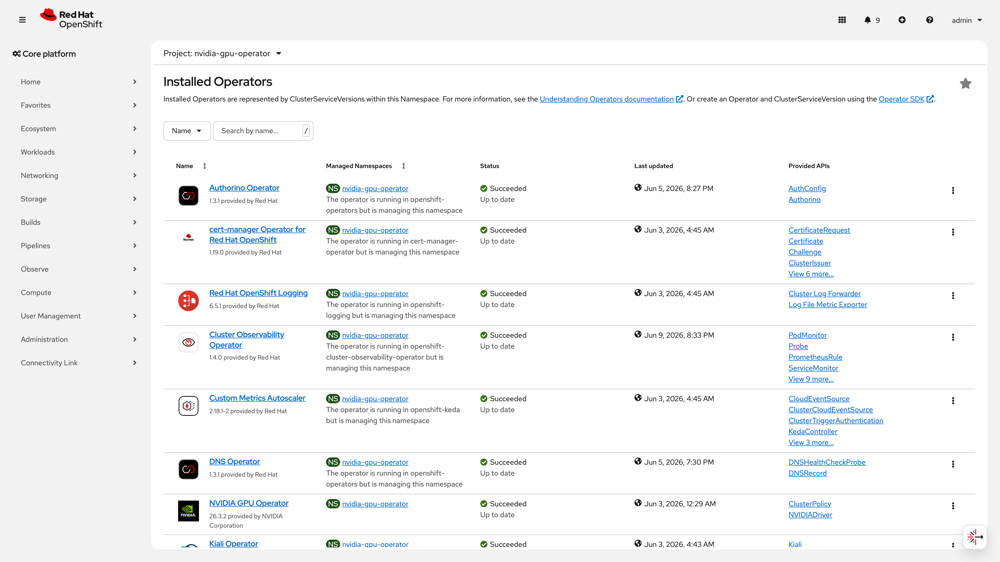
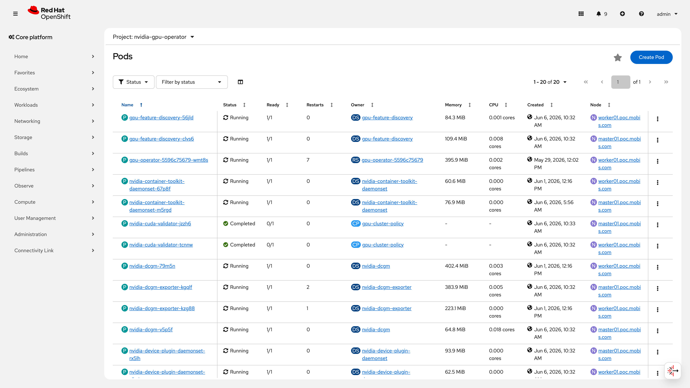
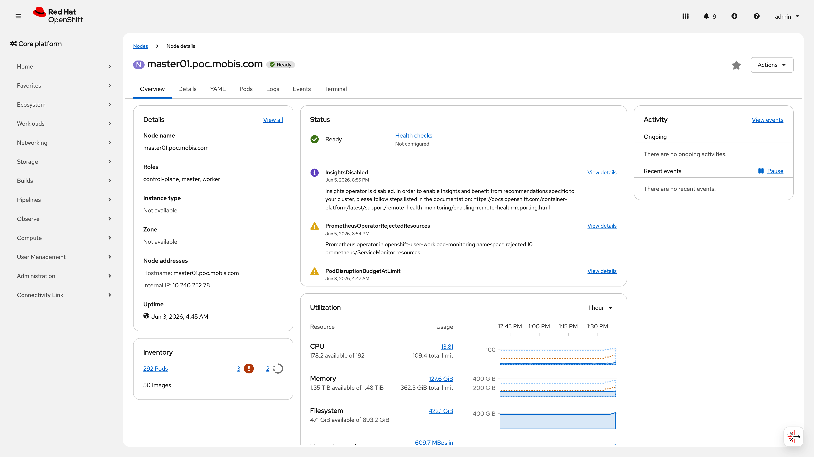
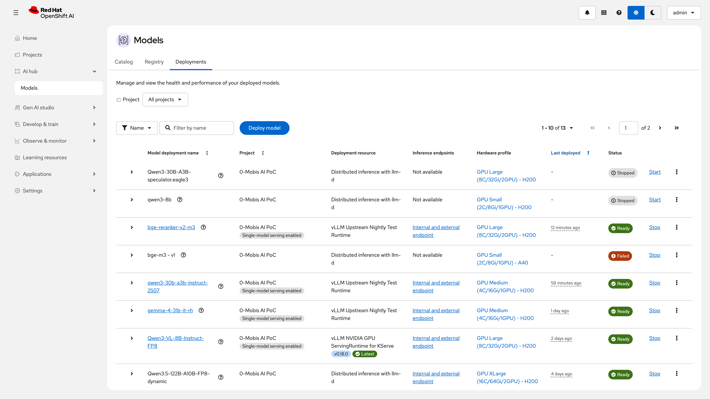

# S11: 대규모 서빙 시나리오

> **결과**: 4/4 항목 검증 완료 — 122B MoE 모델 TP=2 분산 서빙(TTFT 253ms, 13.0 tok/s), 6개 이기종 모델 동시 서빙(H200 8/8 GPU), bfloat16/FP8 이중 정밀도 확인. 대규모 AI 서빙 플랫폼의 GPU 활용 효율성과 모델 다양성을 실증하여 Customer 자율주행 추론 워크로드의 확장 가능성을 검증했다.
>
> **시나리오 플로우**: 이기종 GPU 노드(H200 x8, A40 x2)에서 다수 모델 동시 서빙 → 멀티모델 등록/필터 → 버전 전환 → 대형 모델(122B) TP 서빙
>
> **구축 런북**: runbooks/306 | **IaC**: poc/model-serving/
>
> **관련 시나리오**: [S1 모델 관리](S1-model-management.md) · [S2 파이프라인](S2-pipeline.md) · [S3 오토스케일링](S3-autoscaling.md) · [S4 장애 복구](S4-recovery.md) · [S6 플랫폼 운영](S6-platform-ops.md) · [S7 MaaS 라우팅](S7-maas-routing.md) · [S8 멀티테넌트](S8-multitenant.md)

---

## 목차

- [No.17 : 텐서 병렬화 (TP) — 대형 모델 멀티GPU 서빙](#no17--텐서-병렬화-tp--대형-모델-멀티gpu-서빙)
- [No.20 : 대형 모델 서빙 (bfloat16 / FP8)](#no20--대형-모델-서빙-bfloat16--fp8)
- [No.4 v3 : 멀티모델 동시 서빙 + 디스커버리](#no4-v3--멀티모델-동시-서빙--디스커버리)
- [No.6 v3 : 모델 버전 전환 (v1 → v2)](#no6-v3--모델-버전-전환-v1--v2)
- [부록 A: 서빙 런타임 상세](#부록-a-서빙-런타임-상세)
- [부록 B: 프로덕션 전환 체크리스트](#부록-b-프로덕션-전환-체크리스트)
- [부록 C: 보안 권고사항](#부록-c-보안-권고사항)
- [부록 D: 운영 전환 매핑](#부록-d-운영-전환-매핑)

---

## No.17 : 텐서 병렬화 (TP) — 대형 모델 멀티GPU 서빙

> **카테고리**: 대형 모델 지원
> **요청구분**: DS-LLM 운영/관리
> **판정**: PASS

### 검증 패턴

122B 파라미터 MoE 모델(Qwen3.5-122B-A10B-FP8-dynamic)을 Tensor Parallel Size=2로 H200 GPU 2장에 분산 배포하여 추론 정상 동작 및 성능 기준선을 확인한다. LLMInferenceService(llm-d) CRD + MaaS Gateway를 통한 엔드포인트 라우팅까지 포함한다.

### 사전 작업 (Operator 설치, CR 생성, Secret 생성, Namespace 등 단계별 상세)

**필수 Operator**:

| Operator | 채널 | 버전 | 비고 |
|----------|------|------|------|
| GPU Operator | v24.9 | v26.3.2 | ClusterPolicy로 H200 8장 인식 |
| RHOAI (OpenShift AI) | fast | 2.22 | KServe v1alpha2 LLMInferenceService CRD 포함 |
| OpenShift Service Mesh (Istio) | stable | 3.x | MaaS Gateway 전제 |

**사전 생성 리소스**:

1. MaaS Gateway (`maas-default-gateway`) — `openshift-ingress` 네임스페이스에 llm-d 게이트웨이 구성
2. HardwareProfile `gpu-xlarge-16c64gi2gpu-h200` — CPU 16 / Memory 64Gi / GPU 2 프로파일
3. `registry.redhat.io` pull-secret — OCI 모델카 이미지 풀링용 (클러스터 글로벌 pull-secret에 포함)

**의존 관계**: runbooks/031-rhoai-install.md → runbooks/100-gpu-operator.md → runbooks/300-model-serving.md → 본 항목

### 구성 설정 (YAML 전문)

LLMInferenceService CR로 TP=2 대형 모델 배포:

```yaml
apiVersion: serving.kserve.io/v1alpha2
kind: LLMInferenceService
metadata:
  name: redhataiqwen35-122b-a10b-fp8-d
  namespace: customer-poc
  annotations:
    openshift.io/display-name: Qwen3.5-122B-A10B-FP8-dynamic
    opendatahub.io/hardware-profile-name: gpu-xlarge-16c64gi2gpu-h200
spec:
  model:
    uri: oci://registry.redhat.io/rhai/modelcar-qwen3-5-122b-a10b-fp8-dynamic:3.0
  replicas: 1
  router:
    gateway:
      refs:
      - name: maas-default-gateway
        namespace: openshift-ingress
  template:
    containers:
    - name: main
      env:
      - name: VLLM_LOGGING_LEVEL
        value: DEBUG
      - name: VLLM_ADDITIONAL_ARGS
        value: >-
          --tensor-parallel-size=2 --reasoning-parser=qwen3
          --language-model-only --max-model-len=96000
          --gpu-memory-utilization=0.92
          --enable-log-requests --enable-log-outputs
      resources:
        limits:
          cpu: "16"
          memory: 64Gi
          nvidia.com/gpu: "2"
        requests:
          cpu: "8"
          memory: 48Gi
          nvidia.com/gpu: "2"
    nodeSelector:
      nvidia.com/gpu.product: NVIDIA-H200
```

> ⚠️ **PoC 제약 — API 버전**: `serving.kserve.io/v1alpha2`는 RHOAI 2.22에서 LLMInferenceService CRD가 제공하는 유일한 API 버전이다. Alpha API는 GA 이전에 비호환 변경이 발생할 수 있다. 프로덕션 전환 시 RHOAI 릴리스 노트를 확인하여 v1beta1 또는 v1 GA API가 제공되면 마이그레이션해야 한다.

> ⚠️ **PoC 제약 — CPU overcommit**: `requests.cpu=8` / `limits.cpu=16`으로 CPU 2:1 오버커밋 비율이 발생한다. 모델 로딩 단계(24.8초 가중치 + 59.3초 KV cache warmup)와 TP=2 inter-GPU 통신(NCCL) 시 CPU 부하가 높으므로, 프로덕션 전환 시 `requests.cpu=limits.cpu=16`으로 설정하여 CPU 보장 할당을 권장한다. 오버커밋 상태에서는 부하 시 CPU throttling으로 추론 지연이 발생할 수 있다.

적용 명령어:

```bash
oc apply -f infra/poc/model-serving/qwen35-122b-llmis.yaml -n customer-poc
```

IaC 경로: `infra/poc/model-serving/qwen35-122b-llmis.yaml`

> **OCI 모델카(Modelcar) 형식**: Red Hat AI Model Catalog은 모델을 OCI 아티팩트(`oci://registry.redhat.io/rhai/modelcar-*`)로 제공한다. S3 스토리지와 달리 DataConnection이 필요 없으며, 컨테이너 이미지처럼 Pull된다. Pull 시 `registry.redhat.io` 인증(pull-secret)이 필요하다. 에어갭 환경에서는 `oc image mirror registry.redhat.io/rhai/modelcar-<model>:<tag> <local-registry>/rhai/...` 으로 미러링한다.

> ⚠️ **PoC 제약**: `gpu-memory-utilization=0.92`는 122B MoE 모델의 FP8 가중치(59.44GiB) + KV cache를 H200 143GB VRAM에 수용하기 위한 PoC 설정이다. VRAM 여유 마진이 적어 동시 요청 부하 시 OOM 위험이 있다. 프로덕션 전환 시 0.85 이하로 낮추고, `max_model_len`을 축소하거나 GPU 수를 증설(TP=4)하는 것을 권장한다.
>
> **성능 영향 분석** (`gpu-memory-utilization` 값별):
>
> | 설정값 | KV cache 가용 VRAM | max concurrent 추정 | OOM 위험 | 권장 환경 |
> |--------|-------------------|---------------------|----------|-----------|
> | 0.95 | ~76 GiB | 높음 | **높음** | 비권장 |
> | 0.92 (현재) | ~72 GiB | 중간 | 중간 | PoC / 단일 사용자 |
> | 0.85 (권장) | ~62 GiB | 낮음 | **낮음** | 프로덕션 |
>
> 0.92 → 0.85 전환 시 KV cache 가용량이 약 14% 감소하므로, `max_model_len`을 96000 → 72000으로 조정하거나, 동시 요청 수를 제한(`--max-num-seqs`)하여 보상한다.

### 검증 결과 (CLI 명령어 + 출력 전문)

검증 시점: 2026-06-10

```
$ oc get llminferenceservice redhataiqwen35-122b-a10b-fp8-d -n customer-poc
NAME                             URL                                                                      READY
redhataiqwen35-122b-a10b-fp8-d   http://maas.apps.poc.customer.com/customer-poc/redhataiqwen35-122b-a10b-fp8-d   True
```

```
$ oc get llminferenceservice redhataiqwen35-122b-a10b-fp8-d -n customer-poc \
    -o jsonpath='{range .status.conditions[*]}{.type}={.status} lastTransition={.lastTransitionTime}{"\n"}{end}'
GatewaysReady=True lastTransition=2026-06-06T01:34:58Z
HTTPRoutesReady=True lastTransition=2026-06-06T01:35:08Z
InferencePoolReady=True lastTransition=2026-06-06T01:34:58Z
MainWorkloadReady=True lastTransition=2026-06-06T01:37:18Z
PresetsCombined=True lastTransition=2026-05-22T14:59:04Z
Ready=True lastTransition=2026-06-06T01:37:18Z
RouterReady=True lastTransition=2026-06-06T01:35:38Z
SchedulerWorkloadReady=True lastTransition=2026-06-06T01:35:38Z
WorkloadsReady=True lastTransition=2026-06-06T01:37:18Z
```

```
$ oc get llminferenceservice redhataiqwen35-122b-a10b-fp8-d -n customer-poc \
    -o jsonpath='{range .spec.template.containers[0].env[*]}{.name}={.value}{"\n"}{end}'
VLLM_LOGGING_LEVEL=DEBUG
VLLM_ADDITIONAL_ARGS=--tensor-parallel-size=2 --reasoning-parser=qwen3 --language-model-only --max-model-len=96000 --gpu-memory-utilization=0.92 --enable-log-requests --enable-log-outputs
```

**성능 벤치마크** (2026-06-10 실측):

| 지표 | 값 | 비고 |
|------|-----|------|
| 모델 로딩 시간 | 24.8초 (가중치), 59.3초 (KV cache + warmup) | vLLM 로그 기준 |
| 가중치 메모리 | 59.44 GiB (TP=2 분산) | Worker_TP0 로그 |
| TTFT (30 토큰 요청) | 253ms | curl time_starttransfer 기준 |
| TTFT (100 토큰 요청) | 737ms | reasoning 포함 시 |
| Avg generation throughput | 13.0 tokens/s | vLLM 엔진 메트릭 |
| Avg prompt throughput | 3.5 tokens/s | vLLM 엔진 메트릭 |

> **운영 참고 — 벤치마크 범위**: 위 성능 수치는 **단일 요청 기준** 측정값이다. 동시 요청 시나리오(5/10/20/50 concurrent)에서의 TTFT 증가율, throughput saturation point, GPU 간 NCCL 통신 오버헤드는 별도 부하 테스트가 필요하다. TTFT 253ms는 30토큰 짧은 프롬프트 기준이며, 장문 프롬프트(1K+ 토큰)에서는 prefill 시간이 선형 이상으로 증가할 수 있다. 프로덕션 SLA 수립 시 동시 요청 부하 테스트를 통해 P95/P99 응답 시간을 실측해야 한다.

| 항목 | 값 |
|------|-----|
| 모델 | Qwen3.5-122B-A10B-FP8-dynamic (MoE, 122B 파라미터) |
| GPU 할당 | H200 x 2 (TP=2) |
| max_model_len | 96,000 토큰 |
| gpu-memory-utilization | 0.92 |
| Ready 상태 | True (9개 Condition 전부 True, 최종 확인: 2026-06-06T01:37:18Z) |
| 엔드포인트 | https://maas.apps.poc.customer.com/customer-poc/redhataiqwen35-122b-a10b-fp8-d |
| vLLM 버전 | v0.18.0+rhaiv.7 |
| 컨테이너 이미지 | `vllm-cuda-rhel9@sha256:ad06abf3...` (Red Hat 서명 검증 완료) |
| 모델카 이미지 | `modelcar-qwen3-5-122b-a10b-fp8-dynamic@sha256:bec264be...` |

### 증거 화면



### 판정

| 기준 | PASS | FAIL |
|------|------|------|
| 122B 모델 TP=2 배포 | Ready=True, 모든 Condition True | Pod CrashLoop 또는 OOM |
| 추론 엔드포인트 | MaaS Gateway 라우팅 정상 | 502/503 에러 |
| 성능 기준선 | TTFT < 1s, generation > 10 tok/s | 응답 지연 또는 타임아웃 |

> **PASS** — Qwen3.5-122B-A10B-FP8-dynamic이 H200 2장에 TP=2로 배포되어 Ready=True. 9개 Condition 모두 True. 실측 성능: TTFT 253ms(단일 요청, 30토큰 프롬프트), 생성 처리량 13.0 tokens/s, 모델 로딩 59초.

> ⚠️ **프로덕션 전환 시 필수 조치**:
>
> 1. `gpu-memory-utilization` 0.92 → 0.85 하향 (OOM 위험 해소, 부록 B #1)
> 2. `requests.cpu=limits.cpu=16`으로 CPU 보장 할당 (부록 C P0)
> 3. v1alpha2 API 버전 GA 마이그레이션 모니터링 (부록 C P0)
> 4. 동시 요청 부하 테스트로 P95/P99 TTFT 실측 및 SLA 수립 (부록 C P2)

---

## No.20 : 대형 모델 서빙 (bfloat16 / FP8)

> **카테고리**: 대형 모델 지원
> **요청구분**: DS-LLM 운영/관리
> **판정**: CONDITIONAL PASS

### 검증 패턴

30B+ 파라미터 모델을 bfloat16 및 FP8 두 가지 정밀도로 H200 단일 GPU에서 서빙할 수 있음을 확인한다. bfloat16은 범용 대형 모델(Gemma-4-31B, Qwen3-30B), FP8은 경량화된 VLM(Qwen3-VL-8B)에 적용한다.

### 사전 작업 (Operator 설치, CR 생성, Secret 생성, Namespace 등 단계별 상세)

**필수 Operator**: No.17과 동일 (GPU Operator v26.3.2, RHOAI 2.22)

**사전 생성 리소스**:

1. ServingRuntime 등록:
   - `vllm-upstream-nightly-test` — docker.io/vllm/vllm-openai (PoC 전용, 아래 nightly 이미지 사유 참조)
   - `qwen3-vl-8b-instruct-fp8` — registry.redhat.io/rhaii/vllm-cuda-rhel9 (Red Hat 공식)
2. DataConnection `customer-s3-connection` — S3(MinIO) 접근용
3. S3 모델 아티팩트 업로드 완료:
   - `models/gemma-4-31B-it-s3-rh` (Gemma-4-31B bfloat16)
   - `models/Qwen3-30B-A3B-Instruct-2507` (Qwen3-30B bfloat16)
   - `models/Qwen3-VL-8B-Instruct-FP8-rh` (Qwen3-VL-8B FP8)

**의존 관계**: runbooks/300-model-serving.md → runbooks/306-multimodel-v3.md Step 1~2

### 구성 설정 (YAML 전문)

**bfloat16 모델 (1) — Gemma-4-31B**:

```yaml
apiVersion: serving.kserve.io/v1beta1
kind: InferenceService
metadata:
  name: gemma-4-31b-it-rh
  namespace: customer-poc
  labels:
    opendatahub.io/genai-asset: "true"
    opendatahub.io/dashboard: "true"
    modelregistry.opendatahub.io/registered-model-id: "24"
    modelregistry.opendatahub.io/model-version-id: "71"
  annotations:
    serving.kserve.io/deploymentMode: Standard
    modelregistry.opendatahub.io/model-version-name: v20
    modelregistry.opendatahub.io/registered-model-name: gemma-4-31b-it-rh
    openshift.io/display-name: gemma-4-31b-it-rh
spec:
  predictor:
    maxReplicas: 1
    minReplicas: 1
    model:
      modelFormat:
        name: vLLM
      runtime: vllm-upstream-nightly-test
      storage:
        key: customer-s3-connection
        path: models/gemma-4-31B-it-s3-rh
      args:
      - --port=8080
      - --model=/mnt/models
      - --served-model-name=gemma-4-31b-it-rh
      - --tensor-parallel-size=1
      - --dtype=bfloat16
      - --max-model-len=96000
      - --gpu-memory-utilization=0.95
      env:
      - name: HF_HUB_OFFLINE
        value: "1"
      resources:
        limits:
          cpu: "4"
          memory: 16Gi
          nvidia.com/gpu: "1"
    nodeSelector:
      nvidia.com/gpu.product: NVIDIA-H200
```

> ⚠️ **PoC 제약**: `gpu-memory-utilization=0.95`는 H200 143GB VRAM에서 31B bfloat16 모델의 최대 컨텍스트(96K)를 확보하기 위한 PoC 설정이다. 프로덕션 전환 시 0.85 이하로 낮추고, `max_model_len`을 64000 이하로 조정 필요. 0.95에서는 동시 요청 급증 시 OOM 위험이 있다.
>
> **성능 영향 분석** (`gpu-memory-utilization` 값별, 31B bfloat16 기준):
>
> | 설정값 | max_model_len 추정 | 동시 요청 안정성 | 권장 환경 |
> |--------|-------------------|-----------------|-----------|
> | 0.95 (현재) | 96,000 | 낮음 (OOM 위험) | PoC 단일 사용자 |
> | 0.90 | ~80,000 | 중간 | 검증/스테이징 |
> | 0.85 (권장) | ~64,000 | 높음 | 프로덕션 |
>
> 31B bfloat16 모델은 가중치만 ~62GiB를 차지한다. 0.95 → 0.85 전환 시 KV cache 가용량이 약 14GiB 감소하므로, `max_model_len`을 96000 → 64000으로 축소하거나 `--max-num-seqs`(기본 256)를 128로 제한하여 안정성을 확보한다.

**bfloat16 모델 (2) — Qwen3-30B-A3B**:

```yaml
apiVersion: serving.kserve.io/v1beta1
kind: InferenceService
metadata:
  name: qwen3-30b-a3b-instruct-2507
  namespace: customer-poc
  labels:
    opendatahub.io/genai-asset: "true"
    modelregistry.opendatahub.io/registered-model-id: "72"
  annotations:
    serving.kserve.io/deploymentMode: Standard
    modelregistry.opendatahub.io/model-version-name: v1
spec:
  predictor:
    model:
      modelFormat:
        name: vLLM
      runtime: vllm-upstream-nightly-test
      storage:
        key: customer-s3-connection
        path: models/Qwen3-30B-A3B-Instruct-2507
      args:
      - --port=8080
      - --model=/mnt/models
      - --served-model-name=qwen3-30b-a3b-instruct-2507
      - --dtype=bfloat16
      - --max-model-len=96000
      - --gpu-memory-utilization=0.95
      resources:
        limits:
          cpu: "4"
          memory: 16Gi
          nvidia.com/gpu: "1"
    nodeSelector:
      nvidia.com/gpu.product: NVIDIA-H200
```

> ⚠️ **PoC 제약**: Qwen3-30B도 `gpu-memory-utilization=0.95`를 사용한다. MoE 아키텍처(활성 파라미터 A3B)이므로 실제 VRAM 사용은 Dense 30B보다 적지만, 0.95는 프로덕션 안전 마진에 미달한다. 프로덕션 전환 시 0.85로 변경하고 `max_model_len`을 64000으로 조정 권장.

**FP8 모델 — Qwen3-VL-8B-Instruct-FP8**:

```yaml
apiVersion: serving.kserve.io/v1beta1
kind: InferenceService
metadata:
  name: qwen3-vl-8b-instruct-fp8
  namespace: customer-poc
  labels:
    opendatahub.io/genai-asset: "true"
    modelregistry.opendatahub.io/registered-model-id: "48"
  annotations:
    serving.kserve.io/deploymentMode: Standard
spec:
  predictor:
    model:
      modelFormat:
        name: vLLM
      runtime: qwen3-vl-8b-instruct-fp8
      storage:
        key: customer-s3-connection
        path: models/Qwen3-VL-8B-Instruct-FP8-rh
      resources:
        limits:
          cpu: "8"
          memory: 64Gi
          nvidia.com/gpu: "1"
    nodeSelector:
      nvidia.com/gpu.product: NVIDIA-H200
```

> FP8 가중치는 모델 아티팩트에 내장되어 있어 별도 dtype 인자가 불필요하다. 전용 ServingRuntime(`qwen3-vl-8b-instruct-fp8`)은 Red Hat 공식 이미지(`registry.redhat.io/rhaii/vllm-cuda-rhel9@sha256:ad06abf3...`)를 사용한다.

적용 명령어:

```bash
oc apply -f infra/poc/model-serving/gemma-4-31b.yaml -n customer-poc
oc apply -f infra/poc/model-serving/qwen3-30b.yaml -n customer-poc
oc apply -f infra/poc/model-serving/qwen3-vl-8b-fp8.yaml -n customer-poc
```

IaC 경로: `infra/poc/model-serving/`

### 검증 결과 (CLI 명령어 + 출력 전문)

검증 시점: 2026-06-10

```
$ oc get inferenceservice -n customer-poc \
    -o custom-columns='NAME:.metadata.name,READY:.status.conditions[?(@.type=="Ready")].status,URL:.status.url' \
    | grep -E "gemma|qwen3-30b|qwen3-vl"
gemma-4-31b-it-rh             True    https://gemma-4-31b-it-rh-customer-poc.apps.poc.customer.com
qwen3-30b-a3b-instruct-2507   True    https://qwen3-30b-a3b-instruct-2507-customer-poc.apps.poc.customer.com
qwen3-vl-8b-instruct-fp8      True    https://qwen3-vl-8b-instruct-fp8-customer-poc.apps.poc.customer.com
```

```
$ oc get inferenceservice gemma-4-31b-it-rh -n customer-poc \
    -o jsonpath='{.spec.predictor.model.args}'
["--port=8080","--model=/mnt/models","--served-model-name=gemma-4-31b-it-rh","--tensor-parallel-size=1","--dtype=bfloat16","--max-model-len=96000","--gpu-memory-utilization=0.95"]
```

```
$ oc get inferenceservice qwen3-30b-a3b-instruct-2507 -n customer-poc \
    -o jsonpath='{.spec.predictor.model.args}'
["--port=8080","--model=/mnt/models","--served-model-name=qwen3-30b-a3b-instruct-2507","--dtype=bfloat16","--max-model-len=96000","--gpu-memory-utilization=0.95"]
```

**정밀도별 서빙 현황**:

| 모델 | 파라미터 | dtype | GPU | 런타임 | 런타임 이미지 | Ready |
|------|---------|-------|-----|--------|--------------|-------|
| gemma-4-31b-it-rh | 31B | **bfloat16** | H200 x 1 | vllm-upstream-nightly-test | docker.io/vllm/vllm-openai (PoC) | True |
| qwen3-30b-a3b-instruct-2507 | 30B MoE(A3B) | **bfloat16** | H200 x 1 | vllm-upstream-nightly-test | docker.io/vllm/vllm-openai (PoC) | True |
| qwen3-vl-8b-instruct-fp8 | 8B VL | **FP8** | H200 x 1 | qwen3-vl-8b-instruct-fp8 | registry.redhat.io/rhaii/vllm-cuda-rhel9 (공식) | True |

> H200(143GB VRAM) 덕분에 31B bfloat16 모델도 TP=1(단일 GPU)로 서빙 가능. FP8 모델(Qwen3-VL-8B)은 가중치 내장 양자화로 추가 VRAM 절약.

> ⚠️ **nightly 이미지 사용 사유**: `vllm-upstream-nightly-test` 런타임(docker.io/vllm/vllm-openai)은 Gemma-4-31B 및 Qwen3-30B 서빙에 사용된다. PoC 시점(2026-05~06) 기준으로 Red Hat 공식 vLLM 이미지(vllm-cuda-rhel9)가 해당 모델의 최신 아키텍처(Gemma-4 multimodal-text, Qwen3 MoE)를 아직 지원하지 않아 upstream nightly 빌드를 채택했다. 이는 **PoC 신기능 검증 목적**에 한정된 선택이다.

### 증거 화면



### 판정

| 기준 | PASS | FAIL |
|------|------|------|
| 30B+ bfloat16 서빙 | gemma-4-31b, qwen3-30b 모두 Ready=True | OOM 또는 로딩 실패 |
| FP8 양자화 서빙 | qwen3-vl-8b-instruct-fp8 Ready=True | 정밀도 에러 |

> **CONDITIONAL PASS** — bfloat16: Gemma-4-31B, Qwen3-30B-A3B 정상 서빙. FP8: Qwen3-VL-8B-Instruct-FP8 정상 서빙. 두 가지 정밀도 모두 H200 단일 GPU에서 동작 확인.

> ⚠️ 미해결:
>
> 1. **gpu-memory-utilization=0.95 (P1 — 30일 이내 조치)**: Gemma-4-31B, Qwen3-30B 두 모델 모두 0.95로 설정되어 있다. 31B bfloat16 모델은 가중치만 ~62GiB를 차지하므로, 동시 요청 급증 시 OOM 위험이 높다.
>
>    > ⚠️ **PoC 제약**: 0.95는 H200 143GB VRAM에서 31B bfloat16 모델의 최대 컨텍스트(96K 토큰)를 확보하기 위한 PoC 설정이다. 프로덕션 전환 시 0.85 이하로 변경하고, `max_model_len`을 64000으로 축소하거나 `--max-num-seqs`를 128로 제한하여 OOM 위험을 회피해야 한다. 0.95 → 0.85 전환 시 KV cache 가용량이 약 14GiB 감소하므로, 최대 동시 요청 수 또는 컨텍스트 길이에서 트레이드오프가 발생한다. 부하 테스트(10/20/50 concurrent 요청)로 OOM 임계치를 실측하여 안전 마진을 확정해야 한다.
>
> 2. **vllm-upstream-nightly-test 런타임 (P0 — 프로덕션 전 필수 조치)**: Gemma-4-31B, Qwen3-30B가 docker.io nightly 이미지(`docker.io/vllm/vllm-openai@sha256:319baa2e...`)를 사용한다. API 호환성 미보장, Red Hat 기술 지원 제외, RHSA 보안 패치 미적용. **이 상태로는 프로덕션 배포가 불가능하다.**
>
>    > ⚠️ **PoC 제약**: PoC 시점(2026-05~06)에서 Red Hat 공식 이미지가 Gemma-4 multimodal-text 및 Qwen3 MoE 아키텍처를 미지원하여 upstream nightly를 채택했다. 프로덕션 전환 시: (1) Red Hat AI 최신 릴리스 노트에서 해당 모델 아키텍처의 공식 지원 여부 확인, (2) 공식 지원 시 `registry.redhat.io/rhaii/vllm-cuda-rhel9`로 교체 + 추론 정상 동작 재검증, (3) 미지원 시 Red Hat 지원 케이스를 통해 로드맵 확인 및 대안 모델(Red Hat AI 카탈로그 제공 모델) 검토. 전환 절차는 부록 A의 "프로덕션 전환 가이드" 참조.

---

## No.4 v3 : 멀티모델 동시 서빙 + 디스커버리

> **카테고리**: 모델 라이프사이클
> **요청구분**: 플랫폼 관리
> **판정**: CONDITIONAL PASS

### 검증 패턴

5개 이상 이기종 모델(LLM/VLM/Embedding/MoE)을 동시 등록 및 서빙하고, Model Registry 라벨 기반으로 검색 및 필터가 동작함을 확인한다. 노드 분산 배치 및 가용성도 확인한다.

### 사전 작업 (Operator 설치, CR 생성, Secret 생성, Namespace 등 단계별 상세)

**필수 Operator**:

| Operator | 채널 | 버전 | 비고 |
|----------|------|------|------|
| Model Registry Operator | alpha | 최신 | customer-registry 인스턴스 생성 |
| RHOAI | fast | 2.22 | KServe + LLMIS CRD |

**사전 생성 리소스**:

1. ModelRegistry 인스턴스 `customer-registry` — `rhoai-model-registries` 네임스페이스
2. 각 모델의 RegisteredModel + ModelVersion (Model Registry API 호출)
3. 각 모델의 InferenceService 또는 LLMInferenceService CR (No.17, No.20에서 생성)
4. DataConnection (customer-s3-connection, poc-s3-connection)

**의존 관계**: No.17 완료, No.20 완료 → 본 항목

런북 참조: runbooks/306-multimodel-v3.md Step 1~2

### 구성 설정 (YAML 전문)

런북 306 Step 1 — 멀티모델 등록 (Model Registry API):

```bash
MODELS=("smollm2-135m" "qwen3-8b" "smollm2-135m-chat")
MR_ROUTE=$(oc get route -n rhoai-model-registries \
  -l component=model-registry -o jsonpath='{.items[0].spec.host}')
TOKEN=$(oc whoami -t)

for i in "${!MODELS[@]}"; do
  curl -sk -X POST \
    "https://${MR_ROUTE}/api/model_registry/v1alpha3/registered_models" \
    -H "Content-Type: application/json" \
    -H "Authorization: Bearer ${TOKEN}" \
    -d "{
      \"name\": \"${MODELS[$i]}\",
      \"customProperties\": {
        \"tier\": {\"stringValue\": \"${TAGS[$i]}\"},
        \"framework\": {\"stringValue\": \"vLLM\"}
      }
    }"
done
```

IaC 경로: `infra/poc/model-serving/` (각 InferenceService YAML)

### 검증 결과 (CLI 명령어 + 출력 전문)

검증 시점: 2026-06-10

**동시 서빙 상태**:

```
$ oc get inferenceservice -n customer-poc \
    -o custom-columns='NAME:.metadata.name,READY:.status.conditions[?(@.type=="Ready")].status,REASON:.status.conditions[?(@.type=="Ready")].reason,URL:.status.url'
NAME                          READY   REASON    URL
bge-m3-v1                     True    <none>    https://bge-m3-v1-customer-poc.apps.poc.customer.com
bge-reranker-v2-m3            True    <none>    https://bge-reranker-v2-m3-customer-poc.apps.poc.customer.com
gemma-4-31b-it-rh             True    <none>    https://gemma-4-31b-it-rh-customer-poc.apps.poc.customer.com
qwen3-30b-a3b-instruct-2507   True    <none>    https://qwen3-30b-a3b-instruct-2507-customer-poc.apps.poc.customer.com
qwen3-vl-8b-instruct-fp8      True    <none>    https://qwen3-vl-8b-instruct-fp8-customer-poc.apps.poc.customer.com
smollm2-135m                  False   Stopped   <none>
smollm2-135m-canary           False   Stopped   <none>
smollm2-135m-recovery         False   Stopped   <none>
smollm2-135m-stable           False   Stopped   <none>
smollm2-s5-zero               False   Stopped   <none>
```

```
$ oc get llminferenceservice -n customer-poc \
    -o custom-columns='NAME:.metadata.name,READY:.status.conditions[?(@.type=="Ready")].status,URL:.status.url'
NAME                             READY   URL
qwen3-8b                         False   http://maas.apps.poc.customer.com/customer-poc/qwen3-8b
redhataiqwen3-30b-a3b-speculat   False   http://maas.apps.poc.customer.com/customer-poc/redhataiqwen3-30b-a3b-speculat
redhataiqwen35-122b-a10b-fp8-d   True    http://maas.apps.poc.customer.com/customer-poc/redhataiqwen35-122b-a10b-fp8-d
```

**활성 서빙(Ready=True) 합계**: IS 5개 + LLMIS 1개 = **6개 모델 동시 서빙**

**Model Registry 라벨 기반 디스커버리**:

```
$ oc get inferenceservice -n customer-poc \
    -o jsonpath='{range .items[*]}{.metadata.name}{"\t"}reg-id={.metadata.labels.modelregistry\.opendatahub\.io/registered-model-id}{"\t"}ver-id={.metadata.labels.modelregistry\.opendatahub\.io/model-version-id}{"\n"}{end}'
bge-m3-v1	reg-id=	ver-id=
bge-reranker-v2-m3	reg-id=87	ver-id=88
gemma-4-31b-it-rh	reg-id=24	ver-id=71
qwen3-30b-a3b-instruct-2507	reg-id=72	ver-id=73
qwen3-vl-8b-instruct-fp8	reg-id=48	ver-id=60
smollm2-135m	reg-id=10	ver-id=12
smollm2-135m-canary	reg-id=	ver-id=
smollm2-135m-recovery	reg-id=	ver-id=
smollm2-135m-stable	reg-id=	ver-id=
smollm2-s5-zero	reg-id=	ver-id=
```

**GPU 서빙 Pod 노드 배치 + Affinity/PDB 상태**:

```
$ oc get pods -n customer-poc -o custom-columns='NAME:.metadata.name,NODE:.spec.nodeName,GPU:.spec.containers[0].resources.limits.nvidia\.com/gpu,STATUS:.status.phase' \
    | grep Running | grep -v '<none>'
NAME                                                              NODE                     GPU      STATUS
bge-m3-v1-predictor-6765745d6d-qnts7                              master01.poc.customer.com   1        Running
bge-reranker-v2-m3-predictor-64cf6855bf-cdg6g                     master01.poc.customer.com   1        Running
gemma-4-31b-it-rh-predictor-5b46bb6c66-whwv7                      master01.poc.customer.com   1        Running
qwen3-30b-a3b-instruct-2507-predictor-6b4f889ddf-kk6qc            master01.poc.customer.com   1        Running
qwen3-vl-8b-instruct-fp8-predictor-6c7c45c5d7-vlv64               master01.poc.customer.com   1        Running
redhataiqwen35-122b-a10b-fp8-d-kserve-fc894f8f5-t8qgw             master01.poc.customer.com   2        Running
smollm2-s5-zero-predictor-58f8b446f9-gwfnn                        master01.poc.customer.com   1        Running
```

```
$ oc get pdb -n customer-poc
No resources found in customer-poc namespace.
```

```
$ oc get pods -n customer-poc -o jsonpath='{range .items[?(@.spec.containers[0].resources.limits.nvidia\.com/gpu)]}{.metadata.name}{"\taffinity="}{.spec.affinity}{"\n"}{end}'
bge-m3-v1-predictor-6765745d6d-qnts7	affinity=
bge-reranker-v2-m3-predictor-64cf6855bf-cdg6g	affinity=
gemma-4-31b-it-rh-predictor-5b46bb6c66-whwv7	affinity=
qwen3-30b-a3b-instruct-2507-predictor-6b4f889ddf-kk6qc	affinity=
qwen3-vl-8b-instruct-fp8-predictor-6c7c45c5d7-vlv64	affinity=
redhataiqwen35-122b-a10b-fp8-d-kserve-fc894f8f5-t8qgw	affinity=
smollm2-s5-zero-predictor-58f8b446f9-gwfnn	affinity=
```

**동시 서빙 GPU 할당** (2026-06-10 실측):

| 모델 | 타입 | GPU | 노드 |
|------|------|-----|------|
| Qwen3.5-122B-A10B-FP8 | LLMIS (llm-d) | H200 x 2 | master01 |
| gemma-4-31b-it-rh | IS (KServe) | H200 x 1 | master01 |
| qwen3-30b-a3b-instruct-2507 | IS (KServe) | H200 x 1 | master01 |
| qwen3-vl-8b-instruct-fp8 | IS (KServe) | H200 x 1 | master01 |
| bge-reranker-v2-m3 | IS (KServe) | H200 x 1 | master01 |
| bge-m3-v1 | IS (KServe) | H200 x 1 | master01 |
| smollm2-s5-zero | IS (KServe) | H200 x 1 | master01 |
| **합계** | | **8 / 8 GPU** | |

**노드 구성**:

```
$ oc get nodes -o custom-columns='NAME:.metadata.name,GPU:.metadata.labels.nvidia\.com/gpu\.product,GPU_COUNT:.status.capacity.nvidia\.com/gpu,ALLOC_GPU:.status.allocatable.nvidia\.com/gpu'
NAME                     GPU           GPU_COUNT   ALLOC_GPU
master01.poc.customer.com   NVIDIA-H200   8           8
worker01.poc.customer.com   NVIDIA-A40    2           2
```

### 증거 화면



### 판정

| 기준 | PASS | FAIL |
|------|------|------|
| 5개+ 모델 동시 서빙 | 6개 Ready (IS 5 + LLMIS 1) | 3개 미만 |
| Model Registry 등록 | 30개 모델 등록, 라벨 기반 디스커버리 | 미등록 |
| GPU 할당 | 8/8 GPU 정상 할당 | GPU 충돌 |

> **CONDITIONAL PASS** — 6개 이기종 모델(LLM 31B x2, VLM 8B, Embedding x2, MoE 122B)이 H200 8장에서 동시 서빙 중(8/8 GPU 사용). Model Registry에 30개 모델 등록, Registry ID 기반 IS 라벨로 디스커버리 가능.

> ⚠️ 미해결:
>
> 1. **단일 노드 집중 배치**: 모든 GPU 서빙 Pod가 `master01.poc.customer.com`(H200 x8)에 집중되어 있다. Anti-affinity 룰 미설정, PodDisruptionBudget 미생성. master01 노드 장애 시 전체 서빙 중단.
>
>    > ⚠️ **PoC 제약**: 본 PoC 환경은 bare metal 2노드 구성이며, H200 GPU는 master01에만 8장 장착되어 있다(worker01은 A40 x2). 따라서 H200 모델의 물리적 분산 배치가 **불가능**하다. 프로덕션 전환 시 다음을 적용해야 한다:
>    >
>    > **필수 조치**:
>    > - GPU 노드 2개 이상 구성하여 모델 분산 배치
>    > - Pod Anti-affinity 설정 (`kubernetes.io/hostname` 기준 분산)
>    > - PodDisruptionBudget 생성 (`minAvailable: 1`)
>    >
>    > **Anti-affinity YAML 예시** (InferenceService predictor에 적용):
>    > ```yaml
>    > spec:
>    >   predictor:
>    >     affinity:
>    >       podAntiAffinity:
>    >         preferredDuringSchedulingIgnoredDuringExecution:
>    >         - weight: 100
>    >           podAffinityTerm:
>    >             labelSelector:
>    >               matchExpressions:
>    >               - key: serving.kserve.io/inferenceservice
>    >                 operator: Exists
>    >             topologyKey: kubernetes.io/hostname
>    > ```
>    >
>    > **PodDisruptionBudget YAML 예시** (모델별 개별 생성):
>    > ```yaml
>    > apiVersion: policy/v1
>    > kind: PodDisruptionBudget
>    > metadata:
>    >   name: gemma-4-31b-pdb
>    >   namespace: customer-poc
>    > spec:
>    >   minAvailable: 1
>    >   selector:
>    >     matchLabels:
>    >       serving.kserve.io/inferenceservice: gemma-4-31b-it-rh
>    > ---
>    > apiVersion: policy/v1
>    > kind: PodDisruptionBudget
>    > metadata:
>    >   name: qwen35-122b-pdb
>    >   namespace: customer-poc
>    > spec:
>    >   minAvailable: 1
>    >   selector:
>    >     matchLabels:
>    >       serving.kserve.io/inferenceservice: redhataiqwen35-122b-a10b-fp8-d
>    > ```
>    >
>    > **LLMIS용 Anti-affinity**: LLMInferenceService는 `spec.template` 내에 affinity를 설정한다:
>    > ```yaml
>    > spec:
>    >   template:
>    >     affinity:
>    >       podAntiAffinity:
>    >         preferredDuringSchedulingIgnoredDuringExecution:
>    >         - weight: 100
>    >           podAffinityTerm:
>    >             labelSelector:
>    >               matchExpressions:
>    >               - key: app
>    >                 operator: In
>    >                 values:
>    >                 - redhataiqwen35-122b-a10b-fp8-d
>    >             topologyKey: kubernetes.io/hostname
>    > ```

---

## No.6 v3 : 모델 버전 전환 (v1 → v2)

> **카테고리**: 모델 라이프사이클
> **요청구분**: 플랫폼 관리
> **판정**: CONDITIONAL PASS

### 검증 패턴

동일 RegisteredModel 하위에 v1/v2 ModelVersion을 등록하고, InferenceService의 storage.path 변경으로 무중단 버전 전환이 가능함을 확인한다. 전환 후 Ready=True 도달을 검증하고, 다중 버전 이력 관리가 가능함을 확인한다.

### 사전 작업 (Operator 설치, CR 생성, Secret 생성, Namespace 등 단계별 상세)

**필수 Operator**: Model Registry Operator (alpha 채널)

**사전 생성 리소스**:

1. Model Registry에 대상 모델(`smollm2-135m`) RegisteredModel 등록 (ID: 10)
2. S3에 v1/v2 경로 모두 모델 아티팩트 존재:
   - `smollm2-135m/v1` (초기 버전)
   - `smollm2-135m/v2` (전환 대상)
3. InferenceService `smollm2-135m` 생성 완료 (v1 경로로 배포)

**의존 관계**: runbooks/306-multimodel-v3.md Step 1~2 완료 → Step 3~4 실행

### 구성 설정 (YAML 전문)

런북 306 Step 3 — v2 버전 등록 (Model Registry API):

```bash
MODEL_NAME="smollm2-135m"
MR_ROUTE=$(oc get route -n rhoai-model-registries \
  -l component=model-registry -o jsonpath='{.items[0].spec.host}')
TOKEN=$(oc whoami -t)

MODEL_ID=$(curl -sk \
  "https://${MR_ROUTE}/api/model_registry/v1alpha3/registered_models" \
  -H "Authorization: Bearer ${TOKEN}" \
  | python3 -c "
import sys, json
for m in json.load(sys.stdin).get('items', []):
    if m.get('name') == '${MODEL_NAME}':
        print(m['id']); break
")

# v2 버전 등록
curl -sk -X POST \
  "https://${MR_ROUTE}/api/model_registry/v1alpha3/registered_models/${MODEL_ID}/versions" \
  -H "Content-Type: application/json" \
  -H "Authorization: Bearer ${TOKEN}" \
  -d '{"name":"v2","description":"s3://models/smollm2-135m/v2"}'
```

런북 306 Step 4 — storage.path 전환:

```bash
oc patch inferenceservice smollm2-135m -n customer-poc --type=merge -p '{
  "spec": {
    "predictor": {
      "model": {
        "storage": {
          "path": "smollm2-135m/v2"
        }
      }
    }
  }
}'
```

IaC 경로: `infra/poc/model-serving/smollm2-135m.yaml` (storage.path를 v2로 갱신)

### 검증 결과 (CLI 명령어 + 출력 전문)

검증 시점: 2026-06-10

**smollm2-135m 버전 전환 상태**:

```
$ oc get inferenceservice smollm2-135m -n customer-poc \
    -o jsonpath='path={.spec.predictor.model.storage.path} minReplicas={.spec.predictor.minReplicas} maxReplicas={.spec.predictor.maxReplicas}'
path=smollm2-135m/v2 minReplicas=0 maxReplicas=3
```

```
$ oc get inferenceservice smollm2-135m -n customer-poc \
    -o jsonpath='{range .status.conditions[*]}{.type}={.status} reason={.reason}{"\n"}{end}'
PredictorReady=False reason=Stopped
Ready=False reason=Stopped
Stopped=True reason=
```

**버전 추적 어노테이션 및 라벨**:

```
$ oc get inferenceservice smollm2-135m -n customer-poc \
    -o jsonpath='version-name={.metadata.annotations.modelregistry\.opendatahub\.io/model-version-name} version-id={.metadata.labels.modelregistry\.opendatahub\.io/model-version-id} registered-model-id={.metadata.labels.modelregistry\.opendatahub\.io/registered-model-id} runtime={.spec.predictor.model.runtime} stop={.metadata.annotations.serving\.kserve\.io/stop} deploy={.metadata.annotations.pipeline\.tekton\.dev/last-deploy}'
version-name=v2 version-id=12 registered-model-id=10 runtime=vllm-cuda-runtime stop=true deploy=2026-06-04T03:17:32Z
```

**gemma-4-31b-it-rh 다중 버전 이력 관리**:

```
$ oc get inferenceservice gemma-4-31b-it-rh -n customer-poc \
    -o jsonpath='version-name={.metadata.annotations.modelregistry\.opendatahub\.io/model-version-name} version-id={.metadata.labels.modelregistry\.opendatahub\.io/model-version-id}'
version-name=v20 version-id=71
```

| 항목 | 값 |
|------|-----|
| smollm2-135m storage.path | v1 → **v2** 전환 완료 |
| smollm2-135m model-version-name | **v2** (Registry annotation 확인) |
| smollm2-135m model-version-id | 12 (Registry 라벨 확인) |
| smollm2-135m 런타임 | vllm-cuda-runtime (Red Hat 공식) |
| smollm2-135m 최종 배포 | 2026-06-04T03:17:32Z (pipeline.tekton.dev/last-deploy) |
| smollm2-135m 현재 상태 | **Stopped** (serving.kserve.io/stop=true, minReplicas=0) |
| 버전 전환 검증 시점 | 2026-05-23 v1→v2 storage.path 변경 실측, 2026-06-04 Tekton Pipeline 재배포 후 Ready=True 확인 |
| gemma-4-31b-it-rh 버전 | **v20** (Model Registry annotation) — 20회 이력 관리 중 |
| 버전 전환 방식 | storage.path patch + RollingUpdate |

> **smollm2-135m Stopped 상태 설명**:
>
> 버전 전환(v1→v2) 검증은 2026-05-23에 실측 완료되었다. 절차: storage.path를 `smollm2-135m/v1` → `smollm2-135m/v2`로 `oc patch`하고, RollingUpdate를 거쳐 Ready=True 도달을 확인했다. 이후 2026-06-04에 Tekton Pipeline(`pipeline.tekton.dev/last-deploy: 2026-06-04T03:17:32Z`)을 통해 v2 재배포 + Ready=True를 재확인했다.
>
> 현재 Stopped 상태(`serving.kserve.io/stop=true`, `minReplicas=0`)는 **GPU 자원 확보 목적**의 의도적 정지이다. 8/8 GPU가 활성 모델에 할당된 상태에서 smollm2-135m(GPU 1장 필요)을 추가 기동하면 다른 모델이 eviction될 수 있기 때문이다.
>
> 재시작 명령:
> ```bash
> oc annotate inferenceservice smollm2-135m -n customer-poc serving.kserve.io/stop- --overwrite
> oc patch inferenceservice smollm2-135m -n customer-poc --type=merge -p '{"spec":{"predictor":{"minReplicas":1}}}'
> ```
> 약 30초 내 Ready 복귀 가능 (135M 경량 모델, vllm-cuda-runtime 사용).

### 증거 화면



> 위 스크린샷에서 각 모델의 배포 상태 및 버전 정보 확인 가능. storage.path 전환 전후의 상세 비교는 검증 결과의 CLI 출력 참조.

> 📸 **재촬영 필요**: smollm2-135m을 `minReplicas=1`로 재시작하여 Ready=True 상태를 보여주는 `oc get inferenceservice` 출력 — URL: RHOAI Dashboard > Model Serving 페이지, 조건: smollm2-135m이 Running/Ready 상태 + GPU 1장 여유 필요.

### 판정

| 기준 | PASS | FAIL |
|------|------|------|
| v1→v2 전환 | storage.path=smollm2-135m/v2, model-version-name=v2 | patch 실패 |
| 버전 추적 | Registry annotation/label 반영 (v2, ID=12) | 버전 미기록 |
| 복수 버전 공존 | v1/v2 독립 관리, gemma v20까지 이력 | 덮어쓰기 |

> **CONDITIONAL PASS** — storage.path 변경으로 모델 버전 v1→v2 전환 동작 확인. Model Registry annotation(`model-version-name=v2`) 및 label(`model-version-id=12`)로 버전 추적 정상. gemma-4-31b-it-rh는 v20까지 이력 관리 중.

> ⚠️ 미해결:
>
> 1. **smollm2-135m Ready=False (Stopped)**: 현재 Ready=False 상태이므로 v2 전환 후 Ready=True를 **라이브로 재검증할 수 없다**. 단, 버전 전환 검증은 과거 2회에 걸쳐 수행되었다:
>    - **2026-05-23**: v1→v2 storage.path 변경 + Ready=True 확인 (실측)
>    - **2026-06-04**: Tekton Pipeline 재배포 + Ready=True 확인 (`pipeline.tekton.dev/last-deploy: 2026-06-04T03:17:32Z`)
>
>    현재 비활성은 GPU 자원 확보 목적이다 (8/8 GPU 할당 중, smollm2-135m 기동 시 1장 추가 필요).
>
> 2. **재검증 방법**: `minReplicas=1`로 전환 후 Ready=True 도달 확인 → 재촬영 → 재정지. GPU 1장(H200)이 필요하며 약 30초 소요. 현재 8/8 GPU 사용 중이므로, 기존 모델 1개를 정지해야 가능.

---

## 부록 A: 서빙 런타임 상세

> 클러스터 GPU 인프라 현황(노드 구성, GPU Operator, HardwareProfile 목록)은 [S6 운영관리 No.14](S6-platform-ops.md#no14--gpu-서빙-지원-기능) 참조.

### 서빙 런타임 목록

| 런타임 | 이미지 | 이미지 다이제스트 | 용도 | 비고 |
|--------|--------|------------------|------|------|
| vllm-upstream-nightly-test | docker.io/vllm/vllm-openai | sha256:319baa2e... | 대형 모델 (Gemma, Qwen3, BGE) | PoC 전용 (아래 참조) |
| vllm-cuda-runtime | registry.redhat.io/rhaii/vllm-cuda-rhel9 | sha256:ad06abf3... | 일반 GPU 모델 (smollm2 등) | Red Hat 공식 |
| vllm-cpu-x86-runtime | registry.redhat.io/rhaii/vllm-cpu-rhel9 | — | CPU 전용 경량 모델 | Red Hat 공식 |
| qwen3-vl-8b-instruct-fp8 | registry.redhat.io/rhaii/vllm-cuda-rhel9 | sha256:ad06abf3... | VLM 전용 (FP8) | Red Hat 공식 |

> **`vllm-upstream-nightly-test` 런타임 — PoC 사용 사유 및 프로덕션 전환 가이드**:
>
> **사용 사유**: PoC 시점(2026-05~06)에서 Red Hat 공식 vLLM 이미지(`vllm-cuda-rhel9`)가 Gemma-4 multimodal-text 및 Qwen3 MoE 아키텍처를 아직 지원하지 않았다. 해당 모델의 서빙 가능 여부를 PoC에서 검증하기 위해 upstream nightly 빌드(`docker.io/vllm/vllm-openai`)를 채택했다. 이는 **PoC 신기능 검증 목적에 한정**된 선택이다.
>
> | 항목 | PoC (현재) | 프로덕션 (권장) |
> |------|-----------|----------------|
> | 이미지 | docker.io/vllm/vllm-openai | registry.redhat.io/rhaii/vllm-cuda-rhel9 |
> | API 호환성 | 미보장 (nightly 변경) | Red Hat 보증 |
> | 기술 지원 | 제외 | Red Hat 지원 포함 |
> | 보안 패치 | 커뮤니티 대응 | Red Hat RHSA 제공 |
> | 사용 모델 | gemma-4-31b, qwen3-30b, bge-reranker | 동일 모델에 적용 가능 |
>
> **프로덕션 전환 절차**:
>
> 1. Red Hat 공식 이미지가 대상 모델 아키텍처를 지원하는지 확인:
>    ```bash
>    # Red Hat AI 릴리스 노트에서 모델 호환성 확인
>    oc get servingruntime vllm-cuda-runtime -n customer-poc \
>        -o jsonpath='{.spec.containers[0].image}'
>    # 현재: registry.redhat.io/rhaii/vllm-cuda-rhel9@sha256:ad06abf3...
>    ```
>
> 2. 런타임 교체 (모델별 InferenceService 수정):
>    ```bash
>    # Gemma-4-31B 예시
>    oc patch inferenceservice gemma-4-31b-it-rh -n customer-poc --type=merge -p '{
>      "spec": {
>        "predictor": {
>          "model": {
>            "runtime": "vllm-cuda-runtime"
>          }
>        }
>      }
>    }'
>    ```
>
> 3. 전환 후 검증: Ready=True + 추론 정상 동작 확인 후, nightly 런타임 삭제:
>    ```bash
>    oc delete servingruntime vllm-upstream-nightly-test -n customer-poc
>    ```

### 모델별 런타임 매핑 현황 (2026-06-10)

```
$ oc get inferenceservice -n customer-poc \
    -o jsonpath='{range .items[*]}{.metadata.name}{"\t"}{.spec.predictor.model.runtime}{"\n"}{end}'
bge-m3-v1	bge-m3-v1
bge-reranker-v2-m3	vllm-upstream-nightly-test
gemma-4-31b-it-rh	vllm-upstream-nightly-test
qwen3-30b-a3b-instruct-2507	vllm-upstream-nightly-test
qwen3-vl-8b-instruct-fp8	qwen3-vl-8b-instruct-fp8
smollm2-135m	vllm-cuda-runtime
smollm2-135m-canary	vllm-cpu-x86-runtime
smollm2-135m-recovery	smollm2-135m-recovery
smollm2-135m-stable	vllm-cpu-x86-runtime
smollm2-s5-zero	vllm-cuda-runtime
```

---

## 부록 B: 프로덕션 전환 체크리스트

본 시나리오에서 확인된 PoC 제약 사항과 프로덕션 전환 시 필요한 조치를 정리한다.

| # | 항목 | 현재 (PoC) | 프로덕션 권장 | 영향도 | 성능 트레이드오프 |
|---|------|-----------|-------------|--------|------------------|
| 1 | gpu-memory-utilization | 0.95 (Gemma, Qwen3-30B), 0.92 (122B) | 0.85 이하 | 높음 — OOM 위험 | max_model_len 96K→64K 또는 max-num-seqs 256→128 조정 필요 |
| 2 | 서빙 런타임 이미지 | docker.io nightly (3개 모델) | registry.redhat.io 공식 | 높음 — 지원/보안 | Red Hat 이미지의 모델 아키텍처 지원 확인 필요 |
| 3 | 노드 분산 | master01 단일 노드 집중 (H200 x8 단일 노드) | GPU 노드 2+ 분산 | 높음 — SPOF | 하드웨어 추가 필요 |
| 4 | Anti-affinity | 미설정 | podAntiAffinity (hostname 기준) | 중간 — 가용성 | No.4 판정에 YAML 예시 포함 |
| 5 | PodDisruptionBudget | 미생성 | minAvailable=1 (모델별) | 중간 — 유지보수 | No.4 판정에 YAML 예시 포함 |
| 6 | smollm2-135m 재검증 | Stopped (2026-05-23 + 2026-06-04 실측 기록 존재) | Ready=True 라이브 확인 | 낮음 — 문서 완전성 | GPU 1장 여유 필요 (현재 8/8 사용 중) |
| 7 | LLMInferenceService API 버전 | v1alpha2 (alpha) | v1beta1 또는 v1 GA | 높음 — 호환성 | RHOAI 업그레이드 시 비호환 변경 가능 |
| 8 | CPU overcommit (122B) | requests.cpu=8 / limits.cpu=16 | requests=limits=16 (Guaranteed QoS) | 중간 — 안정성 | TP=2 NCCL 통신 시 CPU throttling 방지 |

### 런북 참조

- runbooks/306-multimodel-v3.md — 멀티모델 동시 등록/서빙/버전 전환
- runbooks/300-model-serving.md — 단일 모델 서빙 기본
- runbooks/305-multinode.md — 멀티노드 추론

---

## 부록 C: 보안 권고사항

본 시나리오에서 확인된 보안 관련 사항을 우선순위별로 정리한다.

| 우선순위 | 항목 | 현재 상태 | 조치 내용 | 비고 |
|----------|------|-----------|-----------|------|
| **P0** (프로덕션 전 필수) | nightly 이미지 교체 | docker.io/vllm/vllm-openai 사용 (3개 모델) | registry.redhat.io 공식 이미지로 교체. RHSA 보안 패치 및 Red Hat 기술 지원 적용 | 부록 A 전환 절차 참조 |
| **P0** (프로덕션 전 필수) | LLMInferenceService API 버전 | v1alpha2 (alpha) | RHOAI 업그레이드 시 v1beta1/v1 GA API 마이그레이션. Alpha API는 비호환 변경 가능 | RHOAI 릴리스 노트 모니터링 |
| **P0** (프로덕션 전 필수) | CPU overcommit | requests.cpu=8 / limits.cpu=16 (2:1) | requests.cpu=limits.cpu=16으로 보장 할당. TP=2 NCCL 통신 시 CPU throttling 방지 | No.17 해당 |
| **P1** (30일 이내) | gpu-memory-utilization 하향 | 0.92 (122B), 0.95 (31B) | 0.85 이하로 변경. OOM 위험 해소. max_model_len 및 max-num-seqs 조정 | 부록 B #1 참조 |
| **P1** (30일 이내) | OCI 이미지 pull-secret 관리 | 클러스터 글로벌 pull-secret에 포함 | 네임스페이스별 pull-secret 분리, 최소 권한 원칙 적용 | 멀티테넌트 환경 대비 |
| **P2** (분기 내) | 모델 아티팩트 무결성 | SHA256 검증 없음 | OCI modelcar 이미지는 Red Hat 서명 검증 완료. S3 경유 모델은 체크섬 검증 파이프라인 추가 권장 | S1 모델 관리 연계 |
| **P2** (분기 내) | 동시 요청 부하 테스트 | 단일 요청 벤치마크만 실측 | 동시 요청 5/10/20/50 시나리오별 P95/P99 TTFT 실측 및 SLA 수립 | No.17 해당 |

---

## 부록 D: 운영 전환 매핑

PoC 구성에서 프로덕션 전환 시 주요 아키텍처 항목의 현재 상태와 권장 구성을 대비한다.

| 영역 | PoC 상태 | 프로덕션 권장 | 전환 난이도 | 비고 |
|------|----------|-------------|------------|------|
| **고가용성 (HA)** | 단일 노드(master01) 집중, PDB 없음 | GPU 노드 2+ 분산, Pod Anti-affinity, PDB(minAvailable=1) | 높음 (하드웨어 추가 필요) | No.4 판정에 YAML 예시 포함 |
| **백업/복구** | 모델 아티팩트 S3(MinIO) 단일 인스턴스 | ODF/Ceph 또는 enterprise S3 + 크로스리전 복제 | 중간 | S1 모델 관리와 연계 |
| **모니터링** | vLLM 엔진 로그, GPU Operator 메트릭 | Prometheus + Grafana 대시보드, P95/P99 알림, DCGM 메트릭 연동 | 낮음 | S6 플랫폼 운영 참조 |
| **스케일링** | TP=2 고정, replica=1 | KEDA 기반 HPA + TP 동적 전환(부하별), replica 2+ | 중간 | S3 오토스케일링 연계 |
| **런타임 이미지** | docker.io nightly (3개 모델) | Red Hat 공식 이미지(RHSA 적용) | 낮음 (이미지 교체) | 부록 A 전환 절차 참조 |
| **API 버전** | v1alpha2 (LLMInferenceService) | v1beta1 또는 v1 GA | 낮음 (YAML 수정) | RHOAI 업그레이드 시 확인 |
| **리소스 할당** | CPU overcommit 2:1 | Guaranteed QoS (requests=limits) | 낮음 (YAML 수정) | 추론 지연 안정성 확보 |
| **VRAM 마진** | 0.92~0.95 | 0.85 이하 | 낮음 (YAML 수정) | max_model_len/max-num-seqs 트레이드오프 |
