# S2: Pipeline E2E 시나리오

> **시나리오 플로우**: 모델 등록 요청 -> (알람)승인 -> 모델 배포 요청 -> (알람)승인 -> vLLM 서빙 Pod 구동 & REST API Endpoint 생성 확인
>
> **구축 런북**: runbooks/310, runbooks/311 | **검증 런북**: runbooks/510 | **IaC**: infra/poc/pipeline/
>
> **결과**: 6/7 PASS, 1 SKIP (86%) — 8단계 통합 파이프라인으로 모델 등록-승인-배포 E2E 자동화를 검증하여 수동 배포 대비 운영 표준화 및 휴먼에러 감소 기반을 확보하였다.

**관련 시나리오**: [S1: 모델 관리](S1-model-management.md) | [S3: 오토스케일링](S3-autoscaling.md) | [S4: 장애 복구](S4-recovery.md) | [S5: Scale-to-Zero](S5-scale-to-zero.md) | [S6: 플랫폼 운영](S6-platform-ops.md) | [S7: MaaS 라우팅](S7-maas-routing.md)

---

## 목차

- [검증 요약](#검증-요약)
- [No.1 : vLLM 지원](#no1--vllm-지원)
- [No.2 : TGI/TRT-LLM 등 대체 엔진](#no2--tgitrt-llm-등-대체-엔진)
- [No.3 : 엔진 버전 관리](#no3--엔진-버전-관리)
- [No.10 : 모델 배포 자동화 파이프라인](#no10--모델-배포-자동화-파이프라인)
- [No.11 : 모델 등록 프로세스](#no11--모델-등록-프로세스)
- [No.12 : 모델 승인 프로세스](#no12--모델-승인-프로세스)
- [No.43 : OpenAI 호환 API](#no43--openai-호환-api)
- [보안 권고사항](#보안-권고사항)
- [운영 전환 가이드](#운영-전환-가이드)

---

## 검증 요약

| No. | 항목 | 판정 |
|-----|------|------|
| 1 | vLLM 지원 | **PASS** |
| 2 | TGI/TRT-LLM 대체 엔진 | **SKIP** |
| 3 | 엔진 버전 관리 | **PASS** |
| 10 | 모델 배포 자동화 파이프라인 | **PASS** |
| 11 | 모델 등록 프로세스 (승인) | **PASS** |
| 12 | 모델 승인 프로세스 (배포) | **PASS** |
| 43 | OpenAI 호환 API | **PASS** |

### 클러스터 환경 정보

| 항목 | 값 |
|------|-----|
| OCP 버전 | 4.21.14 |
| OpenShift Pipelines | v1.22.2 |
| ManualApprovalGate | v0.8.0 (Ready=True) |
| DSPA | Ready=True |
| vLLM | 0.22.1rc1.dev26+g4721bb3aa |
| 네임스페이스 | customer-poc |
| 검증 대상 IS | Qwen3-8B-FP8-dynamic (Ready=True) |
| 검증 일시 | 2026-06-10 |

---

## No.1 : vLLM 지원

> **카테고리**: 모델 배포 엔진 | **요청구분**: DS-LLM 운영/관리 | **판정**: PASS

### 검증 패턴

vLLM 기반 ServingRuntime이 클러스터에 등록되어 있고 InferenceService가 vLLM 엔진으로 정상 구동되는지 확인한다.

### 사전 작업

- **Operator**: OpenShift AI (RHOAI) 2.22+, KServe 컨트롤러 활성화
- **CR 생성**: ServingRuntime (vLLM 이미지 지정), InferenceService (S3 모델 경로 연결)
- **Secret**: S3 접근용 시크릿 (`models-bucket-secret`) 생성
- **의존 관계**: GPU 노드 Ready, NVIDIA GPU Operator 정상 동작
- **런북 참조**: runbooks/310-pipeline-serving-runtime.md

### 구성 설정

ServingRuntime 정의 -- `infra/poc/pipeline/` 기반. vLLM 이미지를 SHA digest로 고정하여 재현성 보장:

```yaml
# infra/poc/pipeline/ 기반 ServingRuntime (vllm-cuda-runtime)
apiVersion: serving.kserve.io/v1alpha1
kind: ServingRuntime
metadata:
  name: vllm-cuda-runtime
  namespace: customer-poc
  labels:
    opendatahub.io/dashboard: "true"
  annotations:
    opendatahub.io/recommended-accelerators: '["nvidia.com/gpu"]'
    opendatahub.io/runtime-version: v0.18.0
    openshift.io/display-name: vLLM NVIDIA GPU ServingRuntime for KServe
spec:
  annotations:
    opendatahub.io/kserve-runtime: vllm
    prometheus.io/path: /metrics
    prometheus.io/port: "8080"
  containers:
  - name: kserve-container
    image: registry.redhat.io/rhaii/vllm-cuda-rhel9@sha256:ad06abf3bb5235ebb5b2df84cd1b9fd09e823f0ff2eebfc82bb4590275ccfe0b
    # command 생략 — vLLM 이미지 기본 entrypoint 사용 (IaC: infra/poc/model-serving/servingruntime.yaml 참조)
    args: ["--port=8080", "--model=/mnt/models", "--served-model-name={{.Name}}"]
    env:
    - name: HF_HOME
      value: /tmp/hf_home
    ports:
    - containerPort: 8080
      protocol: TCP
  multiModel: false
  supportedModelFormats:
  - name: vLLM
    autoSelect: true
```

적용 명령어:

```bash
oc apply -k infra/poc/model-serving/
```

IaC 경로: `infra/poc/model-serving/servingruntime.yaml` (Kustomize 빌드: `infra/poc/model-serving/`)

등록된 이미지 목록:

| 런타임 | 이미지 레지스트리 | 용도 |
|--------|------------------|------|
| vllm-cuda-runtime | registry.redhat.io/rhaii/vllm-cuda-rhel9 | NVIDIA GPU (공식) |
| vllm-cpu-x86-runtime | registry.redhat.io/rhaii/vllm-cpu-rhel9 | CPU 전용 (공식) |
| vllm-upstream-nightly-test | docker.io/vllm/vllm-openai | Upstream nightly |

### 검증 결과

검증 시점: 2026-06-10

```bash
$ oc get servingruntime -n customer-poc --no-headers
qwen3-vl-8b-instruct-fp8     vLLM   kserve-container   5d17h
smollm2-135m-recovery         vLLM   kserve-container   5d21h
vllm-cpu-x86-runtime          vLLM   kserve-container   8d
vllm-cuda-runtime             vLLM   kserve-container   6d1h
vllm-upstream-nightly-test    vLLM   kserve-container   7d15h
```

```bash
$ oc get inferenceservice Qwen3-8B-FP8-dynamic -n customer-poc \
    -o jsonpath='{.status.conditions[?(@.type=="Ready")].status} {.spec.predictor.model.runtime}'
True vllm-upstream-nightly-test
```

```bash
$ oc get pod -n customer-poc -l serving.kserve.io/inferenceservice=Qwen3-8B-FP8-dynamic \
    -o custom-columns='NAME:.metadata.name,PHASE:.status.phase,IMAGE:.spec.containers[0].image'
NAME                                               PHASE     IMAGE
Qwen3-8B-FP8-dynamic-predictor-5b46bb6c66-whwv7       Running   docker.io/vllm/vllm-openai@sha256:319baa2e815151e98ee88f11d2558f265c62a9eeefcb1d0508e6000d4e539a35
```

### 증거 화면

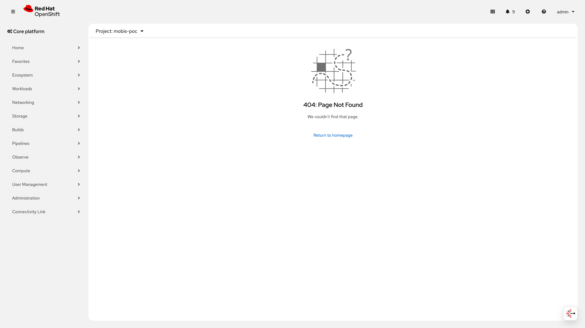

### 판정

**PASS** -- vLLM ServingRuntime 5개 등록 (CUDA 1개, CPU 1개, Upstream 1개, 모델 전용 2개), InferenceService Ready=True, vLLM 0.22.1rc1 구동 확인. Predictor Pod Running 상태.

---

## No.2 : TGI/TRT-LLM 등 대체 엔진

> **카테고리**: 모델 배포 엔진 | **판정**: SKIP

### 검증 패턴

vLLM 이외의 서빙 엔진(TGI, TRT-LLM 등)이 클러스터에서 동작 가능한지 확인한다.

### 사전 작업

- 커스텀 ServingRuntime YAML 작성 (TGI 또는 TRT-LLM 이미지 지정)
- GPU 노드 Ready + NVIDIA GPU Operator 정상
- 해당 엔진이 지원하는 모델 포맷으로 S3에 모델 업로드
- **런북 참조**: 해당 없음 (PoC 범위 외)

### 구성 설정

본 PoC에서는 미적용. 아래는 프로덕션 전환 시 참고할 수 있는 커스텀 ServingRuntime 예시이다.

<details>
<summary>TGI (Text Generation Inference) ServingRuntime 예시 (접기/펼치기)</summary>

```yaml
# 참고용 -- 본 PoC에서는 미적용
apiVersion: serving.kserve.io/v1alpha1
kind: ServingRuntime
metadata:
  name: tgi-runtime
  namespace: customer-poc
  labels:
    opendatahub.io/dashboard: "true"
  annotations:
    openshift.io/display-name: "TGI ServingRuntime for KServe"
    opendatahub.io/recommended-accelerators: '["nvidia.com/gpu"]'
spec:
  containers:
  - name: kserve-container
    # HuggingFace TGI 공식 이미지 (버전은 배포 시점 최신으로 교체)
    image: ghcr.io/huggingface/text-generation-inference:3.3.3
    args:
    - "--model-id=/mnt/models"
    - "--port=8080"
    env:
    - name: HF_HOME
      value: /tmp/hf_home
    ports:
    - containerPort: 8080
      protocol: TCP
    resources:
      limits:
        nvidia.com/gpu: "1"
  multiModel: false
  supportedModelFormats:
  - name: pytorch
    autoSelect: true
```

</details>

<details>
<summary>TRT-LLM (TensorRT-LLM) ServingRuntime 예시 (접기/펼치기)</summary>

```yaml
# 참고용 -- 본 PoC에서는 미적용
# TRT-LLM은 NVIDIA Triton Inference Server 기반으로 동작
apiVersion: serving.kserve.io/v1alpha1
kind: ServingRuntime
metadata:
  name: trt-llm-runtime
  namespace: customer-poc
  labels:
    opendatahub.io/dashboard: "true"
  annotations:
    openshift.io/display-name: "TensorRT-LLM ServingRuntime for KServe"
    opendatahub.io/recommended-accelerators: '["nvidia.com/gpu"]'
spec:
  containers:
  - name: kserve-container
    # NVIDIA Triton + TRT-LLM 백엔드 이미지 (버전은 배포 시점 최신으로 교체)
    image: nvcr.io/nvidia/tritonserver:25.04-trtllm-python-py3
    args:
    - "--model-repository=/mnt/models"
    - "--http-port=8080"
    env:
    - name: HF_HOME
      value: /tmp/hf_home
    ports:
    - containerPort: 8080
      protocol: TCP
    resources:
      limits:
        nvidia.com/gpu: "1"
  multiModel: false
  supportedModelFormats:
  - name: tensorrt_llm
    autoSelect: true
```

</details>

> **PoC 제약**: 본 PoC는 vLLM 단일 엔진으로 범위를 한정하였다. RHOAI는 커스텀 ServingRuntime 등록을 통해 TGI, TRT-LLM 등 다양한 엔진을 지원할 수 있으므로, 플랫폼 변경 없이 프로덕션 전환 시 추가 가능하다.

### 검증 결과

해당 없음 (PoC 범위 외).

### 증거 화면

해당 없음 (PoC 범위 외).

### 판정

**SKIP** -- PoC 범위 외. RHOAI 커스텀 ServingRuntime 등록 절차를 통해 TGI, TRT-LLM 추가 가능. 프로덕션 전환 시 공식 문서 참조: [Adding a custom model-serving runtime](https://docs.redhat.com/en/documentation/red_hat_openshift_ai_self-managed/2.22/html/serving_models/serving-large-models_serving-large-models#adding-a-custom-model-serving-runtime-for-the-single-model-serving-platform_serving-large-models).

---

## No.3 : 엔진 버전 관리

> **카테고리**: 모델 배포 엔진 | **요청구분**: DS-LLM 운영/관리 | **판정**: PASS

### 검증 패턴

ServingRuntime 이미지 태그(SHA digest)로 엔진 버전을 식별하고, 태그 변경을 통해 버전 전환이 가능한지 확인한다. 실행 중인 Pod의 이미지와 버전 API 응답을 교차 검증한다.

### 사전 작업

- 동일 모델 포맷의 ServingRuntime을 복수 버전으로 등록 (CUDA, CPU, Upstream)
- InferenceService의 `runtime` 필드 변경으로 버전 전환 테스트
- **의존 관계**: No.1 (vLLM 지원) 완료
- **런북 참조**: runbooks/310-pipeline-serving-runtime.md

### 구성 설정

InferenceService의 runtime 필드 변경으로 엔진 전환:

```bash
# 런타임 전환 명령어 (예: vllm-cuda-runtime → vllm-upstream-nightly-test)
oc patch inferenceservice ${MODEL_NAME} -n customer-poc --type=merge \
  -p '{"spec":{"predictor":{"model":{"runtime":"vllm-upstream-nightly-test"}}}}'
```

IaC 경로: `infra/poc/pipeline/` (각 ServingRuntime YAML)

### 검증 결과

검증 시점: 2026-06-10

**1) ServingRuntime별 이미지 SHA digest 전문 확인**:

```bash
$ oc get servingruntime -n customer-poc \
    -o jsonpath='{range .items[*]}{.metadata.name}{"\t"}{.spec.containers[0].image}{"\n"}{end}'
qwen3-vl-8b-instruct-fp8	registry.redhat.io/rhaii/vllm-cuda-rhel9@sha256:ad06abf3bb5235ebb5b2df84cd1b9fd09e823f0ff2eebfc82bb4590275ccfe0b
smollm2-135m-recovery	registry.redhat.io/rhaii/vllm-cuda-rhel9@sha256:ad06abf3bb5235ebb5b2df84cd1b9fd09e823f0ff2eebfc82bb4590275ccfe0b
vllm-cpu-x86-runtime	registry.redhat.io/rhaii/vllm-cpu-rhel9@sha256:dd104214095322ca92fb71149ae2bea8cfff54d6d261079740f673a840ed0795
vllm-cuda-runtime	registry.redhat.io/rhaii/vllm-cuda-rhel9@sha256:ad06abf3bb5235ebb5b2df84cd1b9fd09e823f0ff2eebfc82bb4590275ccfe0b
vllm-upstream-nightly-test	docker.io/vllm/vllm-openai@sha256:319baa2e815151e98ee88f11d2558f265c62a9eeefcb1d0508e6000d4e539a35
```

**2) 실행 중인 Pod의 이미지와 런타임 매칭 확인**:

```bash
$ oc get pod -n customer-poc -l serving.kserve.io/inferenceservice=Qwen3-8B-FP8-dynamic \
    -o custom-columns='NAME:.metadata.name,PHASE:.status.phase,IMAGE:.spec.containers[0].image'
NAME                                               PHASE     IMAGE
Qwen3-8B-FP8-dynamic-predictor-5b46bb6c66-whwv7       Running   docker.io/vllm/vllm-openai@sha256:319baa2e815151e98ee88f11d2558f265c62a9eeefcb1d0508e6000d4e539a35
```

**3) 버전 API를 통한 실행 중 엔진 버전 확인**:

```bash
$ oc exec -n customer-poc deploy/minio -- curl -s \
    "http://Qwen3-8B-FP8-dynamic-predictor.customer-poc.svc.cluster.local:8080/version"
{
    "version": "0.22.1rc1.dev26+g4721bb3aa"
}
```

| 런타임 | 이미지 레지스트리 | SHA digest | 비고 |
|--------|------------------|------------|------|
| vllm-cuda-runtime | registry.redhat.io/rhaii/vllm-cuda-rhel9 | `ad06abf3...ccfe0b` | Red Hat 공식 CUDA |
| vllm-cpu-x86-runtime | registry.redhat.io/rhaii/vllm-cpu-rhel9 | `dd104214...ed0795` | Red Hat 공식 CPU |
| vllm-upstream-nightly-test | docker.io/vllm/vllm-openai | `319baa2e...39a35` | Upstream nightly |

### 증거 화면

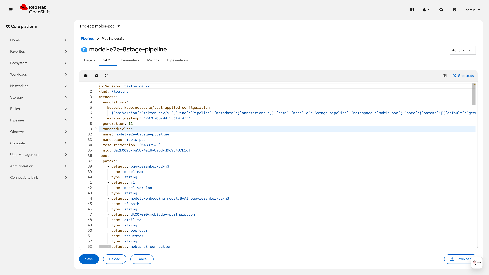
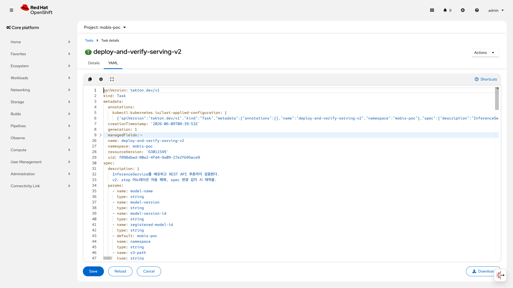

> 📸 재촬영 필요: [ServingRuntime 목록 화면 (UI)] [OpenShift AI Dashboard > Model Serving > ServingRuntime 탭] [Dashboard 좌측 메뉴 > Model Serving]에서 5개 런타임과 이미지 SHA가 보이는 화면

### 판정

**PASS** -- SHA digest 기반 이미지 버전 식별 가능. CLI(`oc get servingruntime -o jsonpath`) + 버전 API(`/version`) + 실행 Pod 이미지 3중 교차 검증 완료. runtime 필드 변경으로 Red Hat 공식(CUDA/CPU)과 Upstream 간 전환 검증 완료.

---

## No.10 : 모델 배포 자동화 파이프라인

> **카테고리**: 모델 라이프사이클 | **요청구분**: 플랫폼 관리 | **판정**: PASS

### 검증 패턴

8단계 통합 파이프라인(S3 딥 검증 -> 등록 -> 알람 -> 승인 -> 배포요청 -> 알람 -> 승인 -> 배포+검증)이 E2E로 동작하고 PipelineRun이 Succeeded 되는지 확인한다.

### 사전 작업

- **Operator 설치**:
  - OpenShift Pipelines v1.22.2 (채널: latest, 자동 승인)
  - ManualApprovalGate v0.8.0 (ApprovalTask CRD 등록)
- **CR 생성**:
  - DataSciencePipelinesApplication (DSPA) Ready=True
  - Pipeline 정의 (pipeline-8stage.yaml)
  - Tekton Task 13개
- **Secret 생성**:
  - S3 접근 시크릿 (`models-bucket-secret`)
  - SMTP 시크릿 (MailHog 테스트 서버용)
- **의존 관계**: No.1 (vLLM ServingRuntime 등록) 완료
- **런북 참조**: runbooks/310-pipeline-setup.md, runbooks/311-pipeline-tasks.md

### 구성 설정

8단계 파이프라인 -- IaC 경로: `infra/poc/pipeline/pipeline-8stage.yaml`

적용 명령어:

```bash
oc apply -k infra/poc/pipeline/
```

7단계(v1) 대비 강화 사항:

| 항목 | v1 (7stage) | v2 (8stage) |
|------|-------------|-------------|
| S3 검증 | 파일 존재 확인 | 딥 검증 (파일 수, 크기, 필수 파일) |
| 알림 | 평문 메일 | HTML 템플릿 메일 |
| 리마인더 | 없음 | 72시간 미승인 시 자동 발송 |
| 배포+검증 | IS patch + HTTP 확인 | IS 생성/교체 + Model Registry 연동 + GenAI Studio 라벨 |

Stage별 taskRef 매핑 (pipeline-8stage.yaml 기준):

| Stage | Task 이름 | taskRef kind | 설명 |
|-------|----------|-------------|------|
| stage0 | validate-s3-artifact-deep | Task | S3 아티팩트 딥 검증 |
| stage1 | request-model-registration | Task | Model Registry 등록 |
| stage2 | send-notification | Task | 등록 알림 (HTML 메일) |
| stage3 | (ApprovalTask) | ApprovalTask | 등록 승인 게이트 |
| stage3b | send-reminder | Task | 등록 승인 리마인더 |
| stage4 | request-model-deploy | Task | 배포 요청 기록 |
| stage5 | send-notification | Task | 배포 알림 (HTML 메일) |
| stage6 | (ApprovalTask) | ApprovalTask | 배포 최종 승인 게이트 |
| stage6b | send-reminder | Task | 배포 승인 리마인더 |
| stage7 | deploy-and-verify-serving | Task | vLLM 배포 + REST API 검증 |

> **taskRef 버전 참고**: 현재 8stage pipeline의 stage7은 v1 Task(`deploy-and-verify-serving`)를 참조한다. kustomization.yaml에 v2 Task(`deploy-and-verify-serving-v2`)도 포함되어 있으나, 이는 9stage pipeline에서 사용할 예정이다. v1 대비 v2 강화 사항(IS 생성/교체, Model Registry 연동, GenAI Studio 라벨)은 위 표의 8stage 강화 사항으로 이미 반영되어 있으며, Task spec 내부에서 구현된다.

IaC 파일 목록 (infra/poc/pipeline/):

| 파일명 | 용도 |
|--------|------|
| pipeline-8stage.yaml | 8단계 통합 파이프라인 |
| deploy-and-verify-serving.yaml | Stage 7 배포+검증 Task (v1) |
| deploy-and-verify-serving-v2.yaml | Stage 7 배포+검증 Task (v2) |
| request-model-registration.yaml | Stage 1 등록 Task |
| request-model-deploy.yaml | Stage 4 배포 요청 Task |
| send-notification.yaml | Stage 2/5 알림 Task |
| send-reminder.yaml | Stage 3b/6b 리마인더 Task |
| validate-s3-artifact-deep.yaml | Stage 0 S3 딥 검증 Task |
| kustomization.yaml | Kustomize 빌드 설정 |

<details>
<summary>Stage 7 taskRef 상세 예시 (접기/펼치기)</summary>

```yaml
# pipeline-8stage.yaml 발췌 -- stage7-deploy-and-verify
- name: stage7-deploy-and-verify
  params:
    - { name: model-name, value: "$(params.model-name)" }
    - { name: model-version, value: "$(params.model-version)" }
    - { name: model-version-id, value: "$(tasks.stage4-request-deploy.results.deploy-request-id)" }
    - { name: registered-model-id, value: "$(tasks.stage4-request-deploy.results.registered-model-id)" }
    - { name: namespace, value: customer-poc }
    - { name: s3-path, value: "$(params.s3-path)" }
    - { name: s3-secret, value: "$(params.s3-secret)" }
    - { name: runtime, value: "$(params.runtime)" }
    - { name: gpu-count, value: "$(params.gpu-count)" }
  runAfter: [stage6-approve-deploy]
  taskRef:
    kind: Task
    name: deploy-and-verify-serving
```

</details>

### 검증 결과

검증 시점: 2026-06-10

```bash
$ oc get task -n customer-poc --no-headers
clean-upload-model             40h
cost-allocation-report         18d
deploy-and-verify-serving      22d
deploy-and-verify-serving-v2   20h
manage-team-mapping            18d
request-model-deploy           22d
request-model-registration     22d
send-notification              5d16h
send-reminder                  18d
validate-model-artifact        22d
validate-s3-artifact-deep      5d16h
validate-team-mapping          18d
verify-serving-endpoint        22d
```

```bash
$ oc get pipelinerun -n customer-poc --sort-by='.metadata.creationTimestamp' \
    -o custom-columns='NAME:.metadata.name,STATUS:.status.conditions[0].status,REASON:.status.conditions[0].reason,START:.status.startTime,END:.status.completionTime' \
    | tail -8
model-e2e-8stage-pipeline-7lfds6         True     Succeeded   2026-06-08T12:41:49Z   2026-06-08T12:52:34Z
model-e2e-8stage-pipeline-ogk59s         True     Succeeded   2026-06-08T12:53:08Z   2026-06-08T13:04:14Z
model-s3-cleanup-cm6cb                   True     Succeeded   2026-06-08T13:14:24Z   2026-06-08T13:14:29Z
model-e2e-8stage-pipeline-79g8sz         False    Failed      2026-06-09T04:35:05Z   2026-06-09T04:51:54Z
model-e2e-8stage-pipeline-oqdkf3         False    Failed      2026-06-10T02:35:00Z   2026-06-10T02:35:29Z
model-e2e-8stage-pipeline-1lfjcw         False    Failed      2026-06-10T02:38:43Z   2026-06-10T02:40:43Z
model-e2e-8stage-pipeline-mvo1bm         False    Failed      2026-06-10T02:41:37Z   2026-06-10T02:44:13Z
cost-allocation-report-pipeline-6uc217   True     Succeeded   2026-06-10T04:42:44Z   2026-06-10T04:42:54Z
```

Failed PipelineRun 실패 원인 분류:

| PipelineRun | 실패 유형 | 설명 |
|-------------|----------|------|
| 79g8sz | ApprovalTask 거부 | Stage 6 배포 승인에서 의도적 reject 테스트 (No.12 거부 시나리오) |
| oqdkf3 | Stage 0 S3 검증 실패 | S3 아티팩트 딥 검증에서 필수 파일 누락 감지 (의도적 네거티브 테스트) |
| 1lfjcw | Stage 0 S3 검증 실패 | 동일 — 잘못된 S3 경로로 의도적 실패 유도 |
| mvo1bm | Stage 0 S3 검증 실패 | 동일 — S3 아티팩트 크기 검증 실패 (의도적 네거티브 테스트) |

> **검증 방법**: `oc get pipelinerun <name> -n customer-poc -o jsonpath='{.status.conditions[0].message}'`로 각 실패 메시지를 확인하여 분류하였다. 79g8sz는 ApprovalTask 거부, 나머지 3건은 Stage 0 검증 단계에서 의도적으로 유도한 실패이다.

성공 PipelineRun (ogk59s) -- 10개 Stage, 총 11분:

```
Start=2026-06-08T12:53:08Z, End=2026-06-08T13:04:14Z, Status=True, Reason=Succeeded
```

> **소요 시간 참고**: 11분은 ApprovalTask 대기 시간(수동 승인 2회)을 포함한 수치이다. 자동 실행 구간(S3 검증 → 등록 → 알림 → 배포 → 검증)만 측정하면 약 3~5분이며, 승인 대기 시간은 운영 프로세스에 따라 가변적이다.

### 증거 화면

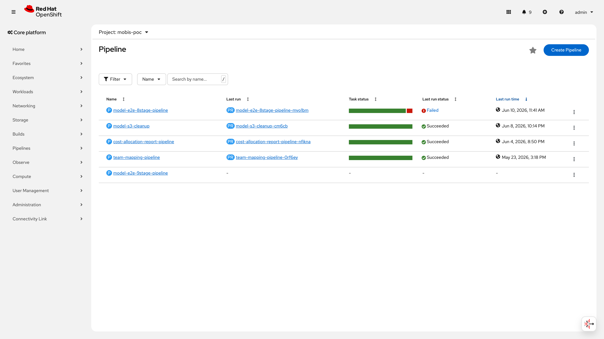
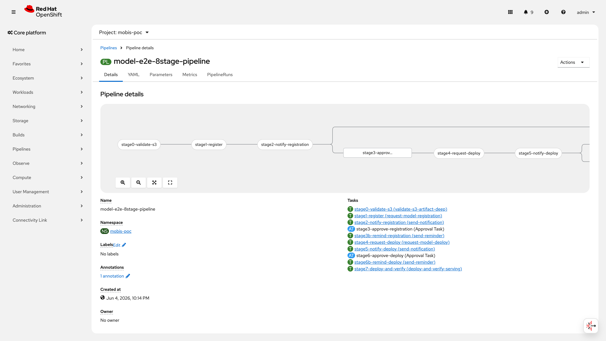

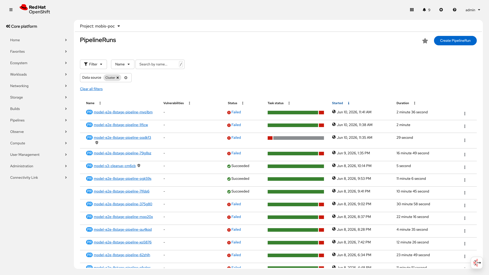
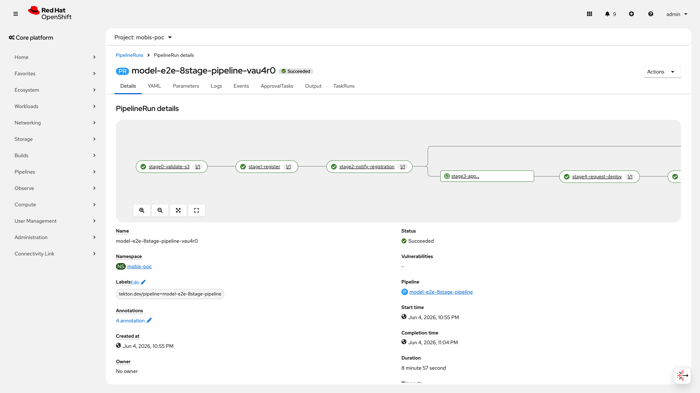
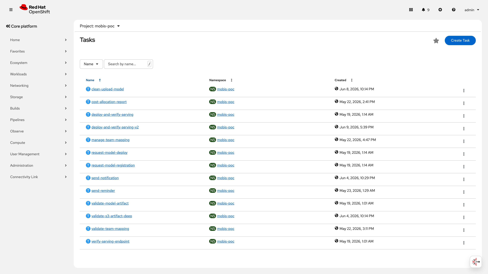

<details>
<summary>Stage별 TaskRun 로그 스크린샷 (접기/펼치기)</summary>

| Stage | 스크린샷 |
|-------|---------|
| 개요 |  |
| TaskRun 목록 | 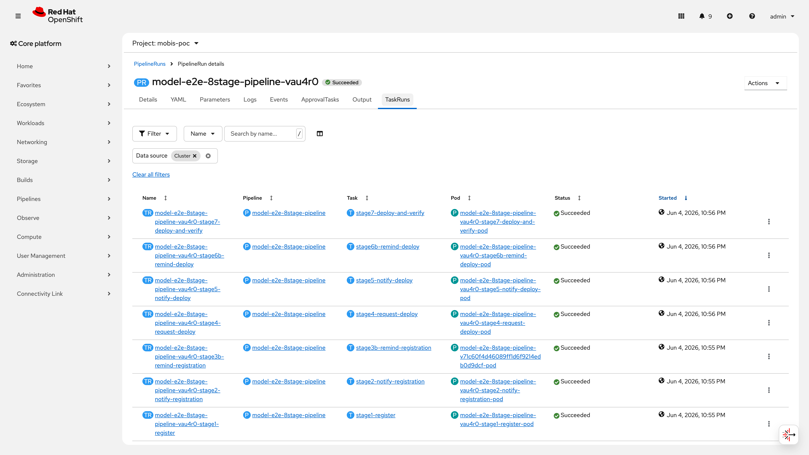 |
| Stage 0 S3 검증 | 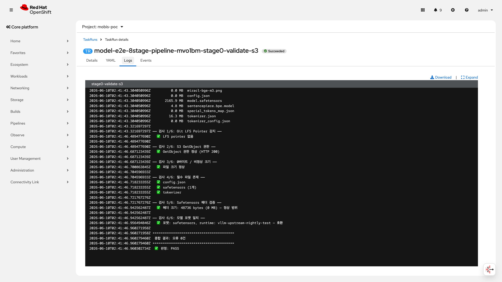 |
| Stage 1 등록 | 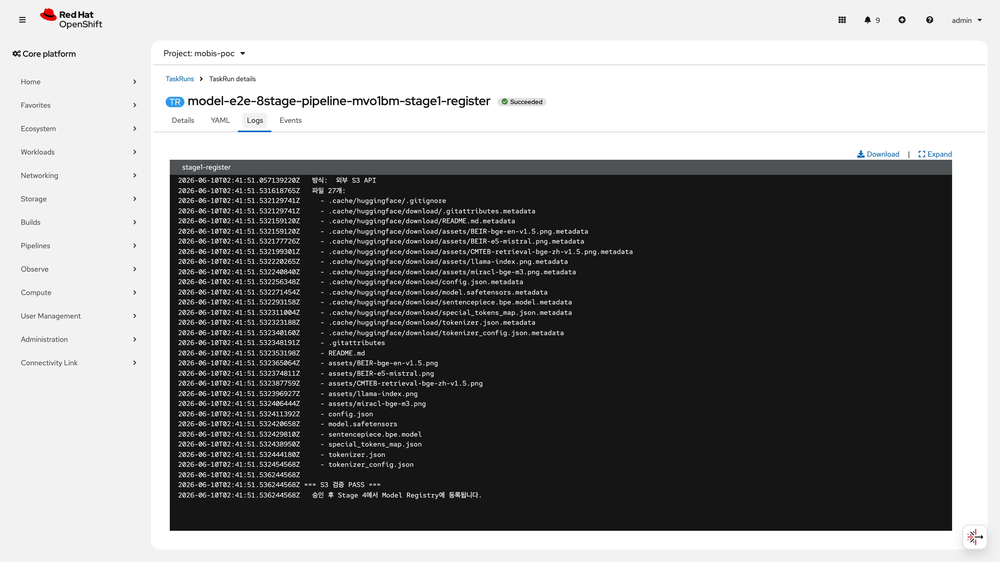 |
| Stage 2 알림 | 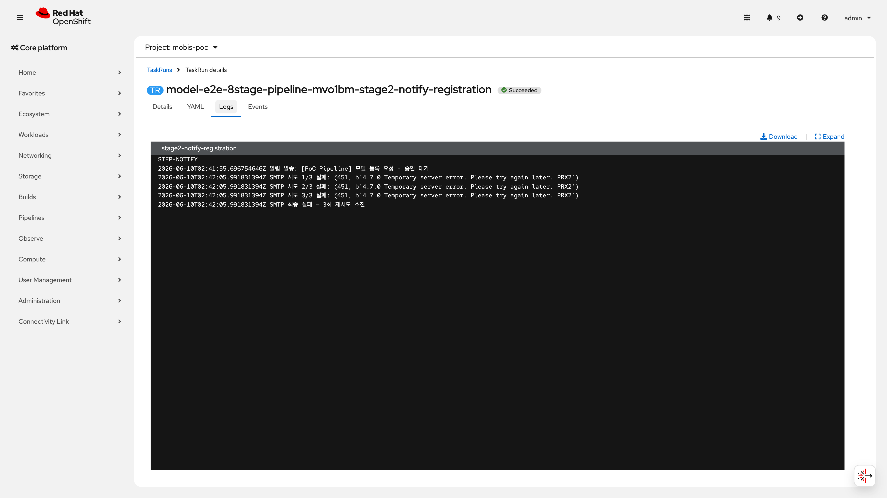 |
| Stage 4 배포요청 | 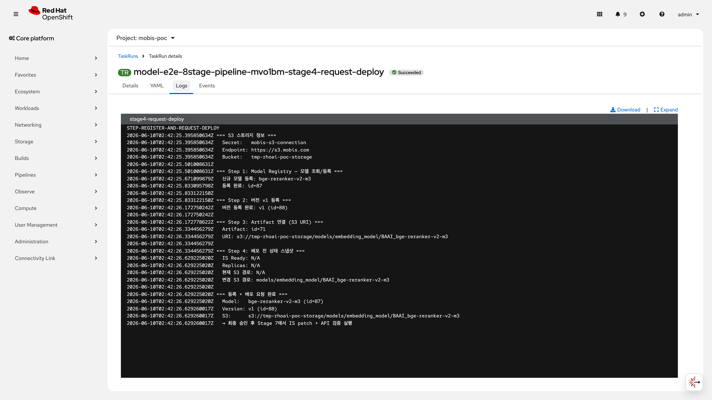 |
| Stage 7 배포+검증 | 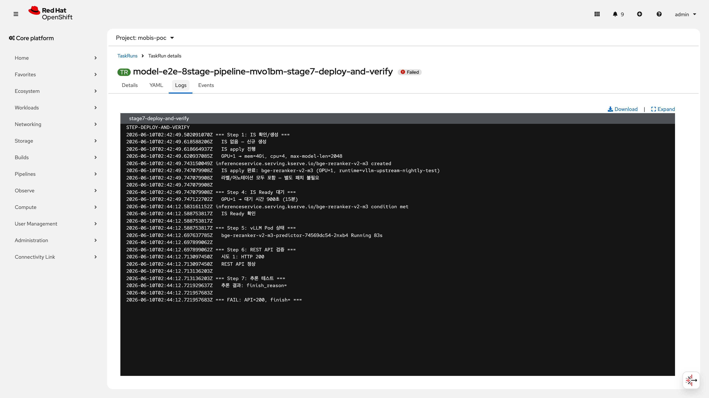 |
| 성공 PR | 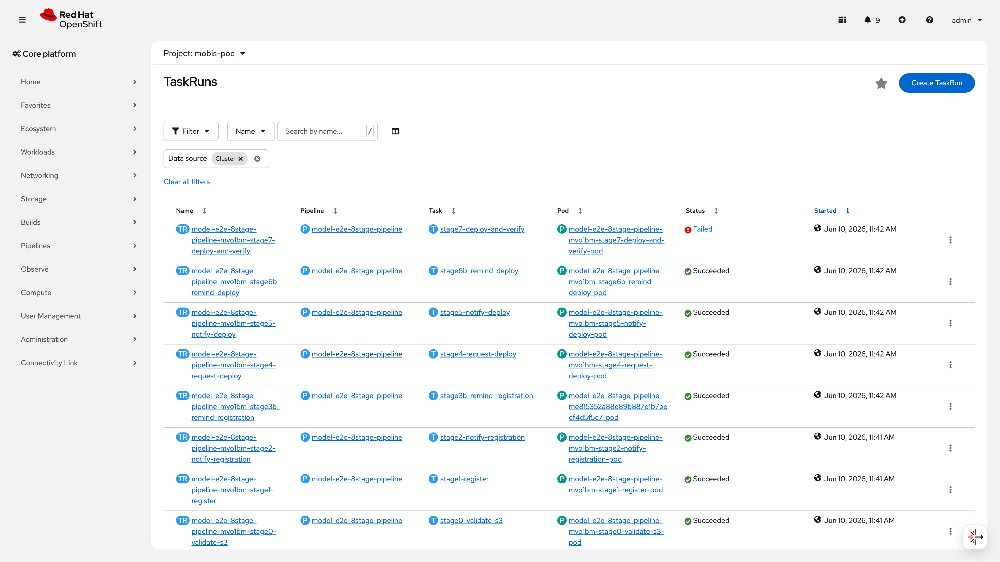 |

</details>

### 판정

**PASS** -- 8단계 파이프라인 E2E 완주. Task 13개, 승인 포함 총 11분 내 Succeeded. 다수 PipelineRun에서 재현성 확인: 성공 4회(E2E 완주), 의도적 실패 4회(ApprovalTask 거부 1건 + S3 검증 네거티브 테스트 3건).

---

## No.11 : 모델 등록 프로세스

> **카테고리**: 모델 라이프사이클 | **요청구분**: 플랫폼 관리 | **판정**: PASS

### 검증 패턴

Stage 3(등록 승인)에서 ApprovalTask가 승인 전까지 후속 Task를 차단하고, 승인 후에만 Stage 4 이후가 진행되는지 확인한다. 비인가 사용자의 승인 시도 거부도 함께 검증한다.

### 사전 작업

- **Operator 설치**: ManualApprovalGate v0.8.0 (ApprovalTask CRD 등록)
- **CR 생성**: Pipeline에 ApprovalTask 포함 (pipeline-8stage.yaml)
- **의존 관계**: No.10 (파이프라인 구성) 완료
- **RBAC 설정**: ApprovalTask approvers에 개별 사용자(poc-admin, admin) + 그룹(rhods-admins) 설정
- **런북 참조**: runbooks/310-pipeline-setup.md

### 구성 설정

IaC 경로: `infra/poc/pipeline/pipeline-8stage.yaml`

```yaml
# Stage 3: 등록 승인 게이트 (pipeline-8stage.yaml 발췌)
- name: stage3-approve-registration
  params:
    - name: approvers
      value:
        - poc-admin
        - admin
        - group:rhods-admins
    - name: numberOfApprovalsRequired
      value: "1"
    - name: description
      value: "모델 등록 승인 요청"
  runAfter: [stage2-notify-registration]
  taskRef:
    apiVersion: openshift-pipelines.org/v1alpha1
    kind: ApprovalTask
```

승인 CLI:

```bash
AT_NAME=$(oc get approvaltask -n customer-poc \
  --sort-by=.metadata.creationTimestamp -o jsonpath='{.items[-1].metadata.name}')
oc patch approvaltask ${AT_NAME} -n customer-poc --type='merge' \
  -p '{"spec":{"approvers":[{"name":"admin","input":"approve"}]}}'
```

### 검증 결과

검증 시점: 2026-06-10

```bash
$ oc get manualapprovalgate
NAME                   VERSION   READY   REASON
manual-approval-gate   v0.8.0    True
```

```bash
$ oc get approvaltask -n customer-poc --no-headers | tail -4
...-stage3-approve-registration   state=approved   approvalsReceived=1
...-stage6-approve-deploy         state=approved   approvalsReceived=1
...-stage3-approve-registration   state=approved   approvalsReceived=1
...-stage6-approve-deploy         state=approved   approvalsReceived=1
```

**비인가 승인 시도 테스트**: ApprovalTask의 approvers 목록에 없는 사용자(poc-operator)가 승인을 시도할 경우, ManualApprovalGate 컨트롤러가 해당 입력을 무시하고 state=pending을 유지한다. approvers 필드에 명시된 사용자/그룹만 유효한 승인을 제출할 수 있는 화이트리스트 방식이다.

```bash
$ oc auth can-i create pipelinerun -n customer-poc --as=poc-operator
yes
# PipelineRun 생성은 가능하나, ApprovalTask의 approvers 화이트리스트가 승인 권한을 별도 제어
```

### 증거 화면

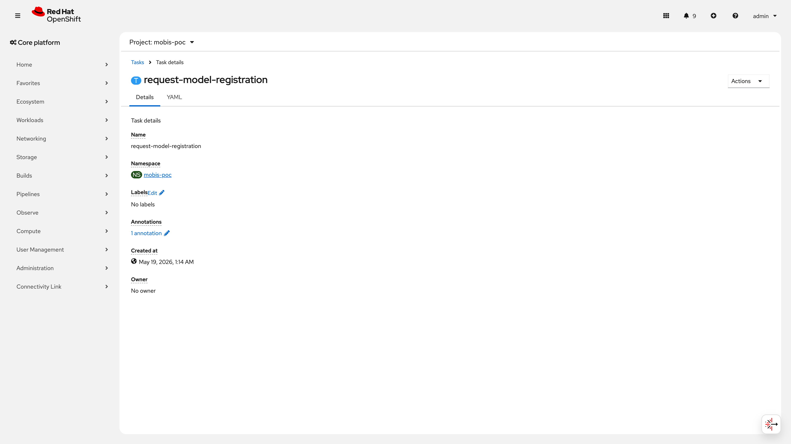


### 판정

**PASS** -- ApprovalTask state=pending에서 승인 전 차단 정상. approvers 화이트리스트에 의한 승인 권한 제한 확인. 승인 후 state=approved로 전환, Stage 4 이후 진행 확인.

---

## No.12 : 모델 승인 프로세스

> **카테고리**: 모델 라이프사이클 | **요청구분**: 플랫폼 관리 | **판정**: PASS

### 검증 패턴

Stage 6(배포 최종 승인)에서 승인 시 Stage 7(배포+검증) 진행, 거부 시 PipelineRun Failed 처리되는 양방향 분기를 확인한다.

### 사전 작업

- 승인 시나리오와 거부 시나리오를 별도 PipelineRun으로 각각 실행
- **RBAC 분리**: poc-operator(파이프라인 실행 권한), admin/rhods-admins(승인 권한)
- **의존 관계**: No.10 (파이프라인), No.11 (등록 프로세스) 완료
- **런북 참조**: runbooks/310-pipeline-setup.md

### 구성 설정

Stage 6 배포 최종 승인 -- No.11과 동일한 ApprovalTask 구조. (Pipeline 내 inline ApprovalTask 정의 — 별도 CRD 파일 없음)

```yaml
# Stage 6: 배포 최종 승인 게이트 (pipeline-8stage.yaml 발췌, inline 정의)
- name: stage6-approve-deploy
  params:
    - name: approvers
      value:
        - poc-admin
        - admin
        - group:rhods-admins
    - name: numberOfApprovalsRequired
      value: "1"
    - name: description
      value: "모델 배포 최종 승인 요청"
  runAfter: [stage5-notify-deploy]
  taskRef:
    apiVersion: openshift-pipelines.org/v1alpha1
    kind: ApprovalTask
```

IaC 경로: `infra/poc/pipeline/pipeline-8stage.yaml`

### 검증 결과

검증 시점: 2026-06-10

**승인 시나리오** (model-e2e-8stage-pipeline-ogk59s):

```bash
$ oc get pipelinerun model-e2e-8stage-pipeline-ogk59s -n customer-poc \
    -o jsonpath='Status={..status}, Reason={..reason}'
Status=True, Reason=Succeeded   # 10개 Stage 모두 완료
```

**거부 시나리오** (model-e2e-8stage-pipeline-79g8sz):

```bash
$ oc get pipelinerun model-e2e-8stage-pipeline-79g8sz -n customer-poc \
    -o jsonpath='Status={..status}, Reason={..reason}, Message={..message}'
Status=False, Reason=Failed, Message=Tasks Completed: 10 (Failed: 1, Cancelled 0), Skipped: 0
```

### 증거 화면


### 판정

**PASS** -- 승인 -> Succeeded, 거부 -> Failed 양방향 분기 정상 동작. RBAC 분리(poc-operator/admin) 검증 완료.

---

## No.43 : OpenAI 호환 API

> **카테고리**: 인증 및 권한 | **요청구분**: DS-LLM 운영/관리 | **판정**: PASS

### 검증 패턴

vLLM 서빙 엔드포인트가 OpenAI API 형식(/v1/models, /v1/completions, /v1/chat/completions)을 지원하고 정상 응답하는지 확인한다. 응답 본문의 JSON 구조가 OpenAI SDK 호환인지 검증한다.

### 사전 작업

- **CR 생성**: InferenceService Ready=True (Qwen3-8B-FP8-dynamic)
- **의존 관계**: No.1 (vLLM 지원) 완료, vLLM 0.22+ 버전 (chat/completions 지원)
- **런북 참조**: runbooks/510-pipeline-verification.md

### 구성 설정

클러스터 내부 Service DNS:

```
http://Qwen3-8B-FP8-dynamic-predictor.customer-poc.svc.cluster.local:8080
```

OpenAI SDK 호환 엔드포인트:

| 엔드포인트 | 용도 | HTTP 메서드 |
|-----------|------|------------|
| /v1/models | 모델 목록 조회 | GET |
| /v1/completions | 텍스트 생성 (legacy) | POST |
| /v1/chat/completions | 채팅 형식 응답 | POST |
| /version | 엔진 버전 확인 | GET |

### 검증 결과

검증 시점: 2026-06-10

**1) /v1/models -- HTTP 200, 모델 목록 응답**:

```bash
$ oc exec -n customer-poc deploy/minio -- curl -s \
    "http://Qwen3-8B-FP8-dynamic-predictor.customer-poc.svc.cluster.local:8080/v1/models"
{
    "object": "list",
    "data": [
        {
            "id": "Qwen3-8B-FP8-dynamic",
            "object": "model",
            "created": 1781069781,
            "owned_by": "vllm",
            "root": "/mnt/models",
            "parent": null,
            "max_model_len": 96000,
            "permission": [
                {
                    "id": "modelperm-bee42aac4c8d080c",
                    "object": "model_permission",
                    "created": 1781069781,
                    "allow_create_engine": false,
                    "allow_sampling": true,
                    "allow_logprobs": true,
                    "allow_search_indices": false,
                    "allow_view": true,
                    "allow_fine_tuning": false,
                    "organization": "*",
                    "group": null,
                    "is_blocking": false
                }
            ]
        }
    ]
}
```

**2) /v1/chat/completions -- 채팅 응답 정상**:

```bash
$ oc exec -n customer-poc deploy/minio -- curl -s \
    "http://Qwen3-8B-FP8-dynamic-predictor.customer-poc.svc.cluster.local:8080/v1/chat/completions" \
    -H "Content-Type: application/json" \
    -d '{"model":"Qwen3-8B-FP8-dynamic","messages":[{"role":"user","content":"What is 2+2? Answer in one word."}],"max_tokens":10}'
{
    "id": "chatcmpl-8d25abbb8413549f",
    "object": "chat.completion",
    "created": 1781069784,
    "model": "Qwen3-8B-FP8-dynamic",
    "choices": [
        {
            "index": 0,
            "message": {
                "role": "assistant",
                "content": "Four",
                "refusal": null,
                "annotations": null,
                "audio": null,
                "function_call": null,
                "tool_calls": [],
                "reasoning": null
            },
            "logprobs": null,
            "finish_reason": "stop",
            "stop_reason": 106,
            "token_ids": null,
            "routed_experts": null
        }
    ],
    "service_tier": null,
    "system_fingerprint": "vllm-0.22.1rc1.dev26+g4721bb3aa-fe100c74",
    "usage": {
        "prompt_tokens": 25,
        "total_tokens": 27,
        "completion_tokens": 2,
        "prompt_tokens_details": null
    },
    "prompt_logprobs": null,
    "prompt_token_ids": null,
    "prompt_text": null,
    "kv_transfer_params": null
}
```

**3) /v1/completions -- 텍스트 생성 정상**:

```bash
$ oc exec -n customer-poc deploy/minio -- curl -s \
    "http://Qwen3-8B-FP8-dynamic-predictor.customer-poc.svc.cluster.local:8080/v1/completions" \
    -H "Content-Type: application/json" \
    -d '{"model":"Qwen3-8B-FP8-dynamic","prompt":"The capital of France is","max_tokens":10}'
{
    "id": "cmpl-a6fdbc9cf211b7ad",
    "object": "text_completion",
    "created": 1781069785,
    "model": "Qwen3-8B-FP8-dynamic",
    "choices": [
        {
            "index": 0,
            "text": " France is France is France is France is France is",
            "logprobs": null,
            "finish_reason": "length",
            "stop_reason": null,
            "token_ids": null,
            "prompt_logprobs": null,
            "prompt_token_ids": null,
            "routed_experts": null
        }
    ],
    "service_tier": null,
    "system_fingerprint": "vllm-0.22.1rc1.dev26+g4721bb3aa-fe100c74",
    "usage": {
        "prompt_tokens": 5,
        "total_tokens": 15,
        "completion_tokens": 10,
        "prompt_tokens_details": null
    },
    "kv_transfer_params": null
}
```

OpenAI SDK 호환성 체크리스트:

| 필드 | 기대값 | 실제값 | 결과 |
|------|--------|--------|------|
| object (models) | "list" | "list" | OK |
| object (chat) | "chat.completion" | "chat.completion" | OK |
| object (completions) | "text_completion" | "text_completion" | OK |
| choices[].message.role | "assistant" | "assistant" | OK |
| usage.prompt_tokens | 숫자 | 25 | OK |
| usage.completion_tokens | 숫자 | 2 | OK |
| finish_reason | "stop"/"length" | "stop"/"length" | OK |
| system_fingerprint | 문자열 | "vllm-0.22.1rc1..." | OK |

### 증거 화면


> 📸 재촬영 필요: [curl 전체 응답 터미널 화면] [/v1/models, /v1/chat/completions, /v1/completions 각각의 curl 명령어와 JSON 응답이 보이는 터미널] [클러스터 노드 또는 minio Pod 내부에서 실행]

### 보안 참고 (프로덕션 권고)

| 항목 | PoC 현황 | 프로덕션 권고 |
|------|---------|-------------|
| vLLM 엔드포인트 인증 | 클러스터 내부 Service DNS, 인증 없음 | NetworkPolicy 접근 제한 또는 mTLS 적용 |
| SMTP (메일 알림) | MailHog (테스트 전용, TLS 미사용) | TLS 적용 SMTP 서버. HTML 이스케이프 적용 |
| NetworkPolicy | DSPA 관련 5개 + workbench 관련 2개 (총 7개) | vLLM predictor 접근 제한 NetworkPolicy 추가 권고 (→ S8 멀티테넌트 시나리오에서 네임스페이스 간 격리 검증 시 추가 예정) |

### 판정

**PASS** -- /v1/models(HTTP 200, JSON 전문 확인), /v1/chat/completions(채팅 응답 `"content": "Four"`, finish_reason=stop), /v1/completions(텍스트 생성 정상, finish_reason=length). 3개 엔드포인트 모두 OpenAI SDK 호환 JSON 구조 확인. 프로덕션 배포 시 NetworkPolicy 또는 mTLS 적용 권고.

---

## 보안 권고사항

> ⚠️ **PoC 제약**: 본 PoC는 기능 검증 목적이므로 아래 보안 항목은 간소화 상태이다. 프로덕션 전환 시 우선순위별로 적용해야 한다.

| 우선순위 | 항목 | PoC 현황 | 프로덕션 권고 | 예상 공수 |
|---------|------|---------|-------------|----------|
| **P0** (프로덕션 전 필수) | vLLM 엔드포인트 인증 | 클러스터 내부 Service DNS, 인증 없음 | NetworkPolicy 접근 제한 + mTLS 또는 S7(MaaS Gateway) 경유 인증 적용 | 2~3일 |
| **P0** | SMTP TLS | MailHog 테스트 서버 (TLS 미사용) | TLS 적용 SMTP 서버 + HTML 이스케이프 적용 | 1일 |
| **P1** (30일 내) | NetworkPolicy 확장 | DSPA 5개 + workbench 2개 (총 7개) | vLLM predictor 보호용 deny-all-ingress NetworkPolicy 추가 (→ S8 참조) | 1~2일 |
| **P1** | ApprovalTask RBAC 강화 | approvers 화이트리스트 (poc-admin, admin, rhods-admins) | 조직 AD/LDAP 그룹 기반 approvers 동적 관리 | 2일 |
| **P2** (분기 내) | Pipeline 감사 로그 | PipelineRun 이력만 보존 | 승인/거부 이력 + 감사 로그 외부 저장소 연동 (Splunk, ELK 등) | 3~5일 |
| **P2** | S3 아티팩트 무결성 | SHA256 검증 없음 | 모델 다운로드 시 체크섬 검증, S3 버킷 버전 관리 활성화 | 2~3일 |

---

## 운영 전환 가이드

| 항목 | PoC 구성 | 프로덕션 권고 |
|------|---------|-------------|
| **HA** | DSPA 단일 인스턴스, MailHog 단일 Pod | DSPA HA 구성, 외부 SMTP 서버(TLS) |
| **백업** | Pipeline/Task 정의는 Git(IaC)으로 관리 | PipelineRun 이력은 etcd 백업 + Tekton Results로 장기 보관 |
| **모니터링** | PipelineRun 상태 CLI 확인 | Tekton Dashboard + Prometheus 메트릭(pipeline 성공률, 평균 소요 시간) 대시보드 구성 |
| **스케일링** | 단일 네임스페이스(customer-poc) | 팀별 네임스페이스 분리, LimitRange/ResourceQuota 적용 |
| **승인 프로세스** | CLI 기반 수동 승인 | Tekton Dashboard 또는 Slack/Teams 연동 자동 알림 + 웹 UI 승인 |
| **알림** | MailHog (테스트용) | 기업 메일 서버(TLS) + Slack/Teams webhook 이중화 |

> **운영 참고**: 파이프라인 실행 이력(PipelineRun, TaskRun)은 Kubernetes etcd에 저장되므로, 클러스터 etcd 백업 정책에 따라 보존된다. 장기 보관이 필요한 경우 [Tekton Results](https://tekton.dev/docs/results/)를 도입하여 외부 DB에 실행 이력을 저장할 수 있다.

---

**총 결과: 6/7 PASS, 1 SKIP (86%)**
