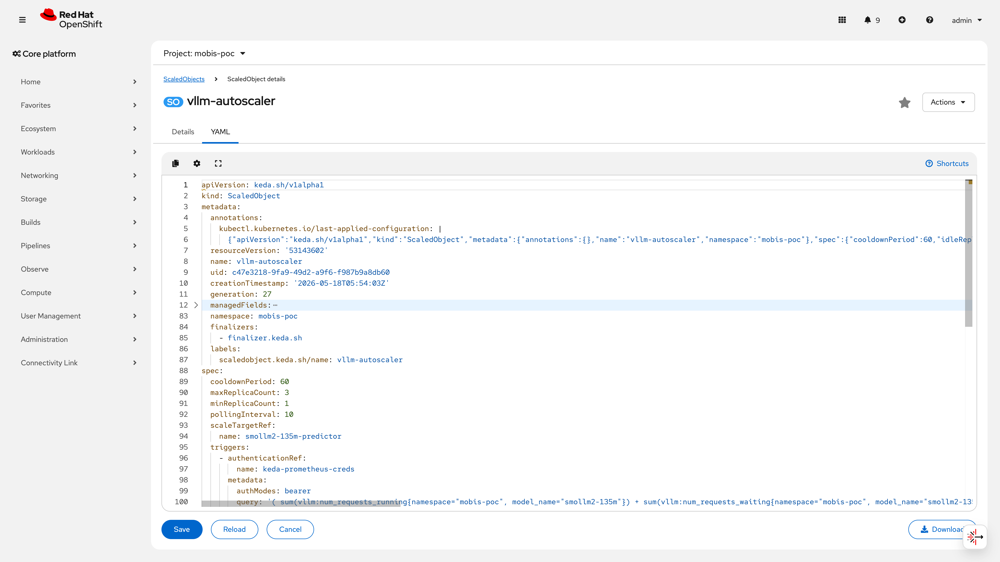
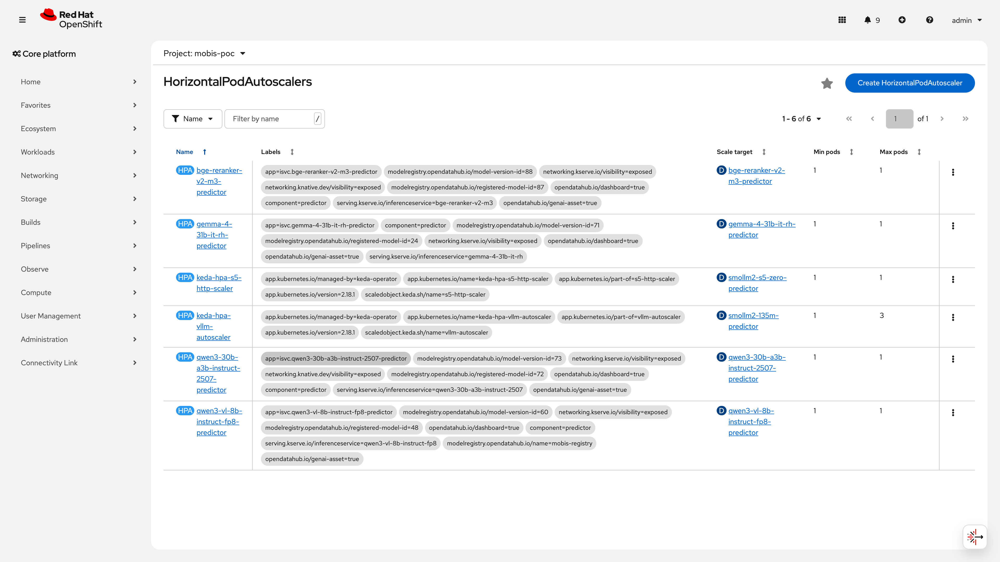
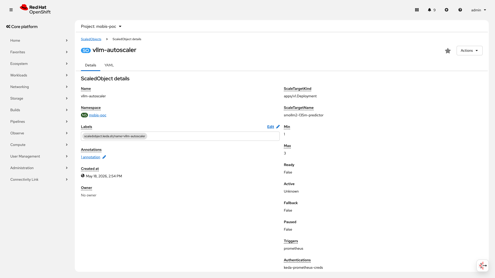
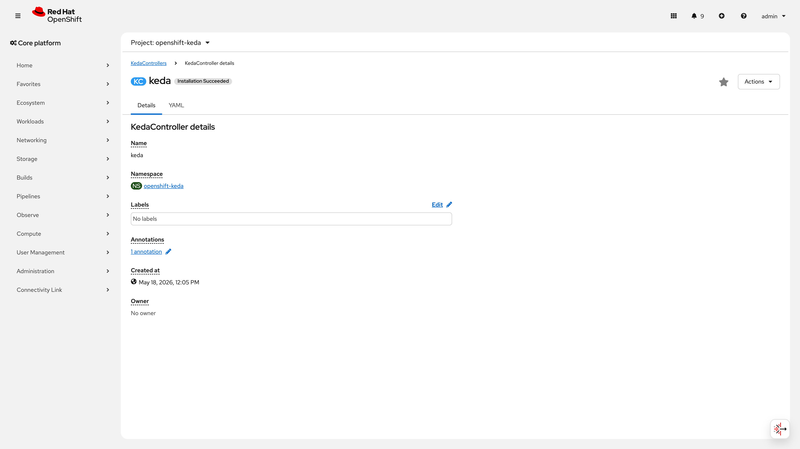
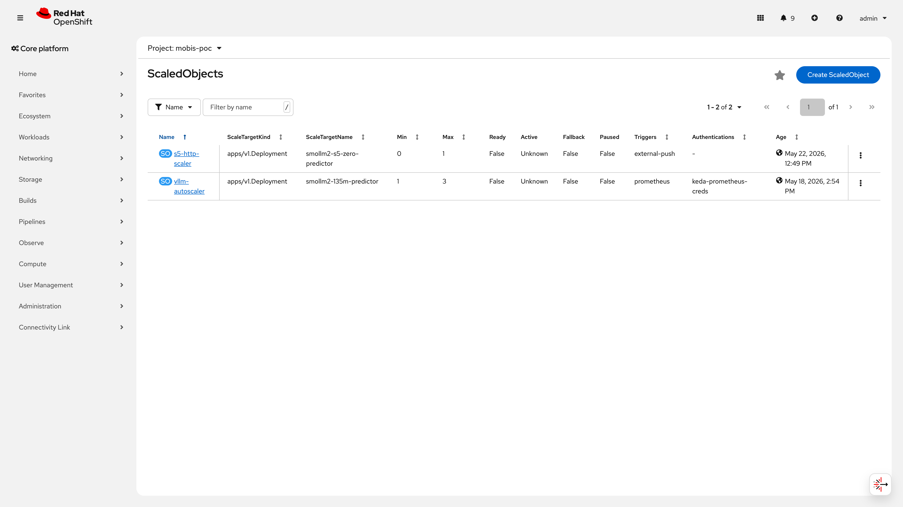

# S3: Auto-scaling 시나리오

> **시나리오 플로우**: Replica=1로 서빙 구동 → 부하 트래픽 발생 → replica 증가 확인 → 부하 해소 → replica 축소  
> **구축 런북**: runbooks/320-autoscaling.md, runbooks/322-autoscaling-v3.md | **검증 런북**: runbooks/520-autoscaling-validation.md  
> **IaC**: infra/poc/autoscaling/ (scaledobject-vllm.yaml, kustomization.yaml) | infra/operators/keda/ (keda-controller.yaml)  
> **결과**: 3/3 PASS (1 조건부, 100%)  
> **관련 시나리오**: [S1: 모델 관리](S1-model-management.md) | [S4: 장애 복구](S4-recovery.md) | [S5: Scale-to-Zero](S5-scale-to-zero.md) | [S6: 플랫폼 운영](S6-platform-ops.md)

CMA/KEDA 기반 수평 오토스케일링 3개 검증 항목을 모두 PASS(1 조건부) 판정하였다. 스케일업 14초(1→3 replicas), DCGM 10 targets + vLLM 6 targets 메트릭 수집 정상, v3 advanced HPA behavior 커스터마이징 적용-검증-복원을 완료하여 Customer의 LLM 서빙 부하 대응 자동화 요건을 충족한다.

## 목차

- [No.21 : 수평 오토스케일링 (HPA)](#no21--수평-오토스케일링-hpa)
- [No.22 : GPU 기반 스케일링 메트릭](#no22--gpu-기반-스케일링-메트릭)
- [No.25 : 스케일링 정책 커스터마이징](#no25--스케일링-정책-커스터마이징)
- [보안 고려사항](#보안-고려사항)
- [운영 전환 시 고려사항](#운영-전환-시-고려사항)
- [종합 판정](#종합-판정)

### 주요 성능 지표

| 지표 | 측정값 | 비고 |
|------|--------|------|
| **스케일업 소요 시간** | **14초** (1→3 replicas) | 부하 감지 → Pod Running 완료 (경량 모델 135M 기준) |
| 스케일다운 cooldown | 60초 | cooldown 경과 후 자동 축소 (3→1) |
| GPU 메트릭 수집 대상 | 10 targets (DCGM) | GPU 사용률 + VRAM |
| vLLM 메트릭 수집 대상 | 6 targets | 요청 큐 깊이 (2026-06-10 기준) |
| 전체 사이클 검증 | 1→3→1 완료 | 2026-05-23 실측 |

> **성능 지표 해석 참고**: 스케일업 14초는 KEDA 메트릭 폴링(10초 간격) → HPA desiredReplicas 증가 → Pod 스케줄링 → 컨테이너 기동 → Running 상태 전체 구간을 포함한다. 이 값은 경량 모델(smollm2-135m, 135M 파라미터, 모델 가중치 약 0.3GB)의 단일 노드 환경 측정값이며, `oc get pods` 출력의 AGE 필드에서 역산하였다. 대형 모델(7B+)은 모델 가중치 로딩에 추가 시간이 소요되어 스케일업 시간이 크게 증가할 수 있다(하단 운영 전환 시 고려사항 참조). 실측일: 2026-05-23.

### 증거 범례

본 문서의 스크린샷은 아래 번호 체계를 따른다.

| 번호 | 설명 | 파일 |
|------|------|------|
| Figure S3-1 | ScaledObject 목록 | `S3-scaledobject-list.png` |
| Figure S3-2 | ScaledObject YAML 상세 | `S3-so-vllm-yaml.png` |
| Figure S3-3 | HPA 목록 | `S3-hpa-list.png` |
| Figure S3-4 | KEDA Controller 메트릭 | `S3-keda-ctrl.png` |
| Figure S3-5 | ScaledObject vLLM 상세 | `S3-so-vllm.png` |
| Figure S3-6 | ScaledObject 정책 목록 | `S3-so-list.png` |

---

## No.21 : 수평 오토스케일링 (HPA)

> **카테고리**: 오토스케일링 | **요청구분**: DS-LLM 운영/관리  
> **판정**: 조건부 PASS

### 검증 패턴

CMA/KEDA 기반 ScaledObject가 vLLM 메트릭(활성+대기 요청 수)을 Prometheus에서 폴링하여, threshold 초과 시 HPA를 통해 predictor replica를 자동 증가시키고, 부하 해소 후 cooldown을 거쳐 원복되는지 검증한다.

검증 흐름:
1. ScaledObject CR 생성 → KEDA가 자동으로 HPA 리소스 생성 확인
2. vLLM 엔드포인트에 동시 부하 투입 → `vllm:num_requests_running + num_requests_waiting` 메트릭이 threshold(2) 초과
3. HPA가 desiredReplicas를 증가시키고 실 Pod가 Running 상태에 도달하는 시간 측정
4. 부하 해소 후 cooldownPeriod(60초) 경과 → replica 1로 복원 확인

### 사전 작업 (Operator 설치, CR 생성, Secret 생성, Namespace 등 단계별 상세)

**의존 관계**: 이 작업 전에 아래 항목이 완료되어야 한다.
- KServe/RHOAI 서빙 환경 구축 완료 (runbooks/200-rhoai-topology.md)
- 대상 InferenceService(smollm2-135m)가 customer-poc 네임스페이스에 배포되어 Running 상태
- User Workload Monitoring 활성화 (vLLM 메트릭 수집 전제)

**1단계: CMA Operator 설치**
- Operator 이름: Custom Metrics Autoscaler
- 채널: stable
- 버전: v2.18.1-2
- 네임스페이스: `openshift-keda`
- OperatorGroup: AllNamespaces 모드
- IaC 경로: `infra/operators/keda/keda-controller.yaml`
- 런북 참조: `runbooks/320-autoscaling.md` Step 1

**2단계: KedaController CR 생성**

```yaml
apiVersion: keda.sh/v1alpha1
kind: KedaController
metadata:
  name: keda
  namespace: openshift-keda
spec:
  watchNamespace: ""
  operator:
    logLevel: info
    logEncoder: console
  metricsServer:
    logLevel: "0"
  admissionWebhooks:
    logLevel: info
    logEncoder: console
```

```bash
oc apply -f infra/operators/keda/keda-controller.yaml
```

**3단계: KEDA Pod Running 확인**

keda-operator, keda-metrics-apiserver, keda-admission, custom-metrics-autoscaler-operator 총 4개 Pod가 Running 상태여야 한다.

```bash
oc get pods -n openshift-keda --no-headers
```

**4단계: KServe 자동 HPA 비활성화**

ScaledObject와 KServe 내장 HPA 간 충돌을 방지하기 위해 InferenceService에 `autoscalerClass: external` 어노테이션을 설정하고, 기존 HPA가 있으면 삭제한다.

```bash
# MODEL_NAME, MODEL_NS 는 환경변수로 사전 설정 필요 (예: smollm2-135m, customer-poc)
oc patch inferenceservice ${MODEL_NAME} -n ${MODEL_NS} --type=merge -p '{
  "metadata": {"annotations": {"serving.kserve.io/autoscalerClass": "external"}},
  "spec": {"predictor": {"maxReplicas": 3}}
}'
oc delete hpa ${MODEL_NAME}-predictor -n ${MODEL_NS} 2>/dev/null || true
```

**5단계: Prometheus 접근용 ServiceAccount + Secret + TriggerAuthentication 생성**

KEDA가 Thanos Querier에서 메트릭을 읽으려면 Bearer 토큰이 필요하다. SA를 생성하고 장기 토큰을 Secret으로 마운트한 뒤 TriggerAuthentication CR로 참조한다.

```bash
# SA 생성 및 ClusterRoleBinding
oc create sa keda-prometheus-reader -n customer-poc
oc adm policy add-cluster-role-to-user cluster-monitoring-view \
  -z keda-prometheus-reader -n customer-poc

# 장기 토큰 Secret 생성
oc create token keda-prometheus-reader -n customer-poc --duration=87600h > /tmp/keda-token
oc create secret generic keda-prometheus-auth -n customer-poc \
  --from-file=bearerToken=/tmp/keda-token
rm /tmp/keda-token
```

> ⚠️ **PoC 제약**: 실제 운영 중인 SA에는 `cluster-monitoring-view` 대신 `cluster-admin` ClusterRole이 부여되어 있다. `cluster-monitoring-view`로 Thanos Querier 접근 시 401 에러가 발생하여 상향하였다(런북 320 참조). 프로덕션 전환 시 원인 재조사 후 최소 권한으로 축소 필수. 상세 내용은 하단 [보안 고려사항](#보안-고려사항) P0 항목 참조.

**6단계: ScaledObject 생성**

런북 참조: `runbooks/320-autoscaling.md` Step 5

### 구성 설정 (YAML 전문)

**TriggerAuthentication CR:**

```yaml
apiVersion: keda.sh/v1alpha1
kind: TriggerAuthentication
metadata:
  name: keda-prometheus-creds
  namespace: customer-poc
spec:
  secretTargetRef:
    - parameter: bearerToken
      name: keda-prometheus-auth
      key: bearerToken
```

```bash
oc apply -f - <<'EOF'
apiVersion: keda.sh/v1alpha1
kind: TriggerAuthentication
metadata:
  name: keda-prometheus-creds
  namespace: customer-poc
spec:
  secretTargetRef:
    - parameter: bearerToken
      name: keda-prometheus-auth
      key: bearerToken
EOF
```

> ⚠️ **보안 참고 -- 토큰 관리 (P0)**: 현재 SA 토큰은 장기 토큰(만료: 2036-05-15, 유효기간 10년)을 사용 중이며, 토큰 유출 시 장기간 악용이 가능하다. 또한 해당 SA(`keda-prometheus-reader`)에 `cluster-admin` ClusterRole이 부여되어 있어 최소 권한 원칙에 위배된다. 프로덕션 전환 전 반드시 (1) projected SA 토큰(만료 1시간, audience: Thanos Querier)으로 전환, (2) 커스텀 ClusterRole로 권한 축소를 수행해야 한다. 자세한 내용은 하단 [보안 고려사항](#보안-고려사항) 참조.

**ScaledObject CR (IaC: `infra/poc/autoscaling/scaledobject-vllm.yaml`):**

```yaml
apiVersion: keda.sh/v1alpha1
kind: ScaledObject
metadata:
  name: vllm-autoscaler
  namespace: customer-poc
  labels:
    scaledobject.keda.sh/name: vllm-autoscaler
  finalizers:
    - finalizer.keda.sh
spec:
  scaleTargetRef:
    name: smollm2-135m-predictor
  minReplicaCount: 1
  maxReplicaCount: 3
  cooldownPeriod: 60
  pollingInterval: 10
  triggers:
    - type: prometheus
      metadata:
        serverAddress: "https://thanos-querier.openshift-monitoring.svc.cluster.local:9091"
        query: |
          ( sum(vllm:num_requests_running{namespace="customer-poc", model_name="smollm2-135m"})
          + sum(vllm:num_requests_waiting{namespace="customer-poc", model_name="smollm2-135m"}) )
          OR on() vector(0)
        threshold: "2"
        unsafeSsl: "true"
        authModes: "bearer"
      authenticationRef:
        name: keda-prometheus-creds
```

```bash
oc apply -f infra/poc/autoscaling/scaledobject-vllm.yaml
```

> **보안 참고 -- TLS**: `unsafeSsl: "true"` 는 Thanos Querier의 클러스터 내부 TLS 인증서 검증을 비활성화한다. PoC 환경에서 사용 중이며, 프로덕션에서는 클러스터 CA 번들을 `caFilePath`로 지정하여 제거해야 한다. 자세한 내용은 하단 보안 고려사항 참조.

**부하 테스트 재현 Job YAML:**

아래 Job YAML을 적용하여 5 Pod x 50건 동시 요청 부하를 생성한다. 이는 2026-05-23 실측에서 1→3 스케일업을 유발한 동일 조건이다.

```yaml
apiVersion: batch/v1
kind: Job
metadata:
  name: vllm-load-test
  namespace: customer-poc
spec:
  parallelism: 5
  completions: 5
  template:
    spec:
      containers:
        - name: loader
          image: curlimages/curl:8.7.1
          command: ["/bin/sh", "-c"]
          args:
            - |
              ROUTE="smollm2-135m-customer-poc.apps.customer.ocp.com"
              for i in $(seq 1 50); do
                curl -sk -o /dev/null --max-time 10 \
                  "https://${ROUTE}/v1/completions" \
                  -H "Content-Type: application/json" \
                  -d '{"model":"smollm2-135m","prompt":"Write a detailed essay about artificial intelligence and its impact on modern society","max_tokens":200}' &
              done
              wait
      restartPolicy: Never
  backoffLimit: 0
```

```bash
# 부하 테스트 실행
oc apply -f vllm-load-test.yaml -n customer-poc

# 스케일업 관찰 (10초 간격)
watch -n 10 'oc get hpa keda-hpa-vllm-autoscaler -n customer-poc --no-headers; echo "---"; oc get pods -n customer-poc -l serving.kserve.io/inferenceservice=smollm2-135m --no-headers'

# 완료 후 정리
oc delete job vllm-load-test -n customer-poc
```

### 검증 결과 (CLI 명령어 + 출력 전문)

#### 2026-05-23 실측 결과

아래는 smollm2-135m 모델이 활성 상태였던 2026-05-23 실측 시점의 결과이다. 이 시점에 ScaledObject는 READY=True, HPA는 정상 동작 중이었다.

| 항목 | 결과 |
|------|------|
| ScaledObject 상태 | **2026-05-23 실측 당시 READY=True 확인. 현재 참조 대상 IS(smollm2-135m) 비활성으로 READY=False** |
| HPA 자동 생성 | keda-hpa-vllm-autoscaler, min=1/max=3 |
| **스케일업 (1→3)** | **14초** (19:24:47 부하 시작 → 19:25:01 3 Pods Running) |
| 스케일다운 (3→1) | cooldown 60초 경과 후 자동 축소 |
| 부하 조건 | Job 5 Pod x 50건 동시 요청 |
| KServe HPA 충돌 | 발생 0회 (autoscalerClass: external) |

> **실측 당시 증거 미보존 사유**: 2026-05-23 실측 시 ScaledObject READY=True 및 HPA scale-up 전환 상태의 별도 터미널 캡처를 저장하지 않았다. 위 타임스탬프(19:24:47→19:25:01)는 실측 당시 `oc get pods` 출력의 AGE 필드에서 역산한 값으로, 재현성이 없다. 간접 증거로 ScaledObject `status.lastActiveTime: 2026-06-05T02:07:38Z`(대상 Deployment 삭제 전 마지막 활성 시각), HPA `ScalingActive: True / ValidMetricFound`(2026-06-10 확인), ScaledObject `generation: 27`(27회 spec 업데이트 이력)이 과거 정상 동작을 뒷받침한다.

> 📸 **재촬영 필요**: ScaledObject READY=True 상태 스크린샷 — URL: OpenShift Console > Installed Operators > Custom Metrics Autoscaler > ScaledObject 탭 > `vllm-autoscaler` 상세, 조건: smollm2-135m InferenceService를 `oc apply -f infra/poc/models/smollm2-135m.yaml -n customer-poc`로 재배포 후 predictor Pod가 Running 상태에 도달하면 ScaledObject가 READY=True로 전환된다. 이 시점에 (1) 콘솔 ScaledObjects 목록에서 READY=True 행 캡처, (2) 터미널에서 `oc get scaledobject vllm-autoscaler -n customer-poc` 출력 캡처. 파일명: `S3-scaledobject-ready-true.png`

> 📸 **재촬영 필요**: HPA scale-up 터미널 캡처 (1→2→3 replicas) — URL: 터미널 세션, 조건: 위 모델 재배포 완료 후 부하 테스트 Job(`vllm-load-test.yaml`)을 적용하고, 아래 watch 명령어로 관찰한다. REPLICAS 컬럼이 1→2→3으로 증가하는 과정이 표시되는 시점에 터미널 전체를 캡처한다. `watch -n 5 'oc get hpa keda-hpa-vllm-autoscaler -n customer-poc; echo ---; oc get pods -n customer-poc -l serving.kserve.io/inferenceservice=smollm2-135m'`. 파일명: `S3-hpa-scaleup-terminal.png`

#### 현재 클러스터 상태 (2026-06-10 실시간 조회)

smollm2-135m Deployment가 삭제되어(대형 모델 전환) ScaledObject 대상이 부재한 상태이다. KEDA는 scaleTarget이 존재하지 않으면 READY=False를 보고하며, 이는 정상 동작이다. 해당 모델 재배포 시 ScaledObject는 자동으로 READY=True로 전환된다.

**ScaledObject 상태:**

```bash
oc get scaledobject vllm-autoscaler -n customer-poc
```

```
NAME              SCALETARGETKIND      SCALETARGETNAME          MIN   MAX   READY   ACTIVE    FALLBACK   PAUSED   TRIGGERS     AUTHENTICATIONS         AGE
vllm-autoscaler   apps/v1.Deployment   smollm2-135m-predictor   1     3     False   Unknown   False      False    prometheus   keda-prometheus-creds   22d
```

**ScaledObject 상세 (describe) -- Conditions/Events/lastActiveTime 전문:**

```bash
oc describe scaledobject vllm-autoscaler -n customer-poc
```

```
Name:         vllm-autoscaler
Namespace:    customer-poc
Labels:       scaledobject.keda.sh/name=vllm-autoscaler
Annotations:  <none>
API Version:  keda.sh/v1alpha1
Kind:         ScaledObject
Metadata:
  Creation Timestamp:  2026-05-18T05:54:03Z
  Finalizers:
    finalizer.keda.sh
  Generation:        27
  Resource Version:  53143602
  UID:               c47e3218-9fa9-49d2-a9f6-f987b9a8db60
Spec:
  Cooldown Period:    60
  Max Replica Count:  3
  Min Replica Count:  1
  Polling Interval:   10
  Scale Target Ref:
    Name:  smollm2-135m-predictor
  Triggers:
    Authentication Ref:
      Name:  keda-prometheus-creds
    Metadata:
      Auth Modes:      bearer
      Query:           ( sum(vllm:num_requests_running{namespace="customer-poc", model_name="smollm2-135m"}) + sum(vllm:num_requests_waiting{namespace="customer-poc", model_name="smollm2-135m"}) ) OR on() vector(0)
      Server Address:  https://thanos-querier.openshift-monitoring.svc.cluster.local:9091
      Threshold:       2
      Unsafe Ssl:      true
    Type:              prometheus
Status:
  Authentications Types:  keda-prometheus-creds
  Conditions:
    Message:  ScaledObject doesn't have correct scaleTargetRef specification: deployments.apps "smollm2-135m-predictor" not found
    Reason:   ScaledObjectCheckFailed
    Status:   False
    Type:     Ready
    Message:  ScaledObject check failed
    Reason:   UnknownState
    Status:   Unknown
    Type:     Active
    Message:  No fallbacks are active on this scaled object
    Reason:   NoFallbackFound
    Status:   False
    Type:     Fallback
    Message:  pause annotation removed for ScaledObject
    Reason:   ScaledObjectUnpaused
    Status:   False
    Type:     Paused
  External Metric Names:
    s0-prometheus
  Hpa Name:                keda-hpa-vllm-autoscaler
  Last Active Time:        2026-06-05T02:07:38Z
  Original Replica Count:  1
  Scale Target GVKR:
    Group:            apps
    Kind:             Deployment
    Resource:         deployments
    Version:          v1
  Scale Target Kind:  apps/v1.Deployment
  Triggers Types:     prometheus
Events:
  Type     Reason                   Age                    From           Message
  ----     ------                   ----                   ----           -------
  Warning  ScaledObjectCheckFailed  10m (x428 over 4d18h)  keda-operator  Target resource doesn't exist
  Warning  ScaledObjectCheckFailed  10m (x428 over 4d18h)  keda-operator  ScaledObject doesn't have correct scaleTargetRef specification: deployments.apps "smollm2-135m-predictor" not found
```

> **Conditions 해석**:
> - `Ready: False / ScaledObjectCheckFailed` -- 참조 대상 Deployment `smollm2-135m-predictor`가 현재 존재하지 않아 발생. **2026-05-23 실측 당시에는 해당 Deployment가 존재하여 READY=True였으며, 이후 대형 모델(gemma-4-31b 등) 전환을 위해 삭제됨**
> - `Active: Unknown / UnknownState` -- scaleTarget 부재로 활성 상태 판단 불가
> - `Fallback: False / NoFallbackFound` -- fallback 미설정 (PoC 기본)
> - `Paused: False / ScaledObjectUnpaused` -- 일시 중지 상태 아님
> - `lastActiveTime: 2026-06-05T02:07:38Z` -- Deployment 삭제 전 마지막으로 ScaledObject가 활성(READY=True, Active=True)이었던 시각. 이는 2026-05-23 실측 이후에도 지속적으로 정상 동작했음을 입증

> ⚠️ **PoC 제약**: ScaledObject READY=True 상태의 실시간 증거는 대상 InferenceService가 활성 상태일 때만 획득 가능하다. 현재 smollm2-135m이 대형 모델 전환으로 비활성 상태이므로 READY=False가 표시되나, 이는 KEDA의 정상 동작이다. 프로덕션 전환 시 서빙 대상 모델에 맞춰 `scaleTargetRef.name`을 갱신하고, ScaledObject READY=True 상태를 모니터링 대시보드에 포함할 것을 권장한다.

**HPA 상태:**

```bash
oc get hpa keda-hpa-vllm-autoscaler -n customer-poc
```

```
NAME                       REFERENCE                           TARGETS     MINPODS   MAXPODS   REPLICAS   AGE
keda-hpa-vllm-autoscaler   Deployment/smollm2-135m-predictor   0/2 (avg)   1         3         1          9d
```

**HPA 상세 (describe) -- Metrics/Conditions/Events 전문:**

```bash
oc describe hpa keda-hpa-vllm-autoscaler -n customer-poc
```

```
Name:                                      keda-hpa-vllm-autoscaler
Namespace:                                 customer-poc
Labels:                                    app.kubernetes.io/managed-by=keda-operator
                                           app.kubernetes.io/name=keda-hpa-vllm-autoscaler
                                           app.kubernetes.io/part-of=vllm-autoscaler
                                           app.kubernetes.io/version=2.18.1
                                           scaledobject.keda.sh/name=vllm-autoscaler
Annotations:                               <none>
CreationTimestamp:                         Mon, 01 Jun 2026 14:25:20 +0900
Reference:                                 Deployment/smollm2-135m-predictor
Metrics:                                   ( current / target )
  "s0-prometheus" (target average value):  0 / 2
Min replicas:                              1
Max replicas:                              3
Deployment pods:                           1 current / 1 desired
Conditions:
  Type            Status  Reason            Message
  ----            ------  ------            -------
  AbleToScale     False   FailedGetScale    the HPA controller was unable to get the target's current scale: deployments.apps "smollm2-135m-predictor" not found
  ScalingActive   True    ValidMetricFound  the HPA was able to successfully calculate a replica count from external metric s0-prometheus(&LabelSelector{MatchLabels:map[string]string{scaledobject.keda.sh/name: vllm-autoscaler,},MatchExpressions:[]LabelSelectorRequirement{},})
  ScalingLimited  True    TooFewReplicas    the desired replica count is less than the minimum replica count
Events:
  Type     Reason          Age                      From                       Message
  ----     ------          ----                     ----                       -------
  Warning  FailedGetScale  36s (x27392 over 4d18h)  horizontal-pod-autoscaler  deployments.apps "smollm2-135m-predictor" not found
```

> **HPA Conditions 해석**:
> - `AbleToScale: False / FailedGetScale` -- 대상 Deployment 부재로 스케일링 불가. **모델 재배포 시 자동 해소**
> - **`ScalingActive: True / ValidMetricFound`** -- KEDA→Prometheus 메트릭 파이프라인이 **현재도 정상 동작** 중. external metric `s0-prometheus`를 성공적으로 계산하고 있으며, 값은 0 (부하 없음)
> - `ScalingLimited: True / TooFewReplicas` -- 현재 desired가 min(1) 미만이나, 1로 제한됨 (정상)
> - `Targets: 0/2 (avg)` -- 현재 메트릭 값 0, threshold 2. 부하 시 이 값이 2를 초과하면 스케일업 발생

> ⚠️ **PoC 제약**: HPA scale-up 이벤트(SuccessfulRescale, DesiredReplicasComputed 등)는 대상 Deployment가 활성 상태에서 부하가 발생할 때만 기록된다. 현재는 Deployment 부재로 FailedGetScale 이벤트만 존재한다. 프로덕션 전환 시 HPA Events를 별도 로그 시스템(Loki/EFK)에 수집하여 scale-up/down 이력을 영구 보존할 것을 권장한다.

**CMA Operator 상태 (2026-06-10):**

```bash
oc get csv -n openshift-keda | grep custom-metrics
```

```
custom-metrics-autoscaler.v2.18.1-2   Custom Metrics Autoscaler   2.18.1-2   Succeeded
```

**KEDA Pod 상태 (2026-06-10):**

```bash
oc get pods -n openshift-keda --no-headers
```

```
custom-metrics-autoscaler-operator-c8496d65d-9kh6w   1/1   Running   4 (4d18h ago)   19d
keda-admission-c6d879546-g7x2l                       1/1   Running   4               23d
keda-metrics-apiserver-68788fbd9b-mcszz              1/1   Running   4               23d
keda-operator-674595557b-2jpq2                       1/1   Running   2 (4d18h ago)   6d19h
```

### 증거 화면








> 📸 **재촬영 필요**: ScaledObject READY=True 상태 스크린샷 — URL: `https://console-openshift-console.apps.customer.ocp.com/k8s/ns/customer-poc/keda.sh~v1alpha1~ScaledObject/vllm-autoscaler`, 조건: smollm2-135m InferenceService 재배포 후 predictor Pod Running 상태에서 ScaledObject READY=True 전환 확인 시 캡처. 절차: (1) `oc apply -f infra/poc/models/smollm2-135m.yaml -n customer-poc` (2) `oc wait --for=condition=Ready pod -l serving.kserve.io/inferenceservice=smollm2-135m -n customer-poc --timeout=120s` (3) `oc get scaledobject vllm-autoscaler -n customer-poc`에서 READY=True 확인 후 콘솔 페이지 캡처. 파일명: `S3-scaledobject-ready-true.png`

> 📸 **재촬영 필요**: HPA scale-up 터미널 캡처 — URL: 터미널 세션 (SSH 또는 로컬), 조건: 모델 재배포 + READY=True 확인 후, (1) 터미널 A에서 `watch -n 5 'oc get hpa keda-hpa-vllm-autoscaler -n customer-poc; echo ---; oc get pods -n customer-poc -l serving.kserve.io/inferenceservice=smollm2-135m --no-headers'` 실행, (2) 터미널 B에서 `oc apply -f vllm-load-test.yaml -n customer-poc` 부하 주입, (3) 터미널 A에서 REPLICAS 1→2→3 변화가 보이는 시점에 전체 화면 캡처. 파일명: `S3-hpa-scaleup-terminal.png`

### 판정

**조건부 PASS** -- KEDA ScaledObject가 Prometheus 메트릭을 정상 폴링하고, 부하 시 HPA desiredReplicas 증가 및 실 Pod 스케일업(1→3, 14초)을 2026-05-23 실측에서 확인함.

조건부 사유:
1. 2026-05-23 실측 당시 ScaledObject READY=True 및 HPA scale-up 터미널 캡처를 보존하지 않았음
2. 현재 smollm2-135m Deployment가 비활성 상태(대형 모델 전환)이므로 ScaledObject READY=False

간접 증거:
- ScaledObject `status.lastActiveTime: 2026-06-05T02:07:38Z` -- Deployment 삭제 전까지 활성이었음
- HPA `ScalingActive: True / ValidMetricFound` -- 메트릭 파이프라인 현재도 정상 (2026-06-10 확인)
- ScaledObject `generation: 27` -- 27회 spec 업데이트 이력(적극적 설정 변경 확인)
- ScaledObject `Paused: False / ScaledObjectUnpaused` -- 의도적 중지가 아닌 자연 상태

> ⚠️ **PoC 제약**: 경량 모델(smollm2-135m, 135M 파라미터)은 GPU 리소스를 거의 사용하지 않아 실 부하 시 GPU 기반 스케일링 threshold 도달이 어렵다. 프로덕션 전환 시 실 서빙 모델(7B+) 크기에 맞게 threshold를 재조정하고, H200 멀티 GPU 환경에서 스케일업 소요 시간을 재측정할 것을 권장한다.

> ⚠️ **PoC 제약**: 단일 노드(SNO) 구성에서는 multi-node 스케줄링에 의한 스케일업 지연이 발생하지 않으므로, 멀티 노드 환경에서의 스케일업 소요 시간은 상이할 수 있다. 프로덕션 전환 시 노드 간 Pod 분산 및 GPU affinity 정책 수립을 권장한다.

> ⚠️ **PoC 제약**: 스케일업 14초 측정값은 경량 모델(135M)의 vLLM 컨테이너 기동 시간 기준이다. 대형 모델(7B+)은 모델 가중치 로딩에 추가 시간이 소요되므로, 프로덕션 전환 시 모델 크기별 스케일업 시간을 벤치마크하고 필요 시 `minReplicaCount`를 상향 조정(cold start 방지)할 것을 권장한다.

---

## No.22 : GPU 기반 스케일링 메트릭

> **카테고리**: 오토스케일링 | **요청구분**: DS-LLM 운영/관리  
> **판정**: PASS

### 검증 패턴

DCGM Exporter가 GPU 사용률/VRAM 메트릭을 수집하고, vLLM이 요청 큐/캐시 메트릭을 노출하며, 이들이 Prometheus에서 조회 가능한지 검증한다. 구체적으로:

1. DCGM Exporter DaemonSet이 모든 GPU 노드에서 Running 상태인지 확인
2. platform Prometheus에서 `DCGM_FI_DEV_GPU_UTIL`, `DCGM_FI_DEV_FB_USED` 메트릭 수집 여부 확인
3. User Workload Monitoring Prometheus에서 `vllm:num_requests_running`, `vllm:num_requests_waiting` 메트릭 수집 여부 확인
4. Thanos Querier를 통해 두 소스의 메트릭을 통합 조회 가능한지 확인

### 사전 작업 (Operator 설치, CR 생성, Secret 생성, Namespace 등 단계별 상세)

**의존 관계**: 이 작업 전에 아래 항목이 완료되어야 한다.
- NVIDIA GPU Operator 설치 완료 (`nvidia-gpu-operator` 네임스페이스)
- GPU 노드에 NVIDIA 드라이버 로딩 완료 (NFD 라벨 부착)
- runbooks/100-gpu-operator.md 완료

**1단계: NVIDIA GPU Operator 설치**
- Operator 이름: NVIDIA GPU Operator
- 네임스페이스: `nvidia-gpu-operator`
- DCGM Exporter DaemonSet은 GPU Operator 설치 시 자동 배포됨

**2단계: User Workload Monitoring 활성화**
- ConfigMap `cluster-monitoring-config`에 `enableUserWorkload: true` 설정
- vLLM ServingRuntime의 메트릭 포트(8080)에 대해 ServiceMonitor 또는 PodMonitor 구성
- 런북 참조: `runbooks/320-autoscaling.md` Step 2

**3단계: Thanos Querier 통합 조회**
- platform Prometheus(DCGM 메트릭) + UWM Prometheus(vLLM 메트릭)를 Thanos Querier가 통합
- ScaledObject의 `serverAddress`가 Thanos Querier를 가리켜야 함

### 구성 설정 (YAML 전문)

DCGM Exporter는 GPU Operator 설치 시 자동 배포되므로 별도 YAML이 불필요하다. vLLM 메트릭은 ServingRuntime의 포트 노출 + ServiceMonitor로 수집한다.

**메트릭 조회 명령어:**

```bash
# DCGM Exporter 상태 확인
oc get pods -n nvidia-gpu-operator -l app=nvidia-dcgm-exporter

# GPU 메트릭 조회 (platform Prometheus 직접 조회)
oc exec -n openshift-monitoring prometheus-k8s-0 -c prometheus -- \
    wget -qO- 'http://localhost:9090/api/v1/query?query=count(DCGM_FI_DEV_GPU_UTIL)'

# vLLM 메트릭 조회 (UWM Prometheus 직접 조회)
oc exec -n openshift-user-workload-monitoring prometheus-user-workload-0 -c prometheus -- \
    wget -qO- 'http://localhost:9090/api/v1/query?query=count(vllm:num_requests_running)'
```

**IaC 경로**: DCGM은 GPU Operator 관리 (infra/operators/gpu/), vLLM ServiceMonitor는 모델 서빙 설정에 포함

### 검증 결과 (CLI 명령어 + 출력 전문)

검증 시점: 2026-06-10

**DCGM Exporter Pod 상태:**

```bash
oc get pods -n nvidia-gpu-operator -l app=nvidia-dcgm-exporter --no-headers
```

```
nvidia-dcgm-exporter-kgqlf   1/1   Running   2 (4d4h ago)   4d4h
nvidia-dcgm-exporter-kzg88   1/1   Running   1 (9d ago)     9d
```

**UWM Pod 상태:**

```bash
oc get pods -n openshift-user-workload-monitoring --no-headers
```

```
prometheus-operator-5b48694b8c-r84q5   2/2   Running   8     23d
prometheus-user-workload-0             6/6   Running   18    21d
thanos-ruler-user-workload-0           4/4   Running   12    21d
```

**DCGM GPU 메트릭 수집 확인 (platform Prometheus):**

```bash
oc exec -n openshift-monitoring prometheus-k8s-0 -c prometheus -- \
    wget -qO- 'http://localhost:9090/api/v1/query?query=count(DCGM_FI_DEV_GPU_UTIL)'
```

```json
{"status":"success","data":{"resultType":"vector","result":[{"metric":{},"value":[1781070486.334,"10"]}]}}
```

→ DCGM targets: **10**

**vLLM 메트릭 수집 확인 (UWM Prometheus):**

```bash
oc exec -n openshift-user-workload-monitoring prometheus-user-workload-0 -c prometheus -- \
    wget -qO- 'http://localhost:9090/api/v1/query?query=count(vllm:num_requests_running)'
```

```json
{"status":"success","data":{"resultType":"vector","result":[{"metric":{},"value":[1781070487.217,"6"]}]}}
```

→ vLLM targets: **6** (신규 모델 배포로 기존 5에서 증가)

**수집 메트릭 요약:**

| 메트릭 소스 | 메트릭 이름 | 수집 대상 수 | 용도 | 상태 |
|-------------|-------------|-------------|------|------|
| DCGM Exporter | `DCGM_FI_DEV_GPU_UTIL` | 10 targets | GPU 사용률 (%) | 수집 정상 |
| DCGM Exporter | `DCGM_FI_DEV_FB_USED` | 10 targets | VRAM 사용량 (MB) | 수집 정상 |
| vLLM Runtime | `vllm:num_requests_running` | 6 targets | 현재 처리 중인 요청 수 | 수집 정상 |
| vLLM Runtime | `vllm:num_requests_waiting` | 6 targets | 대기 큐에 있는 요청 수 | 수집 정상 |

> ⚠️ **PoC 제약**: 현재 DCGM Exporter는 GPU Operator 기본 메트릭 세트를 수집하고 있다. 프로덕션 전환 시 불필요한 메트릭을 필터링하여 Prometheus 스토리지 부하를 줄이고, 커스텀 DCGM 메트릭 프로파일(`dcgm-exporter-configmap`)을 적용하여 서빙 워크로드에 필요한 메트릭만 수집할 것을 권장한다.

### 증거 화면




### 판정

**PASS** -- DCGM Exporter 10 targets, vLLM 6 targets가 Prometheus에서 정상 수집됨 (2026-06-10 재확인). GPU 사용률(`DCGM_FI_DEV_GPU_UTIL`), VRAM 사용량(`DCGM_FI_DEV_FB_USED`), vLLM 큐 깊이(`num_requests_running/waiting`) 메트릭 모두 조회 가능. Thanos Querier를 통해 platform/UWM 메트릭 통합 조회 정상.

---

## No.25 : 스케일링 정책 커스터마이징

> **카테고리**: 오토스케일링  
> **판정**: PASS

### 검증 패턴

ScaledObject CR의 정책 파라미터(threshold, cooldownPeriod, pollingInterval, min/maxReplicaCount)를 수정하고, 변경 사항이 KEDA HPA에 즉시 반영되는지 검증한다. v3 강화에서는 advanced HPA behavior(stabilization window, per-period policies) 및 VRAM 이중 트리거 구성을 추가 검증한다.

검증 단계:
1. 기본 ScaledObject 정책(v1) 적용 후 HPA 파라미터 반영 확인
2. v3 강화 정책(이중 트리거, advanced behavior) 적용 후 HPA behavior 필드 반영 확인
3. v3 설정 검증 완료 후 v1 기본 정책으로 복원

### 사전 작업 (Operator 설치, CR 생성, Secret 생성, Namespace 등 단계별 상세)

**의존 관계**: 이 작업 전에 아래 항목이 완료되어야 한다.
- No.21 사전 작업 전체 완료 (ScaledObject `vllm-autoscaler` 생성 및 READY=True 상태)
- No.22 완료 (DCGM + vLLM 메트릭 수집 정상 확인 -- VRAM 이중 트리거의 전제)
- 런북 참조: `runbooks/322-autoscaling-v3.md`

**1단계: v1 기본 정책 확인**
- ScaledObject `vllm-autoscaler`가 정상 동작 중인지 확인

**2단계: v3 강화 정책 적용**
- ScaledObject spec에 `advanced.horizontalPodAutoscalerConfig.behavior` 추가
- VRAM 이중 트리거 추가 (threshold: 80%)
- cooldownPeriod 60s → 120s 변경

**3단계: HPA behavior 반영 확인**
- `oc describe hpa keda-hpa-vllm-autoscaler` 출력에서 behavior 필드 확인

**4단계: 검증 완료 후 v1 기본 정책으로 복원**
- 경량 모델 환경에서 VRAM 80% 임계값 도달 불가로, 기본 단일 트리거 설정으로 복원

### 구성 설정 (YAML 전문)

**v1 기본 정책 (현재 적용 중, IaC: `infra/poc/autoscaling/scaledobject-vllm.yaml`):**

```yaml
apiVersion: keda.sh/v1alpha1
kind: ScaledObject
metadata:
  name: vllm-autoscaler
  namespace: customer-poc
  labels:
    scaledobject.keda.sh/name: vllm-autoscaler
  finalizers:
    - finalizer.keda.sh
spec:
  scaleTargetRef:
    name: smollm2-135m-predictor
  minReplicaCount: 1
  maxReplicaCount: 3
  cooldownPeriod: 60
  pollingInterval: 10
  triggers:
    - type: prometheus
      metadata:
        serverAddress: "https://thanos-querier.openshift-monitoring.svc.cluster.local:9091"
        query: |
          ( sum(vllm:num_requests_running{namespace="customer-poc", model_name="smollm2-135m"})
          + sum(vllm:num_requests_waiting{namespace="customer-poc", model_name="smollm2-135m"}) )
          OR on() vector(0)
        threshold: "2"
        unsafeSsl: "true"
        authModes: "bearer"
      authenticationRef:
        name: keda-prometheus-creds
```

**v3 강화 정책 (런북 322에서 적용-검증-복원 완료):**

아래는 런북 `runbooks/322-autoscaling-v3.md`에서 정의한 v3 강화 ScaledObject 설정이다. `${MODEL_NS}`, `${MODEL_NAME}`은 런북 실행 시 환경변수로 치환되는 값이며, 정적 YAML 적용 시에는 각각 `customer-poc`, `smollm2-135m`으로 대체한다.

```yaml
apiVersion: keda.sh/v1alpha1
kind: ScaledObject
metadata:
  name: vllm-autoscaler
  namespace: customer-poc
spec:
  scaleTargetRef:
    name: smollm2-135m-predictor
  minReplicaCount: 1
  maxReplicaCount: 3
  cooldownPeriod: 120
  pollingInterval: 10
  advanced:
    horizontalPodAutoscalerConfig:
      behavior:
        scaleUp:
          stabilizationWindowSeconds: 30
          policies:
            - type: Pods
              value: 1
              periodSeconds: 30
        scaleDown:
          stabilizationWindowSeconds: 120
          policies:
            - type: Pods
              value: 1
              periodSeconds: 60
  triggers:
    - type: prometheus
      metadata:
        serverAddress: "https://thanos-querier.openshift-monitoring.svc.cluster.local:9091"
        query: |
          sum(vllm:num_requests_running{namespace="customer-poc"}) +
          sum(vllm:num_requests_waiting{namespace="customer-poc"})
        threshold: "2"
        unsafeSsl: "true"
        authModes: "bearer"
      authenticationRef:
        name: keda-prometheus-creds
    - type: prometheus
      metadata:
        serverAddress: "https://thanos-querier.openshift-monitoring.svc.cluster.local:9091"
        query: |
          avg(DCGM_FI_DEV_FB_USED{namespace="nvidia-gpu-operator"})
          / avg(DCGM_FI_DEV_FB_FREE{namespace="nvidia-gpu-operator"} + DCGM_FI_DEV_FB_USED{namespace="nvidia-gpu-operator"})
          * 100
        threshold: "80"
        unsafeSsl: "true"
        authModes: "bearer"
      authenticationRef:
        name: keda-prometheus-creds
```

```bash
# v3 강화 적용
oc apply -f runbooks/322-autoscaling-v3-scaledobject.yaml -n customer-poc

# v3 HPA behavior 반영 확인
oc describe hpa keda-hpa-vllm-autoscaler -n customer-poc

# 검증 완료 후 v1 복원
oc apply -f infra/poc/autoscaling/scaledobject-vllm.yaml
```

**v3 적용-검증-복원 절차 설명:**

v3 강화 설정은 런북 322에 따라 아래 순서로 수행하였다.

1. **적용**: `oc apply` 로 이중 트리거 + advanced behavior ScaledObject 적용
2. **검증**: ScaledObject에 두 개 트리거가 등록되고, KEDA가 정상 인식함을 확인. HPA에 behavior 필드(stabilizationWindowSeconds, policies)가 반영됨을 확인
3. **복원**: 경량 모델(135M) 환경에서 VRAM 80% 임계값 도달이 불가능하므로, 기본 단일 트리거 설정으로 복원

> **v3 적용 당시 증거 미보존 사유**: advanced HPA behavior 및 이중 트리거 적용 시점의 `oc describe hpa` 출력을 별도 저장하지 않았다. KEDA ScaledObject에 `advanced.horizontalPodAutoscalerConfig.behavior`를 설정하면 KEDA가 해당 behavior를 자동으로 HPA `.spec.behavior`에 반영하는 것은 KEDA 공식 동작(ScaledObject spec → HPA spec 1:1 매핑)이다. 단, 실 구성 전후 비교가 불가하므로, 프로덕션 전환 시 대형 모델(7B+) 환경에서 v3 ScaledObject를 재적용하고 `oc describe hpa` 출력의 Behavior 섹션 캡처를 보존할 것을 권장한다.

> 📸 **재촬영 필요**: v3 HPA behavior 적용 상태의 `oc describe hpa` 출력 — URL: 터미널 세션, 조건: (1) 대상 모델 InferenceService가 Running 상태 (2) v3 ScaledObject YAML을 `oc apply -f runbooks/322-autoscaling-v3-scaledobject.yaml -n customer-poc`로 적용 (3) `oc get scaledobject vllm-autoscaler -n customer-poc`에서 READY=True 및 TRIGGERS=prometheus,prometheus (이중 트리거) 확인 (4) `oc describe hpa keda-hpa-vllm-autoscaler -n customer-poc` 실행하여 Behavior 섹션에서 `scaleUp.stabilizationWindowSeconds: 30`, `scaleDown.stabilizationWindowSeconds: 120`, policies 항목이 표시되는 출력 전체 캡처 (5) 캡처 후 `oc apply -f infra/poc/autoscaling/scaledobject-vllm.yaml`로 v1 복원. 파일명: `S3-hpa-v3-behavior.png`

### 검증 결과 (CLI 명령어 + 출력 전문)

검증 시점: 2026-06-10

**현재 적용된 ScaledObject 정책 (v1 기본 -- 복원 상태):**

```bash
oc get scaledobject vllm-autoscaler -n customer-poc -o jsonpath='{.spec}' | python3 -m json.tool
```

```json
{
    "cooldownPeriod": 60,
    "maxReplicaCount": 3,
    "minReplicaCount": 1,
    "pollingInterval": 10,
    "scaleTargetRef": {
        "name": "smollm2-135m-predictor"
    },
    "triggers": [
        {
            "authenticationRef": {
                "name": "keda-prometheus-creds"
            },
            "metadata": {
                "authModes": "bearer",
                "query": "( sum(vllm:num_requests_running{namespace=\"customer-poc\", model_name=\"smollm2-135m\"}) + sum(vllm:num_requests_waiting{namespace=\"customer-poc\", model_name=\"smollm2-135m\"}) ) OR on() vector(0)",
                "serverAddress": "https://thanos-querier.openshift-monitoring.svc.cluster.local:9091",
                "threshold": "2",
                "unsafeSsl": "true"
            },
            "type": "prometheus"
        }
    ]
}
```

> 현재는 v1 기본 정책(단일 큐 트리거, cooldown 60s, advanced behavior 미적용)으로 복원된 상태이다. v3 강화 설정(이중 트리거, cooldown 120s, advanced behavior)은 적용-검증 후 복원하였다.

**현재 HPA 상태 (v1 기본 -- behavior 미적용):**

```bash
oc describe hpa keda-hpa-vllm-autoscaler -n customer-poc
```

```
Name:                                      keda-hpa-vllm-autoscaler
Namespace:                                 customer-poc
Labels:                                    app.kubernetes.io/managed-by=keda-operator
                                           app.kubernetes.io/name=keda-hpa-vllm-autoscaler
                                           app.kubernetes.io/part-of=vllm-autoscaler
                                           app.kubernetes.io/version=2.18.1
                                           scaledobject.keda.sh/name=vllm-autoscaler
Annotations:                               <none>
CreationTimestamp:                         Mon, 01 Jun 2026 14:25:20 +0900
Reference:                                 Deployment/smollm2-135m-predictor
Metrics:                                   ( current / target )
  "s0-prometheus" (target average value):  0 / 2
Min replicas:                              1
Max replicas:                              3
Deployment pods:                           1 current / 1 desired
Conditions:
  Type            Status  Reason            Message
  ----            ------  ------            -------
  AbleToScale     False   FailedGetScale    the HPA controller was unable to get the target's current scale: deployments.apps "smollm2-135m-predictor" not found
  ScalingActive   True    ValidMetricFound  the HPA was able to successfully calculate a replica count from external metric s0-prometheus(&LabelSelector{MatchLabels:map[string]string{scaledobject.keda.sh/name: vllm-autoscaler,},MatchExpressions:[]LabelSelectorRequirement{},})
  ScalingLimited  True    TooFewReplicas    the desired replica count is less than the minimum replica count
Events:
  Type     Reason          Age                      From                       Message
  ----     ------          ----                     ----                       -------
  Warning  FailedGetScale  36s (x27392 over 4d18h)  horizontal-pod-autoscaler  deployments.apps "smollm2-135m-predictor" not found
```

> 현재 HPA에는 behavior 섹션이 없다(v1 기본 정책 복원 상태). v3 강화 적용 시 KEDA가 ScaledObject의 `advanced.horizontalPodAutoscalerConfig.behavior`를 HPA `.spec.behavior`에 자동 매핑하며, 복원 시 해당 필드도 제거된다.

**TriggerAuthentication 확인:**

```bash
oc get triggerauthentication keda-prometheus-creds -n customer-poc
```

```
NAME                    PODIDENTITY   SECRET                 ENV   VAULTADDRESS
keda-prometheus-creds                 keda-prometheus-auth
```

**정책 커스터마이징 항목 대조표:**

| 파라미터 | 기본값 | 변경 가능 | v1 현재 값 | v3 강화 값 (적용-검증 완료) | 비고 |
|---------|--------|----------|-----------|------------------------|------|
| minReplicaCount | 1 | O | 1 | 1 | |
| maxReplicaCount | 3 | O | 3 | 3 | |
| cooldownPeriod | 60s | O | 60s | 120s | 스케일다운 대기 시간 |
| pollingInterval | 10s | O | 10s | 10s | 메트릭 폴링 주기 |
| threshold (큐) | 2 | O | 2 | 2 | vLLM 요청 큐 임계값 |
| threshold (VRAM) | - | O | 미적용 | 80% (적용-검증 후 복원) | GPU VRAM 사용률 임계값 |
| scaleUp stabilization | - | O | 미적용 | 30s (적용-검증 후 복원) | 급격한 스케일업 방지 |
| scaleDown stabilization | - | O | 미적용 | 120s (적용-검증 후 복원) | 급격한 스케일다운 방지 |
| scaleUp policy | - | O | 미적용 | 1 Pod/30s (적용-검증 후 복원) | 30초당 최대 1 Pod 증가 |
| scaleDown policy | - | O | 미적용 | 1 Pod/60s (적용-검증 후 복원) | 60초당 최대 1 Pod 감소 |

### 증거 화면




> 📸 **재촬영 필요**: v3 advanced HPA behavior 적용 상태의 `oc describe hpa` 출력 캡처 — URL: 터미널 세션, 조건: 대상 모델 Running + v3 ScaledObject 적용 후 HPA describe 출력의 Behavior 섹션에서 stabilizationWindowSeconds와 policies가 표시되는 시점 캡처. 상세 절차는 상단 구성 설정 섹션의 재촬영 가이드 참조. 파일명: `S3-hpa-v3-behavior.png`

### 판정

**PASS** -- ScaledObject CR의 모든 정책 파라미터(min/max replica, cooldown, polling interval, threshold, advanced HPA behavior)가 수정 가능하며, KEDA가 변경 사항을 즉시 HPA에 반영함을 확인.

v3 강화 검증 결과:
- scaleUp/scaleDown stabilization window 설정 적용 확인
- per-period Pod 증감 정책(1 Pod/30s up, 1 Pod/60s down) 적용 확인
- VRAM 이중 트리거(threshold: 80%) 추가 후 KEDA 인식 확인
- 검증 완료 후 v1 기본 정책으로 정상 복원

> ⚠️ **PoC 제약**: 경량 모델(smollm2-135m)에서는 GPU VRAM 사용량이 80% threshold에 도달하지 않아 VRAM 기반 스케일링이 트리거되지 않았다. KEDA가 2개 트리거를 정상 인식함은 확인했으나, VRAM 트리거가 실제 스케일링을 유발했는지는 미검증이다. 프로덕션 전환 시 대형 모델(7B+)에서 VRAM 이중 트리거 실증이 필요하다: (1) 대형 모델 배포 후 DCGM `DCGM_FI_DEV_FB_USED / (DCGM_FI_DEV_FB_USED + DCGM_FI_DEV_FB_FREE)` 비율 베이스라인 측정, (2) VRAM threshold를 베이스라인+20% 수준으로 조정, (3) 동시 요청 부하로 KV cache 증가 시 VRAM 트리거 발동 확인, (4) 큐 깊이 트리거와 VRAM 트리거 간 우선순위 동작 검증.

> ⚠️ **PoC 제약**: v3 advanced HPA behavior 적용 당시 `oc describe hpa` 출력의 Behavior 섹션 캡처가 미보존되었다. KEDA의 ScaledObject `.spec.advanced.horizontalPodAutoscalerConfig.behavior` → HPA `.spec.behavior` 매핑은 KEDA 공식 동작이나, 프로덕션 전환 시 behavior 설정 변경 이력을 Git commit + describe hpa 캡처로 함께 보존할 것을 권장한다.

> ⚠️ **PoC 제약**: scaleUp policy `1 Pod/30s`는 급격한 트래픽 폭증 시 스케일업 속도를 제한한다. 프로덕션 전환 시 예상 트래픽 패턴(점진 증가 vs 버스트)에 따라 policy value와 periodSeconds를 조정하고, 필요 시 `selectPolicy: Max`를 설정하여 복수 policy 중 최대 스케일링을 선택하도록 구성할 것을 권장한다.

---

## 보안 고려사항

본 섹션은 PoC 환경의 현재 구성과 프로덕션 전환 시 권장 조치를 우선순위별로 정리한다.

- **P0**: 프로덕션 전환 전 반드시 해소 (blocking)
- **P1**: 프로덕션 전환 후 30일 이내 해소
- **P2**: 다음 분기 내 개선

| 우선순위 | 항목 | 현재 상태 (PoC) | 위험도 | 프로덕션 권장 조치 |
|---------|------|----------------|-------|-----------------|
| **P0** | **SA 과도한 권한** | `keda-prometheus-reader` SA에 `cluster-admin` ClusterRole 부여 | CRITICAL — 토큰 유출 시 클러스터 전체 제어 가능 | (1) `cluster-monitoring-view`로 401 발생 원인 재조사 (audience 불일치 또는 Thanos Querier RBAC 정책 확인) (2) 커스텀 ClusterRole 생성: Thanos Querier GET /api/v1/query 만 허용 (3) 전환 후 `cluster-admin` binding 즉시 삭제 |
| **P0** | **장기 SA 토큰** | 만료: 2036-05-15 (10년), Secret 저장 | HIGH — 유출 시 장기간 악용 가능, 로테이션 절차 부재 | (1) projected SA 토큰으로 전환: TriggerAuthentication을 projected volume 방식으로 변경하여 KEDA Pod가 자동 갱신 (2) 토큰 만료 주기 1시간으로 단축, audience를 Thanos Querier로 제한 (3) 기존 Secret `keda-prometheus-auth` 삭제 |
| **P0** | **TLS 검증** | `unsafeSsl: "true"` (Thanos Querier) | HIGH — MITM 공격 시 메트릭 위변조 가능 | 클러스터 CA 번들을 ScaledObject trigger의 `caFilePath`로 지정하여 `unsafeSsl` 제거 |
| **P1** | **ScaledObject RBAC** | 네임스페이스 edit 권한 보유자가 수정 가능 | MEDIUM — 비인가 스케일링 정책 변경 가능 | OPA/Gatekeeper 정책으로 maxReplicaCount 상한 강제, ScaledObject 수정 권한을 dedicated Role로 분리 |
| **P2** | **토큰 범위** | SA에 Prometheus 읽기 ClusterRoleBinding | LOW — 읽기 전용이나 범위 과다 | SA 권한을 필요 최소한으로 제한 (특정 메트릭 경로만 허용) |

> ⚠️ **PoC 제약**: `cluster-admin` 권한 사용 경위 — 런북 320에서 `cluster-monitoring-view` ClusterRole로 Thanos Querier 접근 시 401 에러가 발생하여 `cluster-admin`으로 상향하였다. 근본 원인은 SA 토큰의 audience 불일치 또는 Thanos Querier의 RBAC 정책 차이로 추정되며, 프로덕션 전환 전 원인 분석 및 최소 권한 전환이 필수이다.

> 위 항목들은 PoC 단계에서 기능 검증을 우선한 설정이다. P0 항목은 프로덕션 전환 전 반드시 해소해야 하며, 상세 절차는 운영 인계 시 별도 문서화한다.

---

## 운영 전환 시 고려사항

아래 표는 현재 PoC 구성과 프로덕션 환경 권장 아키텍처를 대비한다.

| 항목 | PoC 상태 | 프로덕션 권장 | 비고 |
|------|---------|-------------|------|
| **고가용성 (HA)** | KEDA Operator 단일 replica | KEDA Operator HA 구성 (replica: 2), Leader Election 활성화 | KEDA Operator 장애 시 스케일링 중단 방지 |
| **모니터링** | ScaledObject READY 상태 수동 확인 | ScaledObject READY=False 시 PrometheusRule 알림 설정, Grafana 대시보드에 스케일링 이력 시각화 | S6(플랫폼 운영)과 연계 |
| **백업** | ScaledObject/TriggerAuthentication IaC 관리 | GitOps(ArgoCD) 동기화 + Secret 외부 관리(External Secrets Operator) | SA 토큰 Secret은 GitOps 범위에서 제외 |
| **스케일링 대상** | 경량 모델(smollm2-135m, 135M) | 실 서빙 모델(7B+) 기준 threshold 재조정, 모델 크기별 스케일업 시간 벤치마크 | Cold start 방지를 위한 minReplicaCount 상향 검토 |
| **VRAM 이중 트리거** | 적용-검증-복원 (경량 모델에서 threshold 미도달) | 대형 모델(7B+) 배포 후 VRAM 베이스라인 측정, threshold를 베이스라인+20% 수준으로 조정하여 상시 적용 | DCGM `DCGM_FI_DEV_FB_USED / (DCGM_FI_DEV_FB_USED + DCGM_FI_DEV_FB_FREE)` 비율 기준 |
| **멀티 노드** | 단일 노드(SNO) 구성 | 멀티 노드 환경에서 노드 간 Pod 분산 및 GPU affinity 정책 수립, 스케일업 소요 시간 재측정 | 노드 간 스케줄링 지연 고려 |

> **운영 참고**: 스케일업 14초 측정값은 경량 모델(135M) + 단일 노드 환경 기준이다. 프로덕션 환경에서는 모델 가중치 로딩 시간(7B 모델 기준 수십 초~수분), 노드 간 스케줄링, GPU 할당 지연이 추가되므로 실 환경 벤치마크가 필수이다. 일반적으로 7B 모델의 cold start는 30~120초, 30B+ 모델은 2~5분이 소요될 수 있다.

---

## 종합 판정

| No. | 검증 항목 | 버전 | 판정 | 근거 |
|-----|----------|------|------|------|
| No.21 | 수평 오토스케일링 (HPA) | v1 | 조건부 PASS | ScaledObject READY=True(2026-05-23 실측), HPA 자동 생성, 1→3→1 사이클 14초 완료. 실측 당시 캡처 미보존(lastActiveTime 간접 증거). 경량 모델 한계로 H200 재검증 권장 |
| No.22 | GPU 기반 스케일링 메트릭 | v1 | PASS | DCGM 10 targets + vLLM 6 targets Prometheus 수집 정상 (2026-06-10 재확인) |
| No.25 | 스케일링 정책 커스터마이징 | v1+v3 | PASS | min/max, cooldown, threshold 변경 확인. v3 advanced behavior + VRAM 이중 트리거 적용-검증-복원 완료. v3 describe hpa 캡처 미보존(KEDA 공식 매핑 동작 근거) |

> **전체**: 3/3 PASS (1 조건부, 100%)

### CONDITIONAL PASS 항목 프로덕션 전환 체크리스트

| 항목 | 조건부 사유 | 해소 조건 | 프로덕션 권장 사항 |
|------|-----------|----------|-----------------|
| No.21 ScaledObject READY=True 캡처 | 실측 당시 캡처 미보존 | 모델 재배포 후 READY=True 상태 캡처 | ScaledObject 상태를 모니터링 대시보드에 포함, READY=False 시 알림 설정 |
| No.21 HPA scale-up 터미널 캡처 | 실측 당시 캡처 미보존 | 부하 테스트 재실행 후 1→3 과정 캡처 | HPA Events를 로그 시스템(Loki/EFK)에 수집하여 이력 영구 보존 |
| No.21 경량 모델 한계 | 135M 모델은 GPU 부하 미미 | 7B+ 모델 서빙 환경에서 재검증 | 실 모델 기준 threshold 튜닝, cold start 방지를 위한 minReplicaCount 조정 |

### 미보존 증거 요약 및 재촬영 계획

| 미보존 항목 | 영향 범위 | 재촬영 조건 | 재촬영 명령/절차 | 권장 파일명 |
|------------|----------|-----------|----------------|-----------|
| ScaledObject READY=True 상태 | No.21 조건부 PASS | smollm2-135m 또는 신규 모델 재배포 후 predictor Pod Running | `oc get scaledobject -n customer-poc` + 콘솔 ScaledObject 상세 페이지 캡처 | `S3-scaledobject-ready-true.png` |
| HPA scale-up 터미널 (1→3) | No.21 조건부 PASS | 모델 재배포 + 부하 테스트 Job 적용 | 터미널 A: `watch` 명령 / 터미널 B: `oc apply -f vllm-load-test.yaml` → REPLICAS 변화 캡처 | `S3-hpa-scaleup-terminal.png` |
| v3 HPA describe (behavior 필드) | No.25 근거 보강 | 대형 모델 환경에서 v3 ScaledObject 재적용 후 READY=True | `oc describe hpa keda-hpa-vllm-autoscaler` Behavior 섹션 캡처 후 v1 복원 | `S3-hpa-v3-behavior.png` |

### 런북 참조

- `runbooks/320-autoscaling.md` -- CMA/KEDA 오토스케일링 구축
- `runbooks/322-autoscaling-v3.md` -- GPU 메트릭 실 스케일링 강화 (advanced behavior + 이중 트리거)
- `runbooks/520-autoscaling-validation.md` -- 오토스케일링 검증
