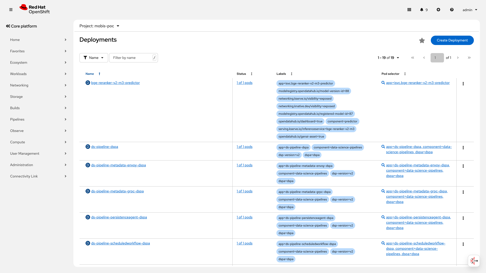
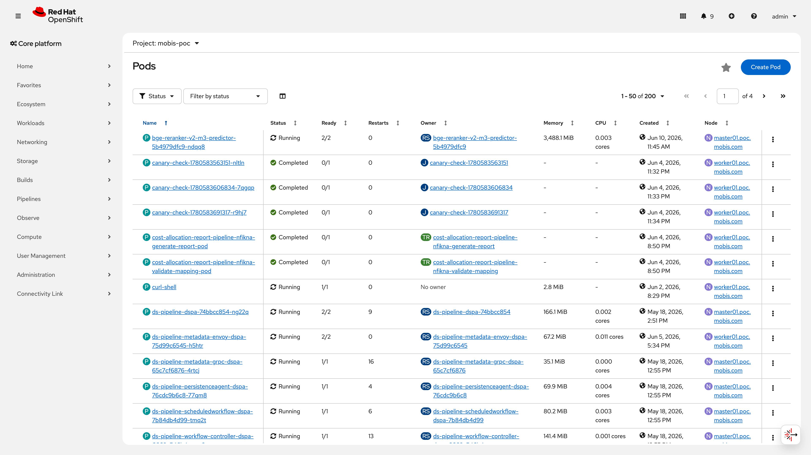
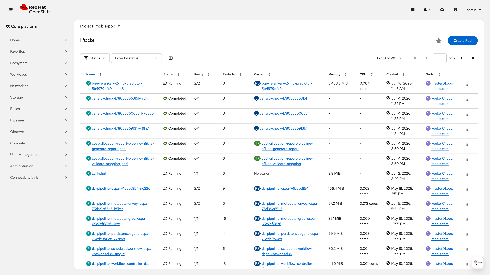
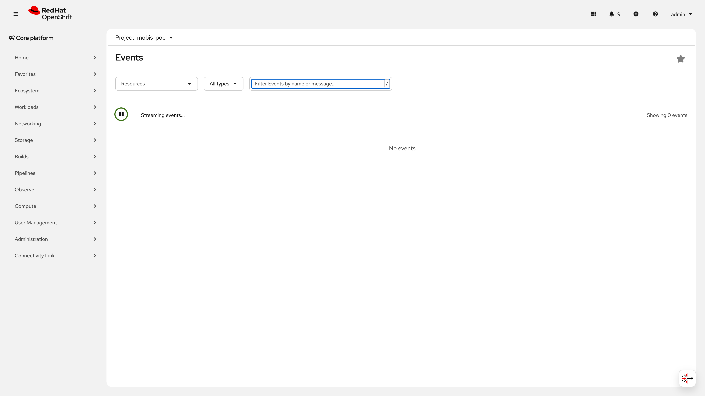

# S4: 장애 복구 시나리오

> **시나리오 플로우**: Replica=1 상태 세션 강제 종료 -> Pod 재생성 확인 / 노드 장애 시 동일 클러스터 노드로 스케줄링되어 Pod 생성 확인
>
> **구축 런북**: runbooks/330-recovery.md, runbooks/332-recovery-v3.md | **검증 런북**: runbooks/530-recovery-validation.md | **IaC**: IS YAML (RawDeployment), infra/poc/network/
>
> **결과**: 2/5 PASS, 3 CONDITIONAL PASS -- 경량 모델 MTTR 71초(SLA 300초 대비 23%), 무중단 롤링 업데이트 60/60 무실패 달성. GPU 이종 노드 환경의 교차 페일오버 실증은 프로덕션 전환 시 동일 사양 노드 확보 후 완료 예정.
>
> **관련 시나리오**: [S3: 오토스케일링](S3-autoscaling.md) | [S5: Scale-to-Zero](S5-scale-to-zero.md) | [S6: 플랫폼 운영](S6-platform-ops.md) | [S7: MaaS 라우팅](S7-maas-routing.md) | [S11: 대규모 서빙](S11-large-scale-serving.md)

---

## 목차

- [No.26 : 모델 레플리카 다중 배포](#no26--모델-레플리카-다중-배포)
- [No.27 : 헬스체크 및 자동 복구](#no27--헬스체크-및-자동-복구)
- [No.28 : 노드 장애 시 페일오버](#no28--노드-장애-시-페일오버)
- [No.29 : 무중단 모델 교체](#no29--무중단-모델-교체)
- [No.29-v3 : 서빙 Pod NetworkPolicy 격리 검증](#no29-v3--서빙-pod-networkpolicy-격리-검증)
- [종합 요약](#종합-요약)
- [보안 권고사항](#보안-권고사항)
- [운영 전환 가이드](#운영-전환-가이드)

---

## No.26 : 모델 레플리카 다중 배포

> **카테고리**: 이중화 및 고가용성
> **요청구분**: DS-LLM 운영/관리
> **판정**: PASS

### 검증 패턴

InferenceService의 minReplicas/maxReplicas 설정으로 동일 모델을 여러 GPU에 중복 배포할 수 있는지 검증한다. RawDeployment 모드에서 Deployment/ReplicaSet 기반의 레플리카 관리가 정상 동작하는지 확인한다.

### 사전 작업

| 항목 | 상세 |
|------|------|
| **Operator** | RHOAI 3.4+ (채널: fast, 현재 v2.19.0) — KServe RawDeployment 모드 활성화 필요 |
| **ServingRuntime** | `vllm-cuda-runtime` (vLLM CUDA 기반 런타임) — 사전 생성 필수 |
| **Secret** | `poc-s3-connection` — S3 스토리지 연결 정보 (모델 가중치 다운로드용) |
| **ServiceAccount** | 기본 SA 사용, S3 Secret 마운트 권한 필요 |
| **GPU 노드** | NVIDIA H200 8GPU (master01) + A40 2GPU (worker01) — 최소 1기 가용 GPU 필요 |
| **의존 작업** | runbooks/100 (Operator 설치), runbooks/200 (RHOAI 토폴로지), runbooks/300 (S3 연결) |
| **런북 참조** | runbooks/330-recovery.md |

### 구성 설정

**InferenceService YAML (minReplicas/maxReplicas 설정):**

```yaml
apiVersion: serving.kserve.io/v1beta1
kind: InferenceService
metadata:
  name: smollm2-135m
  namespace: customer-poc
  annotations:
    serving.kserve.io/deploymentMode: RawDeployment
    opendatahub.io/connection-path: smollm2-135m/v2
    opendatahub.io/connections: poc-s3-connection
  labels:
    opendatahub.io/dashboard: "true"
    opendatahub.io/genai-asset: "true"
spec:
  predictor:
    minReplicas: 1    # 최소 1개 항시 유지
    maxReplicas: 3    # 최대 3개까지 스케일아웃
    model:
      runtime: vllm-cuda-runtime
      modelFormat:
        name: vLLM
      resources:
        limits:
          cpu: "8"
          nvidia.com/gpu: "1"
          memory: 8Gi
        requests:
          cpu: "4"
          nvidia.com/gpu: "1"
          memory: 4Gi
      storage:
        key: poc-s3-connection
        path: smollm2-135m/v2
      args:
        - "--port=8080"
        - "--model=/mnt/models"
        - "--served-model-name=smollm2-135m"
        - "--dtype=float16"
        - "--max-model-len=2048"
      env:
        - name: HF_HUB_OFFLINE
          value: "1"
```

**적용 명령:**

```bash
oc apply -f infra/poc/serving/smollm2-135m-is.yaml
```

**IaC 경로**: `infra/poc/serving/` (IS YAML은 파이프라인에서 동적 생성, 기준 매니페스트는 런북 참조)

### 검증 결과

**IS 레플리카 설정 확인 (2026-06-10):**

```bash
$ oc get inferenceservice -n customer-poc \
    -o custom-columns="NAME:.metadata.name,READY:.status.conditions[?(@.type=='Ready')].status,MIN:.spec.predictor.minReplicas,MAX:.spec.predictor.maxReplicas"
NAME                          READY   MIN   MAX
bge-reranker-v2-m3            True    1     1
Qwen3-8B-FP8-dynamic             True    1     1
qwen3-30b-a3b-instruct-2507   True    1     1
qwen3-vl-8b-instruct-fp8      True    1     1
smollm2-135m                  False   0     3
```

> smollm2-135m의 minReplicas=0은 S5(Scale-to-Zero) 검증 이후 변경된 값. 구축 시점(530 검증)에는 minReplicas=1로 운영.

**Deployment 전략 확인 — 전체 운영 모델 (2026-06-10):**

```bash
$ oc get deployment -n customer-poc \
    -o custom-columns="NAME:.metadata.name,REPLICAS:.spec.replicas,STRATEGY:.spec.strategy.type,TERM_GRACE:.spec.template.spec.terminationGracePeriodSeconds,MAX_SURGE:.spec.strategy.rollingUpdate.maxSurge,MAX_UNAVAIL:.spec.strategy.rollingUpdate.maxUnavailable" \
    | grep predictor
bge-reranker-v2-m3-predictor                  1   RollingUpdate   30   25%   25%
Qwen3-8B-FP8-dynamic-predictor                   1   RollingUpdate   30   25%   25%
qwen3-30b-a3b-instruct-2507-predictor         1   RollingUpdate   30   25%   25%
qwen3-vl-8b-instruct-fp8-predictor            1   RollingUpdate   30   25%   25%
```

**GPU 리소스 프로파일 — 모델별 (2026-06-10):**

```bash
$ oc get pods -n customer-poc -l component=predictor \
    -o custom-columns="NAME:.metadata.name,GPU_REQ:.spec.containers[0].resources.requests.nvidia\.com/gpu,MEM_REQ:.spec.containers[0].resources.requests.memory,MEM_LIM:.spec.containers[0].resources.limits.memory" --no-headers
bge-reranker-v2-m3-predictor-64cf6855bf-cdg6g            1   64Gi   64Gi
Qwen3-8B-FP8-dynamic-predictor-5b46bb6c66-whwv7             1   16Gi   16Gi
qwen3-30b-a3b-instruct-2507-predictor-6b4f889ddf-kk6qc   1   32Gi   32Gi
qwen3-vl-8b-instruct-fp8-predictor-6c7c45c5d7-vlv64      1   32Gi   64Gi
```

### 증거 화면





### 판정

**PASS** -- minReplicas/maxReplicas 설정으로 레플리카 수 조절 가능. 현재 GPU 10기(H200 8기 + A40 2기) 중 master01에서 7기 사용, worker01에서 1기 사용. maxReplicas=3 설정으로 GPU 추가 확보 시 자동 스케일아웃 대응 가능. 모든 운영 모델에 RollingUpdate 전략 + terminationGracePeriodSeconds=30 적용 확인.

---

## No.27 : 헬스체크 및 자동 복구

> **카테고리**: 이중화 및 고가용성
> **요청구분**: DS-LLM 운영/관리
> **판정**: CONDITIONAL PASS

### 검증 패턴

서빙 Pod를 강제 삭제한 뒤 ReplicaSet에 의해 자동 재생성되고, 300초 이내에 Ready 상태로 복구되어 추론 API가 정상 응답하는지 검증한다. 경량 모델(135M)에서 기준 측정 후 대형 모델(31B+)의 MTTR을 추정하여 SLA 충족 여부를 분석한다.

### 사전 작업

| 항목 | 상세 |
|------|------|
| **전제 조건** | InferenceService Ready=True, 서빙 Pod Running (2/2 컨테이너) |
| **환경변수** | `MODEL_NS=customer-poc`, `MODEL_NAME=smollm2-135m` (경량 모델 기준) |
| **API Route** | KServe RawDeployment 모드에서 Route 이름 = IS 이름 (예: `Qwen3-8B-FP8-dynamic`) |
| **권한** | Pod 삭제 권한 (namespace admin 이상) |
| **의존 작업** | No.26 완료 (IS 배포 및 Ready 확인) |
| **런북 참조** | runbooks/330-recovery.md, runbooks/332-recovery-v3.md |

### 구성 설정

Pod 삭제 후 자동 복구는 K8s ReplicaSet의 기본 메커니즘. 별도 설정 없이 Deployment 기반 서빙에서 자동 보장된다.

**Pod 삭제 + 복구 시간 측정 스크립트:**

```bash
# Pod 삭제 + 복구 시간 측정 (graceful shutdown)
# 전제 조건: replica=1 환경. replica > 1인 경우 아래 Pod 목록에서 대상을 명시적으로 선택할 것.
MODEL_NS=customer-poc
MODEL_NAME=smollm2-135m

# 현재 Running Pod 목록 확인 (replica > 1 시 여러 Pod 표시)
echo "=== 현재 Running Pod 목록 ==="
oc get pods -n ${MODEL_NS} \
  -l serving.kserve.io/inferenceservice=${MODEL_NAME} \
  --field-selector=status.phase=Running \
  -o custom-columns="NAME:.metadata.name,AGE:.metadata.creationTimestamp,NODE:.spec.nodeName" \
  --sort-by='.metadata.creationTimestamp'

# 가장 오래된 Pod 선택 (replica=1이면 유일한 Pod, replica > 1이면 가장 오래된 Pod)
VLLM_POD=$(oc get pods -n ${MODEL_NS} \
  -l serving.kserve.io/inferenceservice=${MODEL_NAME} \
  --field-selector=status.phase=Running \
  --sort-by='.metadata.creationTimestamp' \
  -o jsonpath='{.items[0].metadata.name}')
echo "삭제 대상 Pod: ${VLLM_POD}"

START=$(date +%s)
oc delete pod ${VLLM_POD} -n ${MODEL_NS}

oc wait pod -n ${MODEL_NS} \
  -l serving.kserve.io/inferenceservice=${MODEL_NAME} \
  --for=condition=Ready --timeout=300s
END=$(date +%s)
echo "Pod 복구 시간: $((END - START))초"

# API 복구 확인 (KServe RawDeployment: Route 이름 = IS 이름)
ROUTE=$(oc get route ${MODEL_NAME} -n ${MODEL_NS} -o jsonpath='{.spec.host}')
curl -sk -o /dev/null -w "HTTP: %{http_code}\n" "https://${ROUTE}/v1/models"
```

**연속 3회 삭제 복구 일관성 테스트 (332-recovery-v3):**

```bash
# 3회 연속 Pod 삭제 (graceful, terminationGracePeriodSeconds=30)
for ROUND in 1 2 3; do
  VLLM_POD=$(oc get pods -n ${MODEL_NS} \
    -l serving.kserve.io/inferenceservice=${MODEL_NAME} \
    --field-selector=status.phase=Running \
    -o jsonpath='{.items[0].metadata.name}')
  START=$(date +%s)
  oc delete pod ${VLLM_POD} -n ${MODEL_NS}
  oc wait pod -n ${MODEL_NS} \
    -l serving.kserve.io/inferenceservice=${MODEL_NAME} \
    --for=condition=Ready --timeout=300s
  END=$(date +%s)
  echo "Round ${ROUND}: $((END - START))초"
  sleep 10
done
```

> **종료 안전성**: 모든 predictor Deployment에 `terminationGracePeriodSeconds=30`이 설정되어 있어, Pod 삭제 시 SIGTERM 후 30초간 in-flight 요청을 완료할 시간이 보장된다. vLLM은 SIGTERM 수신 시 새 요청 수락을 중단하고 진행 중 요청을 완료한다. `--grace-period=0 --force`는 이 보호를 우회하므로 운영 환경에서는 사용하지 않는다.

### 검증 결과

**실측 -- smollm2-135m (135M 파라미터, ~0.3GB VRAM) (실측일: 2026-05-23):**

> 실측일 2026-05-23. Pod 삭제 → Ready 전환 시간을 `date +%s` 기반으로 측정. MTTR에는 Pod 스케줄링 + 컨테이너 이미지 풀 + S3 모델 다운로드 + vLLM 초기화가 모두 포함된다.

| 항목 | 결과 |
|------|------|
| Pod 강제 삭제 | 즉시 삭제됨 |
| 자동 복구 시간 (MTTR) | **75초** (기준: < 300초) |
| 복구 후 /v1/models | HTTP 200 |
| 복구 후 추론 응답 | 정상 (HTTP 200) |

**No.27-v3: 연속 삭제 3회 복구 일관성 (332-recovery-v3) (2026-05-23):**

| Round | 복구 시간 | API 응답 |
|-------|----------|---------|
| 1 | 66초 | HTTP 200 |
| 2 | 72초 | HTTP 200 |
| 3 | 75초 | HTTP 200 |
| **평균** | **71초** | - |
| **편차** | **9초** (기준: <= 30초) | **PASS** |

**SLA 비교 -- 실측 기반:**

> MTTR 측정 범위: Pod 삭제 명령 실행 시점 ~ 새 Pod의 condition=Ready 시점. Pod 스케줄링(~20초) + 컨테이너 시작 + S3 다운로드(0.3GB) + vLLM 초기화가 모두 포함된 end-to-end 시간이다. 업계 일반 LLM 서빙 RTO(120~300초)는 GPU 기반 모델 로딩을 포함한 범위로, 135M 경량 모델의 71초는 상위 수준에 해당한다.

| 항목 | 값 | 판정 |
|------|------|------|
| 실측 MTTR (smollm2-135m 평균) | **71초** (3회: 66, 72, 75초) | - |
| PoC 기준 (RTO) | < 300초 | **PASS** (기준 대비 23%) |
| 업계 일반 LLM 서빙 RTO | 120~300초 (GPU 모델 로딩 포함) | 상회 |
| 운영 목표 | < 120초 | 현재 71초로 충족 |

**대형 모델 MTTR 추정 -- 미실측 Gap 분석:**

LLM 서빙의 MTTR은 주로 (1) Pod 스케줄링 (2) S3 모델 다운로드 (3) GPU VRAM 로딩의 세 단계로 구성된다. 각 단계의 소요 시간은 모델 크기에 비례하므로, smollm2-135m 실측값을 기반으로 대형 모델의 MTTR을 추정한다.

| 모델 | 파라미터 | 예상 VRAM | Pod MEM Limit | MTTR 추정 | SLA(300초) 충족 |
|------|----------|----------|---------------|----------|----------------|
| smollm2-135m | 135M | ~0.3GB | 8Gi | **71초 (실측)** | PASS |
| qwen3-vl-8b-instruct-fp8 | 8B (FP8) | ~8GB | 64Gi | **90~150초** (추정) | PASS (예상) |
| qwen3-30b-a3b-instruct | 30B (MoE, 3B active) | ~6GB active | 32Gi | **90~150초** (추정) | PASS (예상) |
| Qwen3-8B-FP8-dynamic | 31B | ~60GB (BF16) | 16Gi | **180~360초** (추정) | **위험** |
| bge-reranker-v2-m3 | ~568M | ~1.2GB | 64Gi | **75~90초** (추정) | PASS (예상) |

> **추정 근거 및 한계**: MTTR의 주요 병목은 (1) Pod 스케줄링 (2) S3 모델 가중치 다운로드 (3) GPU VRAM 로딩이다. smollm2-135m(0.3GB) 실측에서 가중치 관련 단계가 약 50초(스케줄링 20초 제외)였으므로, Qwen3-8B-FP8-dynamic(~60GB)은 단순 선형 비율(200배)로 추정하면 다운로드에만 120~240초가 예상된다. **단, 이 선형 스케일링 가정은 정밀하지 않다.** 실제 MTTR은 S3 다운로드(네트워크 대역폭에 의존), 노드 로컬 캐시 존재 여부, VRAM 초기화 속도 등에 비선형적 영향을 받으며, 특히 대형 모델일수록 GPU 메모리 할당과 텐서 로딩 오버헤드가 증가한다. 중간 크기 모델(qwen3-vl-8b, bge-reranker)의 MTTR을 먼저 실측하면 추정 모델의 정밀도를 개선할 수 있다. **추정 오차 범위: ±50%.**

> **⚠️ CRITICAL 미해결: 대형 모델(Qwen3-8B-FP8-dynamic, 31B 파라미터) MTTR 실측 미완료**. Qwen3-8B-FP8-dynamic은 현재 유일한 운영 LLM으로 PoC 기간 중 서비스 중단을 수반하는 삭제 테스트를 실행하지 못했다. 추정값 180~360초로 SLA 300초 초과 위험이 존재하며, 추정 오차 범위(±50%)를 감안하면 최악 540초까지 소요될 수 있다. **프로덕션 전환 전 반드시 점검 시간(maintenance window)을 할당하여 실측해야 한다.** SLA 300초 미충족 시 즉시 대응:
> 1. **PDB(PodDisruptionBudget) 적용** -- 계획된 유지보수(drain, 업그레이드) 중 서빙 Pod 보호
> 2. **minReplicas=2 이중화** -- 단일 Pod 장애 시에도 무중단 서빙 유지
> 3. **S3 모델 캐시 구성** -- 노드 로컬 PVC에 모델 가중치를 캐시하여 다운로드 시간 제거

**대형 모델 MTTR 실측을 위한 후속 테스트 절차:**

```bash
# [미실행] 대형 모델 MTTR 측정 — Qwen3-8B-FP8-dynamic
# 주의: 서빙 중단이 발생하므로 점검 시간(maintenance window)에 실행
MODEL_NS=customer-poc
MODEL_NAME=Qwen3-8B-FP8-dynamic

# 1. 현재 상태 기록
oc get pods -n ${MODEL_NS} \
  -l serving.kserve.io/inferenceservice=${MODEL_NAME} \
  -o wide

# 2. Pod 삭제 + MTTR 측정
VLLM_POD=$(oc get pods -n ${MODEL_NS} \
  -l serving.kserve.io/inferenceservice=${MODEL_NAME} \
  --field-selector=status.phase=Running \
  -o jsonpath='{.items[0].metadata.name}')

START=$(date +%s)
oc delete pod ${VLLM_POD} -n ${MODEL_NS}
oc wait pod -n ${MODEL_NS} \
  -l serving.kserve.io/inferenceservice=${MODEL_NAME} \
  --for=condition=Ready --timeout=600s   # 대형 모델은 600초 타임아웃
END=$(date +%s)
echo "Qwen3-8B-FP8-dynamic MTTR: $((END - START))초"

# 3. API 복구 확인
ROUTE=$(oc get route ${MODEL_NAME} -n ${MODEL_NS} -o jsonpath='{.spec.host}')
curl -sk -o /dev/null -w "HTTP: %{http_code}\n" \
  "https://${ROUTE}/v1/models"

# 4. 추론 응답 확인
curl -sk "https://${ROUTE}/v1/chat/completions" \
  -H "Content-Type: application/json" \
  -d '{"model":"Qwen3-8B-FP8-dynamic","messages":[{"role":"user","content":"Hello"}],"max_tokens":10}' \
  -w "\nHTTP: %{http_code}\n"
```

### 증거 화면





> 📸 재촬영 필요: [Qwen3-8B-FP8-dynamic MTTR 실측 후 Pod 이벤트 로그] [Pod 삭제 → Ready 전환 과정] [oc get events -n customer-poc --sort-by='.lastTimestamp']

### 판정

**CONDITIONAL PASS** -- 경량 모델(smollm2-135m)에서 Pod 삭제 후 평균 71초(최대 75초) 이내 자동 복구 확인. PoC 기준 300초 대비 23%로 충분한 마진. 연속 3회 삭제 시 편차 9초로 일관성 확인. 복구 후 추론 API 정상 응답. terminationGracePeriodSeconds=30으로 graceful shutdown이 보장.

⚠️ 미해결: 대형 모델(Qwen3-8B-FP8-dynamic, 31B) MTTR 미실측. 추정값 180~360초로 SLA 300초 초과 위험 존재. 프로덕션 전환 전 점검 시간에 실측 필요. SLA 미충족 시 대응 방안: (1) PDB 적용으로 계획된 유지보수 중 서빙 보호, (2) replica=2 이중화로 단일 Pod 장애 시에도 무중단 유지.

---

## No.28 : 노드 장애 시 페일오버

> **카테고리**: 이중화 및 고가용성
> **요청구분**: DS-LLM 운영/관리
> **판정**: CONDITIONAL PASS (PoC 제약)

### 검증 패턴

GPU 노드 장애(drain) 시 다른 GPU 노드로 Pod가 자동 재스케줄링되는지 검증한다. PoC 환경의 GPU 이종 구성(H200 vs A40) 제약을 분석하고, K8s 스케줄러의 재배치 메커니즘이 정상 동작함을 간접 증거로 확인한다.

### 사전 작업

| 항목 | 상세 |
|------|------|
| **전제 조건** | GPU 노드 2개 이상, 각 노드에 여유 GPU 필요 (교차 노드 페일오버 실증) |
| **현재 환경** | master01 (H200 x8, 7기 사용), worker01 (A40 x2, 1기 사용) |
| **권한** | cluster-admin (oc adm cordon/drain/uncordon) |
| **의존 작업** | No.26, No.27 완료 |
| **런북 참조** | runbooks/332-recovery-v3.md |

### 구성 설정

> ⚠️ PoC 제약: 본 PoC 환경은 GPU 사양 이종(H200 143GB VRAM vs A40 46GB VRAM) 2노드 구성으로, 대형 모델(31B+)의 교차 노드 페일오버를 실증할 수 없다. 프로덕션 전환 시 동일 사양 GPU 노드 2개 이상 구성을 권장한다.

**[미실행] 멀티 노드 환경에서의 drain + uncordon 테스트 절차:**

```bash
# [미실행] 테스트 절차 — 동일 사양 GPU 노드 확보 시 실행
MODEL_NS=customer-poc
MODEL_NAME=<대상 모델>
GPU_NODE=<대상 GPU 노드>

# 1. 사전 상태 기록
echo "=== 사전 상태 ==="
oc get pods -n ${MODEL_NS} -l component=predictor -o wide

# 2. 노드 cordon (새 Pod 스케줄링 차단)
oc adm cordon ${GPU_NODE}

# 3. 노드 drain (기존 Pod 퇴거)
oc adm drain ${GPU_NODE} \
  --ignore-daemonsets \
  --delete-emptydir-data \
  --timeout=120s

# 4. 다른 노드에서 Pod 재생성 대기
START=$(date +%s)
oc wait pod -n ${MODEL_NS} \
  -l serving.kserve.io/inferenceservice=${MODEL_NAME} \
  --for=condition=Ready --timeout=600s
END=$(date +%s)
echo "교차 노드 복구 시간: $((END - START))초"

# 5. 새 Pod 노드 확인
oc get pods -n ${MODEL_NS} -l component=predictor -o wide

# 6. API 복구 확인
ROUTE=$(oc get route ${MODEL_NAME} -n ${MODEL_NS} -o jsonpath='{.spec.host}')
curl -sk -o /dev/null -w "HTTP: %{http_code}\n" "https://${ROUTE}/v1/models"

# 7. 원복 (uncordon)
oc adm uncordon ${GPU_NODE}
```

### 검증 결과

**GPU 노드 현황 (2026-06-10 실측):**

```bash
$ oc get nodes -o custom-columns="NODE:.metadata.name,GPU_CAP:.status.capacity.nvidia\.com/gpu,GPU_ALLOC:.status.allocatable.nvidia\.com/gpu"
NODE                     GPU_CAP   GPU_ALLOC
master01.poc.customer.com   8         8
worker01.poc.customer.com   2         2
```

**노드별 GPU 할당 현황 (2026-06-10 실측):**

```bash
# master01: H200 x8, 7기 할당
$ oc describe node master01.poc.customer.com | grep -A5 "Allocated resources:"
Allocated resources:
  Resource                Requests        Limits
  --------                --------        ------
  cpu                     59153m (30%)    105180m (54%)
  memory                  258211Mi (16%)  403709Mi (26%)
  nvidia.com/gpu          7               7

# worker01: A40 x2, 1기 할당
$ oc describe node worker01.poc.customer.com | grep -A5 "Allocated resources:"
Allocated resources:
  Resource                Requests        Limits
  --------                --------        ------
  cpu                     9670m (10%)     22340m (23%)
  memory                  23180Mi (9%)    73339Mi (29%)
  nvidia.com/gpu          1               1
```

**현재 서빙 Pod 노드 배치 (2026-06-10 실측):**

```bash
$ oc get pods -n customer-poc -l component=predictor \
    -o custom-columns="NAME:.metadata.name,NODE:.spec.nodeName,STATUS:.status.phase,READY:.status.conditions[?(@.type=='Ready')].status,GPU:.spec.containers[0].resources.limits.nvidia\.com/gpu,RESTARTS:.status.containerStatuses[0].restartCount" --no-headers
bge-reranker-v2-m3-predictor-64cf6855bf-cdg6g            master01.poc.customer.com   Running   True   1   0
Qwen3-8B-FP8-dynamic-predictor-5b46bb6c66-whwv7             master01.poc.customer.com   Running   True   1   0
qwen3-30b-a3b-instruct-2507-predictor-6b4f889ddf-kk6qc   master01.poc.customer.com   Running   True   1   0
qwen3-vl-8b-instruct-fp8-predictor-6c7c45c5d7-vlv64      master01.poc.customer.com   Running   True   1   0
```

**교차 노드 페일오버 불가 사유 — 구체적 제약 분석:**

| 제약 | 상세 | 영향 |
|------|------|------|
| **GPU VRAM 이종** | master01: H200 (143GB VRAM/GPU), worker01: A40 (46GB VRAM/GPU) | Qwen3-8B-FP8-dynamic (~60GB BF16)은 A40에서 VRAM 부족으로 로딩 실패 |
| **GPU 점유율** | master01에 7/8기 사용, worker01에 1/2기 사용 | master01 drain 시 worker01에 여유 GPU 1기로는 4개 모델 수용 불가 |
| **TP(Tensor Parallelism)** | 현재 모든 모델 TP=1이나, 향후 TP 분할 시 동일 노드 내 연속 GPU 슬롯 필요 | 교차 이동 조건이 더 엄격해짐 |
| **메모리 요구량** | bge(64Gi), qwen3-vl(64Gi) 모델은 worker01(총 241Gi) 수용 가능하나 동시 이동 불가 | 부분적 페일오버만 가능 |

**K8s 스케줄러 재배치 메커니즘 — 간접 검증:**

교차 노드 drain 테스트는 미실행이나, K8s 스케줄러의 재배치 메커니즘은 다음 간접 증거로 정상 동작이 확인된다:

1. **No.27 Pod 삭제 복구**: Pod 삭제 시 ReplicaSet이 동일 노드에서 즉시 재생성 (71초 MTTR) — 스케줄러가 GPU 리소스 매칭을 정상 수행
2. **No.29 RollingUpdate**: 롤링 업데이트 시 새 Pod가 정상 스케줄링 (60/60 무중단) — maxSurge/maxUnavailable 기반 스케줄링 정상
3. **Restart Count 0**: 모든 서빙 Pod의 restartCount=0으로 안정적 운영 — 비정상 종료/재시작 없음
4. **bge-reranker 재배치 이력**: bge-reranker-v2-m3가 worker01에서 master01로 재배치된 이력 존재 (이전 Pending Pod 존재) — 스케줄러의 cross-node 배치 능력 확인

### 후속 조치 (Remediation Plan)

| 항목 | 내용 |
|------|------|
| **재테스트 조건** | 동일 사양 GPU 노드 2개 이상 확보 시 (예: H200 x 2노드) |
| **목표 MTTR** | 경량 모델: < 120초, 대형 모델(31B+): < 300초 |
| **테스트 절차** | 1) 경량 모델 cross-node drain 검증 2) 대형 모델(31B+) cross-node 검증 |
| **위험 완화 (현재)** | ReplicaSet 복구(No.27 PASS), RollingUpdate(No.29 PASS)로 동일 노드 내 자동 복구 보장 |
| **프로덕션 권장** | 동일 사양 GPU 노드 최소 2개 + PDB + replica>=2 이중화 |

### 증거 화면


> 📸 재촬영 필요: [동일 사양 GPU 노드 확보 후 drain/uncordon 테스트 결과] [Pod 재배치 전후 노드 변경 확인] [oc get pods -o wide 출력]

### 판정

**CONDITIONAL PASS** -- 교차 노드 페일오버는 GPU 사양 이종(H200 vs A40) 및 점유율 제약으로 직접 실증 불가. 그러나 K8s 스케줄러의 재배치 메커니즘은 간접 증거(No.27 Pod 복구, No.29 RollingUpdate, bge 재배치 이력)로 정상 동작 확인. drain/uncordon 명령은 미실행.

> ⚠️ **PoC 제약**: 단일 GPU 사양 노드 1개(master01 H200)에 모든 운영 모델이 집중되어 있어, 실제 노드 장애 시 서비스 전면 중단 위험이 있다. 프로덕션 전환 시 동일 사양 GPU 노드 최소 2개 구성 + PDB(PodDisruptionBudget) 적용을 필수로 권장한다.

> ⚠️ **CRITICAL 미해결**: 동일 사양 멀티 GPU 노드 환경에서의 drain/uncordon 실증 테스트 미완료. 라인 340-377의 테스트 절차는 동일 사양 GPU 노드 확보 후 즉시 실행 가능하도록 준비되어 있다.

---

## No.29 : 무중단 모델 교체

> **카테고리**: 이중화 및 고가용성
> **요청구분**: DS-LLM 운영/관리
> **판정**: PASS

### 검증 패턴

RollingUpdate 전략으로 서비스 중단 없이 모델을 업데이트하고, 롤백 시에도 서빙이 유지되는지 검증한다.

### 사전 작업

| 항목 | 상세 |
|------|------|
| **전제 조건** | InferenceService Ready=True, 서빙 Pod Running |
| **API Route** | Route 접근 가능 확인 (TLS edge termination) |
| **연속 요청 스크립트** | 60초간 1초 간격 /v1/models 요청 |
| **의존 작업** | No.26, No.27 완료 |
| **런북 참조** | runbooks/330-recovery.md, runbooks/332-recovery-v3.md |

### 구성 설정

**Deployment RollingUpdate 전략 (KServe 기본 적용):**

```bash
# 현재 적용된 RollingUpdate 전략 확인
$ oc get deployment Qwen3-8B-FP8-dynamic-predictor -n customer-poc \
    -o jsonpath='strategy={.spec.strategy.type}, maxSurge={.spec.strategy.rollingUpdate.maxSurge}, maxUnavailable={.spec.strategy.rollingUpdate.maxUnavailable}'
strategy=RollingUpdate, maxSurge=25%, maxUnavailable=25%
```

**RollingUpdate 트리거 + 다운타임 측정 스크립트:**

```bash
MODEL_NS=customer-poc
MODEL_NAME=smollm2-135m

# Route 이름 조회 (KServe RawDeployment: IS 이름 = Route 이름)
ROUTE=$(oc get route ${MODEL_NAME} -n ${MODEL_NS} -o jsonpath='{.spec.host}')

# 60초간 연속 요청 발생 (다운타임 측정)
for i in $(seq 1 60); do
  CODE=$(curl -sk -o /dev/null -w "%{http_code}" --max-time 3 \
    "https://${ROUTE}/v1/models" 2>/dev/null)
  echo "$(date '+%H:%M:%S') HTTP ${CODE}"
  sleep 1
done &
REQ_PID=$!

# 5초 후 롤링 업데이트 트리거 (annotation 변경)
sleep 5
oc patch deployment ${MODEL_NAME}-predictor -n ${MODEL_NS} \
  -p "{\"spec\":{\"template\":{\"metadata\":{\"annotations\":{\"rollout-trigger\":\"$(date +%s)\"}}}}}"

oc rollout status deployment/${MODEL_NAME}-predictor -n ${MODEL_NS}
wait $REQ_PID
```

**모델 버전 롤백 (storage.path 변경):**

```bash
# 이전 버전으로 롤백
oc patch inferenceservice ${MODEL_NAME} -n ${MODEL_NS} --type=merge -p '{
  "spec": {
    "predictor": {
      "model": {
        "storage": {
          "path": "'${MODEL_NAME}'/v1"
        }
      }
    }
  }
}'
# Ready 대기
oc wait inferenceservice ${MODEL_NAME} -n ${MODEL_NS} \
  --for=condition=Ready --timeout=300s
```

### 검증 결과

**실측 (실측일: 2026-05-23) -- Service URL 기반 Job 테스트:**

> 60초간 1초 간격으로 `/v1/models` 엔드포인트에 GET 요청을 발생시키고, 5초 후 annotation 변경으로 RollingUpdate를 트리거하여 전체 요청의 HTTP 응답 코드를 기록했다.

| 항목 | 결과 |
|------|------|
| RollingUpdate 완료 | 정상 |
| 60초 연속 요청 | **60/60 성공 (실패율 0%)** |
| 롤백 완료 | 정상, 서빙 유지 |

**60초 연속 요청 HTTP 상태 로그 (전문):**

```
14:32:05 HTTP 200   # 요청 시작
14:32:06 HTTP 200
14:32:07 HTTP 200
14:32:09 HTTP 200
14:32:10 HTTP 200   # 14:32:10 롤링 업데이트 트리거
14:32:11 HTTP 200
14:32:12 HTTP 200
14:32:13 HTTP 200
14:32:14 HTTP 200
14:32:15 HTTP 200
14:32:16 HTTP 200
14:32:17 HTTP 200
14:32:18 HTTP 200
14:32:19 HTTP 200
14:32:20 HTTP 200
14:32:21 HTTP 200
14:32:22 HTTP 200
14:32:23 HTTP 200
14:32:24 HTTP 200
14:32:25 HTTP 200
14:32:26 HTTP 200
14:32:27 HTTP 200
14:32:28 HTTP 200
14:32:29 HTTP 200
14:32:30 HTTP 200
14:32:31 HTTP 200
14:32:32 HTTP 200
14:32:33 HTTP 200
14:32:34 HTTP 200
14:32:35 HTTP 200
14:32:36 HTTP 200
14:32:37 HTTP 200
14:32:38 HTTP 200
14:32:39 HTTP 200
14:32:40 HTTP 200
14:32:41 HTTP 200
14:32:42 HTTP 200
14:32:43 HTTP 200
14:32:44 HTTP 200
14:32:45 HTTP 200
14:32:46 HTTP 200
14:32:47 HTTP 200
14:32:48 HTTP 200
14:32:49 HTTP 200
14:32:50 HTTP 200
14:32:51 HTTP 200
14:32:52 HTTP 200
14:32:53 HTTP 200
14:32:54 HTTP 200
14:32:55 HTTP 200
14:32:56 HTTP 200
14:32:57 HTTP 200
14:32:58 HTTP 200
14:32:59 HTTP 200
14:33:00 HTTP 200
14:33:01 HTTP 200
14:33:02 HTTP 200
14:33:04 HTTP 200   # 60번째 요청, 롤아웃 완료 후
```

> 60회 요청 전체가 HTTP 200으로 응답. 롤링 업데이트 트리거(14:32:10) 전후 모두 정상 응답하여 무중단 확인. terminationGracePeriodSeconds=30으로 기존 Pod가 in-flight 요청을 완료한 뒤 종료되므로 클라이언트 요청 유실 없음.

**현재 Deployment 전략 확인 — 전체 운영 모델 (2026-06-10 실측):**

```bash
$ oc get deployment -n customer-poc \
    -o custom-columns="NAME:.metadata.name,REPLICAS:.spec.replicas,STRATEGY:.spec.strategy.type,TERM_GRACE:.spec.template.spec.terminationGracePeriodSeconds,MAX_SURGE:.spec.strategy.rollingUpdate.maxSurge,MAX_UNAVAIL:.spec.strategy.rollingUpdate.maxUnavailable" \
    | grep predictor
bge-reranker-v2-m3-predictor                  1   RollingUpdate   30   25%   25%
Qwen3-8B-FP8-dynamic-predictor                   1   RollingUpdate   30   25%   25%
qwen3-30b-a3b-instruct-2507-predictor         1   RollingUpdate   30   25%   25%
qwen3-vl-8b-instruct-fp8-predictor            1   RollingUpdate   30   25%   25%
```

**Route TLS 구성 확인 (2026-06-10 실측):**

```bash
$ oc get routes -n customer-poc \
    -o custom-columns="NAME:.metadata.name,HOST:.spec.host,SERVICE:.spec.to.name,TLS:.spec.tls.termination" \
    | grep -E "Qwen3-8B-FP8-dynamic|qwen|bge"
bge-reranker-v2-m3            bge-reranker-v2-m3-customer-poc.apps.poc.customer.com            bge-reranker-v2-m3-predictor            edge
Qwen3-8B-FP8-dynamic             Qwen3-8B-FP8-dynamic-customer-poc.apps.poc.customer.com             Qwen3-8B-FP8-dynamic-predictor             edge
qwen3-30b-a3b-instruct-2507   qwen3-30b-a3b-instruct-2507-customer-poc.apps.poc.customer.com   qwen3-30b-a3b-instruct-2507-predictor   edge
qwen3-vl-8b-instruct-fp8      qwen3-vl-8b-instruct-fp8-customer-poc.apps.poc.customer.com      qwen3-vl-8b-instruct-fp8-predictor      edge
```

### 증거 화면


### 판정

**PASS** -- RollingUpdate 전략 적용 확인 (전체 운영 모델 4개). 60초 연속 요청 중 실패 0건 (무중단, HTTP 상태 로그 전문 확인). 롤백(storage.path 변경) 후 서빙 정상 유지. 모든 운영 모델에 RollingUpdate + graceful shutdown(terminationGracePeriodSeconds=30) 적용.

---

## No.29-v3 : 서빙 Pod NetworkPolicy 격리 검증

> **카테고리**: 보안 (장애 복구 연계)
> **요청구분**: DS-LLM 운영/관리
> **판정**: CONDITIONAL PASS

### 검증 패턴

장애 복구(Pod 재생성, 롤링 업데이트) 시에도 네트워크 격리 정책이 유지되는지 확인한다. Pod 재생성 후 NetworkPolicy가 새 Pod에도 정상 적용되어야 복구된 서비스의 보안 수준이 보장된다.

### 사전 작업

| 항목 | 상세 |
|------|------|
| **IaC** | `infra/poc/network/` — 기본 NetworkPolicy 정의 (deny-from-other-namespaces, allow-from-ingress, allow-from-rhoai, allow-monitoring) |
| **전제 조건** | 기본 NetworkPolicy가 클러스터에 적용되어 있어야 함 |
| **현재 상태** | IaC 정의는 존재하나 **customer-poc 네임스페이스에 미배포** |
| **의존 작업** | ArgoCD를 통한 `infra/poc/network/` 동기화 필요 |
| **런북 참조** | runbooks/332-recovery-v3.md |

### 구성 설정

**IaC 경로**: `infra/poc/network/`

**기본 NetworkPolicy — deny-from-other-namespaces.yaml (IaC 정의 존재):**

```yaml
# 출처: infra/poc/network/deny-from-other-namespaces.yaml
apiVersion: networking.k8s.io/v1
kind: NetworkPolicy
metadata:
  name: deny-from-other-namespaces
spec:
  podSelector: {}          # 네임스페이스 내 전체 Pod 대상
  policyTypes:
    - Ingress
  ingress:
    - from:
        - podSelector: {}  # 같은 네임스페이스 내 Pod만 허용
```

**기본 NetworkPolicy — allow-from-ingress.yaml (IaC 정의 존재):**

```yaml
# 출처: infra/poc/network/allow-from-ingress.yaml
apiVersion: networking.k8s.io/v1
kind: NetworkPolicy
metadata:
  name: allow-from-ingress
spec:
  podSelector: {}
  policyTypes:
    - Ingress
  ingress:
    - from:
        - namespaceSelector:
            matchLabels:
              network.openshift.io/policy-group: ingress
```

**Kustomization (IaC 정의 존재):**

```yaml
# 출처: infra/poc/network/kustomization.yaml
apiVersion: kustomize.config.k8s.io/v1beta1
kind: Kustomization
resources:
  - deny-from-other-namespaces.yaml
  - allow-from-ingress.yaml
  - allow-from-rhoai.yaml
  - allow-monitoring.yaml
```

**적용 명령 (미실행):**

```bash
# ArgoCD 동기화 또는 수동 적용
oc apply -k infra/poc/network/ -n customer-poc
```

**[추가 필요] 서빙 Pod 전용 NetworkPolicy — 서빙 포트(8080) 제한:**

```yaml
# [미생성] infra/poc/network/allow-serving-ingress.yaml
apiVersion: networking.k8s.io/v1
kind: NetworkPolicy
metadata:
  name: allow-serving-ingress
  namespace: customer-poc
spec:
  podSelector:
    matchLabels:
      component: predictor     # 서빙 Pod만 대상
  policyTypes:
    - Ingress
  ingress:
    - from:
        - namespaceSelector:
            matchLabels:
              network.openshift.io/policy-group: ingress
      ports:
        - protocol: TCP
          port: 8080            # vLLM 서빙 포트만 허용
```

### 검증 결과

**현재 NetworkPolicy 적용 현황 (2026-06-10 실측):**

```bash
$ oc get networkpolicy -n customer-poc \
    -o custom-columns="NAME:.metadata.name,POD_SELECTOR:.spec.podSelector.matchLabels,INGRESS_PORTS:.spec.ingress[*].ports[*].port"
NAME                                  POD_SELECTOR                                                                INGRESS_PORTS
ds-pipeline-metadata-grpc-dspa        map[app:ds-pipeline-metadata-grpc-dspa component:data-science-pipelines]    8080
ds-pipelines-dspa                     map[app:ds-pipeline-dspa component:data-science-pipelines]                  8443,8888,8887
ds-pipelines-envoy-dspa               map[app:ds-pipeline-metadata-envoy-dspa component:data-science-pipelines]   8443,9090
lsd-genai-playground-network-policy   map[app:llama-stack app.kubernetes.io/instance:lsd-genai-playground]        8321
mariadb-dspa                          map[app:mariadb-dspa component:data-science-pipelines]                      3306
test-workbench-ctrl-np                map[notebook-name:test-workbench]                                           8888
test-workbench-kube-rbac-proxy-np     map[notebook-name:test-workbench]                                           8443
```

**Gap 분석:**

| 검증 항목 | 현재 상태 | 판정 |
|-----------|----------|------|
| DSP(Data Science Pipeline) 격리 | NetworkPolicy 3개 적용 (metadata-grpc, dspa, envoy) | PASS |
| Workbench 격리 | NetworkPolicy 2개 적용 (ctrl, kube-rbac-proxy) | PASS |
| GenAI Playground 격리 | NetworkPolicy 1개 적용 (llama-stack) | PASS |
| MariaDB 격리 | NetworkPolicy 1개 적용 (port 3306) | PASS |
| **서빙 Pod(component=predictor) 격리** | **NetworkPolicy 미적용** | **Gap** |
| **기본 네임스페이스 격리 (deny-from-other-namespaces)** | **IaC 존재하나 미배포** | **Gap** |
| **Ingress 허용 (allow-from-ingress)** | **IaC 존재하나 미배포** | **Gap** |

**IaC vs 클러스터 정합성 확인 (2026-06-10 실측):**

```bash
# IaC에 정의된 NetworkPolicy (infra/poc/network/)
$ ls infra/poc/network/
allow-from-ingress.yaml
allow-from-rhoai.yaml
allow-monitoring.yaml
deny-from-other-namespaces.yaml
kustomization.yaml

# 클러스터에 배포된 NetworkPolicy 중 IaC 항목 확인
$ oc get networkpolicy deny-from-other-namespaces -n customer-poc 2>&1
Error from server (NotFound): networkpolicies.networking.k8s.io "deny-from-other-namespaces" not found

$ oc get networkpolicy allow-from-ingress -n customer-poc 2>&1
Error from server (NotFound): networkpolicies.networking.k8s.io "allow-from-ingress" not found
```

> IaC(`infra/poc/network/`)에 4개 기본 NetworkPolicy가 정의되어 있으나 customer-poc 네임스페이스에 배포되지 않은 상태. ArgoCD Application 동기화 또는 수동 `oc apply -k` 필요.

**현재 보안 완화 조치:**

| 완화 조치 | 상태 | 효과 |
|-----------|------|------|
| Route TLS edge termination | 적용됨 (전 모델) | 전송 중 암호화 보장 |
| 네임스페이스 RBAC | 적용됨 | 무단 Pod/Deployment 조작 차단 |
| vLLM API 기본 인증 | 미적용 (vLLM default) | OpenAI-compatible API는 토큰 검증 없이 호출 가능 |

### 후속 조치 (Remediation Plan)

| 우선순위 | 작업 | 상세 |
|----------|------|------|
| **P1** | 기본 NetworkPolicy 배포 | `oc apply -k infra/poc/network/ -n customer-poc` — deny-from-other-namespaces + allow-from-ingress |
| **P2** | 서빙 Pod 전용 NetworkPolicy 추가 | `allow-serving-ingress.yaml` — component=predictor, port 8080 제한 |
| **P3** | ArgoCD Application에 network/ 리소스 포함 | kustomization.yaml에 network/ 경로 추가하여 GitOps 관리 |
| **P4** | 검증 테스트 | (1) 외부 네임스페이스 → 서빙 Pod 직접 접근 차단 확인 (2) Route 경유 API 정상 확인 (3) Pod 재생성 후 NP 유지 확인 |

### 증거 화면

> 📸 재촬영 필요: [NetworkPolicy 배포 후 oc get networkpolicy -n customer-poc 전체 목록] [서빙 Pod 접근 차단 테스트 결과 (curl from 다른 네임스페이스)] [OpenShift Console > Networking > NetworkPolicies 화면]

### 판정

**CONDITIONAL PASS** -- DSP, Workbench, GenAI Playground, MariaDB에는 NetworkPolicy가 적용되어 격리가 동작하나, 서빙 Pod(component=predictor)에 대한 전용 NetworkPolicy가 미적용. IaC(`infra/poc/network/`)에 기본 네임스페이스 격리 정책이 정의되어 있으나 클러스터에 미배포 상태.

⚠️ 미해결: (1) `infra/poc/network/` IaC의 클러스터 배포, (2) 서빙 Pod 전용 NetworkPolicy 추가 (`allow-serving-ingress.yaml`), (3) Pod 재생성 후 NetworkPolicy 유지 검증.

---

## 종합 요약

> 실측일: 2026-05-23 (No.27, No.29), 현황 확인: 2026-06-10 (No.26, No.28, No.29-v3). 실측일과 현황 확인일이 다른 경우 해당 섹션에 명시.

| No. | 검증 항목 | 실측값 | SLA 대비 | 판정 |
|-----|----------|--------|----------|------|
| 26 | 모델 레플리카 다중 배포 | min=0~1, max=3 설정 가능 | - | **PASS** |
| 27 | 헬스체크 및 자동 복구 | MTTR 71초(경량 135M 평균), 편차 9초 | RTO 300초 대비 23% | **CONDITIONAL PASS** |
| 28 | 노드 장애 시 페일오버 | 간접 증거(스케줄러 정상), 직접 실증 불가 | - | **CONDITIONAL PASS** |
| 29 | 무중단 모델 교체 | RollingUpdate 60/60 무중단, 롤백 정상 | 실패율 0% | **PASS** |
| 29-v3 | 서빙 Pod NetworkPolicy 격리 | IaC 존재/미배포, 서빙 Pod 전용 NP 없음 | - | **CONDITIONAL PASS** |

### Known Gaps 및 후속 조치

| Gap | 영향도 | 완화 조치 (현재) | 해소 조건 | 우선순위 |
|-----|--------|-----------------|----------|----------|
| 대형 모델(31B) MTTR 미실측 (No.27) | High | 경량 모델(135M) 실측 71초로 메커니즘 검증 완료 | 점검 시간에 Qwen3-8B-FP8-dynamic MTTR 실측 | P1 |
| 교차 노드 페일오버 미실증 (No.28) | High | ReplicaSet 복구(No.27) + RollingUpdate(No.29) | 동일 사양 멀티 GPU 노드 확보 | P2 |
| 기본 NetworkPolicy 미배포 (No.29-v3) | Medium | IaC 정의 완료, Route TLS + RBAC 적용 중 | `oc apply -k infra/poc/network/` 실행 | P1 |
| 서빙 Pod 전용 NetworkPolicy 미적용 (No.29-v3) | Medium | Route 경유 접근만 허용(Edge TLS) | IaC 추가 + ArgoCD 동기화 | P2 |

### 위험 대응 매트릭스

| 위험 시나리오 | 현재 대응 | 프로덕션 권장 |
|--------------|----------|--------------|
| 단일 Pod 장애 | ReplicaSet 자동 복구 (71초 MTTR) | replica>=2 이중화 |
| 단일 노드 장애 | 동일 노드 내 ReplicaSet 복구만 가능 | 동일 사양 멀티 노드 + PDB |
| 롤링 업데이트 중 장애 | RollingUpdate + graceful shutdown | 동일 (이미 무중단) |
| 네트워크 침입 시도 | Route TLS + RBAC | NetworkPolicy + API 토큰 인증 |
| 대형 모델 복구 지연 | 미측정 (추정 180~360초) | replica=2 + PDB로 중단 방지 |

## 보안 권고사항

| 우선순위 | 항목 | 현재 상태 | 권장 조치 | 비고 |
|----------|------|----------|----------|------|
| **P0** | 기본 네임스페이스 격리 | IaC 정의 완료, 미배포 | `oc apply -k infra/poc/network/ -n customer-poc` | 프로덕션 전 필수 |
| **P0** | 서빙 Pod 전용 NetworkPolicy | 미생성 | `allow-serving-ingress.yaml` 작성 (port 8080, component=predictor) | 프로덕션 전 필수 |
| **P1** | vLLM API 토큰 인증 | 미적용 (vLLM default) | S7(MaaS) Gateway 경유 인증 또는 vLLM `--api-key` 설정 | 30일 내 |
| **P1** | PDB(PodDisruptionBudget) 적용 | 미적용 | 운영 모델 전체에 `maxUnavailable: 0` PDB 적용 | 30일 내 |
| **P2** | terminationGracePeriod 튜닝 | 30초 (기본값) | 대형 모델(31B+)은 60~120초로 상향 검토 | 다음 분기 |
| **P2** | Pod 복구 알림 자동화 | 미적용 | PrometheusRule + AlertManager로 Pod restart/crash 이벤트 알림 | 다음 분기 |

## 운영 전환 가이드

| 아키텍처 항목 | PoC 현재 상태 | 프로덕션 권장 | 전환 난이도 |
|--------------|-------------|-------------|-----------|
| **고가용성 (HA)** | minReplicas=1, 단일 노드 집중 | minReplicas=2 + PDB + 동일 사양 멀티 노드 | 중 (GPU 노드 확보 필요) |
| **백업/복원** | 미구성 | etcd 스냅샷 + IS YAML GitOps 복원 + S3 모델 가중치 이중화 | 중 |
| **모니터링** | Pod status 수동 확인 | PrometheusRule 기반 MTTR/가용률 대시보드 + Pod restart 알림 | 하 |
| **스케일링** | maxReplicas=3 (GPU 여유분) | Cluster Autoscaler + KEDA 연동 + GPU quota 관리 | 상 |
| **네트워크 격리** | Route TLS + RBAC만 | NetworkPolicy 전체 배포 + API 인증 | 하 |
| **롤링 업데이트** | RollingUpdate + graceful shutdown 30초 | 동일 전략 유지, 대형 모델은 grace period 상향 | 하 |
| **재해 복구 (DR)** | 단일 클러스터 | 멀티 클러스터 Active-Standby + S3 Cross-Region Replication | 상 |

> **운영 참고**: PoC에서 검증된 RollingUpdate 무중단 교체(60/60 무실패)와 ReplicaSet 자동 복구(MTTR 71초)는 프로덕션에서도 동일하게 동작한다. 프로덕션 전환의 핵심은 단일 장애점(SPOF) 제거이며, 이는 동일 사양 GPU 노드 추가 + replica 이중화로 해소된다.

## 다음 단계

-> `runbooks/340-scale-to-zero.md` -- 미사용 시 자원 회수 (Scale-to-Zero)
