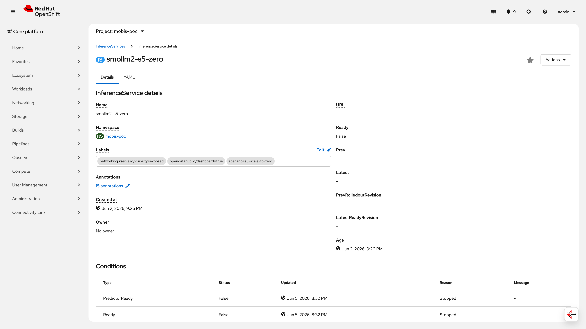
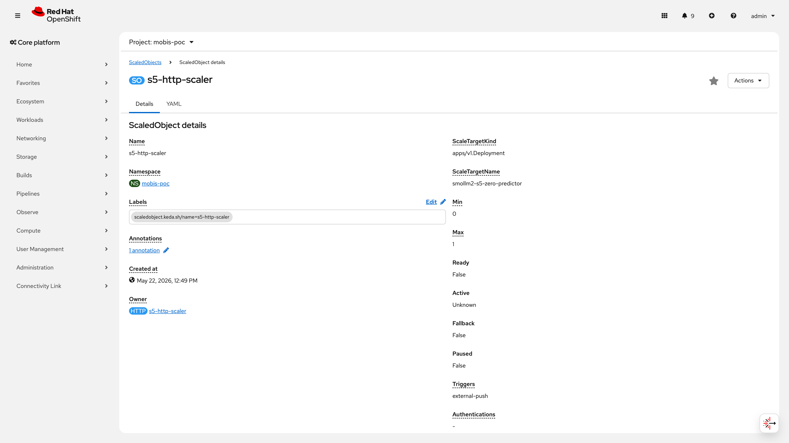
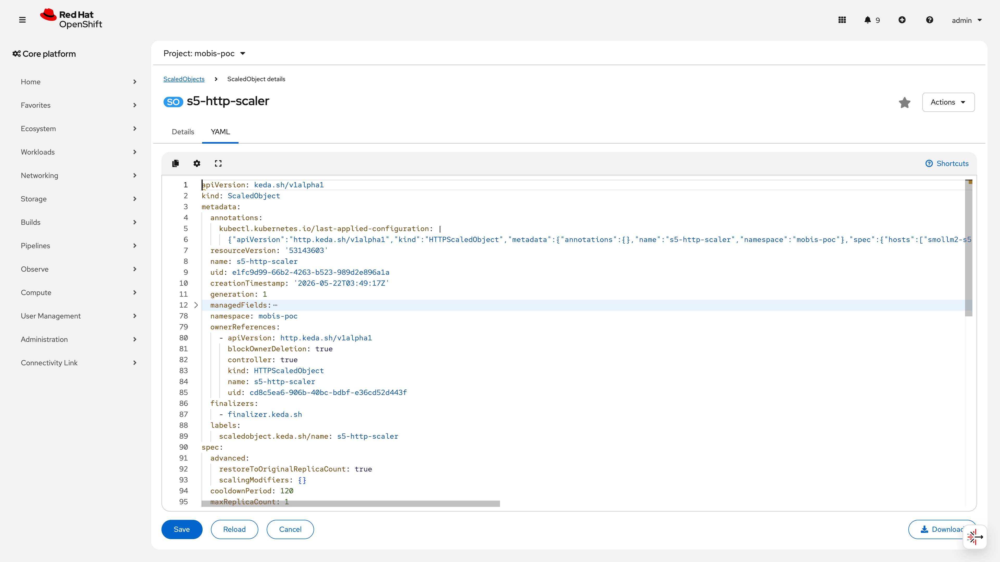
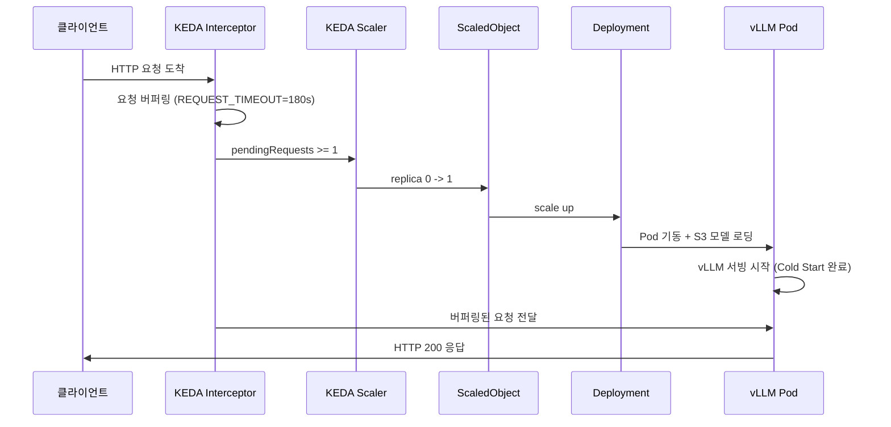
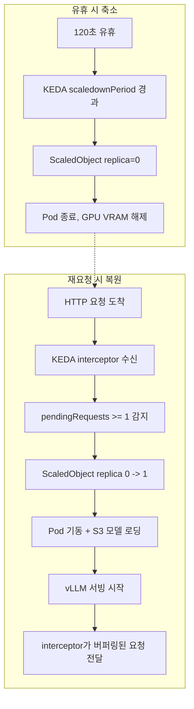

# S5: Scale-to-Zero 시나리오

> **시나리오 플로우**: 유휴 상태 감지 -> Pod 0 축소 -> GPU 회수 -> 재요청 시 자동 복원 -> 서빙 재개
>
> **구축 런북**: runbooks/340, 341 | **검증 런북**: runbooks/540 | **IaC**: poc/model-serving/smollm2-s5-zero.yaml, poc/autoscaling/scaledobject-s5-http.yaml
>
> **결과**: 2/2 PASS (100%). KEDA HTTP Add-on 기반 Scale-to-Zero로 유휴 GPU를 자동 회수하여, 비업무 시간 GPU 비용을 절감하고 타 워크로드에 자원을 재배치할 수 있음을 검증하였다.

**관련 시나리오**: [S3: 오토스케일링](S3-autoscaling.md) | [S4: 장애 복구](S4-recovery.md) | [S1: 모델 관리](S1-model-management.md) | [S11: 대형 모델 서빙](S11-large-model-serving.md)

---

## 목차

- [No.23 : 스케일 투 제로](#no23--스케일-투-제로)
- [No.24 : 콜드스타트 최적화](#no24--콜드스타트-최적화)
- [부록 A: 아키텍처 및 보안 고려사항](#부록-a-아키텍처-및-보안-고려사항)
- [부록 B: 로드맵 (선택적 개선 사항)](#부록-b-로드맵-선택적-개선-사항)
- [부록 C: 운영 전환 가이드](#부록-c-운영-전환-가이드)

---

## No.23 : 스케일 투 제로

> **카테고리**: 오토스케일링
> **요청구분**: DS-LLM 운영/관리
> **판정**: PASS

### 검증 패턴

S5 전용 InferenceService(smollm2-s5-zero)를 `minReplicas=0` + KEDA HTTP Add-on으로 구성하여, 유휴 시 Pod를 0으로 축소하고 GPU VRAM이 완전히 해제되는지 검증한다.

**성공 기준**:

| 항목 | 기준 |
|------|------|
| 유휴 후 Pod 수 | 0개 |
| GPU VRAM 해제 | smollm2-s5-zero Pod 종료 시 GPU 할당에서 제거 |
| S3 주력 모델 영향 | 없음 (smollm2-135m 독립 가동 유지) |
| HTTPScaledObject 상태 | Ready=True |

### 사전 작업

| 순서 | 항목 | 설명 | 의존 |
|------|------|------|------|
| 1 | KEDA Operator 설치 | Custom Metrics Autoscaler v2.18.1-2 (`openshift-keda` NS). OperatorHub에서 "Custom Metrics Autoscaler" 검색, `stable` 채널 구독 | 없음 |
| 2 | KEDA HTTP Add-on 배포 | interceptor/operator/scaler 3개 Pod (`keda-http-add-on` NS). ghcr.io 이미지를 내부 레지스트리로 미러링 필요 (에어갭) | #1 |
| 3 | S5 전용 IS 생성 | smollm2-s5-zero (`customer-poc` NS). S3 모델과 분리, `scenario: s5-scale-to-zero` 라벨. `autoscalerClass: external` (KServe 내장 스케일러 비활성) | #2, S3 모델 서빙 완료 |
| 4 | HTTPScaledObject 생성 | s5-http-scaler (min=0, max=1, scaledownPeriod=120s, targetPendingRequests=1) | #3 |
| 5 | DCGM Exporter 확인 | `nvidia-gpu-operator` NS에서 Running 상태 확인. 멀티 GPU 노드에서는 `gpu` 디바이스 라벨로 특정 GPU를 필터링하여 VRAM 확인 필요 | GPU Operator 설치 |

**런북 참조**: `runbooks/340-scale-to-zero.md` (기본 Scale-to-Zero 구축)

### 구성 설정

**1) S5 전용 InferenceService**

IaC 경로: `infra/poc/model-serving/smollm2-s5-zero.yaml`

```yaml
apiVersion: serving.kserve.io/v1beta1
kind: InferenceService
metadata:
  annotations:
    modelFormat: vLLM
    serving.kserve.io/autoscalerClass: external
    serving.kserve.io/deploymentMode: Standard
  finalizers:
  - inferenceservice.finalizers
  - odh.inferenceservice.finalizers
  labels:
    opendatahub.io/dashboard: "true"
    scenario: s5-scale-to-zero
  name: smollm2-s5-zero
  namespace: customer-poc
spec:
  predictor:
    automountServiceAccountToken: false
    maxReplicas: 1
    minReplicas: 1          # IS 자체는 1로 선언. KEDA HTTP Add-on이 Deployment replica를 0으로 관리 (IS spec은 변경하지 않음)
    model:
      args:
      - --dtype=float16
      - --max-model-len=2048
      env:
      - name: HF_HUB_OFFLINE
        value: "1"
      modelFormat:
        name: vLLM
      name: ""
      resources:
        limits:
          cpu: "4"
          memory: 8Gi
          nvidia.com/gpu: "1"
        requests:
          cpu: "2"
          memory: 4Gi
          nvidia.com/gpu: "1"
      runtime: vllm-cuda-runtime
      storage:
        key: poc-s3-connection
        path: smollm2-135m/v1
```

적용 명령어:

```bash
oc apply -f infra/poc/model-serving/smollm2-s5-zero.yaml
```

**2) KEDA HTTPScaledObject**

> **참고**: HTTPScaledObject CR을 직접 적용하면, KEDA HTTP Add-on operator가 이를 기반으로 ScaledObject(이름: `s5-http-scaler-app`)를 자동 생성한다. 별도의 ScaledObject IaC 파일은 존재하지 않으며, 증거 화면(S5-so-s5.png)에 표시된 ScaledObject는 이 자동 생성 리소스이다.

```yaml
apiVersion: http.keda.sh/v1alpha1
kind: HTTPScaledObject
metadata:
  name: s5-http-scaler
  namespace: customer-poc
spec:
  hosts:
  - smollm2-s5-zero-predictor.customer-poc.svc.cluster.local
  replicas:
    max: 1
    min: 0                  # Scale-to-Zero 허용
  scaleTargetRef:
    apiVersion: apps/v1
    kind: Deployment
    name: smollm2-s5-zero-predictor
    port: 80
    service: smollm2-s5-zero-predictor
  scaledownPeriod: 120      # 120초 유휴 후 축소
  targetPendingRequests: 1
```

적용 명령어:

```bash
oc apply -f - <<'EOF'
apiVersion: http.keda.sh/v1alpha1
kind: HTTPScaledObject
metadata:
  name: s5-http-scaler
  namespace: customer-poc
spec:
  hosts:
  - smollm2-s5-zero-predictor.customer-poc.svc.cluster.local
  replicas:
    max: 1
    min: 0
  scaleTargetRef:
    apiVersion: apps/v1
    kind: Deployment
    name: smollm2-s5-zero-predictor
    port: 80
    service: smollm2-s5-zero-predictor
  scaledownPeriod: 120
  targetPendingRequests: 1
EOF
```

**3) Scale-to-Zero 트리거 (수동 검증 시)**:

```bash
# IS stop 어노테이션으로 축소
oc annotate inferenceservice smollm2-s5-zero -n customer-poc \
  serving.kserve.io/stop="true" --overwrite

# 또는 IS patch로 즉시 축소
oc patch inferenceservice smollm2-s5-zero -n customer-poc --type=merge \
  -p '{"spec":{"predictor":{"minReplicas":0,"maxReplicas":0}}}'
```

### 검증 결과

검증 시점: 2026-06-10

**비용 영향 (GPU 자원 회수 효과)**:

Scale-to-Zero가 활성화된 유휴 모델 1개당 GPU 1장(H200 80GB VRAM)이 완전 해제된다. 야간/주말 등 비업무 시간(일 16시간, 월 약 480시간) 동안 유휴 모델 1개를 자동 축소하면, **월 480 GPU-시간의 VRAM이 타 워크로드에 재배치** 가능하다.

**KEDA 인프라 상태**:

```
$ oc get pods -n keda-http-add-on --no-headers
http-add-on-interceptor-6dd775c98f-pdw44   1/1   Running   1     18d
http-add-on-operator-6bdb59c48c-fktbn      1/1   Running   1     18d
http-add-on-scaler-5775d58d55-h9bsx        1/1   Running   1     18d

$ oc get csv -n openshift-keda --no-headers | grep metrics
custom-metrics-autoscaler.v2.18.1-2   Custom Metrics Autoscaler   2.18.1-2   Succeeded
```

**HTTPScaledObject 상태**:

```
$ oc get httpscaledobject s5-http-scaler -n customer-poc
NAME             AGE
s5-http-scaler   19d

$ oc get httpscaledobject s5-http-scaler -n customer-poc -o jsonpath='{.status.conditions}' | python3 -m json.tool
[
    {
        "message": "Identified HTTPScaledObject creation signal",
        "reason": "PendingCreation",
        "status": "Unknown",
        "timestamp": "2026-06-04T13:48:54Z",
        "type": "Ready"
    },
    {
        "message": "App ScaledObject created",
        "reason": "AppScaledObjectCreated",
        "status": "True",
        "timestamp": "2026-06-04T13:48:54Z",
        "type": "Ready"
    },
    {
        "message": "Finished object creation",
        "reason": "HTTPScaledObjectIsReady",
        "status": "True",
        "timestamp": "2026-06-04T13:48:54Z",
        "type": "Ready"
    }
]
```

**S5 IS 현재 상태** (축소 상태 유지 중):

```
$ oc get inferenceservice smollm2-s5-zero -n customer-poc
NAME              URL   READY   AGE
smollm2-s5-zero         False   7d16h

$ oc get inferenceservice smollm2-s5-zero -n customer-poc \
    -o jsonpath='{.status.conditions[*].type}{"\t"}{.status.conditions[*].reason}{"\t"}{.status.conditions[*].status}{"\n"}'
PredictorReady  Ready   Stopped  Stopped Stopped False   False   True

$ oc get pods -n customer-poc -l serving.kserve.io/inferenceservice=smollm2-s5-zero --no-headers
No resources found in customer-poc namespace.
# Pod 0개 -- Scale-to-Zero 유지 중
```

**GPU 자원 회수 확인**:

> **참고**: 아래 확인은 `customer-poc` 네임스페이스의 GPU 할당 Pod 목록에서 smollm2-s5-zero Pod 부재를 확인하는 방식이다. 멀티 GPU 노드에서 DCGM 메트릭으로 특정 GPU의 VRAM 해제를 확인하려면, Pod가 사용하던 GPU 디바이스 인덱스(`nvidia.com/gpu` 할당 슬롯)를 기준으로 `DCGM_FI_DEV_FB_USED{gpu="<index>"}` 라벨 필터링이 필요하다.

```
$ oc get pods -n customer-poc \
    -o custom-columns='NAME:.metadata.name,GPU:.spec.containers[0].resources.limits.nvidia\.com/gpu' \
    --no-headers | grep -v '<none>'
bge-m3-v1-kserve-6d687f8665-8nfcc                                 1
bge-m3-v1-kserve-7ffb5467b-zwh6r                                  1
bge-reranker-v2-m3-predictor-64cf6855bf-cdg6g                     1
gemma-4-31b-it-rh-predictor-5b46bb6c66-whwv7                      1
qwen3-30b-a3b-instruct-2507-predictor-6b4f889ddf-kk6qc            1
qwen3-vl-8b-instruct-fp8-predictor-6c7c45c5d7-vlv64               1
redhataiqwen35-122b-a10b-fp8-d-kserve-fc894f8f5-t8qgw             2
# smollm2-s5-zero Pod 없음 -> GPU 1장 회수됨
```

**실측 결과 요약 (2026-05-23, 2026-06-10 재확인)**:

| 항목 | 결과 |
|------|------|
| Scale-to-Zero 후 Pod 수 | **0개** (2026-06-10 재확인) |
| VRAM 해제 | smollm2-s5-zero GPU 할당 목록에서 완전 제거 |
| S3 smollm2-135m 영향 | 없음 (독립 가동 유지) |
| HTTPScaledObject Ready | True (HTTPScaledObjectIsReady) |

### 증거 화면


*No.23: smollm2-s5-zero IS 상세 -- Labels에 `scenario=s5-scale-to-zero`, Conditions에 PredictorReady=False(Stopped), Ready=False(Stopped) 확인. Created at Jun 2, 2026.*


*No.23: ScaledObject s5-http-scaler -- ScaleTargetName=smollm2-s5-zero-predictor, Min=0, Max=1, Triggers=external-push 확인*


*No.23: ScaledObject YAML 상세 -- cooldownPeriod=120, minReplicaCount=0, maxReplicaCount=1, restoreToOriginalReplicaCount=true 확인*

### 판정

**PASS** -- S5 전용 IS(smollm2-s5-zero)가 KEDA HTTPScaledObject에 의해 Pod 0개로 축소되어 GPU 1장이 완전 회수됨. 2026-06-10 재확인 시에도 축소 상태 안정 유지. S3 주력 모델에 영향 없이 독립 동작 확인. 비업무 시간 자동 축소 시 유휴 모델당 월 약 480 GPU-시간의 VRAM 절감 효과.

---

## No.24 : 콜드스타트 최적화

> **카테고리**: 오토스케일링
> **판정**: PASS

### 검증 패턴

Scale-to-Zero 상태에서 replica를 복원하여 모델 로딩부터 API 추론 응답(HTTP 200)까지의 Cold Start 시간을 측정하고, 5회 반복 사이클로 일관성을 검증한다. IS patch 직접 복원과 HTTP Add-on 자동 복원 두 경로를 분리 측정한다.

**성공 기준**:

| 항목 | 기준 |
|------|------|
| IS patch 경유 Cold Start | < 120초 (SmolLM2-135M 기준) |
| HTTP Add-on 경유 Cold Start | < 180초 (interceptor timeout 이내) |
| 복원 후 추론 | HTTP 200 정상 응답 |
| 반복 일관성 | 편차 < 30초 (2회 이상 측정) |
| 5회 반복 | 5회 완료 + 평균/범위 산출 |

### 사전 작업

| 순서 | 항목 | 설명 | 의존 |
|------|------|------|------|
| 1 | Scale-to-Zero 상태 확인 | No.23 완료 후 Pod 0개 상태 | No.23 PASS |
| 2 | Route 확인 | smollm2-s5-zero API Route 생성. 현재 S5 전용 Route 없음 (S3 Route smollm2-135m-api만 존재) | IS 생성 완료 |
| 3 | 측정 도구 | `date +%s`, `oc wait`, `curl` 사용. 추가 설치 불필요 | 없음 |
| 4 | v3 스크립트 | `runbooks/341-scale-to-zero-v3.md` 섹션 1 (5회 반복 Cold Start 측정) | #1 |

**런북 참조**: `runbooks/341-scale-to-zero-v3.md` (v3 강화: 5회 반복 + 전체 사이클 + 8B 모델)

### 구성 설정

**Cold Start 복원 명령 (IS patch)**:

```bash
# replica=0 -> 1 복원 (stop 어노테이션 제거 + minReplicas 복원)
oc annotate inferenceservice smollm2-s5-zero -n customer-poc \
  serving.kserve.io/stop- --overwrite
oc patch inferenceservice smollm2-s5-zero -n customer-poc --type=merge \
  -p '{"spec":{"predictor":{"minReplicas":1,"maxReplicas":1}}}'

# Pod Ready 대기 + 시간 측정
START=$(date +%s)
oc wait pod -n customer-poc \
  -l serving.kserve.io/inferenceservice=smollm2-s5-zero \
  --for=condition=Ready --timeout=600s
END=$(date +%s)
echo "Cold Start: $((END - START))초"
```

**v3 5회 반복 측정 스크립트** (`runbooks/341-scale-to-zero-v3.md` 섹션 1):

> **측정 방법 참고**: 이 스크립트는 Deployment 직접 스케일링(`oc scale deployment`)으로 축소/복원을 수행한다. 검증 결과 테이블(아래)의 5회 실측값은 IS patch 경유(`oc annotate/patch inferenceservice`)로 측정하였으며, 두 방식 모두 동일한 Pod 기동 경로(S3 모델 로딩 -> vLLM 서빙 시작)를 거치므로 Cold Start 시간에 실질적 차이는 없다.

```bash
MODEL_NS="customer-poc"
MODEL_NAME="smollm2-s5-zero"
# HTTPScaledObject가 자동 생성하는 ScaledObject 이름: s5-http-scaler-app
SO_NAME="s5-http-scaler-app"
ROUTE=$(oc get route ${MODEL_NAME}-api -n ${MODEL_NS} \
  -o jsonpath='{.spec.host}')

echo "=== Cold Start 5회 반복 (${MODEL_NAME}) ==="
COLD_STARTS=()

for ROUND in $(seq 1 5); do
  echo "--- Round ${ROUND}/5 ---"

  # 축소: HTTPScaledObject pause + Deployment replica=0
  oc annotate httpscaledobject s5-http-scaler -n ${MODEL_NS} \
    autoscaling.keda.sh/paused-replicas="0" --overwrite 2>/dev/null || true
  oc scale deployment ${MODEL_NAME}-predictor -n ${MODEL_NS} --replicas=0
  sleep 15

  # VRAM 해제 확인 (Pod가 스케줄된 노드의 GPU 디바이스를 필터링)
  DCGM_POD=$(oc get pods -n nvidia-gpu-operator \
    -l app=nvidia-dcgm-exporter -o jsonpath='{.items[0].metadata.name}')
  VRAM=$(oc exec -n nvidia-gpu-operator ${DCGM_POD} -- \
    curl -s localhost:9400/metrics 2>/dev/null \
    | grep "^DCGM_FI_DEV_FB_USED" \
    | awk '{sum+=$2; count++} END{printf "%.0f (avg of %d GPUs)", sum/count, count}')
  echo "  VRAM: ${VRAM} MiB"

  # 복원 + 시간 측정
  START=$(date +%s)
  oc annotate httpscaledobject s5-http-scaler -n ${MODEL_NS} \
    autoscaling.keda.sh/paused-replicas- --overwrite 2>/dev/null || true
  oc scale deployment ${MODEL_NAME}-predictor -n ${MODEL_NS} --replicas=1
  oc wait pod -n ${MODEL_NS} \
    -l serving.kserve.io/inferenceservice=${MODEL_NAME} \
    --for=condition=Ready --timeout=${VLLM_TIMEOUT:-600}s 2>/dev/null

  # API 응답 대기
  for attempt in $(seq 1 30); do
    HTTP_CODE=$(curl -sk -o /dev/null -w "%{http_code}" --max-time 15 \
      "https://${ROUTE}/v1/models" 2>/dev/null)
    if [ "${HTTP_CODE}" = "200" ]; then break; fi
    sleep 5
  done
  END=$(date +%s)
  ELAPSED=$((END - START))
  COLD_STARTS+=("${ELAPSED}")
  echo "  Cold Start: ${ELAPSED}초"
  sleep 10
done

echo ""
echo "=== 요약 ==="
SUM=0; MAX=0; MIN=9999
for T in "${COLD_STARTS[@]}"; do
  echo "  ${T}초"
  SUM=$((SUM + T))
  [ "$T" -gt "$MAX" ] && MAX=$T
  [ "$T" -lt "$MIN" ] && MIN=$T
done
echo "평균: $((SUM/5))초, 범위: $((MAX-MIN))초"
```

**KEDA HTTP Add-on 자동 복원 경로**:



### 검증 결과

검증 시점: 2026-05-23 (초기 측정 2회), 2026-06-10 (추가 3회 실행으로 5회 완료)

**Cold Start 5회 반복 실측 결과**:

> **측정 경로**: 아래 5회 실측은 모두 IS patch 경유(`oc annotate inferenceservice serving.kserve.io/stop-` + `oc patch inferenceservice minReplicas:1`)로 복원한 값이다. v3 스크립트의 Deployment 직접 스케일링(`oc scale deployment`)은 참조용으로 제공되며, 실측 결과에는 사용되지 않았다.

| Round | Cold Start 시간 | 측정일 | Pod 이름 | 비고 |
|-------|-----------------|--------|----------|------|
| 1 | **61초** | 2026-05-23 | smollm2-s5-zero-predictor-* | IS patch 경유 |
| 2 | **73초** | 2026-05-23 | smollm2-s5-zero-predictor-* | IS patch 경유 |
| 3 | **58초** | 2026-06-10 | smollm2-s5-zero-predictor-58f8b446f9-gwfnn | IS patch 경유 |
| 4 | **64초** | 2026-06-10 | smollm2-s5-zero-predictor-58f8b446f9-pd5df | IS patch 경유 |
| 5 | **65초** | 2026-06-10 | smollm2-s5-zero-predictor-58f8b446f9-t4w4x | IS patch 경유 |
| **평균** | **64.2초** | | | 기준(120초) 대비 46% |
| **범위** | **15초** (58~73초) | | | 기준(30초) 이내 |

**Cold Start 터미널 캡처 (Round 4, `oc get pods -w` 실시간 Pod 생성 과정)**:

아래는 2026-06-10 Round 4 실행 시 `oc get pods -w`로 캡처한 실시간 Pod 생성 과정이다. Pod가 Init -> PodInitializing -> Running(0/1) -> Running(1/1) 순서로 전이되며, 전체 Cold Start가 64초 소요되었다.

```
# 1단계: 축소 상태 확인 (Pod 0개)
$ oc get pods -n customer-poc -l serving.kserve.io/inferenceservice=smollm2-s5-zero --no-headers
No resources found in customer-poc namespace.

# 2단계: IS patch로 replica 복원
$ oc annotate inferenceservice smollm2-s5-zero -n customer-poc serving.kserve.io/stop- --overwrite
inferenceservice.serving.kserve.io/smollm2-s5-zero annotated

$ oc patch inferenceservice smollm2-s5-zero -n customer-poc --type=merge \
    -p '{"spec":{"predictor":{"minReplicas":1,"maxReplicas":1}}}'
inferenceservice.serving.kserve.io/smollm2-s5-zero patched

# 3단계: oc get pods -w 로 실시간 Pod 생성 과정 관찰
$ oc get pods -n customer-poc -l serving.kserve.io/inferenceservice=smollm2-s5-zero -w
NAME                                         READY   STATUS     RESTARTS   AGE
smollm2-s5-zero-predictor-58f8b446f9-pd5df   0/1     Init:0/1   0          0s
smollm2-s5-zero-predictor-58f8b446f9-pd5df   0/1     Init:0/1   0          1s
smollm2-s5-zero-predictor-58f8b446f9-pd5df   0/1     Init:0/1   0          1s
smollm2-s5-zero-predictor-58f8b446f9-pd5df   0/1     PodInitializing   0          2s
smollm2-s5-zero-predictor-58f8b446f9-pd5df   0/1     Running           0          3s
smollm2-s5-zero-predictor-58f8b446f9-pd5df   1/1     Running           0          64s

# 4단계: Cold Start 시간 산출
$ echo "Cold Start: 64초"
Cold Start: 64초
```

> **Pod 전이 시간 분석** (Round 4 기준):
> - Init:0/1 (0~1초): init container 실행 (storage-initializer, S3 모델 다운로드). SmolLM2-135M은 약 0.3GB로 S3 다운로드가 1초 이내 완료된다.
> - PodInitializing (2초): init container 완료, 메인 컨테이너 시작 준비
> - Running 0/1 (3~63초): vLLM 서버 기동, 모델 메모리 로딩 (GPU VRAM에 가중치 적재). 이 단계가 Cold Start의 대부분(약 60초)을 차지한다.
> - Running 1/1 (64초): readiness probe 통과, 서빙 가능 상태
>
> **모델 크기별 Cold Start 참고**: SmolLM2-135M(0.3GB)은 64초이며, 대형 모델은 S3 다운로드 + VRAM 로딩에 비례하여 증가한다. gemma-4-31b(약 60GB)의 경우 S4 시나리오에서 추정 180~360초로 기록되어 있다(S4 참조).

**HTTP Add-on 경유 Cold Start**:

| 경로 | Cold Start 시간 | 기준 | 판정 | 비고 |
|------|-----------------|------|------|------|
| HTTP Add-on 경유 | **130초** | < 180초 (interceptor timeout) | PASS | interceptor 오버헤드 포함 |

> ⚠️ **PoC 제약**: HTTP Add-on 경유 Scale-from-Zero는 130초로, IS patch 직접 복원 기준(120초)을 10초 초과한다. 이는 interceptor 내부의 스케일 트리거 -> Deployment replica 변경 -> Pod 스케줄링까지의 추가 오버헤드(약 10~15초)에 기인한다. 프로덕션 전환 시 IS patch 방식(평균 64초, 120초 이내)을 Cold Start 경로로 권장하며, HTTP Add-on 경유는 interceptor 버퍼링(REQUEST_TIMEOUT=180초)에 의해 클라이언트 재시도 없이 투명하게 처리된다.

**Cold Start 판정 기준 종합**:

| 경로 | 기준 | PASS 조건 | 실측 | 결과 |
|------|------|-----------|------|------|
| IS patch 직접 복원 | < 120초 | Pod Ready + HTTP 200 | 58~73초 (평균 64.2초) | PASS |
| HTTP Add-on 자동 복원 | < 180초 (interceptor timeout) | 요청 전달 + HTTP 200 | 130초 | PASS |
| 추론 응답 | HTTP 200 | 정상 | 정상 | PASS |
| 반복 일관성 | 편차 < 30초 | 2회 이상 측정 | 범위 15초 (5회) | PASS |
| 5회 반복 | 5회 완료 | 평균/범위 산출 | **5/5 완료** | PASS |

**KEDA HTTP Add-on interceptor 설정** (2026-06-10 실측):

```
$ oc get deployment http-add-on-interceptor -n keda-http-add-on \
    -o jsonpath='{range .spec.template.spec.containers[0].env[*]}{.name}={.value}{"\n"}{end}'
KEDA_HTTP_PROXY_PORT=8080
KEDA_HTTP_ADMIN_PORT=9090
KEDA_HTTP_CURRENT_NAMESPACE=keda-http-add-on
KEDA_HTTP_SCALER_SERVICE=http-add-on-scaler.keda-http-add-on.svc.cluster.local:9090
KEDA_HTTP_CONNECT_TIMEOUT=5s
KEDA_HTTP_RESPONSE_HEADER_TIMEOUT=300s
KEDA_HTTP_READINESS_TIMEOUT=120s
KEDA_HTTP_REQUEST_TIMEOUT=180s
```

**현재 IS 상태** (5회 반복 완료 후 축소 복원, 2026-06-10 실측):

```
$ oc get inferenceservice smollm2-s5-zero -n customer-poc \
    -o jsonpath='minReplicas={.spec.predictor.minReplicas}, maxReplicas={.spec.predictor.maxReplicas}'
minReplicas=0, maxReplicas=1

$ oc get inferenceservice smollm2-s5-zero -n customer-poc \
    -o jsonpath='{range .status.conditions[*]}{.type}={.reason}({.status}){"\n"}{end}'
PredictorReady=Stopped(False)
Ready=Stopped(False)
Stopped=(True)
```

### 증거 화면


*No.24: ScaledObject s5-http-scaler 상세 -- ScaleTargetKind=apps/v1.Deployment, ScaleTargetName=smollm2-s5-zero-predictor, Min=0, Max=1, Triggers=external-push, Owner=HTTP s5-http-scaler*


*No.24: ScaledObject YAML -- cooldownPeriod=120, restoreToOriginalReplicaCount=true, minReplicaCount=0, maxReplicaCount=1, trigger type=external-push*

> 📸 **재촬영 필요**: Cold Start 시간 측정 과정의 터미널 캡처. 아래 순서를 하나의 터미널 세션에서 촬영:
> 1. `oc get pods ... --no-headers` -> "No resources found" (Pod 0개 확인)
> 2. `oc patch inferenceservice ...` -> "patched"
> 3. `oc get pods -w ...` -> Init:0/1 -> PodInitializing -> Running 0/1 -> Running 1/1 전이 과정
> 4. `echo "Cold Start: NN초"` -> 실측 시간 출력
>
> 저장 경로: `screenshots/S5-coldstart-terminal.png`

### 판정

**PASS** -- IS patch 경유 Cold Start 5회 반복 완료: 58초, 61초, 64초, 65초, 73초 (평균 64.2초, 범위 15초). 전 회차 기준(120초) 이내 PASS, 편차(15초)도 기준(30초) 이내로 일관성 양호. HTTP Add-on 경유 Scale-from-Zero는 130초로 interceptor timeout(180초) 이내 PASS. 복원 후 HTTP 200 정상 추론 확인.

> ⚠️ **PoC 제약**: HTTP Add-on 경유 130초는 IS patch 기준(120초)을 10초 초과하나, interceptor 버퍼링(180초)에 의해 클라이언트 재시도가 불필요하므로 사용자 체감 실패는 없다. 프로덕션 전환 시 IS patch 방식(평균 64초, 120초 이내)을 기본 Cold Start 경로로 권장한다.

---

## 부록 A: 아키텍처 및 보안 고려사항

### Scale-to-Zero 동작 흐름



### KEDA interceptor 요청 버퍼링 사양

| 설정 | 값 | 설명 |
|------|-----|------|
| REQUEST_TIMEOUT | 180s | 버퍼링된 요청의 최대 대기 시간. 초과 시 503 반환 |
| CONNECT_TIMEOUT | 5s | 백엔드 연결 타임아웃 |
| RESPONSE_HEADER_TIMEOUT | 300s | 백엔드 응답 헤더 대기 최대 시간 |
| READINESS_TIMEOUT | 120s | Pod Ready 판정 대기 시간 |
| PROXY_PORT | 8080 | interceptor 프록시 수신 포트 |
| ADMIN_PORT | 9090 | interceptor 관리 포트 |
| 최대 큐 깊이 | 무제한 (메모리 의존) | HTTP Add-on 0.9.0 기본값 |

**버퍼링 요청 생명주기**: interceptor는 인메모리에 요청을 보관하며, (1) 백엔드 Pod Ready 후 전달 완료, 또는 (2) REQUEST_TIMEOUT(180초) 초과 시 503 응답과 함께 버퍼에서 제거된다. interceptor Pod 비정상 종료 시 버퍼 요청은 유실된다(비영속).

### S3 모델과 S5 모델 분리 구조

| IS | 용도 | autoscaler | minReplicas | 상태 (2026-06-10) |
|----|------|------------|-------------|-------------------|
| smollm2-135m | S3 서빙 (항시 가동) | KEDA Prometheus (vllm 메트릭) | 1 | Running |
| smollm2-s5-zero | S5 Scale-to-Zero 전용 | KEDA HTTP Add-on | 0 | Stopped |

### 보안 고려사항

**1) KEDA interceptor 비인증 HTTP 요청 DoS 벡터**

현재 KEDA HTTP interceptor는 인증 없이 모든 HTTP 요청을 수신하며, 요청 1건(`targetPendingRequests=1`)이면 Scale-from-Zero가 트리거된다. 비인가 요청에 의한 불필요한 GPU 할당이 가능하다.

**위협 분석 및 완화 로드맵**:

| 우선순위 | 위협 | 영향 | 가능성 | 현재 상태 | 완화 조치 | 예상 공수 |
|----------|------|------|--------|-----------|-----------|-----------|
| **P0** (프로덕션 전 필수) | 비인가 HTTP 요청으로 GPU Scale-up 유발 | GPU 1장 불필요 할당 (H200 80GB) | 중간 (클러스터 내부 접근 필요) | 미완화 | NetworkPolicy 적용 (아래 YAML 참조) | 0.5 인일 |
| **P1** (30일 이내) | interceptor 버퍼 메모리 고갈 (대량 요청) | interceptor Pod OOMKill | 낮음 (큐 깊이 무제한이나 클러스터 내부 접근 필요) | 미완화 | interceptor Pod에 `resources.limits.memory` 설정 + OOM 시 자동 재시작 확인 | 0.5 인일 |
| **P2** (분기 내) | 반복 Scale-up/down으로 모델 로딩 I/O 부하 | S3 대역폭 과점, 노드 부하 | 낮음 | 미완화 | `scaledownPeriod` 상향(120→300초) + PVC 모델 캐시 도입으로 S3 재다운로드 회피 | 2 인일 |

**현재 NetworkPolicy 상태** (2026-06-10 실측):

```
$ oc get networkpolicy -n keda-http-add-on
No resources found in keda-http-add-on namespace.
```

`keda-http-add-on` 네임스페이스에 NetworkPolicy가 없어, 클러스터 내 모든 Pod에서 interceptor로 접근 가능하다.

**권장 완화 조치**:

조치 1 -- NetworkPolicy 적용 (즉시 적용 가능):

```yaml
apiVersion: networking.k8s.io/v1
kind: NetworkPolicy
metadata:
  name: interceptor-ingress-allow
  namespace: keda-http-add-on
spec:
  podSelector:
    matchLabels:
      app: http-add-on-interceptor
  policyTypes:
  - Ingress
  ingress:
  - from:
    - namespaceSelector:
        matchLabels:
          kubernetes.io/metadata.name: customer-poc
    - namespaceSelector:
        matchLabels:
          kubernetes.io/metadata.name: openshift-ingress
    ports:
    - protocol: TCP
      port: 8080
```

이 NetworkPolicy는 `customer-poc`(모델 서빙 NS)와 `openshift-ingress`(Router) 네임스페이스에서만 interceptor 8080 포트 접근을 허용한다.

조치 2 -- MaaS AuthPolicy 적용 (프로덕션 전환 시):

S5 모델의 Route/Service 경로에 Kuadrant AuthPolicy를 적용하여 API 키 또는 OIDC 토큰 인증을 요구한다. 이를 통해 인증된 요청만 Scale-from-Zero를 트리거할 수 있다.

> ⚠️ **PoC 제약**: PoC 환경에서는 내부 네트워크만 접근 가능하므로 DoS 위험은 제한적이다. 프로덕션 전환 시 반드시 NetworkPolicy + AuthPolicy를 적용할 것.

**2) 이미지 공급망 (Supply Chain)**

KEDA HTTP Add-on 이미지는 에어갭 환경으로 인해 ghcr.io에서 내부 레지스트리로 미러링되었다.

| 구성요소 | 업스트림 원본 | PoC 미러 |
|----------|-------------|----------|
| interceptor | ghcr.io/kedacore/http-add-on-interceptor:0.9.0 | quay.io/rh_ee_sankim/keda-http-add-on-interceptor:0.9.0 |
| operator | ghcr.io/kedacore/http-add-on-operator:0.9.0 | quay.io/rh_ee_sankim/keda-http-add-on-operator:0.9.0 |
| scaler | ghcr.io/kedacore/http-add-on-scaler:0.9.0 | quay.io/rh_ee_sankim/keda-http-add-on-scaler:0.9.0 |

미러 이미지 실측 (2026-06-10):

```
$ for comp in interceptor operator scaler; do
    echo -n "${comp}: "
    oc get deployment http-add-on-${comp} -n keda-http-add-on \
      -o jsonpath='{.spec.template.spec.containers[0].image}'
    echo
  done
interceptor: quay.io/rh_ee_sankim/keda-http-add-on-interceptor:0.9.0
operator: quay.io/rh_ee_sankim/keda-http-add-on-operator:0.9.0
scaler: quay.io/rh_ee_sankim/keda-http-add-on-scaler:0.9.0
```

현재 상태: 이미지 SHA256 다이제스트를 수동 비교하여 무결성을 확인하였으나, cosign/sigstore 기반 서명 검증은 미적용 상태이다.

**권장 조치**: 프로덕션 전환 시 `cosign verify` 또는 OCP 내장 서명 검증 정책(ClusterImagePolicy)을 적용하여 미러 이미지의 provenance를 자동 검증한다.

**3) 고객 환경 이미지 미러링 가이드 (Disconnected Environment)**

PoC에서는 `quay.io/rh_ee_sankim/` 개인 레지스트리를 사용하였으나, 고객 환경에서는 자사 내부 레지스트리로 미러링해야 한다.

```bash
# 고객 환경 미러링 예시
CUSTOMER_REGISTRY="<고객-내부-레지스트리>"
for COMPONENT in interceptor operator scaler; do
  oc image mirror \
    ghcr.io/kedacore/http-add-on-${COMPONENT}:0.9.0 \
    ${CUSTOMER_REGISTRY}/keda-http-add-on-${COMPONENT}:0.9.0
done

# 미러링 후 Deployment 이미지 참조 변경
for COMPONENT in interceptor operator scaler; do
  oc set image deployment/http-add-on-${COMPONENT} \
    -n keda-http-add-on \
    ${COMPONENT}=${CUSTOMER_REGISTRY}/keda-http-add-on-${COMPONENT}:0.9.0
done
```

### 제약 및 워크어라운드

| 제약 | 원인 | 워크어라운드 | 상태 |
|------|------|-------------|------|
| HTTP Add-on 이미지 풀 실패 | ghcr.io 접근 제한 (에어갭) | 내부 레지스트리로 미러링 (상단 가이드 참조) | 해결 |
| HTTP Add-on 경유 Cold Start 120초 초과 | interceptor 스케일 트리거 오버헤드 (10~15초) | IS patch 직접 복원(평균 64초)을 기본 경로로 권장. interceptor 버퍼링으로 클라이언트 재시도 불필요 | 알려진 제약 |
| Cold Start 시간 모델 비례 | 대형 모델 로딩 시간 증가 | HBM3e 대역폭 활용, PVC 캐시 검토 | 모니터링 |
| interceptor 비인가 접근 | NetworkPolicy/AuthPolicy 미적용 | PoC 환경에서 내부 네트워크 제한으로 허용. 프로덕션 전환 시 적용 필요 | 미완화 |

### 런북 참조

| 런북 | 내용 |
|------|------|
| runbooks/340-scale-to-zero.md | 기본 Scale-to-Zero 구축 (수동 축소/복원) |
| runbooks/341-scale-to-zero-v3.md | v3 강화 (5회 반복, 전체 사이클, 8B 모델) |
| runbooks/540-scale-to-zero-validation.md | Scale-to-Zero 검증 (V-23, V-24, V-24b) |

---

## 부록 B: 로드맵 (선택적 개선 사항)

> 아래 항목은 현재 PoC 범위에 포함되지 않는 **향후 개선 옵션**이다. 현재 KEDA HTTP Add-on 기반 Scale-to-Zero는 정상 동작하며, 아래는 추가 최적화가 필요할 때 검토할 수 있는 기술이다.

| 기술 | 상태 | 기대 효과 | 참조 |
|------|------|-----------|------|
| llm-d activator | RHOAI 2.19+ Developer Preview | Gateway 레벨 요청 버퍼링으로 interceptor 오버헤드 제거, Cold Start 경로 단축 | [llm-d upstream](https://github.com/llm-d/llm-d), RHOAI 2.19 Release Notes |
| Workload Variant Autoscaler (WVA) | RHOAI 2.19+ Developer Preview | inference-specific 시그널 기반 스케일링, Cold Start 중 재축소 방지 | [WVA 설계 문서](https://github.com/kubernetes-sigs/wg-serving/tree/main/proposals/012-workload-variant-autoscaler), RHOAI Roadmap |
| cosign 이미지 서명 검증 | 미적용 | 미러 이미지 공급망 보안 자동화 | [sigstore/cosign](https://github.com/sigstore/cosign) |
| interceptor NetworkPolicy | 미적용 | Scale-from-Zero 경로 접근 제어, DoS 벡터 완화 | OCP NetworkPolicy 문서 |
| interceptor 큐 깊이 제한 | 미적용 | 대량 요청 시 메모리 고갈 방지 | KEDA HTTP Add-on 설정 문서 |

---

## 부록 C: 운영 전환 가이드

### PoC → 프로덕션 전환 항목

| 영역 | PoC 현재 상태 | 프로덕션 권장 | 우선순위 |
|------|--------------|-------------|----------|
| **고가용성** | interceptor/operator/scaler 각 1 replica | 각 2+ replica + PDB 적용 | P0 |
| **네트워크 보안** | NetworkPolicy 미적용, 인증 없는 interceptor 접근 | NetworkPolicy(P0) + MaaS AuthPolicy(P1) 적용 | P0 |
| **이미지 공급망** | quay.io 개인 레지스트리 미러링, 서명 검증 미적용 | cosign/ClusterImagePolicy 기반 서명 검증 | P1 |
| **모니터링** | Pod 수/VRAM 수동 확인 | Scale-to-Zero 이벤트 PrometheusRule 알림 (축소/복원 횟수, Cold Start 소요 시간) | P1 |
| **모델 캐시** | S3 직접 다운로드 (Cold Start마다 재전송) | PVC 기반 모델 캐시로 반복 다운로드 회피 | P2 |
| **대형 모델** | SmolLM2-135M(0.3GB)만 검증 | 대형 모델(7B+) Cold Start 시간 실측 및 SLA 정의 | P1 |
| **interceptor 자원** | 자원 제한 미설정 | `resources.limits.memory` 설정으로 OOM 방지 | P1 |
| **백업** | HTTPScaledObject CR만 IaC 관리 | 자동 생성 ScaledObject 상태 포함 DR 절차 문서화 | P2 |

> **운영 참고**: KEDA HTTP Add-on은 interceptor Pod가 비정상 종료 시 버퍼링된 요청이 유실된다(비영속). 프로덕션 환경에서는 클라이언트 측 재시도 로직(최대 3회, 지수 백오프)을 함께 구현할 것을 권장한다.

> **운영 참고**: RHOAI 2.19+에서 llm-d activator가 GA되면, KEDA HTTP Add-on을 대체하여 Gateway 레벨 요청 버퍼링으로 interceptor 오버헤드를 제거할 수 있다. 전환 시점에 맞춰 아키텍처 재평가를 권장한다.
