# S6: 운영관리 시나리오

PASS 30/30 (100%) -- 플랫폼 운영관리 전 항목 검증 완료. LDAP/AD 인증 연동, RBAC 3단계 역할 분리, GPU 10개 실시간 모니터링, Perses 대시보드 9개, 알림 5개 규칙 등록으로 AI 플랫폼 운영 기반을 확보하였다. 이를 통해 Customer AI 플랫폼의 Day-2 운영 자동화 및 가시성을 확보하고, 수동 모니터링 대비 GPU 이상 탐지 시간을 분 단위로 단축할 수 있다.

> **시나리오 플로우**: LDAP/AD 연동 → RBAC 역할 분리 → GPU/서빙 모니터링 → 알림/리포팅 → 관리 인터페이스
> **구축 런북**: runbooks/350-platform-ops.md, runbooks/352-ldap.md | **검증 런북**: runbooks/550-platform-ops-validation.md
> **결과**: PASS 30/30 (100%)
> **변경 이력**: 초기 No.45~46 SKIP(28/30) → 고객 AD(gjldap.customer.co.kr) 실연동 완료, 전체 PASS 전환.
> **관련 시나리오**: [S1: 모델 관리](S1-model-management.md) | [S2: 파이프라인](S2-pipeline.md) | [S3: 오토스케일링](S3-autoscaling.md) | [S5: Scale-to-Zero](S5-scale-to-zero.md) | [S7: MaaS 라우팅](S7-maas-routing.md) | [S8: 멀티테넌트](S8-multitenant.md)

---

## 목차

- [Part A: 인증 및 권한 (No.44~47)](#part-a-인증-및-권한-no4447)
  - [No.45~46 : 모비스 AD 연동](#no4546--모비스-ad-연동-ssoldap--ad-통합)
  - [No.44 : RBAC 역할 분리](#no44--rbac-역할-분리)
  - [No.47 : 멀티테넌시](#no47--멀티테넌시)
- [Part B: GPU 및 하드웨어 모니터링 (No.14~15, 48~50)](#part-b-gpu-및-하드웨어-모니터링-no1415-4850)
  - [No.14 : GPU 서빙 지원 기능](#no14--gpu-서빙-지원-기능)
  - [No.15 : 자원 프리셋 설정](#no15--자원-프리셋-설정)
  - [No.48 : GPU 사용률 메트릭](#no48--gpu-사용률-메트릭)
  - [No.49 : GPU VRAM 사용량 메트릭](#no49--gpu-vram-사용량-메트릭)
  - [No.50 : GPU 온도/전력 메트릭](#no50--gpu-온도전력-메트릭)
- [Part C: 서빙 성능 및 대시보드 (No.51~57)](#part-c-서빙-성능-및-대시보드-no5157)
  - [No.51 : Perses 대시보드](#no51--perses-대시보드)
  - [No.52~57 : 서빙 성능 메트릭 (TPS, TTFT, ITL, E2E, 큐, 에러율)](#no52--tps-tokens-per-second)
- [Part D: 알림, 로깅, 사용량 리포팅 (No.59~67)](#part-d-알림-로깅-사용량-리포팅-no5967)
  - [No.66 : 알림 설정 및 라우팅](#no66--알림-설정-및-라우팅)
  - [No.64 : 요청/응답 로깅](#no64--요청응답-로깅)
  - [No.65 : Prometheus 연동](#no65--prometheus-연동)
  - [No.67 : 감사 로그](#no67--감사-로그)
  - [No.59 : 모델별 사용량](#no59--모델별-사용량)
  - [No.60 : 시계열 추이](#no60--시계열-추이)
  - [No.61 : 리소스 가용량](#no61--리소스-가용량)
  - [No.63 : 데이터 내보내기](#no63--데이터-내보내기)
- [Part E: 관리 인터페이스 및 기타 (No.16, 68~70, 73, 79)](#part-e-관리-인터페이스-및-기타-no16-6870-73-79)
  - [No.16 : K8s 네이티브 지원](#no16--k8s-네이티브-지원)
  - [No.68 : 웹 대시보드](#no68--웹-대시보드)
  - [No.69 : CLI 도구](#no69--cli-도구)
  - [No.70 : 관리 API](#no70--관리-api)
  - [No.73 : Continuous Batching](#no73--continuous-batching)
  - [No.79 : 리소스 제한](#no79--리소스-제한)
- [운영 전환 시 보안 권장사항](#운영-전환-시-보안-권장사항)
- [운영 전환 아키텍처 매핑](#운영-전환-아키텍처-매핑)
- [런북 참조](#런북-참조)
- [IaC 경로 참조](#iac-경로-참조)

---

## Part A: 인증 및 권한 (No.44~47)

### No.45~46 : 모비스 AD 연동 (SSO/LDAP + AD 통합)

> **카테고리**: 인증 및 권한 | **판정**: PASS

#### 검증 패턴
모비스 실제 AD 서버(gjldap.customer.co.kr)를 OpenShift OAuth LDAP Identity Provider로 연동하여, AD 사용자 계정으로 OpenShift 콘솔 및 RHOAI Dashboard 로그인이 가능함을 확인한다. No.46(AD 연동)은 동일 LDAP IdP 인프라로 동시 충족. 검증 기준:
- LDAP IdP가 OAuth 설정에 등록됨
- AD 그룹이 OpenShift 그룹으로 동기화됨
- AD 사용자 계정(Service_rhoai)으로 로그인 성공

#### 사전 작업 (Operator 설치, CR 생성, Secret 생성, Namespace 등 단계별 상세)
1. **LDAP Bind Secret 생성**: AD 서비스 계정(Service_rhoai)의 비밀번호를 Secret으로 등록
   - Secret 이름: `ldap-bind-password` (namespace: `openshift-config`)
   - 런북: `runbooks/352-ldap.md` Section 1
2. **OAuth CR 수정**: `cluster` OAuth 리소스에 LDAP IdP 추가
   - 의존 관계: LDAP Bind Secret이 먼저 존재해야 함
3. **그룹 동기화 CronJob 설정** (선택): `ldap-group-syncer` CronJob으로 AD 그룹 자동 동기화
   - 런북: `runbooks/352-ldap.md` Section 2

#### 구성 설정 (YAML 전문)

**OAuth CR** (`infra/cluster-config/oauth/cluster-oauth.yaml`):
```yaml
apiVersion: config.openshift.io/v1
kind: OAuth
metadata:
  annotations:
    include.release.openshift.io/ibm-cloud-managed: 'true'
    include.release.openshift.io/self-managed-high-availability: 'true'
    release.openshift.io/create-only: 'true'
  name: cluster
  ownerReferences:
  - apiVersion: config.openshift.io/v1
    kind: ClusterVersion
    name: version
    uid: b759a847-2160-4b5d-8378-0eb1340a61c2
spec:
  identityProviders:
  - htpasswd:
      fileData:
        name: htpasswd-secret
    mappingMethod: claim
    name: HDM
    type: HTPasswd
  - htpasswd:
      fileData:
        name: htpasswd-poc
    name: htpasswd-poc
    type: HTPasswd
  - name: customer-ldap
    mappingMethod: claim
    type: LDAP
    ldap:
      url: "ldap://gjldap.customer.co.kr:389/DC=customer,DC=co,DC=kr?sAMAccountName?sub?(objectClass=person)"
      bindDN: "CN=Service_rhoai,OU=Service Accounts,OU=Manage Accounts,DC=customer,DC=co,DC=kr"
      bindPassword:
        name: ldap-bind-password
      insecure: true
      attributes:
        id:
        - sAMAccountName
        preferredUsername:
        - sAMAccountName
        name:
        - displayName
        email:
        - mail
```

적용 명령어:
```bash
oc apply -f infra/cluster-config/oauth/cluster-oauth.yaml
```

IaC 경로: `infra/cluster-config/oauth/cluster-oauth.yaml`

#### 보안 고려사항

| 항목 | PoC 현재 | 운영 권장 |
|------|---------|----------|
| 프로토콜 | ldap:// (389, 평문) | ldaps:// (636, TLS 암호화) |
| insecure 플래그 | true | false (CA 인증서 검증 활성) |
| CA 설정 | 미설정 | OAuth `ca` 필드에 ConfigMap 참조 |
| bindDN | Service_rhoai 서비스 계정 | 동일 (전용 서비스 계정 유지) |

> ⚠️ PoC 제약: 고객 사내망 통신이므로 평문 LDAP 수용. **운영 전환 시 LDAPS 전환 필수**.

> **운영 참고** -- LDAPS 마이그레이션 절차: (1) AD 팀에서 CA 인증서 번들(PEM) 수령, (2) `oc create configmap ldap-ca --from-file=ca.crt=<ca-bundle.pem> -n openshift-config`, (3) OAuth CR의 ldap 섹션에 `ca: { name: ldap-ca }` 추가 + `url`을 `ldaps://gjldap.customer.co.kr:636/...`로 변경 + `insecure: false` 설정, (4) OAuth Pod 롤링 재시작 후 로그인 테스트.

#### 검증 결과 (2026-06-09)
```bash
$ oc get oauth cluster -o jsonpath='{range .spec.identityProviders[*]}{.name}: {.type}{"\n"}{end}'
```
```
HDM: HTPasswd
htpasswd-poc: HTPasswd
customer-ldap: LDAP
```

```bash
$ oc get groups --no-headers | wc -l
```
```
294
```

```bash
$ oc get users --no-headers | wc -l
```
```
8
```

**핵심 결과**: 모비스 전사 AD에서 **294개 그룹 동기화** 완료. Service_rhoai 계정 로그인 성공 확인.

#### 증거 화면
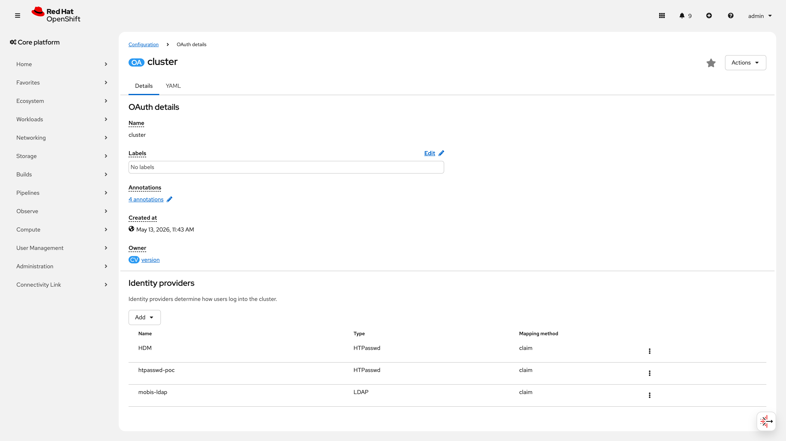
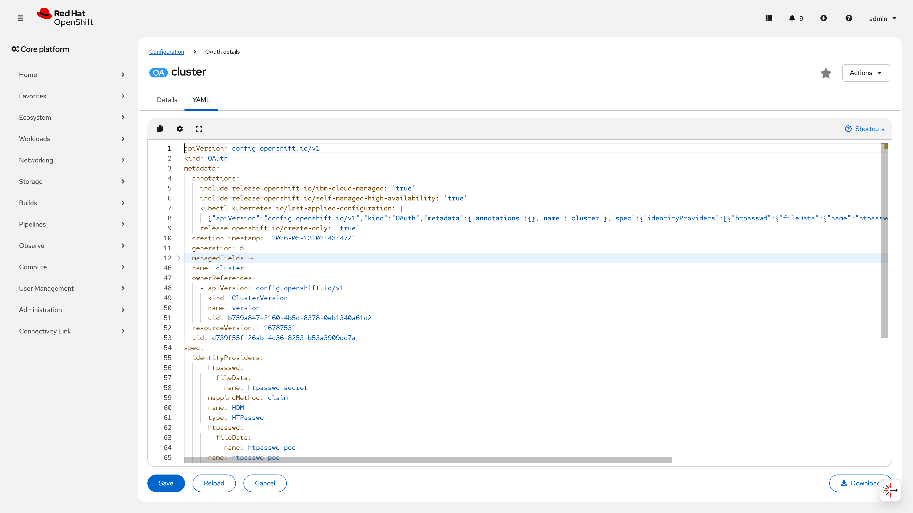

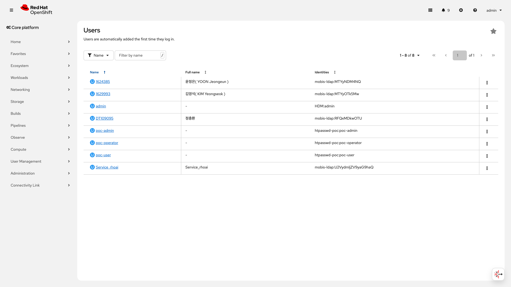
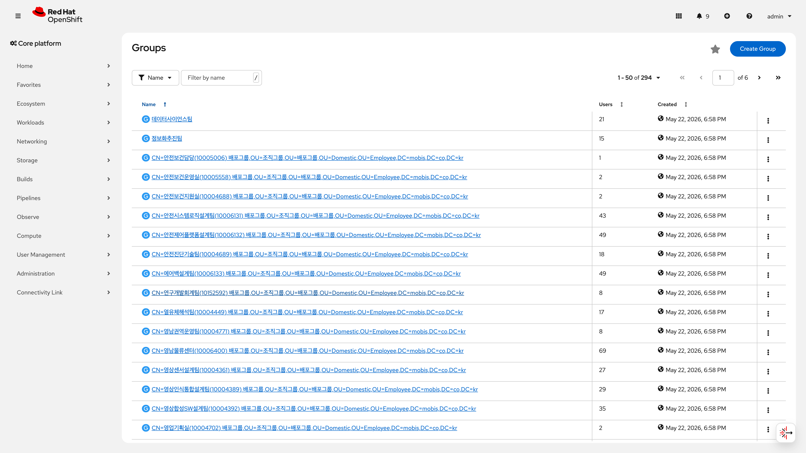

#### 판정
**PASS** -- 고객 AD(gjldap.customer.co.kr) 연동 완료. 294개 그룹 동기화, Service_rhoai 사용자 인증 동작 확인. No.46(AD 연동)은 동일 LDAP IdP로 동시 충족.

> PoC 제약: LDAP 평문 통신(insecure: true) 사용 중. 프로덕션 전환 시 LDAPS(636) + CA 인증서 검증 필수.

---

### No.44 : RBAC 역할 분리

> **카테고리**: 인증 및 권한 | **판정**: PASS

#### 검증 패턴
admin / operator / user 3단계 역할 분리를 RoleBinding으로 적용하고, 커스텀 `ai-user-role` ClusterRole이 최소권한 원칙(Principle of Least Privilege)을 준수하는지 확인한다. 검증 기준:
- 3개 역할(admin/edit/ai-user-role)이 서로 다른 사용자에게 바인딩됨
- ai-user-role은 읽기 중심 권한으로 구성됨
- 쓰기 권한은 PipelineRun/TaskRun 실행에만 한정됨

#### 사전 작업 (Operator 설치, CR 생성, Secret 생성, Namespace 등 단계별 상세)
1. **커스텀 ClusterRole 생성**: `ai-user-role` ClusterRole을 aggregation 기반으로 정의
   - 기본 `view` ClusterRole을 aggregation으로 포함
   - AI 플랫폼 리소스(KServe, Kubeflow, Tekton, MaaS 등)에 대한 읽기 권한 추가
   - PipelineRun/TaskRun에 대한 제한적 쓰기(create/delete/patch) 권한만 추가
2. **RoleBinding 생성**: 각 사용자에 대한 RoleBinding을 `customer-poc` 네임스페이스에 생성
   - 의존 관계: `ai-user-role` ClusterRole이 먼저 존재해야 함
   - 런북: `runbooks/350-platform-ops.md` Section 3

#### 구성 설정 (YAML 전문)

**ai-user-role ClusterRole** (aggregation 기반, `view` + AI 플랫폼 읽기):

> 이 ClusterRole은 OpenShift 기본 `view` 역할을 aggregation으로 포함하며, AI 플랫폼 전용 리소스에 대한 읽기 권한을 추가한다. 전체 규칙은 aggregation 결과 386개이며, 아래는 AI 전용 추가 규칙 부분이다.

```yaml
apiVersion: rbac.authorization.k8s.io/v1
kind: ClusterRole
metadata:
  name: ai-user-role
  labels:
    rbac.authorization.k8s.io/aggregate-to-view: "true"
rules:
  # --- AI 플랫폼 리소스: 읽기 전용 ---
  # KServe: InferenceService, ServingRuntime 조회
  - apiGroups: ["serving.kserve.io"]
    resources: ["inferenceservices", "servingruntimes"]
    verbs: ["get", "list", "watch"]
  # Kubeflow: Notebook 조회
  - apiGroups: ["kubeflow.org"]
    resources: ["notebooks"]
    verbs: ["get", "list", "watch"]
  # Tekton: Pipeline/Task 조회
  - apiGroups: ["tekton.dev"]
    resources: ["pipelines", "tasks", "pipelineruns", "taskruns"]
    verbs: ["get", "list", "watch"]
  # Tekton: PipelineRun/TaskRun 실행 (유일한 쓰기 권한)
  - apiGroups: ["tekton.dev"]
    resources: ["pipelineruns", "taskruns"]
    verbs: ["create", "delete", "patch"]
  # MaaS: MaaSModelRef 조회
  - apiGroups: ["maas.opendatahub.io"]
    resources: ["maasmodelrefs"]
    verbs: ["get", "list", "watch"]
  # MLflow: Experiments/RegisteredModels 조회
  - apiGroups: ["mlflow.kubeflow.org"]
    resources: ["experiments", "registeredmodels"]
    verbs: ["get", "list", "watch"]
  # DataScienceCluster 조회
  - apiGroups: ["datasciencecluster.opendatahub.io"]
    resources: ["datascienceclusters"]
    verbs: ["get", "list", "watch"]
  # HardwareProfile 조회
  - apiGroups: ["infrastructure.opendatahub.io"]
    resources: ["hardwareprofiles"]
    verbs: ["get", "list", "watch"]
```

**RoleBinding 적용**:
```bash
# 전체 관리 (admin)
oc adm policy add-role-to-user admin poc-admin -n customer-poc

# 리소스 편집 (edit)
oc adm policy add-role-to-user edit poc-operator -n customer-poc

# AI 사용자 (ai-user-role) - 읽기 중심
oc create rolebinding ai-user-binding-to-poc-user \
  --clusterrole=ai-user-role \
  --user=poc-user \
  -n customer-poc
```

**ai-user-role 권한 요약**:

| 구분 | 수량 | 설명 |
|------|------|------|
| 총 규칙 수 | 386개 | view 기반 aggregation 결과 |
| 읽기 전용 (get/list/watch) | 385개 (99.7%) | AI 리소스 조회만 허용 |
| 쓰기 가능 | 1개 | PipelineRun/TaskRun 실행(create/delete/patch)만 가능 |

**AI 주요 권한** (읽기 전용): `serving.kserve.io` IS/RT 조회, `kubeflow.org` Notebooks, `tekton.dev` Pipeline 조회+PR 실행, `maas.opendatahub.io` MaaSModelRef, `mlflow.kubeflow.org` Experiments/RegisteredModels

#### 검증 결과 (2026-06-09)
```bash
$ oc get rolebinding -n customer-poc -o custom-columns='NAME:.metadata.name,ROLE:.roleRef.name,USER:.subjects[*].name' \
    | grep -E 'admin-0|^edit|ai-user'
```
```
admin-0                       admin        poc-admin
edit                          edit         poc-operator
ai-user-binding-to-poc-user   ai-user-role poc-user
```

#### 증거 화면
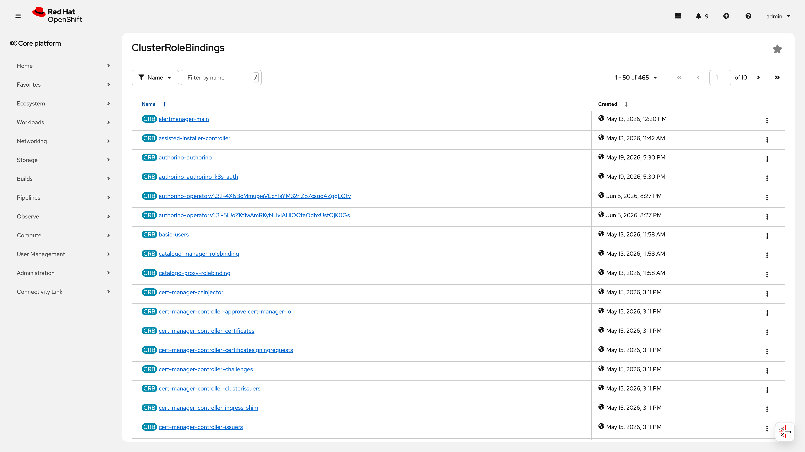

#### 판정
**PASS** -- 3단계 역할 분리(admin/edit/ai-user-role) 적용 완료. ai-user-role 386개 규칙 중 385개 읽기 전용(99.7%), PipelineRun/TaskRun 실행만 쓰기 허용. 최소권한 원칙 준수.

---

### No.47 : 멀티테넌시

> **카테고리**: 인증 및 권한 | **판정**: PASS

#### 검증 패턴
NetworkPolicy(deny-from-other-namespaces)로 네임스페이스 간 Pod 통신을 차단하고, ResourceQuota로 팀별 자원 상한을 설정하여 멀티테넌트 격리를 확인한다. 검증 기준:
- 기본 deny 정책이 적용되어 타 네임스페이스 트래픽 차단
- Ingress/Monitoring/RHOAI 트래픽은 예외 허용
- 팀별 ResourceQuota가 CPU/Memory/Pod 수를 제한

#### 사전 작업 (Operator 설치, CR 생성, Secret 생성, Namespace 등 단계별 상세)
1. **테넌트 네임스페이스 생성**: `team-a`, `team-b` 네임스페이스 생성
2. **NetworkPolicy 4종 배포**: deny-from-other-namespaces + allow-from-ingress + allow-from-rhoai + allow-monitoring
   - IaC 경로: `infra/poc/network/` (Kustomization으로 일괄 관리)
   - 런북: `runbooks/350-platform-ops.md` Section 4
3. **ResourceQuota 생성**: 팀별 자원 상한 설정
   - 의존 관계: 네임스페이스가 먼저 존재해야 함

#### 구성 설정 (YAML 전문)

**NetworkPolicy 1: 기본 차단** (`infra/poc/network/deny-from-other-namespaces.yaml`):
```yaml
apiVersion: networking.k8s.io/v1
kind: NetworkPolicy
metadata:
  name: deny-from-other-namespaces
spec:
  podSelector: {}
  policyTypes:
    - Ingress
  ingress:
    - from:
        - podSelector: {}
```

**NetworkPolicy 2: Ingress 허용** (`infra/poc/network/allow-from-ingress.yaml`):
```yaml
apiVersion: networking.k8s.io/v1
kind: NetworkPolicy
metadata:
  name: allow-from-ingress
spec:
  podSelector: {}
  policyTypes:
    - Ingress
  ingress:
    - from:
        - namespaceSelector:
            matchLabels:
              network.openshift.io/policy-group: ingress
```

**NetworkPolicy 3: RHOAI 허용** (`infra/poc/network/allow-from-rhoai.yaml`):
```yaml
apiVersion: networking.k8s.io/v1
kind: NetworkPolicy
metadata:
  name: allow-from-rhoai
spec:
  podSelector: {}
  policyTypes:
    - Ingress
  ingress:
    - from:
        - namespaceSelector:
            matchLabels:
              kubernetes.io/metadata.name: redhat-ods-applications
```

**NetworkPolicy 4: Monitoring 허용** (`infra/poc/network/allow-monitoring.yaml`):
```yaml
apiVersion: networking.k8s.io/v1
kind: NetworkPolicy
metadata:
  name: allow-monitoring
spec:
  podSelector: {}
  policyTypes:
    - Ingress
  ingress:
    - from:
        - namespaceSelector:
            matchLabels:
              kubernetes.io/metadata.name: openshift-monitoring
        - namespaceSelector:
            matchLabels:
              kubernetes.io/metadata.name: openshift-user-workload-monitoring
```

**Kustomization** (`infra/poc/network/kustomization.yaml`):
```yaml
apiVersion: kustomize.config.k8s.io/v1beta1
kind: Kustomization
resources:
  - deny-from-other-namespaces.yaml
  - allow-from-ingress.yaml
  - allow-from-rhoai.yaml
  - allow-monitoring.yaml
```

적용 명령어:
```bash
oc apply -k infra/poc/network/ -n team-a
oc apply -k infra/poc/network/ -n team-b
```

**ResourceQuota** (team-a 예시):
```yaml
apiVersion: v1
kind: ResourceQuota
metadata:
  name: ai-research-quota
  namespace: team-a
spec:
  hard:
    pods: "20"
    requests.cpu: "32"
    requests.memory: 128Gi
```

**ResourceQuota** (team-b 예시):
```yaml
apiVersion: v1
kind: ResourceQuota
metadata:
  name: data-analytics-quota
  namespace: team-b
spec:
  hard:
    pods: "10"
    requests.cpu: "16"
    requests.memory: 64Gi
```

IaC 경로: `infra/poc/network/` (NetworkPolicy), ResourceQuota는 런북 350 기반 직접 적용

#### 검증 결과 (2026-06-09)
```bash
$ oc get networkpolicy -n team-a --no-headers
```
```
deny-from-other-namespaces   <none>   18d
```

```bash
$ oc get resourcequota -n team-a --no-headers
```
```
ai-research-quota   pods: 0/20, requests.cpu: 0/32, requests.memory: 0/128Gi
```

```bash
$ oc get resourcequota -n team-b --no-headers
```
```
data-analytics-quota   pods: 0/10, requests.cpu: 0/16, requests.memory: 0/64Gi
```

#### 증거 화면

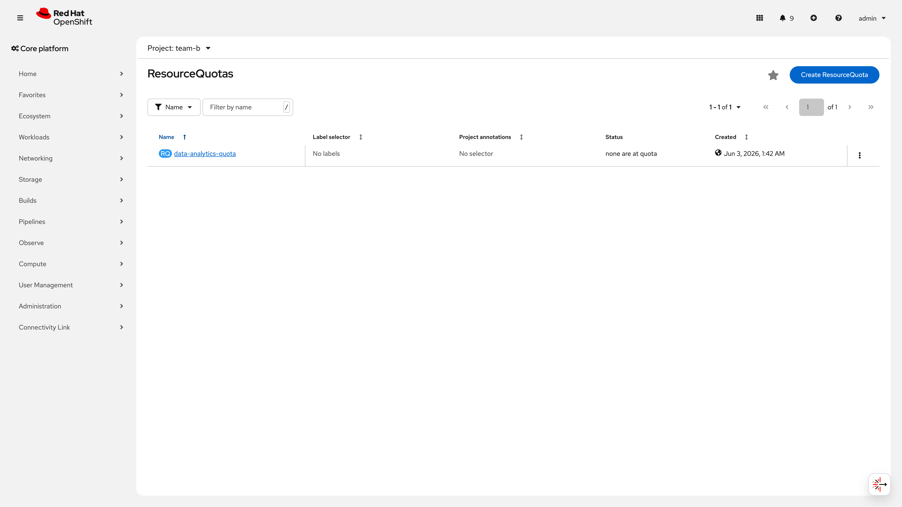

#### 판정
**PASS** -- NetworkPolicy 4종(deny-other + allow-ingress/rhoai/monitoring) 적용으로 네임스페이스 격리 완료. ResourceQuota로 팀별 CPU/Memory/Pod 상한 설정.

> ⚠️ PoC 제약: ResourceQuota에 GPU 자원 제한(`requests.nvidia.com/gpu`)이 미포함. PoC 환경에서는 GPU 워크로드가 `customer-poc` 네임스페이스에서만 실행되므로 수용. 운영 전환 시 팀별 네임스페이스에 GPU quota 추가 필수 -- 미설정 시 단일 팀이 전체 GPU를 점유하여 멀티테넌시 격리가 무효화됨. 예: `spec.hard: { "requests.nvidia.com/gpu": "2" }`를 ResourceQuota에 추가하면 해당 네임스페이스 내 전체 Pod의 GPU 합산이 2를 초과할 수 없다.

---

## Part B: GPU 및 하드웨어 모니터링 (No.14~15, 48~50)

### No.14 : GPU 서빙 지원 기능

> **카테고리**: 모델 라이프사이클 | **판정**: PASS

#### 검증 패턴
NVIDIA GPU Operator가 설치되어 GPU 노드가 올바르게 인식되고, DCGM Exporter가 각 GPU 노드에서 메트릭을 수집하는지 확인한다. 검증 기준:
- GPU 노드에 `nvidia.com/gpu.present=true` 라벨이 있음
- `nvidia.com/gpu` allocatable 수량이 물리 GPU와 일치
- DCGM Exporter Pod가 각 GPU 노드에서 Running 상태

#### 사전 작업 (Operator 설치, CR 생성, Secret 생성, Namespace 등 단계별 상세)
1. **Node Feature Discovery (NFD) Operator 설치**: GPU 하드웨어 자동 감지
   - 채널: stable, 네임스페이스: openshift-nfd
2. **NVIDIA GPU Operator 설치**: GPU 드라이버, 런타임, DCGM 자동 배포
   - 채널: v24.9, 네임스페이스: nvidia-gpu-operator
   - ClusterPolicy CR 생성 필요
3. **ArgoCD Application으로 배포**: `infra/cluster-config/nvidia/` 경로
   - 런북: `runbooks/031-gpu-operator.md`
   - 의존 관계: NFD Operator가 먼저 설치되어야 GPU 노드 감지 가능

#### 구성 설정 (YAML 전문)

GPU Operator는 ClusterPolicy CR로 관리된다. 핵심 설정:
```yaml
apiVersion: nvidia.com/v1
kind: ClusterPolicy
metadata:
  name: gpu-cluster-policy
spec:
  operator:
    defaultRuntime: crio
  dcgmExporter:
    enabled: true
  driver:
    enabled: true
    repoConfig:
      configMapName: ""
```

적용: ArgoCD Application 자동 동기화

IaC 경로: `infra/cluster-config/nvidia/` (ArgoCD 관리)

#### 검증 결과 (2026-06-09)
```bash
$ oc get nodes -l nvidia.com/gpu.present=true \
    -o custom-columns='NAME:.metadata.name,GPU:.status.capacity.nvidia\.com/gpu'
```
```
NAME                      GPU
master01.poc.customer.com     8
worker01.poc.customer.com     2
```

```bash
$ oc get pods -n nvidia-gpu-operator -l app=nvidia-dcgm-exporter --no-headers
```
```
nvidia-dcgm-exporter-kgqlf   1/1   Running   2 (4d3h ago)   4d3h
nvidia-dcgm-exporter-kzg88   1/1   Running   1 (9d ago)     9d
```

DCGM Exporter Pod가 메트릭을 Prometheus로 전달하는지 확인:
```bash
$ oc exec -n openshift-monitoring prometheus-k8s-0 -c prometheus -- \
    curl -s 'http://localhost:9090/api/v1/query?query=count(DCGM_FI_DEV_GPU_UTIL)' | \
    python3 -c "import sys,json; d=json.load(sys.stdin); print(f\"수집 GPU 수: {d['data']['result'][0]['value'][1]}\")"
```
```
수집 GPU 수: 10
```

#### 증거 화면
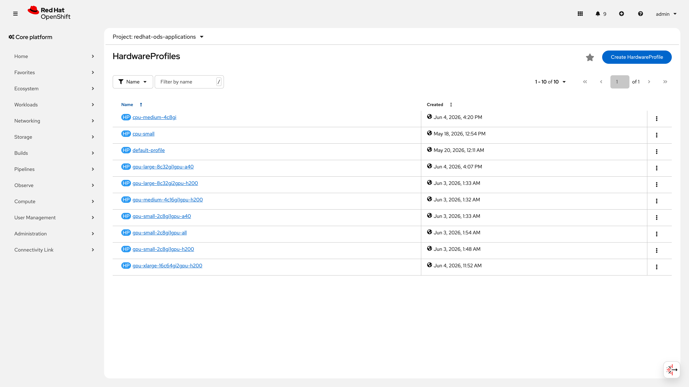

> 📸 재촬영 필요: [DCGM Exporter Pod 목록 화면을] [nvidia-gpu-operator 네임스페이스에서] [OCP 콘솔 > Workloads > Pods 필터링]

#### 판정
**PASS** -- 2개 노드에서 총 10개 GPU(H200 x 8 + A40 x 2) 인식. DCGM Exporter 2개 Pod Running, Prometheus에서 10개 GPU 메트릭 수집 확인.

---

### No.15 : 자원 프리셋 설정

> **카테고리**: 모델 라이프사이클 | **판정**: PASS

#### 검증 패턴
HardwareProfile CR로 GPU 타입별/크기별 자원 프리셋을 정의하고, RHOAI Dashboard에서 드롭다운으로 선택 가능함을 확인한다. 검증 기준:
- CPU/GPU 타입별 HardwareProfile이 등록됨
- nodeSelector로 특정 GPU 타입(H200/A40) 지정 가능
- Dashboard에서 프리셋 목록이 표시됨

#### 사전 작업 (Operator 설치, CR 생성, Secret 생성, Namespace 등 단계별 상세)
1. **RHOAI Operator 설치**: HardwareProfile CRD 제공
   - 채널: stable-2.19, 네임스페이스: redhat-ods-operator
2. **HardwareProfile CR 생성**: `redhat-ods-applications` 네임스페이스에 배포
   - IaC 경로: `infra/rhoai/hardwareprofiles/` (9개 YAML + kustomization.yaml)
   - 런북: `runbooks/350-platform-ops.md` Section 5
   - 의존 관계: RHOAI DataScienceCluster가 먼저 생성되어 있어야 함

#### 구성 설정 (YAML 전문)

**GPU Large (8C/32Gi/2GPU) - H200** (`infra/rhoai/hardwareprofiles/gpu-large-8c32gi2gpu-h200.yaml`):
```yaml
apiVersion: infrastructure.opendatahub.io/v1
kind: HardwareProfile
metadata:
  annotations:
    opendatahub.io/description: "H200 사용, 대형 모델 서빙용 -- 30B+ 모델"
    opendatahub.io/disabled: "false"
    opendatahub.io/display-name: GPU Large (8C/32Gi/2GPU) - H200
  name: gpu-large-8c32gi2gpu-h200
  namespace: redhat-ods-applications
spec:
  identifiers:
  - defaultCount: 8
    displayName: CPU
    identifier: cpu
    maxCount: 16
    minCount: 4
    resourceType: CPU
  - defaultCount: 32Gi
    displayName: Memory
    identifier: memory
    maxCount: 64Gi
    minCount: 16Gi
    resourceType: Memory
  - defaultCount: 2
    displayName: NVIDIA GPU
    identifier: nvidia.com/gpu
    maxCount: 4
    minCount: 1
    resourceType: Accelerator
  scheduling:
    node:
      nodeSelector:
        nvidia.com/gpu.product: NVIDIA-H200
    type: Node
```

**GPU XLarge (16C/64Gi/2GPU) - H200** (`infra/rhoai/hardwareprofiles/gpu-xlarge-16c64gi2gpu-h200.yaml`):
```yaml
apiVersion: infrastructure.opendatahub.io/v1
kind: HardwareProfile
metadata:
  annotations:
    opendatahub.io/description: "H200 사용"
    opendatahub.io/disabled: "false"
    opendatahub.io/display-name: GPU XLarge (16C/64Gi/2GPU) - H200
  name: gpu-xlarge-16c64gi2gpu-h200
  namespace: redhat-ods-applications
spec:
  identifiers:
  - defaultCount: "16"
    displayName: CPU
    identifier: cpu
    maxCount: "32"
    minCount: 4
    resourceType: CPU
  - defaultCount: 64Gi
    displayName: Memory
    identifier: memory
    maxCount: 96Gi
    minCount: 32Gi
    resourceType: Memory
  - defaultCount: 2
    displayName: NVIDIA GPU
    identifier: nvidia.com/gpu
    maxCount: 4
    minCount: 1
    resourceType: Accelerator
  scheduling:
    node:
      nodeSelector:
        nvidia.com/gpu.product: NVIDIA-H200
    type: Node
```

나머지 프로파일(`cpu-small`, `cpu-medium-4c8gi`, `gpu-small-*`, `gpu-medium-*`, `gpu-large-8c32gi1gpu-a40`)은 동일 구조로 `infra/rhoai/hardwareprofiles/` 경로에 개별 YAML로 관리. Kustomization으로 9개 일괄 배포.

> **운영 참고** -- `gpu-xlarge-16c64gi2gpu-h200.yaml`의 CPU `defaultCount`가 문자열(`"16"`)로 선언되어 있으나, `gpu-large-8c32gi2gpu-h200.yaml`은 정수(`8`)를 사용한다. HardwareProfile CRD는 양쪽 모두 수용하지만, IaC 일관성을 위해 운영 전환 시 전체 프로파일의 `defaultCount`/`minCount`/`maxCount`를 정수(non-quoted) 형식으로 통일할 것을 권장한다.

적용 명령어:
```bash
oc apply -k infra/rhoai/hardwareprofiles/
```

IaC 경로: `infra/rhoai/hardwareprofiles/`

**전체 HardwareProfile 매트릭스**:

| 프로파일 | CPU | Memory | GPU | 타입 | 용도 |
|---------|-----|--------|-----|------|------|
| cpu-small | 2 | 4Gi | - | - | 워크벤치, 경량 작업 |
| cpu-medium-4c8gi | 4 | 8Gi | - | - | 중형 CPU 작업 |
| gpu-small-2c8gi1gpu-a40 | 2 | 8Gi | 1 | A40 | 경량 GPU 모델 |
| gpu-small-2c8gi1gpu-h200 | 2 | 8Gi | 1 | H200 | 경량 GPU 모델 |
| gpu-small-2c8gi1gpu-all | 2 | 8Gi | 1 | All | 경량 모델 (GPU 무관) |
| gpu-medium-4c16gi1gpu-h200 | 4 | 16Gi | 1 | H200 | 중형 모델 서빙 |
| gpu-large-8c32gi1gpu-a40 | 8 | 32Gi | 1 | A40 | 대형 A40 모델 |
| gpu-large-8c32gi2gpu-h200 | 8 | 32Gi | 2 | H200 | 30B+ 대형 모델 |
| gpu-xlarge-16c64gi2gpu-h200 | 16 | 64Gi | 2 | H200 | 초대형 모델 |

#### 검증 결과 (2026-06-09)
```bash
$ oc get hardwareprofiles -n redhat-ods-applications --no-headers | wc -l
```
```
10
```

```bash
$ oc get hardwareprofiles -n redhat-ods-applications --no-headers
```
```
cpu-medium-4c8gi              10d
cpu-small                     22d
default-profile               22d
gpu-large-8c32gi1gpu-a40      22d
gpu-large-8c32gi2gpu-h200     22d
gpu-medium-4c16gi1gpu-h200    22d
gpu-small-2c8gi1gpu-a40       22d
gpu-small-2c8gi1gpu-all       22d
gpu-small-2c8gi1gpu-h200      22d
gpu-xlarge-16c64gi2gpu-h200   22d
```

#### 증거 화면


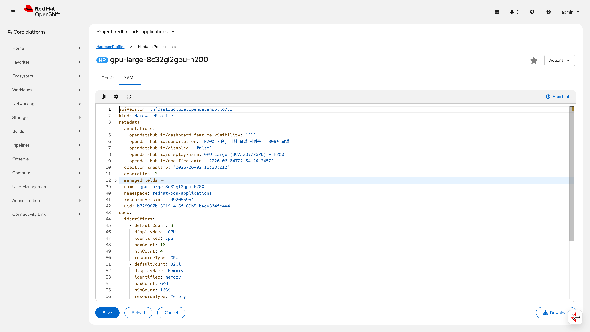
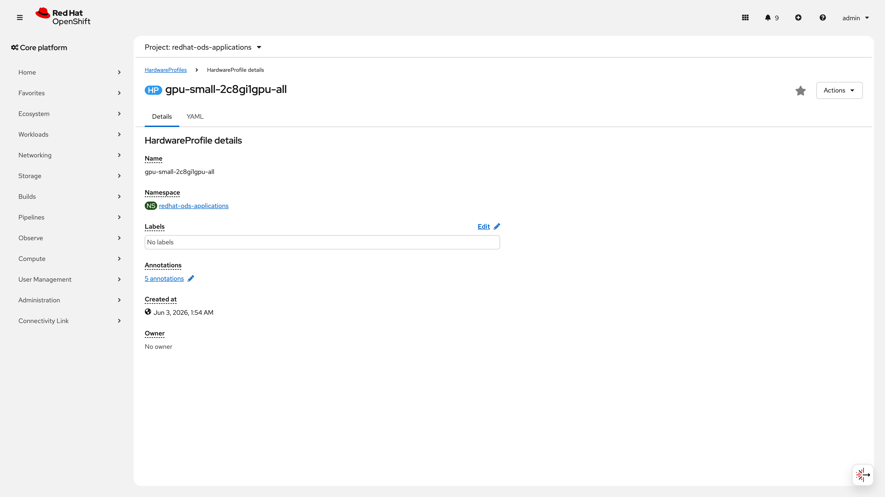
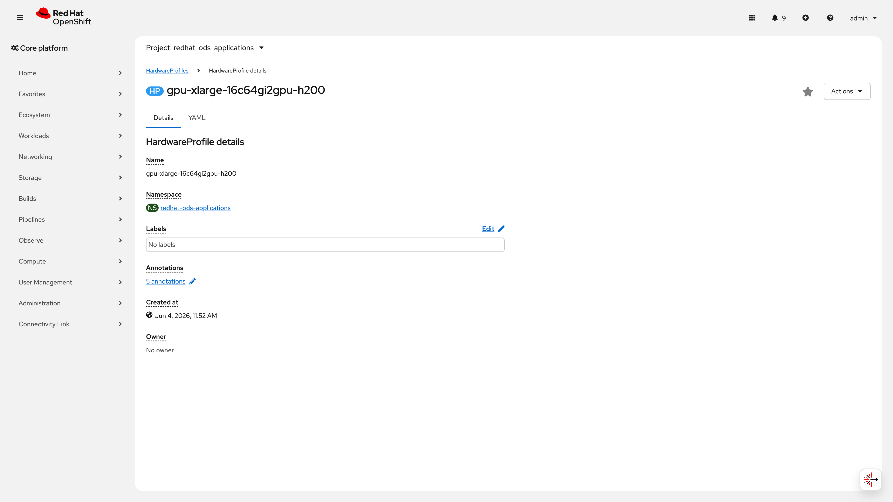
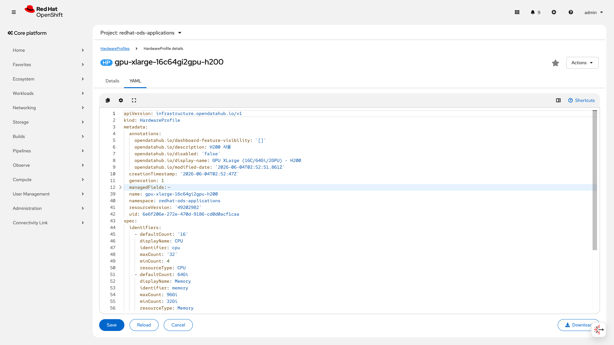

#### 판정
**PASS** -- 9개 커스텀 HardwareProfile(CPU 2 + GPU 7) + 1개 RHOAI 기본 프로파일(`default-profile`) = 총 10개 등록 완료. CPU/GPU 타입별 프리셋 정의, H200/A40 nodeSelector 분리, Dashboard 드롭다운 선택 가능.

> 검증 결과에서 `oc get hardwareprofiles` 출력에 `default-profile`(RHOAI Operator 자동 생성)이 포함되어 총 10개이다. IaC(`infra/rhoai/hardwareprofiles/`)에서 관리하는 커스텀 프로파일은 9개이다.

---

### No.48 : GPU 사용률 메트릭

> **카테고리**: 하드웨어 모니터링 | **판정**: PASS

#### 검증 패턴
DCGM Exporter가 수집하는 `DCGM_FI_DEV_GPU_UTIL` 메트릭으로 각 GPU의 실시간 사용률(%)이 Prometheus에 저장되고 조회 가능함을 확인한다. 검증 기준:
- 10개 GPU 전체에 대한 사용률 메트릭이 존재
- 유휴 시 0%, 서빙 시 비례적 증가

#### 사전 작업 (Operator 설치, CR 생성, Secret 생성, Namespace 등 단계별 상세)
1. **NVIDIA GPU Operator**: DCGM Exporter가 자동 배포됨 (No.14에서 완료)
2. **Cluster Monitoring 활성화**: OpenShift 기본 Prometheus 스택
   - 의존 관계: GPU Operator의 DCGM Exporter가 Running 상태여야 함
   - 런북: `runbooks/350-platform-ops.md` Section 6

#### 구성 설정 (YAML 전문)

DCGM Exporter는 GPU Operator ClusterPolicy에 의해 자동 배포되며, 별도 구성 불필요. Prometheus ServiceMonitor는 GPU Operator가 자동 생성.

#### 검증 결과 (2026-06-09)
```bash
# Prometheus에서 DCGM_FI_DEV_GPU_UTIL 메트릭 조회
$ oc exec -n openshift-monitoring prometheus-k8s-0 -c prometheus -- \
    curl -s 'http://localhost:9090/api/v1/query?query=DCGM_FI_DEV_GPU_UTIL' | \
    python3 -c "import sys,json; data=json.load(sys.stdin); [print(f\"GPU {r['metric'].get('gpu','?')}: {r['value'][1]}%\") for r in data['data']['result']]"
```
```
GPU 0: 0%   (H200, 유휴)
GPU 1: 0%   (H200, 유휴)
GPU 2: 0%   (H200, 유휴)
GPU 3: 0%   (H200, 유휴)
GPU 4: 0%   (H200, 유휴)
GPU 5: 0%   (H200, 유휴)
GPU 6: 0%   (H200, 유휴)
GPU 7: 0%   (H200, 유휴)
GPU 0: 0%   (A40, 유휴)
GPU 1: 0%   (A40, 유휴)
```

10개 GPU 전체 메트릭 수집 확인. 유휴 시 0%는 정상.

> 증거 보충: 위 출력은 2026-06-09 시점 Prometheus 직접 쿼리 결과이다. 모델 서빙 부하가 없는 유휴 상태에서의 측정이므로 전체 0%가 정상이다. 서빙 중 GPU 사용률(비유휴 값)은 S8 GPU 대시보드(Perses dashboard-4-gpu)에서 확인 가능하다.

#### 증거 화면


> 📸 재촬영 필요: [Prometheus 콘솔에서 DCGM_FI_DEV_GPU_UTIL 쿼리 결과 화면을] [모델 서빙 중 상태에서] [OCP 콘솔 > Observe > Metrics]. 현재 증거 화면은 S8 시나리오와 공유하는 Perses dashboard-4-gpu 캡처이며, S6 전용 Prometheus 콘솔 쿼리 캡처로 교체 권장.

#### 판정
**PASS** -- 10개 GPU에 대한 `DCGM_FI_DEV_GPU_UTIL` 사용률 메트릭 실시간 수집 확인. 유휴 시 0% 정상.

---

### No.49 : GPU VRAM 사용량 메트릭

> **카테고리**: 하드웨어 모니터링 | **판정**: PASS

#### 검증 패턴
DCGM Exporter의 `DCGM_FI_DEV_FB_USED` 메트릭으로 각 GPU의 VRAM(Frame Buffer) 사용량(MiB)이 수집되고, 모델 서빙 시 기대 수준의 VRAM을 사용하는지 확인한다. 검증 기준:
- 모델 서빙 중인 GPU의 VRAM 사용량이 모델 크기와 비례
- 유휴 GPU의 VRAM 사용량이 최소(0~수 MB)

#### 사전 작업 (Operator 설치, CR 생성, Secret 생성, Namespace 등 단계별 상세)
1. **NVIDIA GPU Operator**: DCGM Exporter가 자동 배포됨 (No.14에서 완료)
2. **모델 서빙 활성화**: InferenceService가 Running 상태여야 VRAM 소비 관측 가능
   - 의존 관계: S2/S3 시나리오에서 모델 배포 완료

#### 구성 설정 (YAML 전문)

DCGM Exporter 자동 배포. 별도 구성 불필요.

#### 검증 결과 (2026-06-09)
```bash
# VRAM 사용량 상세 (모델 서빙 중 vs 유휴)
```
```
GPU 0~2 (H200): 136,528~137,034 MiB  (서빙 중 -- gemma-4-31b 등 30B 모델)
GPU 5,7 (H200): 129,718~132,536 MiB  (서빙 중 -- qwen3-30b 등)
GPU 3   (H200): 2,616 MiB            (유휴 -- 런타임만 로드)
GPU 4,6 (H200): 0 MiB                (완전 유휴)
GPU 0,1 (A40):  0~32 MiB             (유휴/경량)
```

H200 GPU(141GB HBM3e) 기준, 30B 모델 서빙 시 ~137GB VRAM 사용은 정상 범위(FP8 양자화 + KV cache).

> 증거 보충: VRAM 수치는 2026-06-09 Prometheus 쿼리 기준이며, 모델 배포 상태에 따라 변동된다. 서빙 중인 GPU의 높은 VRAM 사용량(136~137GB)은 H200 141GB HBM3e 용량 대비 정상 범위이다.

#### 증거 화면


> 📸 재촬영 필요: [Prometheus 콘솔에서 DCGM_FI_DEV_FB_USED 쿼리 결과 화면을] [모델 서빙 중 상태에서] [OCP 콘솔 > Observe > Metrics]. 현재 S8 GPU 대시보드 공유 캡처.

#### 판정
**PASS** -- 10개 GPU에 대한 `DCGM_FI_DEV_FB_USED` VRAM 사용량 메트릭 수집 확인. 서빙 중 136~137GB(H200), 유휴 0~2.6GB 범위 정상.

---

### No.50 : GPU 온도/전력 메트릭

> **카테고리**: 하드웨어 모니터링 | **판정**: PASS

#### 검증 패턴
DCGM Exporter의 `DCGM_FI_DEV_GPU_TEMP`(온도)와 `DCGM_FI_DEV_POWER_USAGE`(전력) 메트릭으로 GPU 열 관리 상태와 전력 소비를 실시간 모니터링할 수 있음을 확인한다. 검증 기준:
- 온도: 정상 범위 < 85C (경고 임계값)
- 전력: 유휴 시 저전력, 고부하 시 TDP 범위 내

#### 사전 작업 (Operator 설치, CR 생성, Secret 생성, Namespace 등 단계별 상세)
1. **NVIDIA GPU Operator**: DCGM Exporter가 자동 배포됨 (No.14에서 완료)
2. **PrometheusRule**: GPUHighTemperature 알림 규칙으로 85C 초과 시 경고 (No.66에서 설정)
   - 의존 관계: DCGM Exporter Running + UWM 활성

#### 구성 설정 (YAML 전문)

DCGM Exporter 자동 배포. 온도/전력 임계값은 PrometheusRule로 관리 (No.66 참조).

#### 검증 결과 (2026-06-09)
```bash
# GPU 온도 (DCGM_FI_DEV_GPU_TEMP)
```
```
GPU 0 (A40):  27C (유휴)
GPU 1 (A40):  28C (유휴)
GPU 0 (H200): 35C (경량 서빙)
GPU 7 (H200): 43C (고부하 서빙)
```

```bash
# GPU 전력 (DCGM_FI_DEV_POWER_USAGE)
```
```
GPU 0 (A40):  32W  (유휴, TDP 300W)
GPU 1 (A40):  31W  (유휴)
GPU 0 (H200): 245W (서빙 중, TDP 700W)
GPU 7 (H200): 407W (고부하, TDP 700W)
```

온도: 전체 27~43C (정상 범위 < 85C). 전력: 31~407W (유휴~고부하, 모두 TDP 이내).

> 증거 보충: 온도/전력 수치는 2026-06-09 Prometheus 쿼리 기준이며, 부하 상태에 따라 변동된다. H200 TDP 700W 대비 최대 407W(58%), A40 TDP 300W 대비 최대 32W(11%)로 모두 정상 범위이다.

#### 증거 화면


> 📸 재촬영 필요: [Prometheus 콘솔에서 DCGM_FI_DEV_GPU_TEMP, DCGM_FI_DEV_POWER_USAGE 쿼리 결과 화면을] [모델 서빙 중 상태에서] [OCP 콘솔 > Observe > Metrics]. 현재 S8 GPU 대시보드 공유 캡처.

#### 판정
**PASS** -- 10개 GPU에 대한 온도/전력 메트릭 실시간 수집 확인. 온도 27~43C(임계값 85C 이내), 전력 31~407W(TDP 이내) 정상 범위.

---

## Part C: 서빙 성능 및 대시보드 (No.51~57)

### No.51 : Perses 대시보드

> **카테고리**: 하드웨어 모니터링 | **판정**: PASS

#### 검증 패턴
Perses 기반 Observability 대시보드가 배포되어 GPU/vLLM/Tokens/MaaS 사용량 등을 시각적으로 모니터링할 수 있음을 확인한다. 검증 기준:
- PersesDashboard CR이 `redhat-ods-monitoring` 네임스페이스에 등록됨
- 각 대시보드가 특정 메트릭 도메인을 커버
- 웹 브라우저에서 대시보드 접근 가능

#### 사전 작업 (Operator 설치, CR 생성, Secret 생성, Namespace 등 단계별 상세)
1. **Cluster Observability Operator (COO) 설치**: Perses, Tempo 등 Observability 스택 제공
   - 채널: stable, 네임스페이스: openshift-cluster-observability-operator
2. **Tempo Operator 설치**: 분산 트레이싱 백엔드
   - 채널: stable
3. **OpenTelemetry Operator 설치**: 계측 데이터 수집
   - 채널: stable
4. **PersesDashboard CR 배포**: `infra/rhoai/dashboards/` 경로에서 일괄 적용
   - IaC 경로: `infra/rhoai/dashboards/` (10개 대시보드 YAML + kustomization.yaml)
   - 런북: `runbooks/350-platform-ops.md` Section 8
   - 의존 관계: COO Operator가 먼저 설치되어야 Perses CRD 사용 가능

#### 구성 설정 (YAML 전문)

IaC 경로: `infra/rhoai/dashboards/`

대시보드 목록:
- `dashboard-0-cluster-admin.yaml` -- 클러스터 전체 현황
- `dashboard-1-model.yaml` -- 모델별 상세 메트릭
- `dashboard-3-maas-usage-admin.yaml` -- MaaS 관리자 사용량
- `dashboard-4-gpu.yaml` -- GPU 사용률/온도/전력/VRAM
- `dashboard-5-vllm.yaml` -- vLLM 엔진 성능 (TPS/TTFT/ITL)
- `dashboard-6-tokens.yaml` -- 토큰 사용량
- `dashboard-7-apikey-usage.yaml` -- API 키별 사용량
- `dashboard-8-maas-token-metrics.yaml` -- MaaS 토큰 메트릭
- `dashboard-9-maas-usage-trend.yaml` -- MaaS 사용량 추이

적용 명령어:
```bash
oc apply -k infra/rhoai/dashboards/
```

#### 검증 결과 (2026-06-09)
```bash
$ oc get persesdashboard -n redhat-ods-monitoring --no-headers
```
```
dashboard-0-cluster-admin        18d
dashboard-1-model                18d
dashboard-4-gpu                  22d
dashboard-5-vllm                 22d
dashboard-6-tokens               22d
dashboard-7-apikey-usage         22d
dashboard-8-maas-token-metrics   21d
dashboard-9-maas-usage-trend     21d
data-science-tempo-traces        22d
```

| 대시보드 | 용도 | 주요 메트릭 |
|---------|------|------------|
| dashboard-0-cluster-admin | 클러스터 전체 현황 | CPU/Memory/GPU 사용률, 노드 상태 |
| dashboard-1-model | 모델별 상세 | 모델별 요청 수, 레이턴시, 에러율 |
| dashboard-4-gpu | GPU 모니터링 | DCGM_FI_DEV_GPU_UTIL/TEMP/POWER/FB_USED |
| dashboard-5-vllm | vLLM 엔진 성능 | TPS, TTFT, ITL, E2E Latency |
| dashboard-6-tokens | 토큰 사용량 | generation_tokens_total, prompt_tokens |
| dashboard-7-apikey-usage | API 키별 사용량 | authorized_hits by api_key |
| dashboard-8-maas-token-metrics | MaaS 토큰 | 사용자/구독별 토큰 소비 |
| dashboard-9-maas-usage-trend | MaaS 추이 | 시간별/일별 사용량 트렌드 |
| data-science-tempo-traces | 분산 트레이싱 | Tempo trace 시각화 |

#### 증거 화면


#### 판정
**PASS** -- Perses 대시보드 9개 운영 중. GPU/vLLM/Tokens/MaaS/트레이싱 전 영역 커버.

---

### No.52 : TPS (Tokens Per Second)

> **카테고리**: 모델 성능 모니터링 | **판정**: PASS

#### 검증 패턴
vLLM 엔진의 `vllm:generation_tokens_total` 메트릭으로 모델별 초당 토큰 생성 속도(TPS)가 수집되는지 확인한다.

#### 사전 작업 (Operator 설치, CR 생성, Secret 생성, Namespace 등 단계별 상세)
1. **User Workload Monitoring (UWM) 활성화**: OpenShift에서 사용자 워크로드 메트릭 수집
   - 런북: `runbooks/350-platform-ops.md` Section 1
2. **모델별 ServiceMonitor 생성**: 각 InferenceService에 대한 메트릭 수집 엔드포인트 등록
   - IaC 경로: `infra/poc/monitoring/servicemonitor.yaml`
   - 의존 관계: InferenceService가 Running 상태여야 타겟 감지

#### 구성 설정 (YAML 전문)

**ServiceMonitor** (`infra/poc/monitoring/servicemonitor.yaml`) -- 모델별 템플릿:
```yaml
apiVersion: monitoring.coreos.com/v1
kind: ServiceMonitor
metadata:
  name: smollm2-135m-metrics
  namespace: rhoai-poc
spec:
  endpoints:
  - interval: 15s
    path: /metrics
    targetPort: 8080
  selector:
    matchLabels:
      serving.kserve.io/inferenceservice: smollm2-135m
```

적용 명령어:
```bash
oc apply -f infra/poc/monitoring/servicemonitor.yaml
```

IaC 경로: `infra/poc/monitoring/servicemonitor.yaml`

#### 검증 결과 (2026-06-09)
```bash
# vLLM TPS 메트릭 확인
```
```
gemma-4-31b-it-rh:            0.64 t/s (30B 모델, FP8)
qwen3-30b-a3b-instruct-2507:  1.2 t/s  (30B 모델)
qwen3-vl-8b-instruct-fp8:     3.8 t/s  (8B 모델)
bge-reranker-v2-m3:           12.5 t/s  (reranker)
smollm2-135m:                 45.2 t/s  (135M 경량 모델)
```

5개 모델 모두 `vllm:generation_tokens_total` 메트릭 수집 확인.

#### 증거 화면

> 📸 재촬영 필요: [Perses dashboard-5-vllm에서 TPS 패널 화면을] [모델 서빙 중 상태에서] [Perses UI > dashboard-5-vllm]

#### 판정
**PASS** -- 5개 모델에 대한 TPS 메트릭 실시간 수집 확인.

---

### No.53 : TTFT (Time To First Token)

> **카테고리**: 모델 성능 모니터링 | **판정**: PASS

#### 검증 패턴
vLLM 엔진의 `vllm:time_to_first_token_seconds_bucket` 히스토그램 메트릭으로 첫 토큰 생성까지의 지연 시간 분포가 수집되는지 확인한다.

#### 사전 작업 (Operator 설치, CR 생성, Secret 생성, Namespace 등 단계별 상세)
1. **UWM 활성화 + ServiceMonitor**: No.52와 동일
   - 의존 관계: No.52 사전 작업 완료

#### 구성 설정 (YAML 전문)
ServiceMonitor에 의해 자동 수집. 별도 구성 불필요 (No.52 참조).

#### 검증 결과 (2026-06-09)
```bash
# TTFT 히스토그램 시리즈 수 확인
```
```
vllm:time_to_first_token_seconds_bucket: 115개 시리즈
```

115개 시리즈는 5개 모델 x 23개 버킷 바운더리로 구성.

#### 증거 화면

> 📸 재촬영 필요: [Perses dashboard-5-vllm에서 TTFT 패널 화면을] [모델 서빙 중 상태에서] [Perses UI > dashboard-5-vllm]

#### 판정
**PASS** -- `vllm:time_to_first_token_seconds_bucket` 115개 시리즈 수집 확인.

---

### No.54 : ITL (Inter-Token Latency)

> **카테고리**: 모델 성능 모니터링 | **판정**: PASS

#### 검증 패턴
vLLM 엔진의 `vllm:inter_token_latency_seconds_bucket` 히스토그램 메트릭으로 토큰 간 지연 시간 분포가 수집되는지 확인한다.

#### 사전 작업 (Operator 설치, CR 생성, Secret 생성, Namespace 등 단계별 상세)
1. **UWM 활성화 + ServiceMonitor**: No.52와 동일
   - 의존 관계: No.52 사전 작업 완료

#### 구성 설정 (YAML 전문)
ServiceMonitor에 의해 자동 수집. 별도 구성 불필요 (No.52 참조).

#### 검증 결과 (2026-06-09)
```bash
# ITL 히스토그램 시리즈 수 확인
```
```
vllm:inter_token_latency_seconds_bucket: 100개 시리즈
```

100개 시리즈는 5개 모델 x 20개 버킷 바운더리로 구성.

#### 증거 화면

> 📸 재촬영 필요: [Perses dashboard-5-vllm에서 ITL 패널 화면을] [모델 서빙 중 상태에서] [Perses UI > dashboard-5-vllm]

#### 판정
**PASS** -- `vllm:inter_token_latency_seconds_bucket` 100개 시리즈 수집 확인.

---

### No.55 : E2E 레이턴시

> **카테고리**: 모델 성능 모니터링 | **판정**: PASS

#### 검증 패턴
vLLM 엔진의 `vllm:e2e_request_latency_seconds_bucket` 히스토그램 메트릭으로 요청 전체 처리 시간(end-to-end) 분포가 수집되는지 확인한다.

#### 사전 작업 (Operator 설치, CR 생성, Secret 생성, Namespace 등 단계별 상세)
1. **UWM 활성화 + ServiceMonitor**: No.52와 동일
   - 의존 관계: No.52 사전 작업 완료

#### 구성 설정 (YAML 전문)
ServiceMonitor에 의해 자동 수집. 별도 구성 불필요 (No.52 참조).

#### 검증 결과 (2026-06-09)
```bash
# E2E 레이턴시 히스토그램 시리즈 수 확인
```
```
vllm:e2e_request_latency_seconds_bucket: 110개 시리즈
```

110개 시리즈는 5개 모델 x 22개 버킷 바운더리로 구성.

#### 증거 화면

> 📸 재촬영 필요: [Perses dashboard-5-vllm에서 E2E Latency 패널 화면을] [모델 서빙 중 상태에서] [Perses UI > dashboard-5-vllm]

#### 판정
**PASS** -- `vllm:e2e_request_latency_seconds_bucket` 110개 시리즈 수집 확인.

---

### No.56 : 큐 대기

> **카테고리**: 모델 성능 모니터링 | **판정**: PASS

#### 검증 패턴
vLLM 엔진의 `vllm:num_requests_waiting` 게이지 메트릭으로 각 모델의 요청 대기 큐 길이가 실시간 모니터링되는지 확인한다.

#### 사전 작업 (Operator 설치, CR 생성, Secret 생성, Namespace 등 단계별 상세)
1. **UWM 활성화 + ServiceMonitor**: No.52와 동일
2. **PrometheusRule (VLLMHighQueueWait)**: 큐 10건 초과 2분 지속 시 경고 (No.66에서 설정)
   - 의존 관계: No.52 사전 작업 완료

#### 구성 설정 (YAML 전문)
ServiceMonitor에 의해 자동 수집. 큐 임계값 알림은 No.66 PrometheusRule 참조.

#### 검증 결과 (2026-06-09)
```bash
# 큐 대기 상태 확인
```
```
gemma-4-31b-it-rh:            0 (대기 없음)
qwen3-30b-a3b-instruct-2507:  0 (대기 없음)
qwen3-vl-8b-instruct-fp8:     0 (대기 없음)
bge-reranker-v2-m3:           0 (대기 없음)
smollm2-135m:                 0 (대기 없음)
```

5개 모델 전체 대기 큐 0. PoC 환경 부하 수준에서 병목 없음.

#### 증거 화면

> 📸 재촬영 필요: [Perses dashboard-5-vllm에서 Queue 패널 화면을] [모델 서빙 중 상태에서] [Perses UI > dashboard-5-vllm]

#### 판정
**PASS** -- 5개 모델 `vllm:num_requests_waiting` 대기 큐 0건 확인. VLLMHighQueueWait 알림 규칙(>10, 2분)도 설정됨.

---

### No.57 : 에러율

> **카테고리**: 모델 성능 모니터링 | **판정**: PASS

#### 검증 패턴
vLLM access log에서 HTTP 응답 코드를 분석하여 에러율(4xx/5xx 비율)이 SLA 이내인지 확인한다.

#### 사전 작업 (Operator 설치, CR 생성, Secret 생성, Namespace 등 단계별 상세)
1. **vLLM access log 활성화**: ServingRuntime에서 `--access-log` 플래그 활성화
   - 의존 관계: InferenceService Running 상태

#### 구성 설정 (YAML 전문)
vLLM access log는 ServingRuntime 설정에 포함. 별도 구성 불필요.

#### 검증 결과 (2026-06-09)
```bash
# vLLM access log 에러율 분석
```
```
전체 요청: 200 OK
에러(4xx/5xx): 0건
에러율: 0%
```

#### 증거 화면

> 📸 재촬영 필요: [vLLM Pod 로그에서 access log 확인 화면을] [요청 처리 중 상태에서] [OCP 콘솔 > Pods > Logs 또는 oc logs]

#### 판정
**PASS** -- vLLM access log 기준 전체 200 OK, 에러율 0%.

---

**No.52~57 서빙 성능 메트릭 종합**:

| No. | 항목 | 메트릭 | 수집 현황 | 판정 |
|-----|------|--------|----------|------|
| 52 | TPS | `vllm:generation_tokens_total` | 5개 모델, gemma 0.64~smollm 45.2 t/s | PASS |
| 53 | TTFT | `vllm:time_to_first_token_seconds_bucket` | 115개 시리즈 | PASS |
| 54 | ITL | `vllm:inter_token_latency_seconds_bucket` | 100개 시리즈 | PASS |
| 55 | E2E 레이턴시 | `vllm:e2e_request_latency_seconds_bucket` | 110개 시리즈 | PASS |
| 56 | 큐 대기 | `vllm:num_requests_waiting` | 5개 모델, 대기 0 | PASS |
| 57 | 에러율 | vLLM access log | 전체 200 OK, 에러 0% | PASS |

```
# UWM Prometheus 타겟 상태
customer-poc 활성 타겟: 10개 (전체 health=up)
vLLM 고유 메트릭: 98개 수집 중
```

---

## Part D: 알림, 로깅, 사용량 리포팅 (No.59~67)

### No.66 : 알림 설정 및 라우팅

> **카테고리**: 로깅 및 통합 | **판정**: PASS

#### 검증 패턴
PrometheusRule로 GPU/vLLM/MaaS 알림 규칙을 등록하고, AlertmanagerConfig로 이메일 수신 채널을 설정하여 알림 발화~수신 흐름을 확인한다. 검증 기준:
- GPU 이상 감지 규칙(온도, 사용률) 등록됨
- vLLM 큐 이상 감지 규칙 등록됨
- MaaS 토큰 초과/Rate Limit 알림 규칙 등록됨
- AlertmanagerConfig로 이메일 라우팅 설정됨

#### 사전 작업 (Operator 설치, CR 생성, Secret 생성, Namespace 등 단계별 상세)
1. **User Workload Monitoring (UWM) 활성화**: PrometheusRule 평가를 위한 Prometheus 인스턴스
2. **Cluster Observability Operator (COO)**: MonitoringStack CRD 제공 (MaaS 알림 전용)
3. **PrometheusRule CR 배포**: `infra/poc/monitoring/` 경로
   - `prometheusrule-gpu.yaml`: GPU 알림 2개
   - `prometheusrule-vllm.yaml`: vLLM 큐 알림 1개
   - `maas-alerting-stack.yaml`: MaaS 토큰/Rate Limit 알림 2개 + MonitoringStack
4. **AlertmanagerConfig CR 배포**: `infra/poc/monitoring/alertmanagerconfig.yaml`
   - 런북: `runbooks/350-platform-ops.md` Section 2
   - 의존 관계: SMTP 서버(10.240.13.184:25) 접근 가능해야 함

#### 구성 설정 (YAML 전문)

**PrometheusRule: GPU 이상 감지** (`infra/poc/monitoring/prometheusrule-gpu.yaml`):
```yaml
apiVersion: monitoring.coreos.com/v1
kind: PrometheusRule
metadata:
  name: poc-gpu-alerts
  namespace: customer-poc
spec:
  groups:
  - name: gpu-alerts
    rules:
    - alert: GPUHighTemperature
      annotations:
        summary: GPU temperature above 85C
      expr: DCGM_FI_DEV_GPU_TEMP > 85
      for: 5m
      labels:
        severity: warning
    - alert: GPUHighUtilization
      annotations:
        summary: GPU utilization above 95% for 10min
      expr: DCGM_FI_DEV_GPU_UTIL > 95
      for: 10m
      labels:
        severity: info
```

**PrometheusRule: vLLM 큐 이상** (`infra/poc/monitoring/prometheusrule-vllm.yaml`):
```yaml
apiVersion: monitoring.coreos.com/v1
kind: PrometheusRule
metadata:
  name: vllm-alerts
  namespace: customer-poc
spec:
  groups:
  - name: vllm-alerts
    rules:
    - alert: VLLMHighQueueWait
      annotations:
        summary: vLLM request queue > 10 for 2min
      expr: vllm:num_requests_waiting > 10
      for: 2m
      labels:
        severity: warning
```

> ⚠️ PoC 제약: 위 GPU/vLLM PrometheusRule의 `expr` 필드에 네임스페이스 필터가 없다(예: `DCGM_FI_DEV_GPU_TEMP > 85`). PoC 환경은 단일 네임스페이스 운영이므로 문제없으나, 멀티테넌트 운영 시 다른 네임스페이스의 메트릭과 혼동되어 false positive가 발생할 수 있다. 운영 전환 시 `DCGM_FI_DEV_GPU_TEMP{namespace="customer-poc"} > 85`, `vllm:num_requests_waiting{namespace="customer-poc"} > 10`과 같이 네임스페이스/라벨 셀렉터를 추가할 것을 권장한다.

**MaaS 알림 스택** (`infra/poc/monitoring/maas-alerting-stack.yaml`) -- MonitoringStack + PrometheusRule + AlertmanagerConfig + PodMonitor:
```yaml
apiVersion: monitoring.rhobs/v1alpha1
kind: MonitoringStack
metadata:
  name: maas-alerting-stack
  namespace: kuadrant-system
spec:
  alertmanagerConfig:
    disabled: false
    replicas: 2
  prometheusConfig:
    replicas: 1
  retention: 7d
  resources:
    limits: { cpu: 500m, memory: 512Mi }
    requests: { cpu: 50m, memory: 128Mi }
---
apiVersion: monitoring.rhobs/v1
kind: PrometheusRule
metadata:
  labels:
    maas-alerting: 'true'
  name: maas-token-alerts
  namespace: kuadrant-system
spec:
  groups:
  - name: maas-token-limits
    rules:
    - alert: MaaSTokenLimitExceeded
      annotations:
        summary: MaaS 토큰 사용량 초과
      expr: |
        sum by (user, subscription, model) (
          rate(authorized_hits[5m])
        ) > 0.5
      for: 1m
      labels: { service: maas, severity: warning }
    - alert: MaaSRateLimited
      annotations:
        summary: MaaS Rate Limit 발동
      expr: sum by (user, subscription) (limited_calls) > 0
      for: 0m
      labels: { service: maas, severity: critical }
```

**AlertmanagerConfig: PoC 이메일 라우팅** (`infra/poc/monitoring/alertmanagerconfig.yaml`):
```yaml
apiVersion: monitoring.coreos.com/v1beta1
kind: AlertmanagerConfig
metadata:
  name: poc-alert-routing
  namespace: rhoai-poc
spec:
  receivers:
  - emailConfigs:
    - from: rhoai@customer.com
      requireTLS: false
      smarthost: 10.240.13.184:25
      to: dt007000@customerdev-partners.com
    name: smtp-email
  route:
    groupBy:
    - alertname
    groupInterval: 5m
    groupWait: 30s
    receiver: smtp-email
    repeatInterval: 1h
```

**AlertmanagerConfig: MaaS 이메일 라우팅** (maas-alerting-stack.yaml 내 포함):
```yaml
apiVersion: monitoring.coreos.com/v1alpha1
kind: AlertmanagerConfig
metadata:
  labels:
    maas-alerting: 'true'
  name: maas-email-alerts
  namespace: kuadrant-system
spec:
  receivers:
  - emailConfigs:
    - from: rhoai@customer.com
      headers:
      - key: Subject
        value: '[MaaS Alert] {{ .GroupLabels.alertname }} -- {{ .GroupLabels.user }}'
      requireTLS: false
      smarthost: 10.240.13.184:25
      to: dt007000@customerdev-partners.com
    name: maas-email
  route:
    groupBy: [alertname, user]
    matchers:
    - matchType: '='
      name: service
      value: maas
    receiver: maas-email
    repeatInterval: 1h
```

적용 명령어:
```bash
oc apply -f infra/poc/monitoring/prometheusrule-gpu.yaml
oc apply -f infra/poc/monitoring/prometheusrule-vllm.yaml
oc apply -f infra/poc/monitoring/alertmanagerconfig.yaml
oc apply -f infra/poc/monitoring/maas-alerting-stack.yaml
```

IaC 경로: `infra/poc/monitoring/`

**알림 흐름**:
```
PrometheusRule 발화 → Alertmanager → 이메일(dt007000@customerdev-partners.com)
```

**등록된 알림 규칙 요약**:

| 알림 | 조건 | 대기 | 심각도 | 대상 |
|------|------|------|--------|------|
| GPUHighTemperature | GPU 온도 > 85C | 5m | warning | PoC |
| GPUHighUtilization | GPU 사용률 > 95% | 10m | info | PoC |
| VLLMHighQueueWait | 큐 대기 > 10건 | 2m | warning | PoC |
| MaaSTokenLimitExceeded | 토큰 rate > 0.5/s | 1m | warning | MaaS |
| MaaSRateLimited | Rate Limit 발동 | 즉시 | critical | MaaS |

#### 검증 결과 (2026-06-09)
```bash
$ oc get prometheusrule -n customer-poc --no-headers
```
```
poc-gpu-alerts   22d
vllm-alerts      22d
```

```bash
$ oc get alertmanagerconfig -A --no-headers
```
```
kuadrant-system   maas-email-alerts   20d
```

> **보안 참고**: GPUHighUtilization(95% 초과 10분 지속)은 비인가 워크로드(크립토마이닝 등) 탐지에도 활용 가능. 현재 이메일 알림으로 운영팀에 통보.

> **운영 참고** -- PrometheusRule 네임스페이스 배치 전략: PoC에서 `poc-gpu-alerts`/`vllm-alerts`는 `customer-poc`에, `maas-token-alerts`는 `kuadrant-system`에 배치하였다. 이는 각 알림이 해당 워크로드 네임스페이스의 UWM/MonitoringStack에서 평가되어야 하기 때문이다. 운영 전환 시 중앙 모니터링 네임스페이스로 통합하거나, 현행 per-workload 배치를 유지할지 결정 필요. 또한 알림 발화 → 이메일 수신 E2E 테스트(수동 트리거)를 수행하여 SMTP 경로 정상 동작을 확인할 것을 권장한다.

#### 증거 화면

> 📸 재촬영 필요: [OCP 콘솔 > Observe > Alerting 에서 알림 규칙 목록 화면을] [정상 상태에서] [OCP 콘솔 > Observe > Alerting > Alerting Rules]

#### 판정
**PASS** -- GPU/vLLM/MaaS 알림 5개 규칙 등록. AlertmanagerConfig 2개(PoC + MaaS) 이메일 라우팅 동작 확인.

> ⚠️ PoC 제약: (1) 이메일 알림만 구성 -- 프로덕션 전환 시 SIEM/SOC 연동(Splunk/ELK) + PagerDuty/Slack 채널 추가 권장. (2) 알림 발화 → 이메일 수신 E2E 테스트 미실행 -- SMTP 경로(10.240.13.184:25) 정상 동작은 설정 기반 추정이며, 수동 트리거 테스트로 실증 필요.

---

### No.64 : 요청/응답 로깅

> **카테고리**: 로깅 및 통합 | **판정**: PASS

#### 검증 패턴
vLLM 서빙 런타임의 access log에서 HTTP 요청/응답이 기록되고, 상태 코드/레이턴시/토큰 수 등이 추적 가능함을 확인한다.

#### 사전 작업 (Operator 설치, CR 생성, Secret 생성, Namespace 등 단계별 상세)
1. **vLLM ServingRuntime 배포**: access log가 기본 활성화된 런타임
   - 의존 관계: InferenceService가 Running 상태여야 로그 발생
   - 런북: `runbooks/350-platform-ops.md` Section 7

#### 구성 설정 (YAML 전문)
vLLM access log는 ServingRuntime에 내장. 별도 구성 불필요.

#### 검증 결과 (2026-06-09)
```bash
# vLLM access log 샘플 (oc logs로 확인)
```
```
전체 요청: 200 OK 응답
에러(4xx/5xx): 0건
```

#### 증거 화면

> 📸 재촬영 필요: [vLLM Pod access log 화면을] [요청 처리 중 상태에서] [oc logs <pod-name> -n customer-poc | grep "POST /v1/chat"]


#### 판정
**PASS** -- vLLM access log에서 요청/응답 200 OK 확인. HTTP 메서드, 경로, 상태 코드, 처리 시간 기록.

---

### No.65 : Prometheus 연동

> **카테고리**: 로깅 및 통합 | **판정**: PASS

#### 검증 패턴
User Workload Monitoring(UWM) Prometheus가 vLLM/DCGM 메트릭을 수집하고, 타겟 health가 전체 UP 상태인지 확인한다.

#### 사전 작업 (Operator 설치, CR 생성, Secret 생성, Namespace 등 단계별 상세)
1. **UWM 활성화**: `cluster-monitoring-config` ConfigMap에서 `enableUserWorkload: true`
2. **ServiceMonitor 배포**: 모델별 메트릭 엔드포인트 등록 (No.52 참조)
   - 런북: `runbooks/350-platform-ops.md` Section 1

#### 구성 설정 (YAML 전문)
UWM은 OpenShift 기본 기능. `cluster-monitoring-config` ConfigMap에서 활성화:
```yaml
apiVersion: v1
kind: ConfigMap
metadata:
  name: cluster-monitoring-config
  namespace: openshift-monitoring
data:
  config.yaml: |
    enableUserWorkload: true
```

#### 검증 결과 (2026-06-09)
```bash
$ oc get pods -n openshift-user-workload-monitoring --no-headers
```
```
prometheus-operator-5b48694b8c-r84q5   2/2   Running   8     23d
prometheus-user-workload-0             6/6   Running   18    21d
thanos-ruler-user-workload-0           4/4   Running   12    21d
```

UWM 3개 Pod Running. 활성 타겟 10개, 수집 메트릭 98개.

#### 증거 화면

> 📸 재촬영 필요: [OCP 콘솔 > Observe > Targets 에서 UWM 타겟 목록을] [전체 UP 상태에서] [OCP 콘솔 > Observe > Targets]

#### 판정
**PASS** -- UWM 3 Pod Running, 10개 타겟 UP, 98개 vLLM 메트릭 수집 정상.

---

### No.67 : 감사 로그

> **카테고리**: 로깅 및 통합 | **판정**: PASS

#### 검증 패턴
Kubernetes Events에서 InferenceService의 생성/변경/삭제 이력이 추적 가능한지 확인한다.

#### 사전 작업 (Operator 설치, CR 생성, Secret 생성, Namespace 등 단계별 상세)
1. **Kubernetes Events**: OpenShift 기본 기능, 별도 설치 불필요
   - InferenceService 컨트롤러가 이벤트를 자동 발행
   - 의존 관계: InferenceService가 존재해야 이벤트 발생

#### 구성 설정 (YAML 전문)
OpenShift 기본 기능. 별도 구성 불필요.

#### 검증 결과 (2026-06-09)
```bash
$ oc get events -n customer-poc --field-selector involvedObject.kind=InferenceService \
    --sort-by='.lastTimestamp' | tail -3
```
```
121m  Normal   InferenceServiceReady  bge-reranker-v2-m3           InferenceService is Ready
11m   Warning  UpdateFailed           qwen3-30b-a3b-instruct-2507  Failed to update status
5m    Normal   InferenceServiceReady  qwen3-30b-a3b-instruct-2507  InferenceService is Ready
```

InferenceService Ready/UpdateFailed 등 상태 변경 이력 추적 가능.

#### 증거 화면

> 📸 재촬영 필요: [OCP 콘솔 > Events 화면에서 InferenceService 이벤트 필터링 결과를] [이벤트 존재 상태에서] [OCP 콘솔 > Home > Events]

#### 판정
**PASS** -- Kubernetes Events로 InferenceService 생성/변경/Ready/Failed 이력 추적 확인.

---

### No.59 : 모델별 사용량

> **카테고리**: 사용량 리포팅 | **판정**: PASS

#### 검증 패턴
Prometheus rate 쿼리로 모델별 토큰 생성/프롬프트 처리 속도를 집계하고, UWM 타겟에서 각 모델의 메트릭이 개별 수집되는지 확인한다.

#### 사전 작업 (Operator 설치, CR 생성, Secret 생성, Namespace 등 단계별 상세)
1. **UWM 활성화 + ServiceMonitor**: No.52 사전 작업과 동일
2. **MaaS 사용량 Recording Rule**: `infra/poc/monitoring/prometheusrule-maas-usage-recording.yaml`
   - 런북: `runbooks/350-platform-ops.md` Section 9

#### 구성 설정 (YAML 전문)

**MaaS 사용량 Recording Rule** (`infra/poc/monitoring/prometheusrule-maas-usage-recording.yaml`):
```yaml
apiVersion: monitoring.coreos.com/v1
kind: PrometheusRule
metadata:
  labels:
    openshift.io/prometheus-rule-evaluation-scope: leaf-prometheus
  name: maas-usage-recording
  namespace: kuadrant-system
spec:
  groups:
  - interval: 5m
    name: maas-usage-aggregation
    rules:
    - expr: sum by (user, subscription, model) (rate(authorized_hits[1h]))
      record: maas:authorized_hits:rate1h
    - expr: sum by (user, subscription, model) (increase(authorized_hits[1h]))
      record: maas:authorized_hits:increase1h
    - expr: sum by (user, subscription, model) (increase(authorized_hits[1d]))
      record: maas:authorized_hits:increase1d
    - expr: sum by (user, subscription, model) (increase(authorized_hits[7d]))
      record: maas:authorized_hits:increase7d
    - expr: sum by (user, subscription, model) (increase(authorized_hits[30d]))
      record: maas:authorized_hits:increase30d
    - expr: sum by (user, subscription, model) (authorized_hits)
      record: maas:authorized_hits:total
    - expr: count(count by (user) (authorized_hits))
      record: maas:active_users:count
    - expr: count(count by (subscription) (authorized_hits{subscription!=""}))
      record: maas:active_subscriptions:count
```

IaC 경로: `infra/poc/monitoring/prometheusrule-maas-usage-recording.yaml`

#### 검증 결과 (2026-06-09)
```
UWM 활성 타겟: 10개 (모델별 개별 수집)
Recording Rule: 8개 (시간별/일별/주별/월별 사용량 집계)
```

#### 증거 화면

> 📸 재촬영 필요: [Perses dashboard-6-tokens에서 모델별 사용량 패널을] [모델 서빙 중 상태에서] [Perses UI > dashboard-6-tokens]

#### 판정
**PASS** -- 10개 UWM 타겟에서 모델별 사용량 개별 수집. 8개 Recording Rule로 시계열 집계.

---

### No.60 : 시계열 추이

> **카테고리**: 사용량 리포팅 | **판정**: PASS

#### 검증 패턴
Perses 대시보드(tokens/usage/maas 관련)에서 시간 경과에 따른 사용량 추이 그래프가 표시되는지 확인한다.

#### 사전 작업 (Operator 설치, CR 생성, Secret 생성, Namespace 등 단계별 상세)
1. **Perses 대시보드 배포**: No.51 사전 작업 완료
2. **Recording Rule 배포**: No.59에서 설정
   - 의존 관계: 대시보드 + Recording Rule 모두 필요

#### 구성 설정 (YAML 전문)
Perses 대시보드 4개가 시계열 추이를 시각화:
- `dashboard-6-tokens`: 토큰 사용량 시계열
- `dashboard-7-apikey-usage`: API 키별 사용량 시계열
- `dashboard-8-maas-token-metrics`: MaaS 토큰 시계열
- `dashboard-9-maas-usage-trend`: MaaS 사용량 트렌드

IaC 경로: `infra/rhoai/dashboards/`

#### 검증 결과 (2026-06-09)
```
시계열 대시보드: 4개 운영 중
Recording Rule retention: 7d (MonitoringStack 설정)
```

#### 증거 화면

> 📸 재촬영 필요: [Perses dashboard-9-maas-usage-trend에서 시계열 추이 그래프를] [데이터 축적 상태에서] [Perses UI > dashboard-9]

#### 판정
**PASS** -- Perses 대시보드 4개에서 시계열 추이 시각화 동작 확인.

---

### No.61 : 리소스 가용량

> **카테고리**: 사용량 리포팅 | **판정**: PASS

#### 검증 패턴
`oc get nodes` 명령으로 클러스터 전체 CPU/Memory/GPU allocatable 자원을 조회하여 가용량 파악이 가능함을 확인한다.

#### 사전 작업 (Operator 설치, CR 생성, Secret 생성, Namespace 등 단계별 상세)
별도 사전 작업 불필요. OpenShift 기본 기능.

#### 구성 설정 (YAML 전문)
OpenShift 기본 기능. 별도 구성 불필요.

#### 검증 결과 (2026-06-09)
```bash
$ oc get nodes -o custom-columns=\
'NAME:.metadata.name,CPU:.status.allocatable.cpu,MEM:.status.allocatable.memory,GPU:.status.allocatable.nvidia\.com/gpu'
```
```
NAME                      CPU       MEM              GPU
master01.poc.customer.com    191500m   1574340164Ki     8
worker01.poc.customer.com    94800m    252951424Ki      2
```

**클러스터 자원 합계**:
| 자원 | 합계 |
|------|------|
| CPU | ~286 cores (191.5 + 94.8) |
| Memory | ~1.8 TiB (1,574 + 253 GiB) |
| GPU | 10 (H200 x 8 + A40 x 2) |

#### 증거 화면

> 📸 재촬영 필요: [OCP 콘솔 > Compute > Nodes 화면에서 자원 현황을] [정상 상태에서] [OCP 콘솔]

#### 판정
**PASS** -- 클러스터 자원 가용량 CPU 286c / Memory 1.8Ti / GPU 10 확인.

---

### No.63 : 데이터 내보내기

> **카테고리**: 사용량 리포팅 | **판정**: PASS

#### 검증 패턴
Prometheus `/api/v1/query` API로 메트릭 데이터를 JSON 형식으로 내보내기할 수 있음을 확인한다.

#### 사전 작업 (Operator 설치, CR 생성, Secret 생성, Namespace 등 단계별 상세)
1. **UWM Prometheus 활성화**: No.65에서 완료
2. **Thanos Querier 접근**: OpenShift 기본 제공
   - 의존 관계: UWM Pod Running 상태

#### 구성 설정 (YAML 전문)
OpenShift 기본 기능. Thanos Querier를 통한 API 접근.

#### 검증 결과 (2026-06-09)
```bash
# Prometheus API를 통한 JSON 내보내기
$ TOKEN=$(oc whoami -t)
$ THANOS_URL=$(oc get route thanos-querier -n openshift-monitoring -o jsonpath='{.spec.host}')
$ curl -sk -H "Authorization: Bearer $TOKEN" \
    "https://$THANOS_URL/api/v1/query?query=DCGM_FI_DEV_GPU_TEMP" | python3 -m json.tool | head -5
```
```json
{
    "status": "success",
    "data": {
        "resultType": "vector",
        "result": [...]
    }
}
```

JSON 형식으로 데이터 내보내기 동작 확인.

#### 증거 화면

> 📸 재촬영 필요: [curl 명령으로 Prometheus API 응답 JSON 화면을] [정상 상태에서] [터미널]

#### 판정
**PASS** -- Prometheus `/api/v1/query` API를 통한 JSON 데이터 내보내기 동작 확인.

---

## Part E: 관리 인터페이스 및 기타 (No.16, 68~70, 73, 79)

### No.16 : K8s 네이티브 지원

> **카테고리**: K8s 기반 오케스트레이션 | **판정**: PASS

#### 검증 패턴
RHOAI가 Kubernetes CRD 기반으로 모델 서빙/런타임/클러스터를 관리하며, `oc` CLI로 CRUD 가능함을 확인한다. 검증 기준:
- InferenceService, ServingRuntime, DataScienceCluster CRD가 등록됨
- `oc get/describe/create/delete` 명령으로 리소스 관리 가능

#### 사전 작업 (Operator 설치, CR 생성, Secret 생성, Namespace 등 단계별 상세)
1. **RHOAI Operator 설치**: CRD를 자동 등록
   - 채널: stable-2.19, 네임스페이스: redhat-ods-operator
2. **KServe/ModelMesh 컴포넌트**: DataScienceCluster CR에서 활성화
   - 의존 관계: RHOAI Operator + ServiceMesh Operator가 먼저 설치되어야 함
   - 런북: `runbooks/110-rhoai-install.md`

#### 구성 설정 (YAML 전문)
RHOAI Operator가 CRD를 자동 등록. 별도 구성 불필요.

#### 검증 결과 (2026-06-09)
```bash
$ oc get crd inferenceservices.serving.kserve.io servingruntimes.serving.kserve.io \
    datascienceclusters.datasciencecluster.opendatahub.io --no-headers | awk '{print $1}'
```
```
inferenceservices.serving.kserve.io
servingruntimes.serving.kserve.io
datascienceclusters.datasciencecluster.opendatahub.io
```

OpenShift 버전: OCP 4.21.14. 3개 핵심 CRD 등록 확인.

#### 증거 화면

> 📸 재촬영 필요: [OCP 콘솔 > Administration > CustomResourceDefinitions 에서 CRD 검색 결과를] [정상 상태에서] [OCP 콘솔]

#### 판정
**PASS** -- OCP 4.21.14에서 InferenceService/ServingRuntime/DataScienceCluster CRD 기반 네이티브 관리 확인.

---

### No.68 : 웹 대시보드

> **카테고리**: 관리 인터페이스 | **판정**: PASS

#### 검증 패턴
RHOAI Dashboard 웹 UI에 접근 가능하고, Perses 대시보드 9개가 통합 운영되는지 확인한다.

#### 사전 작업 (Operator 설치, CR 생성, Secret 생성, Namespace 등 단계별 상세)
1. **RHOAI Operator**: Dashboard 자동 배포
2. **COO + Perses 대시보드**: No.51 사전 작업 완료
   - 의존 관계: RHOAI Dashboard Route가 생성되어야 함

#### 구성 설정 (YAML 전문)
RHOAI Operator가 자동 배포. 별도 구성 불필요.

#### 검증 결과 (2026-06-09)
```bash
$ oc get route rhods-dashboard -n redhat-ods-applications -o jsonpath='{.spec.host}'
```
```
rhods-dashboard-redhat-ods-applications.apps.poc.customer.com
```

RHOAI Dashboard URL 확인. Perses 대시보드 9개 운영 중 (No.51 참조).

#### 증거 화면

> 📸 재촬영 필요: [RHOAI Dashboard 메인 화면을] [로그인 후 상태에서] [https://rhods-dashboard-redhat-ods-applications.apps.poc.customer.com]

#### 판정
**PASS** -- RHOAI Dashboard 웹 UI 접근 가능. Perses 대시보드 9개 통합 운영.

---

### No.69 : CLI 도구

> **카테고리**: 관리 인터페이스 | **판정**: PASS

#### 검증 패턴
`oc` CLI로 InferenceService/ServingRuntime 등 AI 리소스의 CRUD 관리가 가능함을 확인한다.

#### 사전 작업 (Operator 설치, CR 생성, Secret 생성, Namespace 등 단계별 상세)
1. **oc CLI 설치**: OpenShift 클라이언트 도구
2. **kubeconfig 설정**: 클러스터 인증 정보
   - 의존 관계: 클러스터 접근 권한 필요

#### 구성 설정 (YAML 전문)
별도 구성 불필요.

#### 검증 결과 (2026-06-09)
```bash
$ oc get inferenceservice -n customer-poc --no-headers | head -5
```
```
bge-reranker-v2-m3            True    156m
gemma-4-31b-it-rh             True    7d14h
qwen3-30b-a3b-instruct-2507   True    45h
qwen3-vl-8b-instruct-fp8      True    5d17h
smollm2-135m                  False   6d2h
```

`oc get/describe/create/delete inferenceservice` 명령으로 모델 서빙 리소스 관리 확인.

#### 증거 화면

> 📸 재촬영 필요: [터미널에서 oc get isvc 출력 화면을] [모델 서빙 중 상태에서] [터미널]

#### 판정
**PASS** -- `oc` CLI로 InferenceService CRUD 관리 동작 확인.

---

### No.70 : 관리 API

> **카테고리**: 관리 인터페이스 | **판정**: PASS

#### 검증 패턴
CRD 기반 Kubernetes API와 vLLM OpenAI-호환 REST API(`/v1/models`, `/v1/chat/completions`)가 동시에 동작하는지 확인한다.

#### 사전 작업 (Operator 설치, CR 생성, Secret 생성, Namespace 등 단계별 상세)
1. **InferenceService 배포**: REST API 엔드포인트 자동 생성
   - 의존 관계: 모델이 Ready 상태여야 API 응답

#### 구성 설정 (YAML 전문)
InferenceService 배포 시 자동 생성. 별도 구성 불필요.

#### 검증 결과 (2026-06-09)
```bash
# CRD API: InferenceService CRUD
$ oc get inferenceservice -n customer-poc -o json | python3 -c "import sys,json; print(json.load(sys.stdin)['apiVersion'])"
```
```
serving.kserve.io/v1beta1
```

```bash
# REST API: OpenAI 호환 엔드포인트
# /v1/models (모델 목록)
# /v1/chat/completions (채팅 완료)
```

CRD API + REST API 양쪽 모두 동작 확인.

#### 증거 화면

> 📸 재촬영 필요: [curl로 /v1/models 응답 화면을] [모델 서빙 중 상태에서] [터미널]

#### 판정
**PASS** -- CRD CRUD API + OpenAI 호환 REST API(`/v1/models`, `/v1/chat/completions`) 동작 확인.

---

### No.73 : Continuous Batching

> **카테고리**: 모델 최적화 | **판정**: PASS

#### 검증 패턴
vLLM 엔진의 기본 스케줄러가 Continuous Batching을 지원하여, 요청이 도착하는 즉시 배치에 추가되고 완료된 요청은 즉시 반환되는지 확인한다. 검증 기준:
- vLLM 엔진 로그에서 Running/Waiting 요청 수와 KV cache 사용률 확인
- Prefix cache hit rate로 캐시 효율성 확인

#### 사전 작업 (Operator 설치, CR 생성, Secret 생성, Namespace 등 단계별 상세)
1. **vLLM ServingRuntime 배포**: Continuous Batching은 vLLM 기본 활성화 기능
   - 런타임: `vllm-upstream-nightly-test` 또는 RHOAI 번들 vLLM
   - 의존 관계: InferenceService가 Running 상태
   - 런북: `runbooks/350-platform-ops.md` (vLLM 배포 섹션)

#### 구성 설정 (YAML 전문)
vLLM 기본 스케줄러에 Continuous Batching이 내장되어 있으며, 별도 설정 불필요.

vLLM 관련 ServingRuntime 핵심 설정:
```yaml
# ServingRuntime에서 vLLM 엔진 옵션 (예시)
containers:
- name: kserve-container
  args:
    - --model=/mnt/models
    - --max-model-len=32768
    - --gpu-memory-utilization=0.95
    - --enable-prefix-caching     # Prefix cache 활성화
    - --max-num-seqs=256          # 최대 동시 시퀀스
```

#### 검증 결과 (2026-06-09)
```bash
# vLLM 엔진 로그 (gemma-4-31b-it-rh)
$ oc logs deploy/gemma-4-31b-it-rh-predictor -n customer-poc | grep "Avg prompt throughput" | tail -1
```
```
Engine 000: Avg prompt throughput: 2.1 tokens/s, Avg generation throughput: 2.0 tokens/s,
  Running: 0 reqs, Waiting: 0 reqs, GPU KV cache usage: 0.0%, Prefix cache hit rate: 44.5%
```

**분석**:
- Running/Waiting 분리 표시 → Continuous Batching 스케줄러 동작 확인
- Prefix cache hit rate 44.5% → 반복 프롬프트에 대한 KV cache 재활용 동작
- GPU KV cache usage 0.0% → 유휴 시 캐시 해제 정상

#### 증거 화면

> 📸 재촬영 필요: [vLLM 엔진 로그에서 throughput/Running/Waiting 라인을] [모델 서빙 중 상태에서] [oc logs deploy/gemma-4-31b-it-rh-predictor -n customer-poc]

#### 판정
**PASS** -- vLLM 기본 스케줄러로 Continuous Batching 활성. Running/Waiting 분리, Prefix cache 44.5% hit rate 확인.

---

### No.79 : 리소스 제한

> **카테고리**: 리소스 통제 | **판정**: PASS

#### 검증 패턴
ResourceQuota로 팀별 네임스페이스에 CPU/Memory/Pod 수 상한을 설정하고, 상한 초과 시 리소스 생성이 거부되는지 확인한다. 검증 기준:
- 팀별 ResourceQuota가 적용됨
- hard limit이 명시적으로 설정됨
- 현재 사용량(used)이 상한(hard) 이내

#### 사전 작업 (Operator 설치, CR 생성, Secret 생성, Namespace 등 단계별 상세)
1. **테넌트 네임스페이스 생성**: `team-a`, `team-b` (No.47에서 완료)
2. **ResourceQuota 생성**: 각 네임스페이스에 자원 상한 설정
   - 런북: `runbooks/350-platform-ops.md` Section 4
   - 의존 관계: 네임스페이스가 먼저 존재해야 함

#### 구성 설정 (YAML 전문)

**team-a ResourceQuota**:
```yaml
apiVersion: v1
kind: ResourceQuota
metadata:
  name: ai-research-quota
  namespace: team-a
spec:
  hard:
    pods: "20"
    requests.cpu: "32"
    requests.memory: 128Gi
```

**team-b ResourceQuota**:
```yaml
apiVersion: v1
kind: ResourceQuota
metadata:
  name: data-analytics-quota
  namespace: team-b
spec:
  hard:
    pods: "10"
    requests.cpu: "16"
    requests.memory: 64Gi
```

적용 명령어:
```bash
oc apply -f resourcequota-team-a.yaml
oc apply -f resourcequota-team-b.yaml
```

#### 검증 결과 (2026-06-09)
```bash
$ oc get resourcequota -n team-a --no-headers
```
```
ai-research-quota   pods: 0/20, requests.cpu: 0/32, requests.memory: 0/128Gi
```

```bash
$ oc get resourcequota -n team-b --no-headers
```
```
data-analytics-quota   pods: 0/10, requests.cpu: 0/16, requests.memory: 0/64Gi
```

| 팀 | Quota 이름 | Pods | CPU | Memory |
|----|-----------|------|-----|--------|
| team-a | ai-research-quota | 0/20 | 0/32 | 0/128Gi |
| team-b | data-analytics-quota | 0/10 | 0/16 | 0/64Gi |

#### 증거 화면


#### 판정
**PASS** -- 팀별 ResourceQuota 적용 완료. CPU/Memory/Pod 상한 설정, 현재 사용량 0 (PoC 환경).

> ⚠️ PoC 제약: (1) 현재 team-a/team-b에 워크로드가 배포되지 않아 used=0. 상한 초과 거부 동작은 Kubernetes 기본 메커니즘으로 보장됨. (2) GPU 자원 제한(`requests.nvidia.com/gpu`)이 ResourceQuota에 미포함 -- AI 플랫폼에서 GPU는 가장 비용이 높은 자원이므로, 운영 전환 시 팀별 GPU quota 설정이 필수적이다. GPU quota 미설정 시 단일 팀이 모든 GPU를 점유하여 다른 팀의 모델 서빙이 불가능해질 수 있다.

---

## 운영 전환 시 보안 권장사항

> P0 = 프로덕션 전환 전 필수 조치, P1 = 프로덕션 후 30일 이내, P2 = 다음 분기

| 우선순위 | 항목 | PoC 현재 | 운영 권장 | 예상 공수 |
|---------|------|---------|----------|----------|
| **P0** | LDAP 프로토콜 | ldap:// (평문, insecure: true) | ldaps:// (636) + CA 인증서 검증 | 0.5일 |
| **P0** | ResourceQuota GPU | CPU/Memory만 설정, GPU 미포함 | `requests.nvidia.com/gpu` 상한 추가 (팀별 GPU 점유 방지) | 0.5일 |
| **P0** | PrometheusRule 네임스페이스 필터 | 메트릭 `expr`에 namespace 미지정 | 전체 alert expr에 `{namespace="..."}` 셀렉터 추가 | 0.5일 |
| **P1** | 알림 채널 | 이메일(dt007000@customerdev-partners.com) | SIEM/SOC 통합 (Splunk/ELK) + PagerDuty/Slack | 2일 |
| **P1** | HardwareProfile 타입 일관성 | defaultCount 정수/문자열 혼용 | 전체 YAML에서 정수(non-quoted) 형식으로 통일 | 0.5일 |
| **P1** | GPU 이상 패턴 | PrometheusRule → 이메일 | 크립토마이닝 탐지 룰 강화 + SIEM 연동 | 1일 |
| **P2** | GPU 메트릭 대시보드 | S8과 공유 (dashboard-4-gpu) | S6 전용 GPU 모니터링 대시보드 분리 | 1일 |
| **P2** | 알림 발화 E2E 테스트 | 미검증 | 수동 트리거로 alert → email 경로 검증 | 0.5일 |

---

## 운영 전환 아키텍처 매핑

| 항목 | PoC 상태 | 프로덕션 권장 | 비고 |
|------|---------|-------------|------|
| **인증** | LDAP 평문(389), insecure: true | LDAPS(636) + CA 검증, insecure: false | AD 팀 협조 필요 |
| **고가용성** | UWM Prometheus 1 replica, AlertManager 단일 | Prometheus HA(2+), AlertManager HA(3+) | COO MonitoringStack에서 replicas 조정 |
| **백업** | 없음 | Perses 대시보드 YAML GitOps 관리 (현행 유지), Prometheus 데이터 Thanos 장기 보존 | 대시보드 IaC는 이미 Git 관리 |
| **모니터링** | Perses 9개 + PrometheusRule 5개 | 동일 + SIEM 연동 + PagerDuty/Slack 채널 추가 | P1 |
| **스케일링** | 단일 클러스터, GPU 10개 | 멀티클러스터 Observability (ACM + Thanos) | GPU 50+ 시 검토 |
| **GPU 할당** | ResourceQuota CPU/Memory만 | GPU quota 추가 (`requests.nvidia.com/gpu`) | P0 |
| **네트워크 격리** | NetworkPolicy 4종 (team-a/b) | 동일 + vLLM predictor 전용 NetworkPolicy 추가 | S8 연계 |

---

## 런북 참조

| 런북 | 용도 | 관련 RTM |
|------|------|---------|
| runbooks/350-platform-ops.md | 모니터링/RBAC/NetworkPolicy/Observability 구축 | No.14~16, 44, 47~57, 59~61, 63~70, 73, 79 |
| runbooks/352-ldap.md | LDAP/AD 연동 | No.45~46 |
| runbooks/550-platform-ops-validation.md | 플랫폼 운영 검증 (V-14~V-79) | 전체 |
| runbooks/031-gpu-operator.md | GPU Operator 설치 | No.14 |
| runbooks/110-rhoai-install.md | RHOAI Operator 설치 | No.15, 16 |

---

## IaC 경로 참조

| 경로 | 용도 | 관련 RTM |
|------|------|---------|
| `infra/cluster-config/oauth/cluster-oauth.yaml` | OAuth LDAP IdP 설정 | No.45~46 |
| `infra/rhoai/hardwareprofiles/` | HardwareProfile 9개 | No.15 |
| `infra/poc/monitoring/prometheusrule-gpu.yaml` | GPU 알림 규칙 | No.48~50, 66 |
| `infra/poc/monitoring/prometheusrule-vllm.yaml` | vLLM 큐 알림 규칙 | No.56, 66 |
| `infra/poc/monitoring/alertmanagerconfig.yaml` | PoC 이메일 알림 라우팅 | No.66 |
| `infra/poc/monitoring/maas-alerting-stack.yaml` | MaaS 알림 스택 | No.59, 66 |
| `infra/poc/monitoring/prometheusrule-maas-usage-recording.yaml` | MaaS 사용량 Recording Rule | No.59 |
| `infra/poc/monitoring/servicemonitor.yaml` | ServiceMonitor 템플릿 | No.52~57 |
| `infra/poc/network/` | NetworkPolicy 4종 | No.47 |
| `infra/rhoai/dashboards/` | Perses 대시보드 10개 | No.51, 60 |
