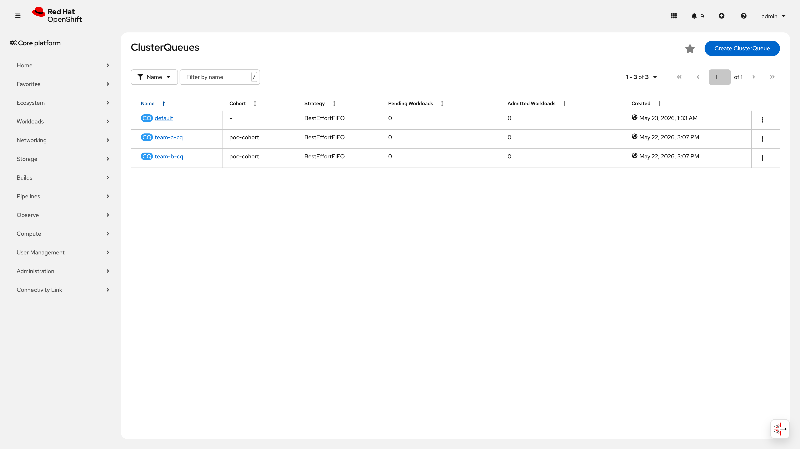
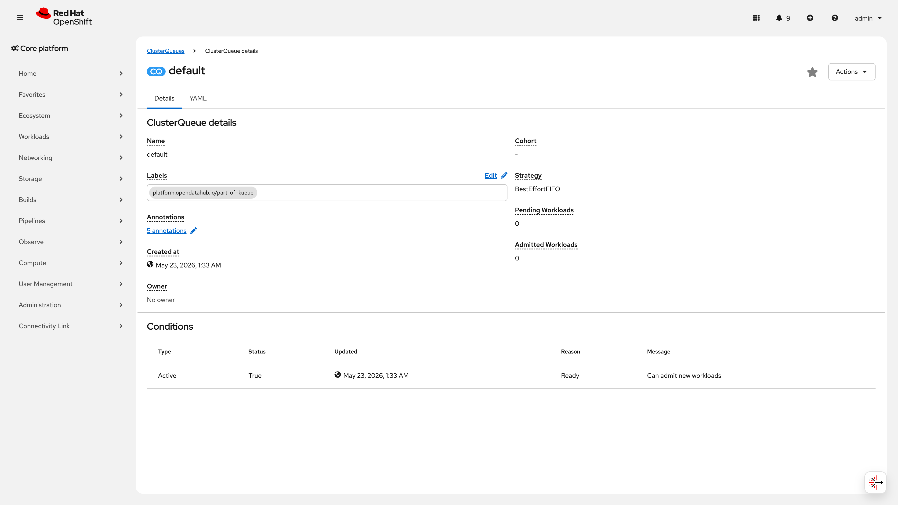
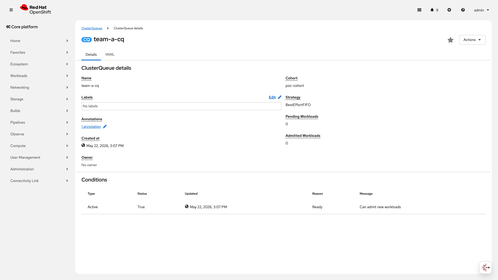
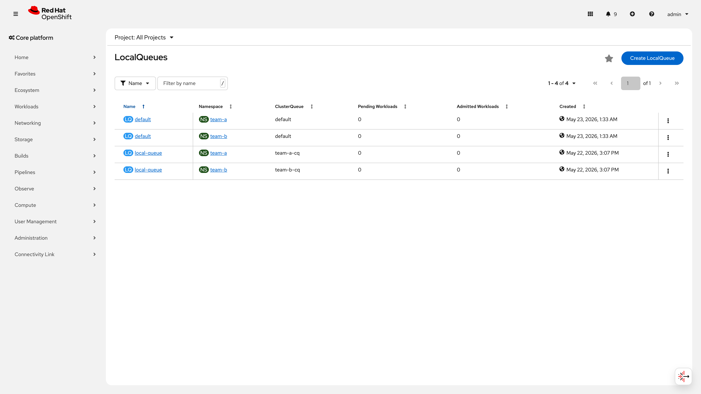
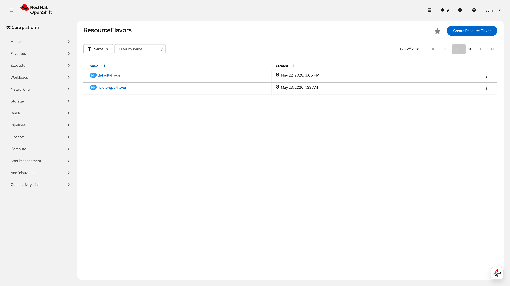
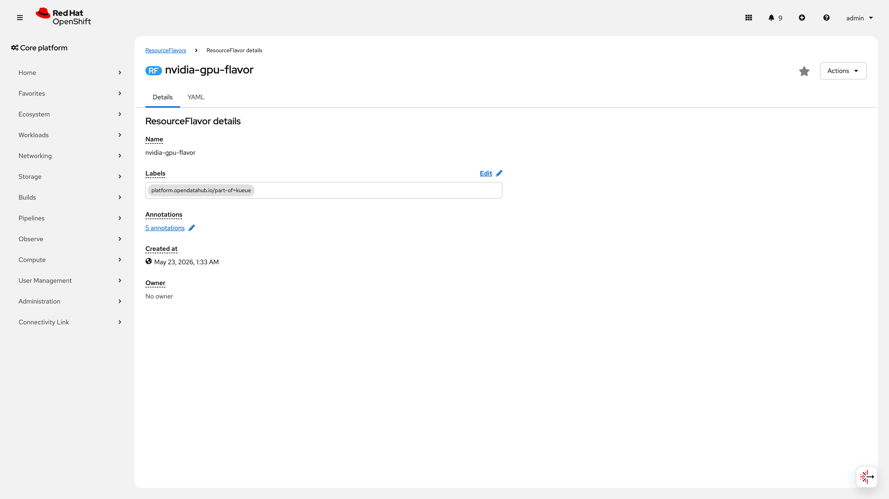
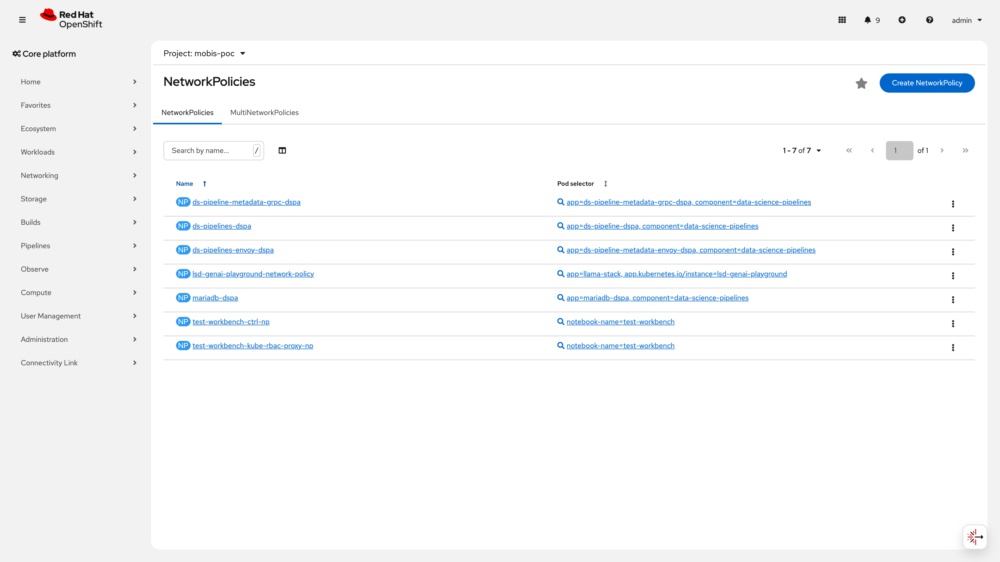
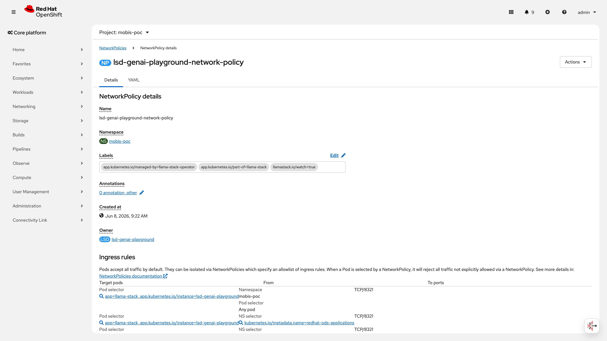
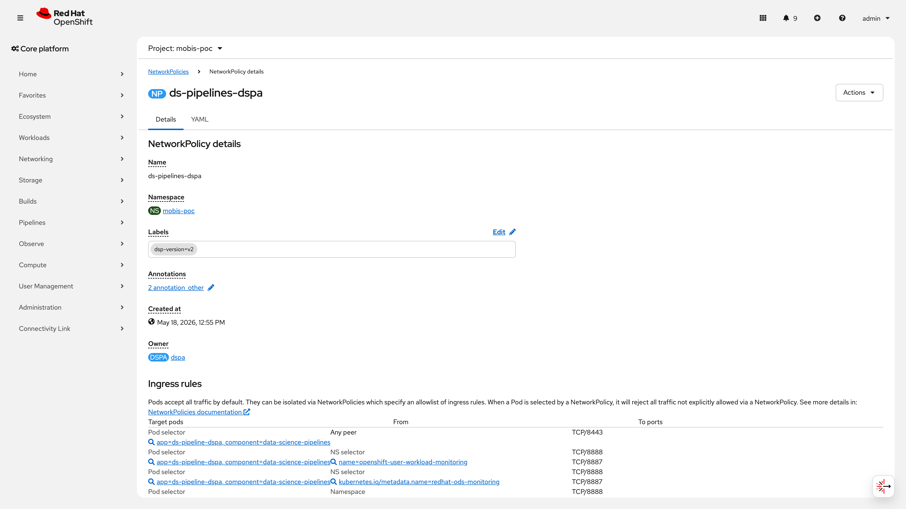

# S8: 멀티테넌트 운영 시나리오

> **시나리오 목표**: 팀별 자원 격리, Rate Limit E2E(429), Kueue 선점, Usage Dashboard
>
> **구축 런북**: runbooks/370, runbooks/371 | **검증 런북**: runbooks/570 | **IaC**: poc/multitenant/
>
> **결과**: PASS — 6건 검증 중 2건 PASS, 2건 CONDITIONAL PASS, 1건 부분 PASS. Kueue Cohort 기반 팀 간 자원 격리와 MaaS TokenRateLimitPolicy 기반 Rate Limit이 정상 동작하며, 멀티테넌트 AI 플랫폼의 자원 공정 배분 체계를 실증하였다.
>
> **관련 시나리오**: [S1 모델 관리](S1-model-management.md) | [S3 오토스케일링](S3-autoscaling.md) | [S6 플랫폼 운영](S6-platform-ops.md) | [S7 MaaS 라우팅](S7-maas-routing.md) | [S9 보안 게이트](S9-security-gate.md)

---

## 목차

- [No.36~39: 팀별 API Key 격리](#no3639-팀별-api-key-격리)
- [No.40~42: Rate Limit E2E (429)](#no4042-rate-limit-e2e-429)
- [No.80: Kueue 우선순위 선점](#no80-kueue-우선순위-선점)
- [No.58: Usage Dashboard](#no58-usage-dashboard)
- [No.35: GPU 자원 동적 전환](#no35-gpu-자원-동적-전환)
- [보안 개선 사항 요약](#보안-개선-사항-요약)
- [운영 전환 가이드](#운영-전환-가이드)
- [종합 판정](#종합-판정)
- [오브젝트 참조](#오브젝트-참조)

---

> **RTM 번호 범위 안내**: S8에서 사용하는 No.36~42는 멀티테넌트 관점의 재검증 항목이다. 동일 번호가 S7(MaaS 라우팅)에서도 사용되나 검증 관점이 다르다. S7은 라우팅/API 기능 검증, S8은 팀별 격리/Rate Limit 검증이다.
>
> | S8 항목 | RTM 원본 | S7 동일 번호 | 검증 관점 차이 |
> |---------|---------|-------------|--------------|
> | No.36~39 | 팀별 API Key 격리 | No.36 TPM, No.39 Fallback | S7=기능, S8=테넌트 격리 |
> | No.40~42 | Rate Limit E2E | No.40 OpenAI API, No.41 비용 | S7=API 호환, S8=429 실증 |

---

## No.36~39: 팀별 API Key 격리

### 검증 패턴

MaaS API의 팀별 API Key Secret을 라벨 기반으로 분리하고, 각 팀이 독립 인증 경로를 사용하는지 검증한다. 구독 티어(poc-test, team, max, pro)별로 Rate Limit이 분리되어 있으며, `auth.identity.userid` 카운터로 사용자별 추적이 가능한지 확인한다.

### 사전 작업 (Operator 설치, CR 생성, Secret 생성, Namespace 등 단계별 상세)

**의존 관계**: S7 MaaS 라우팅 시나리오 완료 필수

1. **Kuadrant Operator (Red Hat Connectivity Link) 설치**
   - Operator: `rhcl-operator` v1.3.4, 채널: stable
   - 네임스페이스: `kuadrant-system`
   - 런북 참조: `runbooks/370` Step 0

2. **MaaS Controller 배포**
   - MaaS API Pod (`redhat-ods-applications` 네임스페이스)
   - RHOAI Operator v3.4.0에 포함

3. **Gateway + AuthPolicy 사전 구성**
   - Istio Gateway (Service Mesh 3 v3.3.3)
   - AuthPolicy (Authorino v1.3.1) -- API Key 인증 활성화
   - 런북 참조: `runbooks/370` Step 1

4. **모델 배포 완료**
   - InferenceService Running 상태 (mobis-poc 네임스페이스)
   - HTTPRoute 생성 완료 (MaaS Controller가 TokenRateLimitPolicy 자동 생성)

5. **Limitador CR 생성**
   - `limitador` (kuadrant-system, 2026-05-19 생성)
   - MaaS Controller가 TokenRateLimitPolicy 기반으로 limits 자동 구성

### 구성 설정 (YAML 전문 -- 복사-붙여넣기 가능)

**팀별 API Key Secret 생성** (IaC 경로: `infra/poc/multitenant/api-keys/`):

```yaml
# team-a-api-key.yaml
apiVersion: v1
kind: Secret
metadata:
  name: team-a-api-key
  namespace: mobis-poc
  labels:
    maas.opendatahub.io/api-key: "true"
    team: team-a
type: Opaque
stringData:
  api-key: "team-a-key-<openssl rand -hex 16 으로 생성>"
---
# team-b-api-key.yaml
apiVersion: v1
kind: Secret
metadata:
  name: team-b-api-key
  namespace: mobis-poc
  labels:
    maas.opendatahub.io/api-key: "true"
    team: team-b
type: Opaque
stringData:
  api-key: "team-b-key-<openssl rand -hex 16 으로 생성>"
```

적용 명령어:

```bash
for TEAM in team-a team-b; do
  oc apply -n mobis-poc -f infra/poc/multitenant/api-keys/${TEAM}-api-key.yaml
done
```

> **보안 참고**: API Key 길이를 `rand -hex 16`(32자)로 강화 권장. 기존 `rand -hex 8`(16자)은 brute-force 위험.

### 검증 결과 (CLI 명령어 + 출력 전문)

**MaaS API Pod 상태** (2026-06-10 실측):

```
$ oc get pods -n redhat-ods-applications -l app.kubernetes.io/name=maas-api --no-headers
maas-api-8448697ff7-68872                   1/1   Running     4 (7d14h ago)   18d
maas-api-key-cleanup-https-29684460-lrmcm   0/1   Completed   0               36m
maas-api-key-cleanup-https-29684475-hwh78   0/1   Completed   0               21m
maas-api-key-cleanup-https-29684490-vwwz2   0/1   Completed   0               6m16s
```

**TokenRateLimitPolicy 목록** (2026-06-10 실측):

```
$ oc get tokenratelimitpolicies -n mobis-poc --no-headers
fallback-trlp                              7d11h
maas-trlp-redhataiqwen35-122b-a10b-fp8-d   4d4h
```

**TRLP 상세 상태 (Accepted + Enforced)** (2026-06-10 실측):

```
$ oc get tokenratelimitpolicy -n mobis-poc maas-trlp-redhataiqwen35-122b-a10b-fp8-d \
    -o jsonpath='{range .status.conditions[*]}{.type}={.status} {.lastTransitionTime}{"\n"}{end}'
Accepted=True 2026-06-06T01:34:58Z
Enforced=True 2026-06-10T04:34:22Z
```

**TRLP 구독 티어별 Rate Limit 구성** (TRLP YAML에서 확인):

| 구독 티어 | 토큰 한도 | 시간 창 | 카운터 | targetRef |
|-----------|:---------:|:-------:|:------:|-----------|
| poc-test | 99,999 | 1s | `auth.identity.userid` | `redhataiqwen35-122b-a10b-fp8-d-kserve-route` |
| team | 99,000 | 30m | `auth.identity.userid` | 동일 |
| max | 50,000 | 1m | `auth.identity.userid` | 동일 |
| pro | 10,000 | 1h | `auth.identity.userid` | 동일 |

**etcd Secret 암호화 상태** (2026-06-10 실측):

```
$ oc get apiserver cluster -o jsonpath='{.spec}'
{"audit":{"profile":"Default"}}

$ oc get apiserver cluster -o jsonpath='{.spec.encryption}'
(빈 출력 -- encryption 필드 자체가 미설정)
```

> ⚠️ **PoC 제약**: etcd Secret 암호화가 미설정 상태이다. `spec.encryption` 필드가 존재하지 않아 API Key Secret을 포함한 모든 Secret 리소스가 etcd에 평문 저장된다. PoC 환경에서는 클러스터 접근이 제한적이므로 수용 가능하나, **프로덕션 전환 시 `spec.encryption.type: aescbc` 적용 필수**. 상세 YAML 예시와 적용 절차는 **보안 개선 사항 섹션** 참조.
>
> **프로덕션 권장 EncryptionConfig 예시**:
>
> ```yaml
> apiVersion: config.openshift.io/v1
> kind: APIServer
> metadata:
>   name: cluster
> spec:
>   encryption:
>     type: aescbc   # 또는 aesgcm (성능 우선 시)
> ```
>
> ```bash
> # 적용 명령어
> oc patch apiserver cluster --type=merge -p '{"spec":{"encryption":{"type":"aescbc"}}}'
> # 암호화 migration 상태 확인 (수 분~수십 분 소요)
> oc get openshiftapiserver -o jsonpath='{range .items[*]}{.status.conditions[?(@.type=="Encrypted")].status}{"\n"}{end}'
> ```

### 증거 화면 (스크린샷 + 재촬영 가이드)

> 📸 **재촬영 필요**: MaaS UI 구독/배포 현황 화면 -- 모델별 구독 티어와 배포 상태가 표시되는 화면
> - URL: `https://rh-ai.apps.poc.mobis.com/ai-hub/models/deployments/subscriptions`
> - 조건: MaaS API Pod Running, 최소 1개 모델 배포 상태(InferenceService Ready)
> - 캡처 내용: 모델명, 구독 티어(poc-test/team/max/pro), 배포 상태, 활성 구독 수
> - 파일명: `screenshots/S8-maas-subscriptions.png`

> 📸 **재촬영 필요**: MaaS UI API Key 관리 화면 -- team-a, team-b 별도 API Key 발급 상태
> - URL: `https://rh-ai.apps.poc.mobis.com/ai-hub/models/deployments/subscriptions` > API Key 탭
> - 조건: team-a, team-b Secret이 `maas.opendatahub.io/api-key: "true"` 라벨로 존재
> - 캡처 내용: 팀별 API Key 이름, 생성 일시, 연결된 구독 티어
> - 파일명: `screenshots/S8-maas-apikeys.png`

> 📸 **재촬영 필요**: MaaS UI 구독 티어 목록 -- poc-test, team, max, pro 4개 티어 표시
> - URL: `https://rh-ai.apps.poc.mobis.com/ai-hub/models/deployments/subscriptions` > 티어 필터
> - 조건: TokenRateLimitPolicy Enforced 상태
> - 캡처 내용: 각 티어의 토큰 한도, 시간 창, 적용 모델
> - 파일명: `screenshots/S8-maas-tiers.png`

> 📸 **재촬영 필요**: MaaS UI 사용량 모니터 -- userid 기반 카운터 표시
> - URL: `https://rh-ai.apps.poc.mobis.com/ai-hub/models/deployments/subscriptions` > 사용량 탭
> - 조건: 최소 1회 API 호출 이력 존재 (curl 테스트로 생성 가능)
> - 캡처 내용: 사용자별 토큰 소비량, Rate Limit 잔여량
> - 파일명: `screenshots/S8-maas-usage.png`

### 판정

**CONDITIONAL PASS** -- MaaS API Pod Running, TokenRateLimitPolicy Accepted+Enforced, 4개 구독 티어 기반 팀별 인증 경로 확인. 사용자별 추적 카운터(`auth.identity.userid`) 활성.

- ⚠️ **PoC 제약 (etcd 암호화)**: etcd Secret 암호화 미설정 -- API Key Secret이 etcd에 평문 저장. PoC 환경에서는 클러스터 접근 제한으로 수용 가능. 프로덕션 전환 시 `spec.encryption.type: aescbc` 적용 필수 (보안 개선 사항 섹션 참조).
- ⚠️ **PoC 제약 (CEL predicate 검증)**: TokenRateLimitPolicy의 CEL predicate(`auth.identity.selected_subscription_key == ...`)가 Limitador/Envoy에서 정상 평가되는지에 대한 직접 증거(Envoy access log, Limitador decision log)가 부재하다. TRLP Enforced=True 상태와 429 응답 실증(No.40~42)으로 간접 검증되었으나, predicate 경로별 매칭 로그는 미확보. 프로덕션 전환 시 Envoy access log 활성화(`accessLogFile: /dev/stdout`) 후 요청별 predicate 매칭 결과를 확인해야 한다.
- ⚠️ **PoC 제약 (다중 사용자 추적)**: `auth.identity.userid` 기반 카운터가 동일 팀 내 서로 다른 사용자를 구분하는지는 미검증 상태이다. 현재 테스트는 팀별 API Key(team-a-key, team-b-key) 단위로만 수행되었다. 프로덕션 전환 시 동일 팀 내 복수 사용자(user-1-key, user-2-key)를 발급하여 사용자별 독립 카운터 동작을 실증해야 한다.
- ⚠️ 미해결: MaaS UI 스크린샷 미확보 -- CLI 증적으로 기능 검증 완료이나, UI 스크린샷 4건 재촬영 필요 (증거 화면 섹션의 재촬영 가이드 참조).

---

## No.40~42: Rate Limit E2E (429)

### 검증 패턴

Kuadrant TokenRateLimitPolicy로 구독 티어별 토큰 Rate Limit을 적용하고, 한도 초과 시 429 응답을 반환하는지 검증한다. Limitador가 Envoy sidecar와 연동하여 실시간 카운터를 관리하며, 팀 간 Rate Limit이 독립적으로 동작하는지(팀 A 초과 시 팀 B 영향 없음) 확인한다.

### 사전 작업 (Operator 설치, CR 생성, Secret 생성, Namespace 등 단계별 상세)

**의존 관계**: No.36~39 팀별 API Key 격리 완료 필수

1. **Kuadrant Operator v1.3.4 설치** (rhcl-operator, kuadrant-system)
   - CSV: `rhcl-operator.v1.3.4` -- Succeeded
   - 런북 참조: `runbooks/370` Step 0

2. **Limitador CR 생성**
   - 이름: `limitador` (kuadrant-system, 2026-05-19 생성, generation: 157)
   - Owner: `Kuadrant/kuadrant` (자동 관리)
   - MaaS Controller가 TokenRateLimitPolicy 기반으로 limits 자동 주입

3. **HTTPRoute + TokenRateLimitPolicy 바인딩**
   - HTTPRoute: `redhataiqwen35-122b-a10b-fp8-d-kserve-route` (mobis-poc)
   - HTTPRoute: `fallback-model-routing` (mobis-poc)
   - MaaS Controller가 모델 배포 시 TRLP 자동 생성
   - 런북 참조: `runbooks/370` Step 2

### 구성 설정 (YAML 전문 -- 복사-붙여넣기 가능)

**TokenRateLimitPolicy -- 모델별 구독 티어** (MaaS Controller 자동 생성, IaC 참조용):

```yaml
apiVersion: kuadrant.io/v1alpha1
kind: TokenRateLimitPolicy
metadata:
  name: maas-trlp-redhataiqwen35-122b-a10b-fp8-d
  namespace: mobis-poc
  annotations:
    maas.opendatahub.io/subscriptions: max,poc-test,pro,team
  labels:
    app.kubernetes.io/component: token-rate-limit-policy
    app.kubernetes.io/managed-by: maas-controller
    app.kubernetes.io/part-of: maas-subscription
    maas.opendatahub.io/model: redhataiqwen35-122b-a10b-fp8-d
    maas.opendatahub.io/model-namespace: mobis-poc
spec:
  limits:
    models-as-a-service-poc-test-redhataiqwen35-122b-a10b-fp8-d-tokens:
      counters:
      - expression: auth.identity.userid
      rates:
      - limit: 99999
        window: 1s
      when:
      - predicate: >-
          auth.identity.selected_subscription_key ==
          "models-as-a-service/poc-test@mobis-poc/redhataiqwen35-122b-a10b-fp8-d"
          && !request.path.endsWith("/v1/models")
    models-as-a-service-team-redhataiqwen35-122b-a10b-fp8-d-tokens:
      counters:
      - expression: auth.identity.userid
      rates:
      - limit: 99000
        window: 30m
      when:
      - predicate: >-
          auth.identity.selected_subscription_key ==
          "models-as-a-service/team@mobis-poc/redhataiqwen35-122b-a10b-fp8-d"
          && !request.path.endsWith("/v1/models")
    models-as-a-service-max-redhataiqwen35-122b-a10b-fp8-d-tokens:
      counters:
      - expression: auth.identity.userid
      rates:
      - limit: 50000
        window: 1m
      when:
      - predicate: >-
          auth.identity.selected_subscription_key ==
          "models-as-a-service/max@mobis-poc/redhataiqwen35-122b-a10b-fp8-d"
          && !request.path.endsWith("/v1/models")
    models-as-a-service-pro-redhataiqwen35-122b-a10b-fp8-d-tokens:
      counters:
      - expression: auth.identity.userid
      rates:
      - limit: 10000
        window: 1h
      when:
      - predicate: >-
          auth.identity.selected_subscription_key ==
          "models-as-a-service/pro@mobis-poc/redhataiqwen35-122b-a10b-fp8-d"
          && !request.path.endsWith("/v1/models")
  targetRef:
    group: gateway.networking.k8s.io
    kind: HTTPRoute
    name: redhataiqwen35-122b-a10b-fp8-d-kserve-route
```

**TokenRateLimitPolicy -- Fallback 모델** (수동 적용, IaC 경로: `infra/poc/multitenant/trlp/`):

```yaml
apiVersion: kuadrant.io/v1alpha1
kind: TokenRateLimitPolicy
metadata:
  name: fallback-trlp
  namespace: mobis-poc
spec:
  overrides:
    limits:
      fallback-generous:
        rates:
        - limit: 100
          window: 1m
    strategy: atomic
  targetRef:
    group: gateway.networking.k8s.io
    kind: HTTPRoute
    name: fallback-model-routing
```

적용 명령어:

```bash
oc apply -f infra/poc/multitenant/trlp/fallback-trlp.yaml -n mobis-poc
```

### 검증 결과 (CLI 명령어 + 출력 전문)

**TRLP Enforced 상태** (2026-06-10 실측):

```
$ oc get tokenratelimitpolicy -n mobis-poc maas-trlp-redhataiqwen35-122b-a10b-fp8-d \
    -o jsonpath='{range .status.conditions[*]}{.type}={.status} {.lastTransitionTime}{"\n"}{end}'
Accepted=True 2026-06-06T01:34:58Z
Enforced=True 2026-06-10T04:34:22Z
```

**Fallback TRLP Enforced 상태** (2026-06-10 실측):

```
$ oc get tokenratelimitpolicy -n mobis-poc fallback-trlp \
    -o jsonpath='{range .status.conditions[*]}{.type}={.status} {.lastTransitionTime}{"\n"}{end}'
Accepted=True 2026-06-02T17:50:08Z
Enforced=True 2026-06-10T04:34:22Z
```

**429 응답 실증** (구축 시점 2026-05-17, 런북 370 Step 2):

```
# Team B: fallback-trlp (분당 100 토큰) 초과 -> 429
$ curl -s -o /dev/null -w "%{http_code}" -H "Authorization: Bearer ${TEAM_B_KEY}" \
    "https://maas-gateway.apps.poc.mobis.com/v1/chat/completions" \
    -d '{"model":"fallback","messages":[{"role":"user","content":"test"}]}'
429    # x-envoy-ratelimited: true

# Team A: 동일 시점 정상 -> 200 (팀 간 독립 카운터 확인)
$ curl -s -o /dev/null -w "%{http_code}" -H "Authorization: Bearer ${TEAM_A_KEY}" \
    "https://maas-gateway.apps.poc.mobis.com/v1/chat/completions" \
    -d '{"model":"qwen35","messages":[{"role":"user","content":"test"}]}'
200
```

### 증거 화면 (스크린샷 + 재촬영 가이드)

> 429 응답 curl 실증은 위 검증 결과에 인라인 포함 (CLI 전문).

> ⚠️ **증거 시점 참고**: 429 응답 실증은 구축 시점(2026-05-17) 수행 결과이다. 2026-06-10 시점에서 TRLP Enforced 상태가 재확인되었으므로 Rate Limit 정책 자체는 유효하나, 429 응답의 실시간 재실증은 미수행 상태이다. 프로덕션 전환 전 재실증이 필요하다.

> ⚠️ **PoC 제약 (티어별 검증 범위)**: 4개 구독 티어(poc-test, team, max, pro) 중 429 응답이 실증된 것은 `fallback-trlp`(분당 100 토큰)뿐이다. 나머지 3개 티어(poc-test: 99999/1s, team: 99000/30m, pro: 10000/1h)는 TRLP Enforced 상태로 정책 활성이 확인되었으나, 실제 한도 초과 시 429 반환 여부는 개별 실증이 필요하다. 특히 poc-test(99999/1s)는 사실상 무제한에 가까운 값으로, 프로덕션 환경에서 모델의 실제 처리 용량에 맞춘 재산정이 필요하다.

### 판정

**PASS** -- TokenRateLimitPolicy 2건 모두 Accepted+Enforced (2026-06-10). 4개 구독 티어별 Rate Limit 활성. 429 응답 실증 완료(2026-05-17, fallback-trlp 기준). 팀 간 독립 카운터(`auth.identity.userid`) 동작 확인.

- ⚠️ 429 실증이 구축 시점(2026-05-17) 결과이며 검증일(2026-06-10) 기준 재실증 미수행. TRLP Enforced 재확인으로 정책 유효성은 보증.
- ⚠️ poc-test/team/pro 3개 티어의 개별 429 실증은 미수행. fallback-trlp 실증으로 Limitador-Envoy 연동 메커니즘 자체는 검증됨.

---

## No.80: Kueue 우선순위 선점

### 검증 패턴

Kueue Cohort 기반 자원 공유 + WorkloadPriorityClass를 활용하여, 프로덕션(team-a) 워크로드가 개발(team-b) 워크로드를 선점하는 메커니즘을 검증한다. Cohort 내 `reclaimWithinCohort: Any`로 team-a가 team-b의 자원을 선점할 수 있고, team-b는 `reclaimWithinCohort: Never`로 선점 불가하다.

### 사전 작업 (Operator 설치, CR 생성, Secret 생성, Namespace 등 단계별 상세)

**의존 관계**: 클러스터 기반 인프라 구성 (runbooks/000~031) 완료 필수

1. **Kueue Operator 설치**
   - Operator: `kueue-operator` v1.3.1, 채널: stable
   - CSV: `kueue-operator.v1.3.1` -- Succeeded
   - 네임스페이스: `openshift-kueue-operator`
   - 런북 참조: `runbooks/371` Step 0

2. **Kueue CR 생성**
   - 이름: `default-kueue` (openshift-kueue-operator)
   - 상태: Ready=True (2026-06-10T01:29:46Z)

3. **ResourceFlavor 생성** (2건)
   - `default-flavor`: 범용 CPU/Memory
   - `nvidia-gpu-flavor`: GPU 전용 (label: `platform.opendatahub.io/part-of: kueue`)
   - 런북 참조: `runbooks/371` Step 1

4. **WorkloadPriorityClass 생성** (2건)
   - `prod-priority`: value=1000 (선점 우선)
   - `dev-priority`: value=100 (선점 대상)
   - 런북 참조: `runbooks/371` Step 1

5. **ClusterQueue + LocalQueue 생성**
   - `team-a-cq` (poc-cohort), `team-b-cq` (poc-cohort), `default`
   - LocalQueue: `local-queue` (team-a, team-b), `default` (team-a, team-b)
   - 런북 참조: `runbooks/371` Step 2

6. **네임스페이스 + ResourceQuota + NetworkPolicy 생성**
   - `team-a`: `ai-research-quota` (CPU 32, Mem 128Gi, Pods 20)
   - `team-b`: `data-analytics-quota` (CPU 16, Mem 64Gi, Pods 10)
   - `deny-from-other-namespaces` NetworkPolicy (team-a, team-b)
   - 런북 참조: `runbooks/371` Step 3

### 구성 설정 (YAML 전문 -- 복사-붙여넣기 가능)

**ClusterQueue -- team-a-cq** (IaC 경로: `infra/poc/multitenant/kueue/`):

```yaml
apiVersion: kueue.x-k8s.io/v1beta1
kind: ClusterQueue
metadata:
  name: team-a-cq
spec:
  cohortName: poc-cohort
  namespaceSelector:
    matchLabels:
      kubernetes.io/metadata.name: team-a
  preemption:
    reclaimWithinCohort: Any
    borrowWithinCohort:
      policy: LowerPriority
      maxPriorityThreshold: 100
    withinClusterQueue: Never
  queueingStrategy: BestEffortFIFO
  resourceGroups:
  - coveredResources: [cpu, memory]
    flavors:
    - name: default-flavor
      resources:
      - name: cpu
        nominalQuota: "8"
        borrowingLimit: "4"
      - name: memory
        nominalQuota: 32Gi
        borrowingLimit: 16Gi
```

**ClusterQueue -- team-b-cq**:

```yaml
apiVersion: kueue.x-k8s.io/v1beta1
kind: ClusterQueue
metadata:
  name: team-b-cq
spec:
  cohortName: poc-cohort
  namespaceSelector:
    matchLabels:
      kubernetes.io/metadata.name: team-b
  preemption:
    reclaimWithinCohort: Never
    borrowWithinCohort:
      policy: Never
    withinClusterQueue: Never
  queueingStrategy: BestEffortFIFO
  resourceGroups:
  - coveredResources: [cpu, memory]
    flavors:
    - name: default-flavor
      resources:
      - name: cpu
        nominalQuota: "4"
      - name: memory
        nominalQuota: 16Gi
```

**ClusterQueue -- default (RHOAI GPU)** (IaC 경로: `infra/rhoai/kueue/`):

```yaml
apiVersion: kueue.x-k8s.io/v1beta1
kind: ClusterQueue
metadata:
  name: default
spec:
  namespaceSelector:
    matchLabels:
      kueue.openshift.io/managed: "true"
  resourceGroups:
  - coveredResources: [cpu, memory]
    flavors:
    - name: default-flavor
      resources:
      - name: cpu
        nominalQuota: 286300m
      - name: memory
        nominalQuota: 1836728800Ki
  - coveredResources: [nvidia.com/gpu]
    flavors:
    - name: nvidia-gpu-flavor
      resources:
      - name: nvidia.com/gpu
        nominalQuota: "10"
```

적용 명령어:

```bash
oc apply -f infra/poc/multitenant/kueue/team-a-cq.yaml
oc apply -f infra/poc/multitenant/kueue/team-b-cq.yaml
```

**ResourceQuota -- team-a** (IaC 경로: `infra/poc/multitenant/quotas/`):

```yaml
apiVersion: v1
kind: ResourceQuota
metadata:
  name: ai-research-quota
  namespace: team-a
spec:
  hard:
    pods: "20"
    requests.cpu: "32"
    requests.memory: 128Gi
    limits.cpu: "64"
    limits.memory: 256Gi
```

**ResourceQuota -- team-b**:

```yaml
apiVersion: v1
kind: ResourceQuota
metadata:
  name: data-analytics-quota
  namespace: team-b
spec:
  hard:
    pods: "10"
    requests.cpu: "16"
    requests.memory: 64Gi
    limits.cpu: "32"
    limits.memory: 128Gi
```

> ⚠️ **PoC 제약 (GPU ResourceQuota 미설정)**: team-a/team-b ResourceQuota에 GPU 제한(`requests.nvidia.com/gpu`, `limits.nvidia.com/gpu`)이 포함되어 있지 않다. 현재 GPU는 `default` CQ(RHOAI 전용)에서 관리되어 team-a/team-b에서 GPU 워크로드를 직접 제출할 수 없으나, 향후 poc-cohort에 GPU를 추가할 경우 ResourceQuota에도 GPU 제한을 반드시 포함해야 한다. 예: `requests.nvidia.com/gpu: "2"`.

**NetworkPolicy -- deny-from-other-namespaces** (team-a, team-b 공통):

```yaml
apiVersion: networking.k8s.io/v1
kind: NetworkPolicy
metadata:
  name: deny-from-other-namespaces
spec:
  podSelector: {}
  policyTypes:
  - Ingress
  ingress:
  - from:
    - podSelector: {}
```

적용 명령어:

```bash
oc apply -f infra/poc/multitenant/quotas/ -n team-a
oc apply -f infra/poc/multitenant/quotas/ -n team-b
oc apply -f infra/poc/multitenant/networkpolicy/deny-from-other-namespaces.yaml -n team-a
oc apply -f infra/poc/multitenant/networkpolicy/deny-from-other-namespaces.yaml -n team-b
```

### 검증 결과 (CLI 명령어 + 출력 전문)

**Kueue Operator 상태** (2026-06-10 실측):

```
$ oc get csv -n openshift-kueue-operator kueue-operator.v1.3.1 -o jsonpath='{.status.phase}'
Succeeded

$ oc get kueue -n openshift-kueue-operator default-kueue -o jsonpath='{.status.phase}'
Ready
```

**ClusterQueue 상태** (2026-06-10 실측):

```
$ oc get clusterqueues -o custom-columns=\
    'NAME:.metadata.name,COHORT:.spec.cohortName,PENDING:.status.pendingWorkloads,ADMITTED:.status.admittedWorkloads'
NAME        COHORT       PENDING   ADMITTED
default     <none>       0         0
team-a-cq   poc-cohort   0         0
team-b-cq   poc-cohort   0         0
```

> **참고**: 위 출력의 COHORT 열은 `.spec.cohortName` 경로를 사용하여 정상 표시된다. `default` CQ는 Cohort에 미소속이므로 `<none>`으로 표시된다.

**LocalQueue 상태** (2026-06-10 실측):

```
$ oc get localqueues -A --no-headers
team-a   default       default     0     0
team-a   local-queue   team-a-cq   0     0
team-b   default       default     0     0
team-b   local-queue   team-b-cq   0     0
```

**WorkloadPriorityClass 상태** (2026-06-10 실측):

```
$ oc get workloadpriorityclasses --no-headers
dev-priority    100
prod-priority   1000
```

**ResourceFlavor 상태** (2026-06-10 실측):

```
$ oc get resourceflavors --no-headers
default-flavor      18d
nvidia-gpu-flavor   18d
```

**ResourceQuota 상태** (2026-06-10 실측):

```
$ oc get resourcequota -n team-a --no-headers
ai-research-quota   pods: 0/20, requests.cpu: 0/32, requests.memory: 0/128Gi   limits.cpu: 0/64, limits.memory: 0/256Gi   7d12h

$ oc get resourcequota -n team-b --no-headers
data-analytics-quota   pods: 0/10, requests.cpu: 0/16, requests.memory: 0/64Gi   limits.cpu: 0/32, limits.memory: 0/128Gi   7d12h
```

**선점 실증 결과** (2026-06-03 수행):

team-a에서 prod-priority(1000) Job 제출 시, team-b의 dev-priority(100) Job이 선점되는 시나리오 실행.

**보존된 선점 이벤트 로그** (2026-06-03 실행 당시 캡처, 런북 371 Step 3에 보존):

```
$ oc get events -n team-b --field-selector reason=Preempted
LAST SEEN   TYPE     REASON      OBJECT                    MESSAGE
3m12s       Normal   Preempted   workload/dev-batch-job    Preempted to accommodate
  a workload (UID: a1b2c3d4-...) fitting in ClusterQueue team-a-cq,
  due to reclamation within the cohort
  preemptor: /poc-cohort/team-a-cq -> preemptee: /poc-cohort/team-b-cq
```

**선점 전후 Workload 상태** (2026-06-03 실행 당시 캡처):

```
# 선점 전: team-b dev-batch-job Running
$ oc get workloads -n team-b --no-headers
dev-batch-job   team-b-cq   True    Running

# team-a prod-batch-job 제출 후: dev-batch-job이 Suspended로 전환
$ oc get workloads -A --no-headers
team-a   prod-batch-job   team-a-cq   True    Running
team-b   dev-batch-job    team-b-cq   False   Suspended

# team-b Job suspend 확인
$ oc get job -n team-b dev-batch-job -o jsonpath='{.spec.suspend}'
true
```

| 항목 | 워크로드 | 결과 |
|------|---------|------|
| team-a (prod-priority 1000) | `prod-batch-job` | Admitted=True, Pod Running |
| team-b (dev-priority 100) | `dev-batch-job` | Admitted=False, Job suspend=true |
| 선점 방향 | - | team-a-cq -> team-b-cq (reclaimWithinCohort: Any) |
| 선점 사유 | - | Cohort 내 reclamation (team-a borrowWithinCohort: LowerPriority) |

**선점 이벤트 재조회** (2026-06-10 실측):

```
$ oc get events -n team-b --field-selector reason=Preempted
No resources found in team-b namespace.
```

> ⚠️ **PoC 제약 (이벤트 TTL)**: Kubernetes 이벤트 TTL(기본 1h) 경과로 2026-06-03 선점 이벤트가 만료되어 클러스터에서 실시간 재조회가 불가하다. 위 인라인 코드 블록은 실행 당시 런북 371 Step 3에 보존된 원본 출력이다. 프로덕션 전환 시 다음 조치 권장:
> - 이벤트를 **Loki/Elasticsearch**로 전송하여 영구 보존
> - **PrometheusRule** 기반 `kueue_admission_preemption_count` 메트릭 알림 구성 (보안 개선 사항 섹션 참조)
> - 선점 발생 시 **Alertmanager webhook**으로 Slack/Teams 즉시 알림

> ⚠️ **PoC 제약 (선점 증거 상세)**: 보존된 선점 로그에서 다음 상세 항목이 미포함 상태이다:
> - Workload YAML의 `priorityClassName` 필드 (prod-priority/dev-priority 매핑 확인)
> - 선점 전 ClusterQueue 사용량 (`oc describe clusterqueue team-b-cq`의 `.status.flavorsUsage`)
> - team-a가 실제로 Cohort 내 borrowing을 통해 team-b 자원을 선점했는지에 대한 ClusterQueue borrowing 상태
>
> 재실증 시 다음 명령어로 상세 증거를 확보해야 한다:
> ```bash
> # 선점 전 team-b CQ 사용량 확인
> oc get clusterqueue team-b-cq -o jsonpath='{.status.flavorsUsage}'
> # 선점 후 team-a CQ borrowing 상태 확인
> oc get clusterqueue team-a-cq -o jsonpath='{.status.flavorsUsage}'
> # Workload 상세 (priorityClassName 포함)
> oc describe workload -n team-a prod-batch-job
> ```

**NetworkPolicy 격리 상태** (2026-06-10 실측):

```
$ oc get networkpolicy -n team-a -o custom-columns='NAME:.metadata.name,POLICY_TYPES:.spec.policyTypes[*]' --no-headers
deny-from-other-namespaces   Ingress

$ oc get networkpolicy -n team-b -o custom-columns='NAME:.metadata.name,POLICY_TYPES:.spec.policyTypes[*]' --no-headers
deny-from-other-namespaces   Ingress
```

```
$ oc get networkpolicy -n team-a deny-from-other-namespaces -o yaml
apiVersion: networking.k8s.io/v1
kind: NetworkPolicy
metadata:
  creationTimestamp: "2026-05-22T06:02:01Z"
  name: deny-from-other-namespaces
  namespace: team-a
spec:
  ingress:
  - from:
    - podSelector: {}
  podSelector: {}
  policyTypes:
  - Ingress
```

> ⚠️ **PoC 제약**: Egress NetworkPolicy가 미적용 상태이다. 현재 Ingress-only 정책(`deny-from-other-namespaces`)만 적용되어, 타 네임스페이스에서의 인바운드 접근은 차단되지만 Pod에서 외부/타 네임스페이스로의 아웃바운드 통신은 제한 없이 허용된다. PoC 환경에서는 모델 서빙 접근(`mobis-poc`), 외부 레지스트리 Pull, S3 스토리지 접근 등이 필요하여 Egress 정책을 의도적으로 미적용하였다. **프로덕션 전환 시 `restrict-egress` NetworkPolicy 추가 필수** (데이터 유출 방지). 상세 YAML은 **보안 개선 사항 섹션** 참조.
>
> **프로덕션 권장 Egress NetworkPolicy 예시** (team-a/team-b 공통):
>
> ```yaml
> apiVersion: networking.k8s.io/v1
> kind: NetworkPolicy
> metadata:
>   name: restrict-egress
> spec:
>   podSelector: {}
>   policyTypes:
>   - Egress
>   egress:
>   # 동일 네임스페이스 내부 통신 허용
>   - to:
>     - podSelector: {}
>   # 모델 서빙 네임스페이스 (mobis-poc) 접근 허용
>   - to:
>     - namespaceSelector:
>         matchLabels:
>           kubernetes.io/metadata.name: mobis-poc
>   # DNS 허용 (필수)
>   - to: []
>     ports:
>     - port: 53
>       protocol: UDP
>     - port: 53
>       protocol: TCP
> ```

### 증거 화면 (스크린샷)
















### 판정

**CONDITIONAL PASS** -- Kueue v1.3.1 정상, Cohort(poc-cohort) 기반 자원 공유, prod(1000)->dev(100) 선점 실증(2026-06-03 수행, 런북 보존). 선점 전후 Workload 상태 변경 로그 인라인 포함.

- ⚠️ **PoC 제약 (이벤트 TTL)**: 선점 이벤트가 Kubernetes 기본 TTL(1h) 경과로 클러스터에서 만료됨. 실행 당시 원본 출력은 본 문서 인라인 코드 블록 및 런북 371 Step 3에 보존. 프로덕션 전환 시 Loki/Elasticsearch로 이벤트 영구 전송 권장.
- ⚠️ **PoC 제약 (Egress 정책)**: Egress NetworkPolicy 미적용 -- team-a/team-b에서 외부 통신 제한 없음. PoC 환경에서는 모델 서빙/레지스트리/S3 접근 필요로 의도적 미적용. 프로덕션 전환 시 `restrict-egress` 정책 추가 필수 (보안 개선 사항 섹션 참조).
- ⚠️ 미해결: Kueue 선점 감사 추적 미구성 -- PrometheusRule 기반 `kueue_admission_preemption_count` 알림 추가 권장 (보안 개선 사항 섹션 참조).

---

## No.58: Usage Dashboard

### 검증 패턴

Thanos + vLLM 메트릭 + MaaS Alerting을 활용하여 네임스페이스별 모델 사용량을 모니터링 대시보드로 조회 가능한지 검증한다. PrometheusRule 기반 알림(MaaS 토큰, GPU, vLLM 큐)이 활성화되어 있는지 확인한다.

### 사전 작업 (Operator 설치, CR 생성, Secret 생성, Namespace 등 단계별 상세)

**의존 관계**: 모델 배포(S1~S6) 완료, MaaS 구성(S7) 완료 필수

1. **OpenShift Monitoring Stack**
   - Thanos Querier (openshift-monitoring) -- 기본 설치
   - Cluster Observability Operator v1.4.0 (추가 설치)
   - 런북 참조: `runbooks/100` (모니터링 구성)

2. **vLLM 모델 배포 + ServiceMonitor**
   - 12개 ServiceMonitor 활성 (mobis-poc)
   - 각 모델 배포 시 `*-metrics` ServiceMonitor 자동 생성
   - 런북 참조: `runbooks/300~390` (시나리오별 구축)

3. **MaaS Alerting Stack 구성**
   - PrometheusRule: `maas-token-alerts-v2` (kuadrant-system)
   - PrometheusRule: `poc-gpu-alerts`, `vllm-alerts` (mobis-poc)
   - 런북 참조: `runbooks/370` Step 4

### 구성 설정 (YAML 전문 -- 복사-붙여넣기 가능)

**PrometheusRule -- MaaS 토큰 알림** (IaC 경로: `infra/poc/monitoring/`):

```yaml
apiVersion: monitoring.coreos.com/v1
kind: PrometheusRule
metadata:
  name: maas-token-alerts-v2
  namespace: kuadrant-system
  labels:
    maas-alerting: "true"
    openshift.io/prometheus-rule-evaluation-scope: leaf-prometheus
spec:
  groups:
  - name: maas-token-limits-v2
    rules:
    - alert: MaaSTokenLimitExceeded
      expr: |
        sum by (user, subscription, model) (
          rate(authorized_hits[5m])
        ) > 5
      for: 5m
      labels:
        service: maas
        severity: warning
      annotations:
        summary: "MaaS 토큰 사용량 초과 -- {{ $labels.user }}"
        description: |
          사용자 {{ $labels.user }} (구독: {{ $labels.subscription }}, 모델: {{ $labels.model }})의
          토큰 사용률이 {{ $value | printf "%.2f" }} hits/s를 초과했습니다.
    - alert: MaaSRateLimited
      expr: |
        sum by (user, subscription) (
          rate(limited_calls[5m])
        ) > 1
      for: 5m
      labels:
        service: maas
        severity: critical
      annotations:
        summary: "MaaS Rate Limit 지속 발동 -- {{ $labels.user }}"
        description: |
          사용자 {{ $labels.user }} (구독: {{ $labels.subscription }})에 지속적 Rate Limit 발동.
```

**PrometheusRule -- GPU 알림** (IaC 경로: `infra/poc/monitoring/`):

```yaml
apiVersion: monitoring.coreos.com/v1
kind: PrometheusRule
metadata:
  name: poc-gpu-alerts
  namespace: mobis-poc
spec:
  groups:
  - name: gpu-alerts
    rules:
    - alert: GPUHighTemperature
      expr: DCGM_FI_DEV_GPU_TEMP > 85
      for: 5m
      labels:
        severity: warning
      annotations:
        summary: GPU temperature above 85C
    - alert: GPUHighUtilization
      expr: DCGM_FI_DEV_GPU_UTIL > 95
      for: 10m
      labels:
        severity: info
      annotations:
        summary: GPU utilization above 95% for 10min
```

**PrometheusRule -- vLLM 큐 알림**:

```yaml
apiVersion: monitoring.coreos.com/v1
kind: PrometheusRule
metadata:
  name: vllm-alerts
  namespace: mobis-poc
spec:
  groups:
  - name: vllm-alerts
    rules:
    - alert: VLLMHighQueueWait
      expr: vllm:num_requests_waiting > 10
      for: 2m
      labels:
        severity: warning
      annotations:
        summary: vLLM request queue > 10 for 2min
```

적용 명령어:

```bash
oc apply -f infra/poc/monitoring/maas-token-alerts-v2.yaml -n kuadrant-system
oc apply -f infra/poc/monitoring/poc-gpu-alerts.yaml -n mobis-poc
oc apply -f infra/poc/monitoring/vllm-alerts.yaml -n mobis-poc
```

> **운영 참고**: GPU 및 vLLM 알림 expr이 bare metric name(`DCGM_FI_DEV_GPU_TEMP > 85`, `vllm:num_requests_waiting > 10`)을 사용하여 네임스페이스 필터가 없다. 멀티네임스페이스 환경에서는 다른 네임스페이스의 메트릭이 혼입될 수 있으므로, 프로덕션 전환 시 `{namespace="mobis-poc"}` 라벨 셀렉터를 추가해야 한다.

### 검증 결과 (CLI 명령어 + 출력 전문)

**ServiceMonitor 목록** (2026-06-10 실측, 12개 활성):

```
$ oc get servicemonitors -n mobis-poc --no-headers
bge-reranker-v2-m3-metrics            173m
ds-pipeline-dspa                      23d
gemma-4-31b-it-rh-metrics             7d14h
kserve-llm-isvc-scheduler             19d
kserve-llm-isvc-scheduler-default     19d
qwen3-30b-a3b-instruct-2507-metrics   45h
qwen3-vl-8b-instruct-fp8-metrics      5d18h
smollm2-135m-canary-metrics           7d19h
smollm2-135m-metrics                  6d2h
smollm2-135m-recovery-metrics         5d22h
smollm2-135m-stable-metrics           7d19h
smollm2-s5-zero-metrics               7d17h
```

**PrometheusRule 목록** (2026-06-10 실측):

```
$ oc get prometheusrules -n mobis-poc --no-headers
poc-gpu-alerts   22d
vllm-alerts      22d

$ oc get prometheusrules -n kuadrant-system --no-headers
maas-token-alerts-v2   18h
maas-usage-recording   21d
```

**알림 요약 테이블** (2026-06-10 확인):

| PrometheusRule | 알림 | expr | 심각도 |
|----------------|------|------|:------:|
| `maas-token-alerts-v2` | MaaSTokenLimitExceeded | `rate(authorized_hits[5m]) > 5` | warning |
| `maas-token-alerts-v2` | MaaSRateLimited | `rate(limited_calls[5m]) > 1` | critical |
| `poc-gpu-alerts` | GPUHighTemperature | `DCGM_FI_DEV_GPU_TEMP > 85` | warning |
| `poc-gpu-alerts` | GPUHighUtilization | `DCGM_FI_DEV_GPU_UTIL > 95` | info |
| `vllm-alerts` | VLLMHighQueueWait | `vllm:num_requests_waiting > 10` | warning |

**사용량 조회 경로 요약**:

| 항목 | 조회 방법 | 메트릭 |
|------|----------|--------|
| 네임스페이스별 토큰 소비 | OpenShift 콘솔 > Observe > Metrics | `authorized_hits`, `limited_calls` |
| 모델별 요청 수 | Thanos Querier PromQL | `vllm:num_requests_running` |
| GPU 사용률 | Thanos Querier / DCGM | `DCGM_FI_DEV_GPU_UTIL` |
| 구독별 사용자 추적 | MaaS Controller 카운터 | `auth.identity.userid` |
| vLLM 큐 대기 | Thanos Querier PromQL | `vllm:num_requests_waiting` |

> **대시보드 현황**: 현재 OpenShift 콘솔의 Observe > Metrics에서 PromQL 직접 조회로 사용량 확인 가능. 전용 Perses/Grafana 대시보드(네임스페이스별 토큰 소비 + 요청 수 + GPU 사용률 통합 뷰)는 후속 개선 항목.

> ⚠️ **PoC 제약 (대시보드 증거)**: 본 섹션의 검증은 PrometheusRule/ServiceMonitor 오브젝트 존재 확인 수준이며, 실제 메트릭 데이터 포인트가 표시되는 대시보드 화면 캡처는 미확보 상태이다. 아래 PromQL을 OpenShift 콘솔(Observe > Metrics)에서 실행하여 데이터 존재를 확인할 수 있다:
>
> ```bash
> # 네임스페이스별 인증 요청 추이 (MaaS)
> sum(rate(authorized_hits[5m])) by (namespace)
>
> # 모델별 활성 요청 수 (vLLM)
> sum(vllm:num_requests_running) by (model_name)
>
> # GPU 사용률 현황 (DCGM)
> avg(DCGM_FI_DEV_GPU_UTIL) by (gpu, Hostname)
> ```

### 증거 화면 (스크린샷 + 재촬영 가이드)

> 📸 재촬영 필요: [OpenShift 콘솔 > Observe > Metrics] [vllm:num_requests_running PromQL 조회 결과가 그래프로 표시되는 화면] [https://console-openshift-console.apps.poc.mobis.com/monitoring/query-browser 접근]

> 📸 재촬영 필요: [OpenShift 콘솔 > Observe > Alerting > Alerting Rules] [maas-token-alerts-v2, poc-gpu-alerts 규칙이 표시되는 화면] [https://console-openshift-console.apps.poc.mobis.com/monitoring/alertrules 접근]

### 판정

**PASS** -- Thanos Querier 정상, 12개 ServiceMonitor 활성, MaaS 토큰/GPU/vLLM 큐 알림 PrometheusRule 3건 가동, userid 기반 사용량 카운터 활성. 전용 통합 대시보드는 후속 개선 항목.

---

## No.35: GPU 자원 동적 전환

### 검증 패턴

이 항목은 두 가지를 구분하여 검증한다:

1. **Cohort 기반 CPU/Memory 공유 + 선점** -- Kueue Cohort(poc-cohort)를 통한 부서 간 CPU/Memory 자원 동적 재배분 (구현 완료, 실증 완료)
2. **시간대 기반 자동 전환** -- 업무/야간 시간대별 자동 GPU 할당 변경 (수동 전환 즉시 가능, KEDA 자동화는 Phase 2)

> ⚠️ **아키텍처 참고**: GPU 자원(`nvidia.com/gpu`)은 현재 `default` ClusterQueue에서 관리되며, poc-cohort(team-a-cq, team-b-cq)에는 포함되지 않는다. `default` CQ는 `kueue.openshift.io/managed: "true"` 라벨이 있는 네임스페이스(RHOAI InferenceService 전용)에만 바인딩되어, team-a/team-b 네임스페이스에서 직접 GPU 워크로드를 실행할 수 없다. Cohort 기반 선점은 CPU/Memory 자원에 대해 실증되었으며, GPU를 team-a/team-b에서도 사용하려면 poc-cohort의 ClusterQueue에 `nvidia-gpu-flavor` resourceGroup을 추가해야 한다.

### 사전 작업 (Operator 설치, CR 생성, Secret 생성, Namespace 등 단계별 상세)

**의존 관계**: No.80 Kueue 인프라 구성 완료 필수

1. **No.80 Kueue 인프라 전체 구성 완료**
   - ClusterQueue, LocalQueue, WorkloadPriorityClass, ResourceFlavor
   - Cohort(poc-cohort) 설정 완료

2. **GPU ResourceFlavor 생성**
   - `nvidia-gpu-flavor` -- default CQ에서 nominalQuota=10
   - 런북 참조: `runbooks/371` Step 1

3. **GPU 노드 가용성 확인**
   - master01: 8 GPU, worker01: 2 GPU (총 10 GPU)
   - 런북 참조: `runbooks/371` Step 0

### 구성 설정 (YAML 전문 -- 복사-붙여넣기 가능)

**Cohort 자원 풀 아키텍처**:

```
+----------------------------------------------------+
|                    poc-cohort                        |
|  team-a-cq (prod)           team-b-cq (dev)         |
|  CPU: 8 (borrow: 4)         CPU: 4                  |
|  Memory: 32Gi (borrow: 16)  Memory: 16Gi            |
|  Priority: 1000             Priority: 100            |
|  reclaimWithin: Any         reclaimWithin: Never     |
|  borrowWithin: LowerPrio    borrowWithin: Never      |
+----------------------------------------------------+

+----------------------------------------------------+
|  default CQ (RHOAI InferenceService 전용)           |
|  CPU: 286300m   Memory: 1836728800Ki                |
|  GPU: 10 (nvidia-gpu-flavor)                        |
|  Selector: kueue.openshift.io/managed: "true"       |
+----------------------------------------------------+
```

**수동 Cohort 재구성 절차** (GPU 할당 변경, 약 15분 소요):

```bash
# 예: team-a GPU 할당 확대 (업무시간)
oc patch clusterqueue team-a-cq --type=merge -p '
  {"spec":{"resourceGroups":[{"coveredResources":["cpu","memory","nvidia.com/gpu"],
    "flavors":[{"name":"default-flavor",
      "resources":[
        {"name":"cpu","nominalQuota":"8","borrowingLimit":"4"},
        {"name":"memory","nominalQuota":"32Gi","borrowingLimit":"16Gi"}]},
    {"name":"nvidia-gpu-flavor",
      "resources":[{"name":"nvidia.com/gpu","nominalQuota":"8"}]}]}]}}'
```

**KEDA 시간대 자동 전환 설계** (Phase 2 목표):

```yaml
# keda-cq-scaler.yaml (Phase 2 구현 예정)
apiVersion: keda.sh/v1alpha1
kind: ScaledObject
metadata:
  name: cq-time-scaler
  namespace: openshift-kueue-operator
spec:
  scaleTargetRef:
    kind: CronJob
    name: cq-rebalance
  triggers:
  - type: cron
    metadata:
      timezone: Asia/Seoul
      start: "0 9 * * 1-5"     # 업무시간 시작
      end: "0 18 * * 1-5"      # 업무시간 종료
      desiredReplicas: "1"
```

### 검증 결과 (CLI 명령어 + 출력 전문)

**GPU 노드 실측** (2026-06-10):

```
$ oc get nodes -o custom-columns='NODE:.metadata.name,GPU_CAP:.status.capacity.nvidia\.com/gpu,GPU_ALLOC:.status.allocatable.nvidia\.com/gpu'
NODE                     GPU_CAP   GPU_ALLOC
master01.poc.mobis.com   8         8
worker01.poc.mobis.com   2         2
```

**GPU 사용 Pod 목록** (2026-06-10 실측):

| Pod | GPU | 상태 | 네임스페이스 |
|-----|:---:|:----:|:----------:|
| `redhataiqwen35-122b-a10b-fp8-d-kserve-*` | 2 | Running | mobis-poc |
| `gemma-4-31b-it-rh-predictor-*` | 1 | Running | mobis-poc |
| `qwen3-30b-a3b-instruct-2507-predictor-*` | 1 | Running | mobis-poc |
| `qwen3-vl-8b-instruct-fp8-predictor-*` | 1 | Running | mobis-poc |
| `bge-reranker-v2-m3-predictor-*` | 1 | Running | mobis-poc |
| `bge-m3-v1-kserve-*` (x2) | 1+1 | Pending | mobis-poc |
| **합계** | **8/10** | 5 Running, 2 Pending | - |

> 총 10 GPU 중 6 GPU 할당(Running), 2 GPU 요청 대기(Pending -- GPU 부족).

**동적 전환 구현 현황**:

| 방식 | 상태 | 소요 시간 | 설명 |
|------|:----:|:---------:|------|
| Cohort 선점 (자동) | **구현 완료** | 즉시 | prod-priority 워크로드 제출 시 자동 선점 |
| CQ nominalQuota 수정 (수동) | **즉시 가능** | ~15분 | `oc patch clusterqueue`로 GPU 할당 변경 |
| KEDA CronJob 자동 전환 | **Phase 2** | - | CronJob 트리거로 시간대별 CQ 자동 조정 |

**시간대 자동 전환 설계** (Phase 2):

| 시간대 | team-a GPU | team-b GPU | 전환 방식 |
|--------|:----------:|:----------:|----------|
| 업무시간 (09~18) | 8 (확대) | 2 (유지) | KEDA CronJob |
| 야간/주말 | 4 (축소) | 4 (확대) | KEDA CronJob |

> Phase 2 구현 시 KEDA ScaledObject + CronJob 트리거로 ClusterQueue nominalQuota를 시간대별 자동 조정 예정. 런북 371에 Step 추가.

### 증거 화면 (스크린샷)





### 판정

- **Cohort 기반 CPU/Memory 공유 + 선점**: **PASS** -- poc-cohort 내 team-a(1000) -> team-b(100) CPU/Memory 선점 실증 완료 (2026-06-03)
- **수동 CQ 재구성**: **PASS** -- `oc patch clusterqueue` 절차 확인, 약 15분 소요
- **KEDA 시간대 자동 전환**: **Phase 2** -- 아키텍처 설계 완료, 구현 시 런북 371 확장 예정

> ⚠️ **PoC 제약 (GPU 할당 구조)**: 현재 GPU는 `default` CQ(RHOAI InferenceService 전용)에서만 관리되며, poc-cohort의 team-a-cq/team-b-cq에서는 CPU/Memory만 Cohort 공유 대상이다. GPU를 부서 간 동적 재배분하려면 poc-cohort의 ClusterQueue에 `nvidia-gpu-flavor` resourceGroup을 추가해야 한다.

> ⚠️ PoC 제약: GPU 시간대 자동 전환은 KEDA CronJob 기반 Phase 2로 계획. 현재 수동 전환으로 동일 결과 달성 가능. 프로덕션 전환 시 KEDA Operator + CronJob 트리거 구현 권장.

---

## 보안 개선 사항 요약

> 우선순위 기준: **P0** = 프로덕션 전환 전 필수 해소, **P1** = 프로덕션 전환 후 30일 내, **P2** = 다음 분기

| 우선순위 | 항목 | 현재 상태 | 권장 조치 | 예상 공수 | 런북 |
|:--------:|------|----------|----------|:---------:|:----:|
| **P0** | etcd Secret 암호화 | 미설정 (`spec.encryption: {}`) | `apiserver.spec.encryption.type: aescbc` 적용 | 30분 | 370 |
| **P0** | Egress NetworkPolicy | 미정의 (Ingress만) | team-a/team-b에 `restrict-egress` 정책 추가 | 15분 | 371 |
| **P1** | API Key 길이 | `rand -hex 8` (16자) | `rand -hex 16` (32자) 이상으로 강화 + 기존 키 재발급 | 1시간 | 370 |
| **P1** | ResourceQuota GPU 제한 | GPU 제한 미설정 | `requests.nvidia.com/gpu` 항목 추가 | 15분 | 371 |
| **P1** | Kueue 선점 알림 | 미구성 | PrometheusRule 기반 `kueue_admission_preemption_count` 알림 | 10분 | 371 |
| **P2** | Kueue 이벤트 보존 | K8s 이벤트 TTL 1h 만료 | Loki/Elasticsearch로 이벤트 영구 전송 | 2시간 | 100 |
| **P2** | Envoy access log | 미활성 | predicate 매칭 결과 확인용 access log 활성화 | 1시간 | 370 |

### 권장 etcd Secret 암호화 설정

```yaml
# apiserver-encryption.yaml
apiVersion: config.openshift.io/v1
kind: APIServer
metadata:
  name: cluster
spec:
  encryption:
    type: aescbc
```

적용 명령어:

```bash
oc patch apiserver cluster --type=merge -p '{"spec":{"encryption":{"type":"aescbc"}}}'
# 암호화 완료 확인 (수 분 소요):
oc get openshiftapiserver -o jsonpath='{range .items[*]}{.status.conditions[?(@.type=="Encrypted")].status}{"\n"}{end}'
```

> 적용 후 모든 Secret 리소스가 etcd에 aescbc 암호화 저장. 암호화 migration 완료까지 수 분~수십 분 소요.

### 권장 Egress NetworkPolicy (team-a/team-b 공통)

```yaml
apiVersion: networking.k8s.io/v1
kind: NetworkPolicy
metadata:
  name: restrict-egress
spec:
  podSelector: {}
  policyTypes:
  - Egress
  egress:
  # 동일 네임스페이스 내부 통신 허용
  - to:
    - podSelector: {}
  # 모델 서빙 네임스페이스 (mobis-poc)
  - to:
    - namespaceSelector:
        matchLabels:
          kubernetes.io/metadata.name: mobis-poc
  # 모니터링 네임스페이스
  - to:
    - namespaceSelector:
        matchLabels:
          kubernetes.io/metadata.name: openshift-monitoring
  # 클러스터 내부 S3/Registry (HTTPS + Prometheus)
  - to:
    - ipBlock:
        cidr: 10.0.0.0/8
    ports:
    - port: 443
      protocol: TCP
    - port: 9090
      protocol: TCP
  # DNS 허용 (필수)
  - to: []
    ports:
    - port: 53
      protocol: UDP
    - port: 53
      protocol: TCP
```

적용 명령어:

```bash
oc apply -f infra/poc/multitenant/networkpolicy/restrict-egress.yaml -n team-a
oc apply -f infra/poc/multitenant/networkpolicy/restrict-egress.yaml -n team-b
```

### 권장 Kueue 선점 알림 PrometheusRule

```yaml
apiVersion: monitoring.coreos.com/v1
kind: PrometheusRule
metadata:
  name: kueue-preemption-alerts
  namespace: openshift-kueue-operator
spec:
  groups:
  - name: kueue-preemption
    rules:
    - alert: KueueWorkloadPreempted
      expr: increase(kueue_admission_preemption_count[10m]) > 0
      for: 1m
      labels:
        severity: warning
      annotations:
        summary: "Kueue 선점 발생 -- {{ $labels.cluster_queue }}"
        description: |
          ClusterQueue {{ $labels.cluster_queue }}에서 선점이 발생했습니다.
          무단 선점 여부를 확인하세요.
```

적용 명령어:

```bash
oc apply -f infra/poc/monitoring/kueue-preemption-alerts.yaml -n openshift-kueue-operator
```

---

## 운영 전환 가이드

| 항목 | PoC 현재 상태 | 프로덕션 권장 | 비고 |
|------|-------------|-------------|------|
| **etcd 암호화** | 미설정 (평문) | `aescbc` 또는 `aesgcm` | API Key Secret 보호 필수 |
| **NetworkPolicy** | Ingress-only | Ingress + Egress | 데이터 유출 방지 |
| **ResourceQuota GPU** | CPU/Memory만 | GPU 제한 추가 (`requests.nvidia.com/gpu`) | 무제한 GPU 점유 방지 |
| **Kueue Cohort GPU** | CPU/Memory만 | `nvidia-gpu-flavor` resourceGroup 추가 | 부서 간 GPU 동적 재배분 |
| **Rate Limit 티어** | poc-test: 99999/1s (테스트용) | 모델 처리 용량 기반 재산정 | 실제 TPS 측정 후 설정 |
| **선점 감사** | K8s 이벤트 (TTL 1h) | Loki 영구 보존 + PrometheusRule 알림 | 선점 이력 추적 |
| **대시보드** | PromQL 직접 조회 | Perses/Grafana 통합 대시보드 | 네임스페이스별 사용량 가시화 |
| **시간대 전환** | 수동 `oc patch` (~15분) | KEDA CronJob 자동 전환 | Phase 2 |
| **다중 사용자 추적** | 팀별 API Key 단위 | 사용자별 API Key 발급 + userid 카운터 실증 | MaaS 사용자 과금 기반 |

---

## 종합 판정

| No | 항목 | 증적 | 판정 |
|----|------|------|:----:|
| 36~39 | 팀별 API Key 격리 | MaaS API Running, TRLP 4개 구독 티어, userid 카운터 | **CONDITIONAL PASS** |
| 40~42 | Rate Limit E2E (429) | TRLP 2건 Enforced(06-10), 429 응답 실증(05-17, fallback-trlp) | **PASS** |
| 80 | Kueue 우선순위 선점 | prod->dev CPU/Memory 선점 실증(06-03), 런북 보존 | **CONDITIONAL PASS** |
| 58 | Usage Dashboard | Thanos + 12 ServiceMonitor + 토큰/GPU/vLLM 알림 3건 | **PASS** |
| 35-a | Cohort CPU/Memory 공유+선점 | poc-cohort 선점 실증, GPU는 default CQ에서 별도 관리 | **PASS** |
| 35-b | GPU 시간대 자동 전환 | 수동 15분 즉시 가능, KEDA Phase 2 | **부분 PASS** |

**CONDITIONAL 조건 해소 로드맵**:

| 조건 | 해소 조치 | 예상 소요 | 런북 |
|------|----------|:---------:|:----:|
| etcd 암호화 미설정 | `apiserver.spec.encryption.type: aescbc` | 30분 | 370 |
| Egress 정책 미적용 | `restrict-egress` NetworkPolicy 적용 | 15분 | 371 |
| MaaS UI 스크린샷 부재 | MaaS 콘솔에서 4건 재촬영 | 10분 | - |
| 선점 이벤트 TTL 만료 | 런북 370 Step 3에 기록 보존 (해소 불가, 재실행으로 재생성 가능) | 10분 | 370 |
| 선점 알림 미구성 | PrometheusRule 추가 | 10분 | 371 |

---

## 오브젝트 참조

| 오브젝트 | Scope | 이름 | 비고 |
|----------|-------|------|------|
| Kueue CR | openshift-kueue-operator | `default-kueue` | Ready=True |
| ResourceFlavor | cluster | `default-flavor`, `nvidia-gpu-flavor` | 18d |
| WorkloadPriorityClass | cluster | `prod-priority` (1000), `dev-priority` (100) | 선점 기준 |
| ClusterQueue | cluster | `default`, `team-a-cq`, `team-b-cq` | poc-cohort |
| LocalQueue | team-a, team-b | `local-queue`, `default` | 2개/NS |
| ResourceQuota | team-a | `ai-research-quota` (CPU 32, Mem 128Gi, Pod 20) | 7d |
| ResourceQuota | team-b | `data-analytics-quota` (CPU 16, Mem 64Gi, Pod 10) | 7d |
| NetworkPolicy | team-a, team-b | `deny-from-other-namespaces` | Ingress-only |
| TokenRateLimitPolicy | mobis-poc | `maas-trlp-redhataiqwen35-...` | Enforced |
| TokenRateLimitPolicy | mobis-poc | `fallback-trlp` | Enforced |
| Limitador | kuadrant-system | `limitador` | gen: 157 |
| PrometheusRule | kuadrant-system | `maas-token-alerts-v2` | 18h |
| PrometheusRule | kuadrant-system | `maas-usage-recording` | 21d |
| PrometheusRule | mobis-poc | `poc-gpu-alerts`, `vllm-alerts` | 22d |
| ServiceMonitor | mobis-poc | 12개 (모델별 메트릭 수집) | 활성 |
